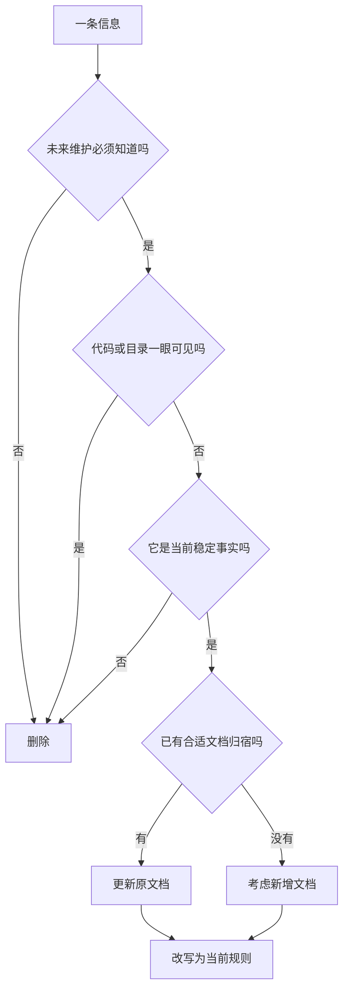

# 项目文档

项目长期文档只保留未来 Agent 持续维护项目时必须依赖、且难以从代码或目录结构直接看出的稳定事实。文档先服务决策，不服务解释；宁缺毋滥。只有长期稳定文档才算文档，历史过程、任务背景、迁移叙事都不算文档内容。

## 目标结果

使用这份 skill 后，整理出来的长期文档应当满足下面这些结果：

- 不知道历史的人，只读当前文档，也能做出正确维护判断
- 读者能直接看出当前谁负责、唯一入口是什么、边界在哪里
- 文档不会残留“之前/现在/不再/改成了”这类历史参照物
- 同一条稳定事实只在最权威的位置保留一份，其他地方只做必要引用
- 如果这次改动没有产生新的长期稳定事实，那么长期文档可以完全不改

## 执行总则

**先判生死，再动文笔。**

整理长期文档时，必须先判断每条信息应该：

- 删除
- 合并或迁移
- 补写
- 保留

只有完成这一步，才允许进入措辞改写。不要一上来就把旧句子润色得更像规范文风，那通常只是在保养噪音。

## 何时使用

- 新增或整理 `AGENTS.md`、`ARCHITECTURE.md`、`DESIGN.md`、各目录 `SPEC.md` 等长期文档
- 职责边界、唯一写入口、跨层通信、阅读路径、设计语义等长期事实发生变化
- 文档开始混入“这次改动”“之前/现在”“不再”“改成了”这类历史或补丁式表述
- 需要判断一条信息该删除、保留、改写，还是移动到另一份长期文档

不要用于：

- PR 描述、提交说明、任务纪要、迁移记录、临时排查笔记
- 代码、目录结构或类型定义一眼就能看出的表面事实

## 收录标准

一条信息只有同时满足下面四个条件，才值得进入长期文档：

| 条件 | 说明 | 不满足时怎么做 |
| --- | --- | --- |
| 未来维护必须知道 | 不知道就容易改错落点、越过边界、破坏协作契约 | 删除 |
| 代码或目录不够显然 | 不能只靠看文件名、函数名、局部实现就立刻得出 | 删除 |
| 当前仍然有效 | 它描述的是此刻成立的稳定事实，而不是旧规则或过渡过程 | 删除或改写 |
| 有明确归宿 | 能判断它应落在哪一类长期文档，而不是到处都写一份 | 移动或合并 |

可以把它压成一句判断公式：

> 必须知道 + 非显然 + 当前有效 + 有稳定归宿 = 值得写进长期文档

## 不该写进长期文档的内容

| 类型 | 为什么不该写 | 正确归宿 |
| --- | --- | --- |
| 本次任务怎么改过来的 | 这是过程，不是长期知识 | Git、PR、任务记录 |
| 旧规则已经失效 | 失效后通常不再指导未来判断 | 直接删除 |
| `A 不再负责 B` 这类否定残影 | 它仍以旧世界为前提，没有直接给出当前规则 | 改写为当前职责 |
| 代码表面事实 | 读代码就能看到，文档只是重复 | 删除 |
| 目录清单式描述 | 除非在表达阅读路径或权威来源，否则价值很低 | 删除或收敛为入口说明 |
| 只在这次任务语境里成立的信息 | 离开上下文就失去判断价值 | 删除 |

## 核心规则

1. 先判断这次改动是否真的触及长期稳定事实；如果没有，就不要修改任何长期文档。
2. 先做删除、合并、迁移、补写判断，再做措辞改写。
3. 避免补丁式修改，优先先删后写；不要在旧句子后面续写历史残影。
4. 只写未来维护必须知道、但又不够显然的稳定事实。
5. 跨模块、跨层、跨多个文件才能拼出的事实，通常值得写进长期文档。
6. 文档应直接陈述当前规则，不以旧规则为参照物。
7. 若稳定信息已经有合适归宿，更新原文档，不为本次改动新增并行文档。
8. 长期文档先服务未来决策，再服务理解；如果两者冲突，优先保留能指导决策的内容。
9. 同一条稳定事实只保留一个权威版本；局部文档只保留必要引用，不要把规则拆碎写在多处。
10. 如果一轮整理只发生措辞替换，而没有任何删除、迁移、合并或补写，默认视为整理力度不足，必须重新审查收录边界。

## 判断流程

如果整理完发现没有新的稳定事实需要沉淀，那么“不改长期文档”就是正确结果。

## 整理流程

按下面这个顺序做，最不容易把长期文档越改越脏：

1. 先判断这次代码或设计变化是否真的触及长期稳定事实
   如果只是实现细节、局部修复、临时兼容、一次性排查结果，通常不需要改长期文档。
2. 列出四类对象
   删除候选、迁移/合并候选、必须补写的缺口、可以原样保留的稳定事实。
3. 先删掉不该存在的内容
   先找过程叙述、否定残影、表面事实、过期规则，而不是急着在旧句子上继续打补丁。
4. 再做迁移或合并
   把写错位置的规则挪到权威文档，把重复规则收口到唯一归宿。
5. 再补写真正缺失的稳定事实
   重点看职责归属、状态拥有者、唯一入口、跨层边界、阅读路径、设计权威来源。
6. 最后统一改写成当前规则
   只改那些经过生死判断后仍然值得保留的句子，确保文本脱离历史背景也能独立成立，不依赖“之前/现在/不再”来理解。

## 一轮整理的最小产出

完成一次长期文档整理时，至少应该能在脑中或工作记录里明确回答：

- 删掉了什么，为什么它不配继续留在长期文档里
- 合并或迁移了什么，为什么它原来的位置不对
- 补上了什么，为什么这是未来维护必须依赖的非显然事实
- 哪些内容虽然看着啰嗦，但仍然值得保留

如果四项里只有最后一项，通常说明你只是在润色，而不是在整理。

## 交付格式

汇报整理结果时，不要按“我先做了什么、然后又做了什么”的过程顺序来写。优先按**信息集合变化**汇报：

| 文档 | 删除了什么 | 迁移/合并了什么 | 补写了什么 | 保留理由 |
| --- | --- | --- | --- | --- |
| `...` | `...` | `...` | `...` | `...` |

汇报时遵守下面这些约束：

- 优先说被判删除、迁移、合并、补写的内容，不要先说措辞优化
- 如果某份文档只有措辞改写，没有信息集合变化，必须明确说明为什么没有任何内容值得删、并、移、补
- 如果某份文档没有改动，也可以把它列出来并说明“已审查，但没有新的长期信息边界变化”
- 不要把“我顺手清理了”“我又改成了”当成主要价值；主要价值应是哪些信息被判定保留或淘汰

## 文档落点判断

先判断信息属于哪一层，再决定写到哪一份长期文档：

| 这条信息主要在回答什么 | 优先归宿 |
| --- | --- |
| 仓库级硬约束、任务起手式、验证要求、协作边界 | `AGENTS.md` |
| 仓库整体阅读路径、模块索引、跨层通信、同步矩阵 | `ARCHITECTURE.md` |
| 视觉语言、组件权威来源、页面骨架、交互设计约束 | `DESIGN.md` |
| 某个模块内部的真实入口、状态拥有者、稳定职责、协作契约 | 对应目录 `SPEC.md` |

如果你在判断“写到哪里”时犹豫，优先问下面四个问题：

- 这是仓库级约束，还是某个模块自己的稳定边界？
- 这是阅读入口和架构关系，还是具体模块的内部事实？
- 这是长期设计语义，还是实现层面的布局细节？
- 这条规则是否已经在更上位、更权威的文档里有合适归宿？

## 红旗句式

看到下面这些句式时，默认停下来重审这句话是否配留在长期文档里：

- `不再...`
- `已经不是...`
- `之前...现在...`
- `原本...现在...`
- `为了这次改动...`
- `这里改成了...`

这些句式不是绝对禁止，但它们往往意味着文本还在借历史解释现在，而不是直接陈述当前规则。

## 删除优先规则

整理长期文档时，默认先做删除判断，而不是默认保留：

| 如果一句话主要在做什么 | 默认动作 |
| --- | --- |
| 复述本次任务怎么改 | 删除 |
| 对旧规则做否定说明 | 改写为当前规则；改不成就删除 |
| 复述代码、目录、类型定义表面事实 | 删除 |
| 记录已经失效的旧边界 | 删除 |
| 解释临时兼容、阶段性过渡、一次性排查结论 | 删除 |
| 只有结合这次上下文才有意义 | 删除 |

一个实用原则：**如果删掉这句话，未来 Agent 仍能从代码和其他长期文档里轻松做出正确判断，那么它大概率就不该存在。**

## 合并与迁移规则

除了删除，还要主动检查下面这些情况：

| 现象 | 默认动作 |
| --- | --- |
| 同一条稳定规则在两份文档都出现 | 收口到更权威的位置，另一处改成引用或直接删除 |
| 仓库级规则写进模块 `SPEC.md` | 迁移到 `AGENTS.md` 或 `ARCHITECTURE.md` |
| 模块内部边界写在仓库级总纲里 | 迁移到对应目录 `SPEC.md` |
| 设计语义混入架构文档 | 迁移到 `DESIGN.md` |
| 架构边界混入设计文档 | 迁移到 `ARCHITECTURE.md` 或模块 `SPEC.md` |

长期文档的整理不只是删句子，也包括把信息送回正确归宿。

## 删改模板

| 遇到的写法 | 处理方式 |
| --- | --- |
| `A 不再负责 B` | 改写为 `B 由 C 负责` |
| `之前通过 X，现在改为 Y` | 改写为 `当前通过 Y ...` |
| `为了修复某问题，这里...` | 如果能沉淀出稳定事实，就改写成规则；否则删除 |
| `目录下有 A、B、C` | 如果只是复述结构，删除；只有在表达阅读路径或权威来源时才保留 |
| `这里新增了一个...` | 如果只描述本次改动，删除；如果形成长期边界，再改写为当前事实 |

如果一句话离开历史上下文就无法单独成立，通常应该删除。

## 改写示例

### 从补丁式描述改成规则式描述

| 不推荐 | 推荐 |
| --- | --- |
| `ProjectSession 不再负责数据库写入。` | `数据库写入统一收口到 Storage/LGDatabase.py；ProjectSession 不得直接写库。` |
| `之前渲染层直接请求接口，现在改为通过 desktop-api。` | `渲染层统一通过 desktop-api 接入桌面能力与 Core API。` |
| `为了修复状态不同步，这里改成 bootstrap + patch。` | `项目运行态以 bootstrap + patch 流作为权威状态来源。` |
| `原本这里有两个入口，现在只保留一个。` | `唯一入口是 ...` |

### 从目录复述改成阅读入口

| 不推荐 | 推荐 |
| --- | --- |
| `frontend/src/renderer 下有 app、pages、widgets、lib。` | `渲染层页面逻辑留在 pages，跨页面稳定组合层进入 widgets。` |
| `docs 目录里有 ARCHITECTURE.md 和 DESIGN.md。` | `架构阅读路径以 ARCHITECTURE.md 为准；设计语言以 DESIGN.md 为准。` |

### 应该直接删除而不是改写

| 不推荐 | 原因 |
| --- | --- |
| `2025 年我们把运行态从 X 迁到了 Y。` | 这是历史过程，不是长期规则 |
| `这次为了兼容旧数据，先临时这样处理。` | 这是阶段性背景，不是稳定事实 |
| `这里以前有问题，所以现在加了一个判断。` | 它解释了这次修改，但没有沉淀长期边界 |
| `A、B、C 三个目录分别放在这里。` | 如果只是目录清单，读代码即可得知 |

## 何时新增文档

不要因为这次改动碰到了一个复杂问题，就顺手新增一份长期文档。只有在下面这些条件同时成立时，才考虑新增：

1. 这条信息属于长期稳定事实，而不是这次任务过程
2. 现有文档没有合适归宿
3. 未来 Agent 会反复依赖它做维护判断
4. 把它塞进现有权威文档会明显破坏结构或职责边界

如果只是这次任务需要解释背景、记录过程、承载一次性的迁移细节，就不要新增长期文档。

## 自检问题

- 不知道历史的人，只读当前文档，能否做出正确维护判断？
- 删除这句话后，未来 Agent 会失去关键决策依据吗？
- 这句话是在复述代码表面事实，还是在补足非显然的长期知识？
- 读完后，是否知道当前谁负责、唯一入口是什么、边界在哪里？
- 同一条稳定事实是否已经在更合适的文档里存在？
- 这轮整理是否真的产生了删除、迁移、合并或补写，而不只是措辞替换？

## 验收分级

可以用下面的标准粗略判断一轮整理做到几分：

| 分数段 | 表现 |
| --- | --- |
| `0-4` | 主要是措辞润色，信息集合几乎没变 |
| `5-7` | 已经发生删除或规则收口，但迁移、补写、归宿判断还不够稳定 |
| `8-9` | 明确完成删 / 并 / 移 / 补中的多项动作，且结果汇报围绕信息边界而不是操作过程 |
| `10` | 不仅完成删 / 并 / 移 / 补，还能清楚解释每份文档为什么该留、该删、该挪、该补；读者一眼能判断这轮整理改变了什么信息集合 |

如果一次“全量整理”后仍然很难说清哪些信息被淘汰、哪些被归位、哪些被补上，默认不算 10 分。

## 提交前清单

- 本次改动是否真的触及长期稳定事实？
- 是否已经先完成删除、迁移、合并判断，再补充必要事实？
- 是否还残留“之前/现在/不再/改成了”这类历史参照？
- 是否有任何句子只是复述代码或目录结构？
- 是否把同一条稳定规则写进了多个文档？
- 如果完全不了解这次任务历史，读者还能否依赖当前文档做对判断？
- 如果这轮几乎没有删、并、移、补，是否已经停下来重新审查，而不是直接把它当作完成？

## 失败信号

出现下面任一情况，默认说明这轮整理没有达到预期：

- 几乎所有改动都只是把句子改得更顺
- 文档长度、结构和信息集合几乎不变
- 没有删除任何明显不该存在的内容
- 没有检查信息是否写错位置
- 读完后仍然只是“更好看”，而不是“更能指导未来维护”

## 常见误区

- 为了显得认真，在每次改代码后都顺手改长期文档
- 在旧文档上打补丁，留下“曾经如此”的残影
- 把任务过程、排查思路、迁移背景写进长期文档
- 把代码表面事实、目录清单、显而易见的调用关系重复进文档
- 同一条稳定规则在多份文档里各写一半，导致未来维护者需要来回拼图
- 明明现有文档已经有合适归宿，却仍然因为这次任务新建并行说明
- 一轮整理下来只改措辞、不动信息集合，却误以为已经完成了文档整理
