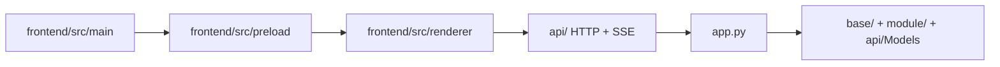

# LinguaGacha Agent Guidelines
本文档用于约束在本仓库工作的 Agent 的行为、命令与代码风格，**必须严格遵循**

## 0. 仓库入口与当前架构
- 仓库级唯一文档入口：[`docs/ARCHITECTURE.md`](docs/ARCHITECTURE.md)
- 其余项目文档统一从 `docs/ARCHITECTURE.md` 的索引继续进入
- 完整的文档索引、阅读路径与同步矩阵以 `docs/ARCHITECTURE.md` 为权威来源，本文只保留执行层摘要
- 当前技术栈：Python 3.14、Electron、React 19、TypeScript、Tailwind CSS 4、shadcn/ui

| 场景 | 快捷阅读顺序 |
| --- | --- |
| 仓库整体结构 | `docs/ARCHITECTURE.md` -> `app.py` -> `base/*` |
| Python Core / 本地 API | `docs/ARCHITECTURE.md` -> [`api/SPEC.md`](api/SPEC.md) -> [`module/Data/SPEC.md`](module/Data/SPEC.md) |
| Electron 子工程 | `docs/ARCHITECTURE.md` -> [`frontend/SPEC.md`](frontend/SPEC.md) |
| React 渲染层 | `docs/ARCHITECTURE.md` -> [`frontend/SPEC.md`](frontend/SPEC.md) -> [`frontend/src/renderer/SPEC.md`](frontend/src/renderer/SPEC.md) |

## 1. 通用规则
### 1.1 工作节奏
执行任务时按下面流程推进，保持“先找入口、再进实现、最后验证”的节奏：
1. **先读入口文档**：先看 [`docs/ARCHITECTURE.md`](docs/ARCHITECTURE.md)，再沿索引进入最相关的 `SPEC.md` 或设计文档。
2. **理解真实边界**：定位实际入口、状态来源、模块职责和依赖方向，不凭历史印象改代码。
3. **分析数据流**：确认谁拥有状态、谁负责写入、事件如何传播、前后端如何过边界。
4. **按层实施变更**：只在真正负责该语义的层修改代码；如必须保留兼容层，先说明原因、范围与清理计划。
5. **审视 Diff**：检查逻辑正确性、潜在回归、命名与注释是否仍然贴合当前架构。
6. **验证并同步文档**：跑对应检查；如果目录职责、契约或阅读路径失真，同任务更新文档。

### 1.2 架构与实现原则
- **全局最优**：以全局最优解为首要目标，重构大于优化。
- **KISS & YAGNI**：保持简单，避免过度封装、兼容层和防御性堆叠，确有必要时先说明理由。
- **正交数据流**：同一业务语义只允许一个权威来源与一个写入口。
- **跨层载荷**：跨线程、跨模块、跨前后端只传 `id`、值对象或不可变快照，禁止共享可变对象引用。
- **标准库优先**：先用标准库，只有标准库不满足需求时才引入第三方能力。

### 1.4 本地化与长期文案
- Python Core 的用户可见文案统一维护在 `module/Localizer/`。
- Electron 渲染层的用户可见文案统一维护在 `frontend/src/renderer/i18n/` 与对应 `resources/` 文件。
- 禁止在业务实现里直接硬编码长期文案，修改文案时同步检查中英文资源是否语义一致。

## 2. Python 规则
### 2.1 Python Core 的真实边界
- `app.py` 负责运行时入口、CLI 分流、Core API 启停与退出清理；不要把前端逻辑、页面状态或桌面桥接塞回这里。
- `api/` 是 Python Core 对外暴露给 Electron 的唯一 HTTP / SSE 边界；接口、响应壳、错误码、SSE topic 变更必须同时对齐 [`api/SPEC.md`](api/SPEC.md)。
- `module/Data/` 负责以数据为中心的主链路服务；工程、规则、分析、翻译、校对与 Extra 工具的改动先按 [`module/Data/SPEC.md`](module/Data/SPEC.md) 判断真实落点。
- `api/Client/` 与 `api/Models/` 负责 Python 侧的对象化契约边界；改动响应结构时，要同步检查客户端对象、状态仓库和契约测试是否仍一致。

### 2.2 Python 代码风格
- 注释统一使用 `# ...`；所有类、方法和关键逻辑都要解释“为什么这样做”，不要只翻译代码表面行为。
- 控制流优先显式 `if / elif / else`，避免为图省事堆叠过深的早回和隐式分支。
- 命名遵循现有 Python 风格：默认 `snake_case`，类名使用 `PascalCase`，常量使用 `UPPER_SNAKE_CASE`。
- 禁止首位下划线命名，例如 `_get_data`、`_internal_method`、`_data`。
- 禁止魔术值；字符串、数字和状态位优先收口到常量、枚举或冻结数据对象。
- 所有函数必须标注参数和返回值类型；类属性、实例属性、`@dataclass` 字段必须标注类型。
- 优先使用现代类型写法，如 `A | None`、`list[str]`；只有在第三方库缺类型信息时，才允许 `Any`、`cast()`、`Protocol` 兜底。
- 数据载体优先使用 `dataclasses`；跨线程或跨边界传递的数据优先使用 `@dataclass(frozen=True)`。
- 模块对外只暴露类；常量、枚举等语义应优先设计为类属性。

### 2.3 Python 日志与异常
- 统一使用 `LogManager.get().debug/info/warning/error(msg, e)` 记录日志。
- 需要记录异常时，必须把 `e` 传入日志接口，禁止手动拼接 `traceback.format_exc()`。
- 只有“预期且无害”的场景才允许 `except: pass`，并且必须用注释写明为什么可以静默忽略。
- 不可恢复的致命异常无需就地吞掉，直接冒泡给顶层统一记录和退出。
- 需要包装语义时使用 `raise ... from e` 保留原始异常链。

### 2.4 Python 变更约束
- 新增或调整本地 API 时，先明确它属于 `api/Application`、`api/Contract`、`api/Server/Routes` 还是 `api/Bridge`，不要只补某一层。
- 新增项目级状态前，先判断它应归属 `ProjectSession`、某个领域 service、`DataManager`，还是渲染层的应用级状态封装。
- 禁止在 API 层直接操作数据库或持有 `ProjectSession`；SQL 只允许落在 `Storage/LGDatabase.py`。
- Python 侧用户文案继续放在 `module/Localizer/`，不要把前端渲染层文案回写到后端。

## 3. TypeScript / HTML / CSS 规则
### 3.1 Electron 与前端边界
- 前端子工程入口固定为 [`frontend/SPEC.md`](frontend/SPEC.md)；渲染层局部规则固定为 [`frontend/src/renderer/SPEC.md`](frontend/src/renderer/SPEC.md)。
- `frontend/src/main` 只负责 Electron 宿主、窗口、原生对话框与标题栏。
- `frontend/src/preload` 只负责 `contextBridge` 桥接，不维护页面状态与 UI 逻辑。
- `frontend/src/shared` 只放跨端共享契约、桌面常量与 Core API 地址解析规则。
- `frontend/src/renderer` 才承载 React 页面、导航、状态编排、组件与样式实现。
- Electron 前端与 Python Core 的运行时通信统一通过 `api/` 的 HTTP / SSE 契约，禁止在前端直接导入 Python 模块。

### 3.2 TypeScript / React 落位规则
- 渲染层目录职责保持清晰：`app` 管应用壳层与全局状态，`pages` 管页面装配，`widgets` 管跨页面复用组合组件，`shadcn` 管基础组件源码，`hooks` / `i18n` / `lib` 提供支撑。
- 页面私有逻辑留在 `pages/<page-name>/`，不要为了“看起来复用”过早抬进 `widgets`、`app` 或 `lib`。
- `widgets/` 只放跨页面稳定复用的组合层；如果只是 shadcn 基础组件，不要塞进 `widgets/`。
- `shadcn/` 只放 shadcn CLI 已安装组件源码与其项目内定制；业务组件、页面语义组件、临时组合组件不得进入 `shadcn/`。
- 遵循现有前端命名：变量和函数使用 `camelCase`，组件、类型、上下文使用 `PascalCase`，widget 目录使用 `kebab-case`，页面入口统一使用 `page.tsx`。
- TypeScript 代码优先保持显式类型，不要无节制回退到 `any`；只有在第三方类型确实缺失时再局部兜底。
- React Hook 必须遵循 ESLint 规则；不要为了压警告而规避依赖管理。

### 3.3 HTML / CSS / 主题规则
- `frontend/src/renderer/index.html` 只是 renderer 宿主壳；不要把业务结构、运行时状态或临时脚本塞进 HTML 入口。
- 全局 token、第三方运行时皮肤和主题变量统一收口在 `frontend/src/renderer/index.css`；`--ui-*` 只允许在这里定义。
- 页面私有样式放在页面目录，由页面入口统一导入；widget 私有样式由 widget 自己导入；不要把页面语义样式反向塞进全局。
- 必须支持亮色与暗色主题，避免硬编码颜色；基础组件和组合组件都不得自建并行主题状态。
- 渲染层默认执行 `px-first`：视觉尺寸字面量优先用 `px`；`line-height` 使用无单位数值；`letter-spacing` 仅允许使用 `em`；`clamp()` 仅允许 `px + vw + px` 组合。
- 静态资源放在 `frontend/public/`；文案、mock、页面配置等源码资源必须留在 `frontend/src/renderer/`。

### 3.4 前端通信与文案
- 前端页面、状态 hook 与辅助模块统一通过 `frontend/src/renderer/app/desktop-api.ts`、SSE 事件流以及应用级状态封装消费 Core。
- 渲染层长期文案统一放在 `frontend/src/renderer/i18n/` 与对应 `resources/` 文件，禁止把长期文案硬编码到组件或页面逻辑里。
- 桌面能力统一通过 `window.desktopApp` 或共享契约暴露，不要在渲染层绕过 preload 直接访问 Node / Electron 能力。

## 4. 验证、文档与交付
### 4.1 常用命令
| 场景 | 命令 |
| --- | --- |
| 安装依赖 | `uv sync -U --extra test` |
| 启动 Python Core | `uv run app.py` |
| 启动 Electron 前端 | `cd frontend && npm run dev` |
| Python 格式化 | `uv run ruff format <file_path>` |
| Python 检查 | `uv run ruff check --fix <file_path>` |
| Python 测试 | `uv run pytest` |
| 前端 Lint | `cd frontend && npm run lint` |
| 渲染层审查 | `cd frontend && npm run renderer:audit` |
| Renderer 类型检查 | `cd frontend && npx tsc -p tsconfig.json --noEmit` |
| Electron Node 侧类型检查 | `cd frontend && npx tsc -p tsconfig.node.json --noEmit` |

### 4.2 变更后的最低验证要求
| 变更类型 | 最低验证 |
| --- | --- |
| Python 业务逻辑、数据流、API 行为变化 | `uv run pytest` + 相关文件 `ruff format` / `ruff check --fix` |
| API 契约、错误码、SSE topic 变化 | `uv run pytest`，并补齐/更新对应 `api` 测试 |
| Electron 主进程、预加载、共享桥接变化 | `cd frontend && npm run lint` + `npx tsc -p tsconfig.node.json --noEmit` |
| 渲染层结构、组件契约、样式边界、导航变化 | `cd frontend && npm run lint` + `npm run renderer:audit` + `npx tsc -p tsconfig.json --noEmit` + `npx tsc -p tsconfig.node.json --noEmit` |
| 仅文档改动 | 自检链接、命名和阅读路径是否仍然准确 |

### 4.3 文档同步原则
- 完整的模块文档索引、阅读路径与“变更类型 -> 必须同步的文档”矩阵，以 [`docs/ARCHITECTURE.md`](docs/ARCHITECTURE.md) 为唯一权威来源。
- 本文只保留仓库级执行原则，不再重复维护完整同步矩阵，避免与文档索引页漂移。
- 当改动影响目录职责、契约边界或阅读顺序时，先更新 `docs/ARCHITECTURE.md`，再同步对应模块 `SPEC.md`。

### 4.4 交付要求
- 完成后必须回看 Diff，确认规则、命名、注释、文档与当前架构一致。
- 如果改动会让现有文档失真，必须在同一任务内同步修正，不要把文档债留到以后。
- 若验证未执行、执行失败，或只完成了部分验证，必须在交付时明确说明。
