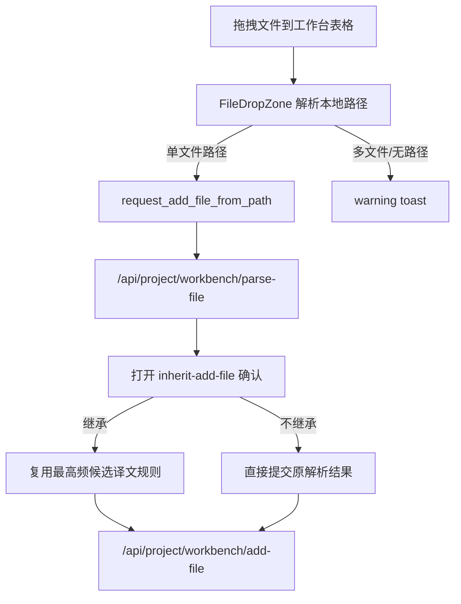

# 🧭 工作台表格拖拽添加文件计划

## ✅ 摘要
在工作台文件表格区域复用术语页的 `FileDropZone` 交互：用户把单个本地文件拖到表格区域后，走现有“添加文件 -> 解析 -> 继承确认 -> add-file mutation”链路；多个文件或无法解析路径时只提示 warning，不新增额外 UI。已有“多候选译文自动取最高频”逻辑保持不变并被拖拽入口复用。

## 🧩 接口与类型变化
- 在 `UseWorkbenchLiveStateResult` 增加 `request_add_file_from_path(source_path: string): Promise<void>`，供拖拽入口直接复用现有添加文件逻辑。
- 增加 `notify_add_file_drop_issue(issue: "multiple" | "unavailable"): void` 或等价方法，统一处理拖拽失败 toast。
- 不新增后端 API、preload 能力、ProjectStore 状态或长期文案键；复用 `app.drop.import_here`、`app.drop.multiple_unavailable`、`app.drop.unavailable`。

## 🛠️ 实施步骤

1. 确认工作台添加文件权威链路
   - 目的：避免拖拽入口绕过现有解析、继承确认和同步 mutation。
   - 实施方案：
     1. 以 `use-workbench-live-state.ts` 中现有 `request_add_file()` 为唯一参考。
     2. 确认状态拥有者仍是工作台页面 hook，唯一写入口仍是 `/api/project/workbench/add-file`。
     3. 确认 `create_workbench_add_file_plan()` 的最高频候选选择规则无需为拖拽单独分支。
   - 阶段成果：得到明确结论：拖拽只是新增入口，不改变数据域、API 契约或继承算法。

2. 抽出“按路径添加文件”的共享方法
   - 目的：让按钮选择文件和表格拖拽文件使用同一条业务路径。
   - 实施方案：
     1. 将 `request_add_file()` 中从 `source_path` 开始的逻辑抽为 `request_add_file_from_path(source_path)`。
     2. 保留 `pickWorkbenchFilePath()` 只在 `request_add_file()` 内执行，选择成功后调用共享方法。
     3. 共享方法继续创建 barrier checkpoint、运行 modal progress toast、调用 `parse-file`、设置 `pending_add_file_request` 并打开 `inherit-add-file`。
   - 阶段成果：按钮添加行为不变，拖拽入口可直接传入路径并进入同一个确认弹窗。

3. 接入工作台表格拖拽区域
   - 目的：让“拖到表格区域添加文件”的交互与术语页保持一致。
   - 实施方案：
     1. 在 `workbench-page/page.tsx` 引入 `FileDropZone`。
     2. 用 `FileDropZone` 包裹 `WorkbenchFileTable`，`label` 使用 `t("app.drop.import_here")`。
     3. `disabled` 绑定 `!workbench_state.can_edit_files`，与命令栏“添加文件”按钮保持一致。
     4. `on_path_drop` 调用 `workbench_state.request_add_file_from_path(path)`。
     5. `on_drop_issue` 调用 hook 暴露的 warning toast 方法。
   - 阶段成果：用户拖入单个文件时触发现有添加流程；任务忙、文件操作中或工程未加载时拖拽入口禁用。

4. 保持拖拽冲突边界
   - 目的：避免外部文件拖拽影响工作台内部行拖拽排序。
   - 实施方案：
     1. 依赖 `FileDropZone` 的 `has_path_drop_payload()` 过滤，只响应 `Files` 或 `text/uri-list`。
     2. 保持 `WorkbenchFileTable` 内部 `AppTable` 行排序逻辑不变。
     3. 验证排序启用时行拖拽仍可用，排序视图下原有禁用规则仍生效。
   - 阶段成果：外部文件拖入会显示覆盖层；内部行排序不会被误当作文件导入。

5. 补齐测试
   - 目的：覆盖新增入口和失败提示，防止后续按钮/拖拽逻辑分叉。
   - 实施方案：
     1. 更新 `use-workbench-live-state.test.ts`，测试 `request_add_file_from_path("E:/demo/new.txt")` 会调用 `parse-file` 并打开 `inherit-add-file`。
     2. 保留并调整现有 `request_add_file()` 测试，确认 picker 入口仍委托到同一流程。
     3. 将 toast mock 调整为可断言 fixture，覆盖 `multiple` 与 `unavailable` 分别触发 warning 文案。
     4. 若已有页面级测试入口可用，补一个轻量 smoke：工作台页渲染表格外层 `FileDropZone`，并按 `can_edit_files` 传递禁用状态。
   - 阶段成果：新增拖拽入口、旧按钮入口、拖拽异常提示都有可回归断言。

6. 清理施工现场
   - 目的：保证实现收口，不留下重复分支或临时资源。
   - 实施方案：
     1. 清理目标：重复的添加文件解析逻辑、未使用导入、未使用类型、临时测试 mock、无用样式类。
     2. 清理范围：仅检查工作台页面、工作台 hook、相关测试；不触碰术语页、替换页、保留页和后端 add-file 实现。
     3. 处理方式：按钮与拖拽共用 helper；不新增工作台私有拖拽组件；不新增本地化键。
     4. 保留理由：保留现有 `FileDropZone`、`file-drop` 工具和继承确认弹窗，因为它们仍是跨页面复用与工作台添加文件的权威入口。
   - 阶段成果：diff 中只保留本任务必要改动，没有无关重构或废弃资源。

7. 执行验证与文档核对
   - 目的：确认前端类型、交互边界和长期文档仍然一致。
   - 实施方案：
     1. 在 `frontend` 执行：`npm run format`、`npm run format:check`、`npm run lint`、`npm run renderer:audit`。
     2. 执行类型检查：`npx tsc -p tsconfig.json --noEmit`、`npx tsc -p tsconfig.node.json --noEmit`。
     3. 执行测试：优先定向运行 `npm run test -- use-workbench-live-state`，条件允许再运行 `npm run test`。
     4. 回看 diff，确认无需更新 `docs/API.md`、`docs/FRONTEND.md`、`docs/DESIGN.md`；若实现中实际改变长期交互规则，再同步对应文档。
   - 阶段成果：得到完整验证结果；若有未执行或失败项，交付时明确原因和影响范围。

## 🧪 验收标准
- 单个本地文件拖到工作台表格区域后，会进入现有添加文件解析和继承确认弹窗。
- 多个文件拖入时提示“暂不支持多个文件”，无法解析路径时提示拖拽不可用。
- 拖拽添加与按钮添加提交到同一 `parse-file` / `add-file` 链路。
- 继承添加时，多候选译文仍自动选择出现次数最多者，不新增选择 UI 或提示。
- 工作台行拖拽排序、选择、右键菜单、删除/重置操作保持原行为。

## 📌 假设与边界
- 本次只支持单文件拖拽添加；多文件批量添加不在范围内。
- 不做后端契约变更，不增加 preload API。
- 当前工作树已有未提交改动，实施时只在本任务相关文件上增量修改，不回滚无关改动。
