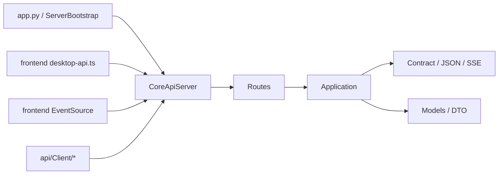

# `api/` 规格

## 一句话总览
`api/` 是 LinguaGacha Python Core 对外暴露的唯一本地协议边界。它同时服务 Electron 渲染层和 Python 侧对象化客户端；需要跨多处代码一起理解的协议事实收口在本文，精确路径常量、字段定义和 DTO 以 `Routes/*`、`Contract/*`、`Models/*` 为准。

## 权威来源
| 关注点 | 代码权威来源 |
| --- | --- |
| 服务启动、监听地址、错误映射 | `api/Server/CoreApiServer.py`、`api/Server/ServerBootstrap.py`、`api/Server/CoreApiPortCatalog.py` |
| 路由分组与精确路径 | `api/Server/Routes/*.py` |
| 请求归一化与业务约束 | `api/Application/*.py` |
| HTTP 载荷包装与 bootstrap / SSE 线格式 | `api/Contract/*.py` |
| 公开事件桥与 `project.patch` 生成 | `api/Bridge/*.py` |
| Python 客户端与对象化模型 | `api/Client/*.py`、`api/Models/*.py` |
| Electron 接入点 | `frontend/src/renderer/app/desktop-api.ts`、`frontend/src/renderer/app/project-runtime/SPEC.md` |

## 阅读顺序
1. 先读第 1 节和第 2 节，确认 API 的分层、路径前缀和协议不变量。
2. 再读第 3 节和第 4 节，确认运行态流、同步 mutation 和各路由族边界。
3. 如果改 Python 客户端，继续读第 5 节；如果改 Electron 运行态接入，同时联读 [`frontend/src/renderer/app/project-runtime/SPEC.md`](../frontend/src/renderer/app/project-runtime/SPEC.md)。

## 1. 运行时边界

### 1.1 真实分层


### 1.2 目录职责
| 目录 | 职责 |
| --- | --- |
| `api/Server/` | 本地 HTTP 服务、路由注册、统一错误映射 |
| `api/Application/` | 读取 Core 状态、归一化请求、组织稳定语义 |
| `api/Contract/` | 把内部对象编码成 HTTP / SSE 有效载荷 |
| `api/Bridge/` | 把内部事件裁成公开 topic 与 `project.patch` |
| `api/Models/` | Python 冻结 DTO、bootstrap 行块与客户端共享模型 |
| `api/Client/` | Python 侧薄客户端与对象化返回包装 |

### 1.3 路径前缀与消费者
- 主业务 API 统一落在 `api/`。
- 应用设置固定使用 `/api/settings/*`。
- Extra 工具固定使用 `/api/extra/*`。
- 新增主业务协议时，不扩展新的并行根前缀。
- Electron 主路径只消费 `/api/project/bootstrap/stream` 与 `/api/events/stream`，其余页面写操作走普通 JSON 路由。

### 1.4 监听地址与端口
- `CoreApiServer` 固定绑定 `127.0.0.1`，不是 `0.0.0.0`。
- 默认端口只有一个：`38191`。
- 若设置 `LINGUAGACHA_CORE_API_BASE_URL`，服务端和前端都以该地址中的显式端口为单一候选来源。

### 1.5 事件桥真实装配
- `ServerBootstrap` 在公开 SSE 上挂的是 `ProjectPatchEventBridge`，它内部再复用 `PublicEventBridge`。
- 普通公开 topic 由 `PublicEventBridge` 负责，`project.patch` 由外层桥补出；运行态补丁语义因此属于 API 边界的一部分。

## 2. 协议不变量

### 2.1 HTTP 约定
- 公开 `GET` 只有 3 个：
  - `/api/health`
  - `/api/events/stream`
  - `/api/project/bootstrap/stream`
- 其余公开接口统一走 `POST + JSON body`。
- `OPTIONS` 由 `CoreApiServer` 统一回 `204`。
- CORS 统一开放到 `Origin * / Methods GET,POST,OPTIONS / Headers Content-Type`。

### 2.2 响应壳
成功响应固定为：

```json
{
  "ok": true,
  "data": {}
}
```

失败响应固定为：

```json
{
  "ok": false,
  "error": {
    "code": "invalid_request",
    "message": "..."
  }
}
```

### 2.3 错误码边界
`CoreApiServer` 在边界层只稳定保证 3 个错误码：

| `error.code` | 触发条件 |
| --- | --- |
| `not_found` | 路由不存在，或内部抛出 `FileNotFoundError` |
| `invalid_request` | 内部抛出 `ValueError` |
| `internal_error` | 其他未捕获异常 |

需要特别记住：
- revision 冲突、工程未加载、任务忙碌等业务错误大多会折叠成 `invalid_request + message`。
- API 当前没有稳定的业务错误码体系；调用方不能靠 `error.code` 区分所有业务分支。

### 2.4 SSE 线格式
普通事件流 `/api/events/stream` 由 `EventEnvelope.to_sse_payload()` 生成，协议特点是：
- `event:` 直接写 topic
- `data:` 直接写 payload JSON
- 没有 `event_id`、`timestamp`、`topic` 回显
- 空闲时服务端发送 `: keepalive`

## 3. 运行态事件协议

### 3.1 Bootstrap 是一次性阶段化首包
`/api/project/bootstrap/stream` 使用独立事件型别，不复用普通 topic：

| `event:` | 字段 | 用途 |
| --- | --- | --- |
| `stage_started` | `stage`、`message` | 某个 stage 开始 |
| `stage_payload` | `stage`、`payload` | stage 有效载荷 |
| `stage_completed` | `stage` | 某个 stage 结束 |
| `completed` | `projectRevision`、`sectionRevisions` | 整条 bootstrap 流完成 |

规则：
- 这条流是一次性首包，不是长期订阅流。
- `desktop-api.ts` 会监听 `failed`，但当前服务端不主动发送该事件型别。
- 渲染层真正依赖的是 `stage_started`、`stage_payload`、`completed` 三类事件。

### 3.2 Bootstrap stage 顺序是稳定契约
顺序固定为：
1. `project`
2. `files`
3. `items`
4. `quality`
5. `prompts`
6. `analysis`
7. `proofreading`
8. `task`

`ProjectStore` 依赖这套顺序建立最小运行态；顺序或命名变化时，`api/SPEC.md` 与 `frontend/src/renderer/app/project-runtime/SPEC.md` 必须一起改。

### 3.3 `RowBlock` 的稳定边界
只有两个 stage 依赖 `RowBlock(fields, rows)` 作为硬约束：

| stage | 字段顺序 |
| --- | --- |
| `files` | `rel_path`、`file_type`、`sort_index` |
| `items` | `item_id`、`file_path`、`row_number`、`src`、`dst`、`status`、`text_type`、`retry_count` |

块类型由 stage 决定，不额外携带 `schema` 标签；渲染层会把这两类行块分别归一化为 `files[rel_path]` 与 `items[item_id]`，而不是直接绑定 Python dict 形状。

### 3.4 公开 topic 中真正需要记住的约束

| topic | 稳定事实 |
| --- | --- |
| `task.progress_changed` | 只发送本次事件里真实出现的字段，不补齐缺失统计 |
| `task.status_changed` | `DONE / ERROR / IDLE` 是桥接层根据内部终态重新解释后的结果 |
| `settings.changed` | 只是设置广播，不等于页面必须整体刷新 |
| `project.patch` | 是 `ProjectPatchEventBridge` 额外补出的运行态补丁，不属于普通公开 topic 枚举 |

### 3.5 `project.patch` 只承载运行态补丁
`project.patch` 至少包含 `source`、`updatedSections` 与 `patch`，并在可用时带 `projectRevision`、`sectionRevisions`：

| 语义 | 形状 | 典型来源 |
| --- | --- | --- |
| 任务终态补丁 | `source + updatedSections + patch + sectionRevisions + projectRevision` | 翻译任务 DONE、分析任务 DONE |
| 显式运行态补丁 | `source + updatedSections + patch + sectionRevisions + projectRevision` | `PROJECT_RUNTIME_PATCH` 事件 |

规则：
- 调用方可以把 `project.patch` 当成可直接合并到 `ProjectStore` 的补丁事件，而不是刷新提示。
- 同步 mutation 成功路径不依赖额外 `project.patch` 确认事实落地；修订号对齐由 `ProjectMutationAck` 负责。

## 4. 路由族与真正需要记住的约束

### 4.1 路由族分布
| 前缀 | 关注点 |
| --- | --- |
| `/api/health` | 探活入口 |
| `/api/events/stream` | 长期事件流 |
| `/api/project/bootstrap/stream` | 一次性 bootstrap 首包 |
| `/api/project/*` | 工程、工作台、校对与同步 mutation |
| `/api/tasks/*` | 翻译 / 分析任务 |
| `/api/models/*` | 模型页 |
| `/api/quality/rules/*` 与 `/api/quality/prompts/*` | 规则与提示词 |
| `/api/settings/*` | 应用设置 |
| `/api/extra/*` | Extra 工具 |

### 4.2 `/api/project/*` 下的真实边界
- `project`、`workbench`、`proofreading` 共用前缀，但分别由不同 Application 服务负责。
- 工作台和校对页的运行态真值来自 bootstrap + `ProjectStore`；API 不提供整页 `workbench` 快照，也不提供文件级并行 patch 路由。
- `workbench/parse-file` 是只读解析路由：只读取本地文件并返回标准化 preview，不落库、不清缓存、不发事件。
- `translation/reset-preview`、`translation/reset`、`analysis/reset-preview`、`analysis/reset` 也落在 `/api/project/*`，因为它们属于项目运行态同步 mutation，而不是后台线程任务路由。
- 工作台同步写接口和校对同步保存接口都以 `ProjectMutationAck { accepted, projectRevision, sectionRevisions }` 作为统一回执。
- `reorder-files` 的隐藏硬约束是 `ordered_rel_paths` 必须完整覆盖当前文件集合。

### 4.3 同步 mutation 与任务型接口
- 工作台 `add-file / replace-file / reset-file / delete-file / delete-file-batch / reorder-files`、校对 `save-item / save-all / replace-all`，以及 `translation/reset`、`analysis/reset` 都属于同步 mutation：前端先本地 patch，服务端持久化后返回 `ProjectMutationAck` 对齐 revision。
- `translation/reset-preview` 与 `analysis/reset-preview` 是 reset planner 的只读预演入口，不改运行态事实。
- `retranslate-items`、翻译任务与分析任务才属于任务型接口，完成后通过任务事件和必要的 `project.patch` 推进运行态。
- `/api/project/analysis/import-glossary` 也是同步 mutation：前端提交已筛好的 `entries`、`analysis_candidate_count`、`expected_section_revisions`，以及单独的 `expected_glossary_revision`；服务端会分别校验运行态 section revision 与 glossary 自身 revision，再负责持久化与 revision 对齐。
- `tasks/snapshot` 是按需快照，不是订阅入口；分析任务快照在可用时会额外带 `analysis_candidate_count`。
- `export-translation` 只有最小 `accepted` 回执，没有稳定 DTO 边界。

### 4.4 Settings / Models / Quality / Extra
- `settings/update` 只处理 `SettingsAppService.SETTING_KEYS` 白名单字段，未知字段会被忽略。
- 对渲染层运行态来说，高影响刷新键只有 `source_language` 与 `mtool_optimizer_enable`；`target_language` 只同步工程 meta 镜像。
- `models/reorder` 使用 `ordered_model_ids`，且只能重排单一模型分组；`models/add` 只新增自定义类型。
- 稳定 `rule_type` 只有 `glossary`、`pre_replacement`、`post_replacement`、`text_preserve`。
- 规则与提示词的真值来自 bootstrap 与前端本地 patch；写接口成功后只用 `ProjectMutationAck` 对齐 revision。
- `text_preserve` 的非显然差异是 `meta` 使用 `{"mode": str}`，而不是 `{"enabled": bool}`。
- `prompts/import` 只读取本地文本并返回 `{"text": ...}`，不承担导入即保存。
- 规则统计由渲染层基于 `ProjectStore.items` 本地计算，公开 API 不提供独立统计路由。
- `extra` 保持独立前缀 `/api/extra/*`；`ts-conversion/start` 的进度与终态依赖 `extra.ts_conversion_progress`、`extra.ts_conversion_finished` 两个 SSE topic。

## 5. Python 客户端边界

### 5.1 `ApiClient` 的真实行为
- `ApiClient` 只取响应体里的 `data`。
- 它不会：
  - 校验 `ok`
  - 保留 `error`
  - 主动把业务失败提升成结构化异常
- 所以 Python 客户端侧很多“失败”最终只会表现成空字典或缺字段，而不是明确错误对象。

### 5.2 对象化覆盖的真正分界
高价值结论不是“每个方法返回什么”，而是哪些客户端以稳定 DTO 为主，哪些仍返回原始结构：
- `SettingsApiClient`、`ExtraApiClient`、`ProjectApiClient`、`ProofreadingApiClient` 的主路径返回是对象化结果。
- `TaskApiClient` 的任务快照与分析术语导入结果返回对象化结果；`export_translation()` 返回原始结构。
- `ModelApiClient` 的模型页快照链路返回对象化结果；`test_model()` 返回原始结构。
- `WorkbenchApiClient` 的写接口统一返回 `ProjectMutationAck`；`parse_file()` 仍返回原始 preview `dict`。
- `QualityRuleApiClient` 以 `bool`、`str`、原始 `dict` / `list` 为主，没有形成冻结 DTO 边界。
- Python 侧客户端边界是显式请求/响应包装，不承担运行态缓存、SSE 消费或 `ProjectStore` 风格的长期状态同步层。

## 6. Electron 接入边界
- 渲染层真正的 API 接入入口只有 `frontend/src/renderer/app/desktop-api.ts`。
- 发请求前会先用 `/api/health` 校验：
  - `status === "ok"`
  - `service === "linguagacha-core"`
- 项目运行态主路径固定为：
  - `/api/project/bootstrap/stream`
  - `/api/events/stream`
- 更细的 `ProjectStore`、bootstrap stage 落地、页面变更信号与本地统计任务，以 [`frontend/src/renderer/app/project-runtime/SPEC.md`](../frontend/src/renderer/app/project-runtime/SPEC.md) 为准。

## 7. 什么时候必须同步更新本文
- 路径前缀、路由分组或版本边界变化
- 错误映射口径变化
- bootstrap stage / RowBlock 字段顺序 / 事件型别变化
- SSE topic 或 `project.patch` 语义变化
- Python 客户端对象化覆盖边界变化
- Electron 接入 Core 的唯一入口变化

## 维护原则
- 本文只记录需要跨 `Routes / Application / Bridge / Client` 一起理解的协议边界，不平铺可直接从代码读取的字段表。
- 更适合前端运行态文档的页面派生逻辑，交给 [`frontend/src/renderer/app/project-runtime/SPEC.md`](../frontend/src/renderer/app/project-runtime/SPEC.md) 维护。
- 更适合同步 mutation 落库路径的领域细节，交给 [`module/Data/SPEC.md`](../module/Data/SPEC.md) 维护。
