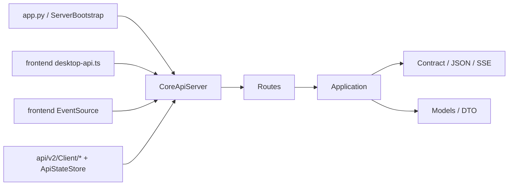

# `api/` 规格

## 一句话总览
`api/` 是 LinguaGacha Python Core 对外暴露的唯一本地协议边界。它当前服务两类消费者：
- Electron 渲染层运行时
- Python 侧测试 / 桥接 / 对象化客户端

这份文档只保留后续 Agent 开发会反复依赖、且不翻多处代码就难以快速得出的事实；完整路径常量和字段定义以 `Routes/*`、`Contract/*`、`Models/*` 为准。

## 权威来源
| 关注点 | 代码权威来源 |
| --- | --- |
| 服务启动、监听地址、错误映射 | `api/v2/Server/CoreApiServer.py`、`api/v2/Server/ServerBootstrap.py`、`api/v2/Server/CoreApiPortCatalog.py` |
| 路由分组与精确路径 | `api/v2/Server/Routes/*.py` |
| 请求归一化与业务约束 | `api/v2/Application/*.py` |
| HTTP 载荷包装与 bootstrap / SSE 线格式 | `api/v2/Contract/*.py` |
| 公开事件桥与 `project.patch` 生成 | `api/v2/Bridge/*.py` |
| Python 客户端与状态仓库 | `api/v2/Client/*.py`、`api/v2/Models/*.py` |
| Electron 接入点 | `frontend/src/renderer/app/desktop-api.ts`、`frontend/src/renderer/app/project-runtime/SPEC.md` |

## 阅读顺序
1. 先读第 2 节和第 3 节，确认运行时边界、版本分层和协议不变量。
2. 再读第 4 节，理解各路由族真正需要记住的兼容与约束。
3. 如果要改 Python 对象化客户端，继续读第 5 节。
4. 如果要改 Electron 运行态接入，继续读第 6 节，并联读 [`frontend/src/renderer/app/project-runtime/SPEC.md`](../frontend/src/renderer/app/project-runtime/SPEC.md)。

## 1. 运行时边界

### 1.1 当前真实分层


### 1.2 目录职责
| 目录 | 职责 |
| --- | --- |
| `api/v2/Server/` | 本地 HTTP 服务、路由注册、统一错误映射 |
| `api/v2/Application/` | 读取 Core 状态、归一化请求、组织稳定语义 |
| `api/v2/Contract/` | 把内部对象编码成 HTTP / SSE 有效载荷 |
| `api/v2/Bridge/` | 把内部事件裁成公开 topic 与 `project.patch` |
| `api/v2/Models/` | Python 冻结 DTO、bootstrap 行块与客户端共享模型 |
| `api/v2/Client/` | Python 侧薄客户端、SSE 消费器、状态仓库 |

### 1.3 版本现实
- 当前业务主边界已经集中在 `api/v2/`。
- 但并不是所有公开接口都已经迁到 `/api/v2/...`：
  - `settings` 仍在 `/api/settings/*`
  - `extra` 仍在 `/api/extra/*`
- 后续新增主业务 API 应继续落在 `api/v2/`，不要再新开并行根前缀。

### 1.4 监听地址与端口
- `CoreApiServer` 当前固定绑定 `127.0.0.1`，不是 `0.0.0.0`。
- 默认端口只有一个：`38191`。
- 若设置 `LINGUAGACHA_CORE_API_BASE_URL`，服务端和前端都会把端口解析到该地址中的显式端口；它不是“建议值”，而是单一候选端口来源。

### 1.5 事件桥真实装配
- `ServerBootstrap` 不是直接把 `PublicEventBridge` 挂到 SSE 上。
- 当前实际装配是：
  - 外层：`ProjectPatchEventBridge`
  - 内层：`PublicEventBridge`
- 结果是：
  - 普通公开 topic 仍由 `PublicEventBridge` 负责
  - `project.patch` 由外层桥额外补出

## 2. 协议不变量

### 2.1 HTTP 约定
- 公开 `GET` 目前只有 3 个：
  - `/api/health`
  - `/api/v2/events/stream`
  - `/api/v2/project/bootstrap/stream`
- 其余公开接口统一走 `POST + JSON body`。
- `OPTIONS` 由 `CoreApiServer` 统一回 `204`。
- 当前 CORS 是完全开放口径：
  - `Access-Control-Allow-Origin: *`
  - `Access-Control-Allow-Methods: GET,POST,OPTIONS`
  - `Access-Control-Allow-Headers: Content-Type`

### 2.2 响应壳
成功响应固定为：

```json
{
  "ok": true,
  "data": {}
}
```

失败响应固定为：

```json
{
  "ok": false,
  "error": {
    "code": "invalid_request",
    "message": "..."
  }
}
```

### 2.3 当前错误码现实
`CoreApiServer` 在边界层只稳定保证 3 个错误码：

| `error.code` | 触发条件 |
| --- | --- |
| `not_found` | 路由不存在，或内部抛出 `FileNotFoundError` |
| `invalid_request` | 内部抛出 `ValueError` |
| `internal_error` | 其他未捕获异常 |

需要特别记住：
- revision 冲突、工程未加载、任务忙碌等业务错误，当前大多仍会折叠成 `invalid_request + message`。
- 也就是说，**不要假设 API 已经提供稳定的业务错误码体系**。

### 2.4 SSE 线格式
普通事件流 `/api/v2/events/stream` 由 `EventEnvelope.to_sse_payload()` 生成，当前协议特点是：
- `event:` 直接写 topic
- `data:` 直接写 payload JSON
- 没有 `event_id`、`timestamp`、`topic` 回显
- 空闲时服务端发送 `: keepalive`

## 3. 运行态事件协议

### 3.1 Bootstrap 流不是普通 topic 流
`/api/v2/project/bootstrap/stream` 当前使用独立事件型别，而不是复用普通 topic：

| `event:` | 当前字段 | 用途 |
| --- | --- | --- |
| `stage_started` | `stage`、`message` | stage 开始 |
| `stage_payload` | `stage`、`payload` | stage 有效载荷 |
| `stage_completed` | `stage` | stage 完成 |
| `completed` | `projectRevision`、`sectionRevisions` | 整条 bootstrap 流完成 |

不明显但很重要的事实：
- 前端当前只真正消费 `stage_started`、`stage_payload`、`completed`。
- `desktop-api.ts` 会监听 `failed`，但 Python 服务端现在**不会主动发送** `failed`。
- 这条流本质上是“一次性阶段化首包”，不是长期订阅流。

### 3.2 Bootstrap stage 顺序是稳定契约
当前顺序固定为：
1. `project`
2. `files`
3. `items`
4. `quality`
5. `prompts`
6. `analysis`
7. `task`

渲染层 `ProjectStore` 依赖这套顺序建立最小运行态；如果顺序或命名变化，前后端文档必须同步改。

### 3.3 `RowBlock` 当前只在两个 stage 上是硬约束
当前稳定 schema：

| schema | stage | 字段顺序 |
| --- | --- | --- |
| `project-files.v1` | `files` | `rel_path`、`file_type` |
| `project-items.v1` | `items` | `item_id`、`file_path`、`src`、`dst`、`status` |

前端不是直接消费 Python dict，而是先把它们归一化成：
- `files[rel_path]`
- `items[item_id]`

### 3.4 公开 topic 里真正不直观的地方
当前 `/api/v2/events/stream` 上值得记住的 topic：

| topic | 需要记住的事实 |
| --- | --- |
| `task.progress_changed` | 只发送本次事件里真实出现的字段，不会补齐缺失统计 |
| `task.status_changed` | `DONE / ERROR / IDLE` 是桥接层根据内部终态再解释后的结果 |
| `settings.changed` | 只是设置广播，不等于页面必须刷新 |
| `project.patch` | 不是 `EventTopic` 成员，而是桥接层额外补出的运行态补丁 |

### 3.5 `project.patch` 的真实语义
`project.patch` 当前**不保证**总是完整补丁事件。

它至少会有：
- `source`
- `updatedSections`

它**可能**还会有：
- `projectRevision`
- `patch`
- `sectionRevisions`

这意味着：
- 翻译 / 分析 DONE 后，它常常是“带 `patch` 的真实增量补丁”
- 文件操作后，它可能只是“告知哪些 section 失效”，前端会把它当成“重新 bootstrap 当前项目运行态”的信号

如果后续要新增 `project.patch` 用法，优先保持这两种语义兼容，而不是假设所有事件都必须带 `patch` 数组。

## 4. 路由族与真正需要记住的约束

### 4.1 当前路由族分布
| 前缀 | 说明 |
| --- | --- |
| `/api/health` | 探活入口 |
| `/api/v2/events/stream` | 运行态 SSE |
| `/api/v2/project/bootstrap/stream` | V2 bootstrap 首包 |
| `/api/v2/project/*` | 工程、工作台、校对页 |
| `/api/v2/tasks/*` | 翻译 / 分析任务 |
| `/api/v2/models/*` | 模型页 |
| `/api/v2/quality/rules/*` | 质量规则 |
| `/api/v2/quality/prompts/*` | 自定义提示词 |
| `/api/settings/*` | 应用设置 |
| `/api/extra/*` | Extra 工具 |

这份文档不再平铺完整接口清单；精确路径以 `api/v2/Server/Routes/*.py` 为准。

### 4.2 Project / Workbench / Proofreading
- `project`、`workbench`、`proofreading` 三块虽然都挂在 `/api/v2/project/*` 下，但它们不是一个 Application 服务。
- 工作台命令型接口大多只返回 `accepted`，真正的重型视图刷新依赖后续显式拉取 `file-patch`。
- `workbench/add-file`、`replace-file`、`reset-file`、`delete-file`、`delete-file-batch` 现在在 HTTP 请求内直接执行文件操作；参数校验、重名冲突和解析失败会直接以错误响应透传给前端，而不是只在后台线程里吞掉。
- `reorder-files` 的隐藏硬约束是：`ordered_rel_paths` 必须完整覆盖当前文件集合，不能只传局部。
- Proofreading 的工程定位优先级当前是：
  - `lg_path`
  - `path`
  - `project_id`
  - 当前已加载工程
- Proofreading 的筛选输入优先级当前是：
  - `filters`
  - `filter_options`
  - 顶层扁平字段
- Proofreading 在“工程未加载 / 工程路径过期”时，很多场景返回的是 `readonly` 快照，而不是业务错误。

### 4.3 Task
- `tasks/snapshot` 是按需快照，不是订阅态入口。
- 分析任务快照在可用时会额外带 `analysis_candidate_count`。
- `import-analysis-glossary`、`reset-*` 当前都要求：
  - 工程已加载
  - 引擎空闲
- `export-translation` 目前只有最小 `accepted` 回执，没有稳定 DTO。

### 4.4 Settings
- `settings` 仍未迁到 `/api/v2/`。
- `update` 只处理 `SettingsAppService.SETTING_KEYS` 白名单字段，未知字段会被忽略，不会报错。
- 对渲染层运行态而言，当前只有：
  - `source_language`
  - `mtool_optimizer_enable`
  会进入工作台 / 校对页的高影响刷新链。
- `target_language` 当前只同步工程 meta 镜像，不是页面刷新信号。

### 4.5 Models
- `models/reorder` 当前只接受 `ordered_model_ids`，不再兼容 `model_id + operation` 的离散重排动作。
- `ordered_model_ids` 必须只重排某一个模型分组，不能跨组混排。
- `models/add` 当前实际只新增自定义类型，不会新增新的 preset 模型。

### 4.6 Quality / Prompts
- 当前 `rule_type` 只稳定使用：
  - `glossary`
  - `pre_replacement`
  - `post_replacement`
  - `text_preserve`
- `text_preserve` 与其余规则最大的非显然差异是：
  - `meta` 形状是 `{"mode": str}`
  - 不是 `{"enabled": bool}`
- `query-proofreading` 在 `text_preserve` 下会强制把 `is_regex` 设为 `true`。
- 规则和提示词都已经用了 `expected_revision` 做乐观锁，但 API 边界还没有给出专门的冲突错误码。

### 4.7 Extra
- `extra` 仍保留在非 v2 前缀下。
- `ts-conversion/start` 的终态和进度不靠轮询，而是依赖 SSE：
  - `extra.ts_conversion_progress`
  - `extra.ts_conversion_finished`

## 5. Python 客户端边界

### 5.1 `ApiClient` 的真实行为
- `ApiClient` 只取响应体里的 `data`。
- 它当前不会：
  - 校验 `ok`
  - 保留 `error`
  - 主动把业务失败提升成结构化异常
- 所以 Python 客户端侧很多“失败”最终只会表现成空字典或缺字段，而不是明确错误对象。

### 5.2 对象化覆盖的真正分界
高价值结论不是“每个方法返回什么”，而是这几条分界：
- `SettingsApiClient`、`ExtraApiClient` 基本已经对象化完成。
- `ProjectApiClient`、`TaskApiClient` 的主路径快照已对象化，但少量辅助命令仍返回原始结构。
- `WorkbenchApiClient`、`QualityRuleApiClient`、`ProofreadingApiClient` 仍有明显一截停留在原始 `dict` / `list` 返回。
- `ModelApiClient.test_model()`、`TaskApiClient.export_translation()` 当前仍是原始结构接口。

### 5.3 `ApiStateStore` 当前只缓存最小运行态
它现在只稳定缓存：
- `project_snapshot`
- `task_snapshot`
- `extra_task_states`

它**不会**缓存：
- settings
- workbench
- quality
- proofreading
- model page
- `project.patch` 派生运行态

也就是说，`ApiStateStore` 仍然只是 Python 侧的轻量状态仓，而不是 `ProjectStore` 的 Python 对等实现。

### 5.4 `SseClient` 的现实限制
- 没有自动重连。
- 只消费 `/api/v2/events/stream`。
- `settings.changed` 与 `project.patch` 目前都不会落成本地缓存，只是通知型事件。

## 6. Electron 接入边界
- 渲染层真正的 API 接入入口只有 `frontend/src/renderer/app/desktop-api.ts`。
- 发请求前会先用 `/api/health` 校验：
  - `status === "ok"`
  - `service === "linguagacha-core"`
- 项目运行态主路径固定为：
  - `/api/v2/project/bootstrap/stream`
  - `/api/v2/events/stream`
- 更细的 `ProjectStore`、bootstrap stage 落地、页面变更信号，已经下沉到 [`frontend/src/renderer/app/project-runtime/SPEC.md`](../frontend/src/renderer/app/project-runtime/SPEC.md)，不在本文重复展开。

## 7. 什么时候必须同步更新本文
- 路径前缀、路由分组或版本边界变化
- 错误映射口径变化
- bootstrap stage / schema / 事件型别变化
- SSE topic 或 `project.patch` 语义变化
- Python 客户端对象化覆盖边界变化
- Electron 接入 Core 的唯一入口变化

## 维护原则
- 本文不再做完整接口手册；能在 `Routes/*` 和 `Contract/*` 一眼看出的字段表，不重复平铺。
- 优先记录“代码里分散存在、但开发时必须一起理解”的真实边界。
- 若某段说明已经更适合前端运行态文档，就迁到前端文档，不在这里维持双份解释。
