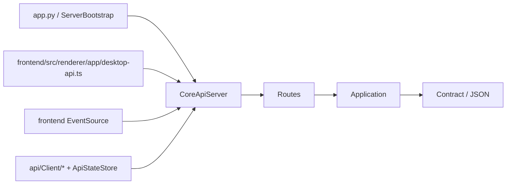

# `api/` 规格

## 1. 范围

本文档描述 `api/` 目录当前已经落地的本地 Core API 事实，包括：

- 本地 HTTP / SSE 边界与运行时结构
- 路由分组、请求入口、响应载荷与关键约束
- Python 侧 `api/Client` / `ApiStateStore` 的对象化消费边界
- Electron 渲染层接入 Core 的运行时入口

本文只记录当前代码已经实现并可验证的行为，不记录“计划中”或“理应如此”的未来状态。

### 1.1 权威来源

| 关注点 | 代码权威来源 |
| --- | --- |
| 路径、HTTP 方法、服务启动 | `api/Server/CoreApiServer.py`、`api/Server/ServerBootstrap.py`、`api/Server/Routes/*.py` |
| 请求归一化、业务约束、响应语义 | `api/Application/*.py` |
| HTTP `data` 载荷包装 | `api/Contract/*.py` |
| Python 侧对象化消费 | `api/Client/*.py`、`model/Api/*.py` |
| Electron 运行时接入 | `frontend/src/renderer/app/desktop-api.ts` |

### 1.2 阅读顺序

1. 先看本文第 2 节和第 3 节，确认边界、协议和错误口径。
2. 再看第 4 节，定位具体接口族与稳定载荷。
3. 如果要改 Python 客户端对象化边界，继续看第 5 节。
4. 如果要改 Electron 运行时接入方式，继续看第 6 节。

## 2. 运行时结构



### 2.1 目录职责

| 目录 | 职责 |
| --- | --- |
| `api/Server/` | 启动本地 HTTP 服务、注册路由、处理基础响应壳与错误映射 |
| `api/Server/Routes/` | 按领域声明路径常量并把请求分发到对应 Application 服务 |
| `api/Application/` | 读取 Core 状态、归一化请求、组织稳定响应语义 |
| `api/Contract/` | 把内部对象收口为 HTTP `data` 载荷 |
| `api/Bridge/` | 把内部事件裁剪成对外稳定的 SSE topic 与 payload |
| `api/Client/` | Python 侧薄客户端、SSE 消费器与状态仓库，主要用于测试和桥接场景 |

### 2.2 启动与注册

- `ServerBootstrap.start()` 负责组装各个 `*AppService`，再统一注册到 `CoreApiServer`。
- `CoreApiServer.register_routes()` 只注册基础健康检查；业务路由由 `api/Server/Routes/*.py` 追加注册。
- `EventRoutes` 把 `EventStreamService.stream_to_handler()` 暴露为唯一 SSE 入口。

## 3. 通用协议

### 3.1 HTTP 约定

- `GET /api/health` 与 `GET /api/events/stream` 是仅有的 `GET` 接口。
- 其余公开接口统一使用 `POST + JSON body`。
- `OPTIONS` 由 `CoreApiServer` 统一返回 `204`，无需各路由单独处理。

成功响应壳固定为：

```json
{
  "ok": true,
  "data": {}
}
```

失败响应壳固定为：

```json
{
  "ok": false,
  "error": {
    "code": "invalid_request",
    "message": "..."
  }
}
```

### 3.2 当前错误码现实

`CoreApiServer` 当前只在边界层统一保证以下错误码：

| `error.code` | 触发条件 |
| --- | --- |
| `not_found` | 路由不存在，或处理过程中抛出 `FileNotFoundError` |
| `invalid_request` | 处理过程中抛出 `ValueError` |
| `internal_error` | 其他未捕获异常 |

需要特别注意：

- 质量规则、提示词、校对等模块在数据层已经存在 revision 冲突异常类型，但 API 边界当前**没有**把它们翻译成独立 HTTP 错误码。
- 任务重置、分析术语导入、Extra 命令的“工程未加载”与“任务执行中”目前通常表现为 `invalid_request + 本地化 message`，而不是稳定的 `NO_PROJECT` / `TASK_RUNNING` 代码。

### 3.3 SSE 约定

SSE 真实线格式由 `EventEnvelope.to_sse_payload()` 生成，当前协议是：

```text
event: task.progress_changed
data: {"task_type":"translation","line":3}

```

当前实现特点：

- `event:` 直接承载 topic 名称。
- `data:` 直接承载 payload JSON。
- **没有** `event_id`、`timestamp`、`topic` 回显等额外包裹字段。
- 服务端空闲时会发送 `: keepalive` 注释帧保活。

### 3.4 当前公开 topic

| topic | 载荷用途 |
| --- | --- |
| `project.changed` | 通知工程加载态和当前路径变化 |
| `task.status_changed` | 通知翻译 / 分析任务生命周期变化 |
| `task.progress_changed` | 通知翻译 / 分析任务进度字段变化 |
| `workbench.snapshot_changed` | 通知工作台快照或刷新原因变化 |
| `settings.changed` | 通知设置字段变化 |
| `proofreading.snapshot_invalidated` | 通知校对快照失效，需要重新拉取 |
| `extra.ts_conversion_progress` | 通知繁简转换长任务进度 |
| `extra.ts_conversion_finished` | 通知繁简转换长任务终态 |

当前 payload 摘要：

| topic | 当前稳定字段 |
| --- | --- |
| `project.changed` | `loaded`、`path` |
| `task.status_changed` | `task_type`、`status`、`busy` |
| `task.progress_changed` | `task_type` 以及当前事件中实际出现的进度字段；不会强行补齐缺失字段 |
| `workbench.snapshot_changed` | `reason`、`scope`，以及按文件场景可选的 `rel_paths`、`removed_rel_paths`、`order_changed`；仍兼容 `snapshot` 全量载荷 |
| `settings.changed` | `keys`，以及可选的 `settings` 子集 |
| `proofreading.snapshot_invalidated` | `reason`、`scope`，以及按来源可选的 `rule_types`、`meta_keys`、`reset_scope`、`keys`、`rel_paths`、`removed_rel_paths`、`source_event`、`trigger_reason` |
| `extra.ts_conversion_progress` / `extra.ts_conversion_finished` | `task_id`、`phase`、`message`、`current`、`total`、`finished` |

### 3.5 Python 侧 SSE 消费现状

- `SseClient` 解析 `event:` / `data:` 帧后，把 payload 直接交给 `ApiStateStore.apply_event()`。
- `SseClient` 当前没有自动重连策略，发生 `httpx.HTTPError` 时会静默结束线程。
- `ApiStateStore` 当前只合并以下状态：
  - `project.changed`
  - `task.status_changed`
  - `task.progress_changed`
  - `proofreading.snapshot_invalidated`
  - `extra.ts_conversion_progress`
  - `extra.ts_conversion_finished`
- `settings.changed` 与 `workbench.snapshot_changed` 当前属于通知型事件，`ApiStateStore` 不缓存完整快照。

## 4. HTTP 接口目录

除第 4.1 节外，下列接口默认都是 `POST`。

### 4.1 基础接口

| 方法 | 路径 | `data` 结构 | 说明 |
| --- | --- | --- | --- |
| `GET` | `/api/health` | `{"status": "ok", "service": "linguagacha-core"}` | 渲染层探活与 base URL 确认入口 |
| `GET` | `/api/events/stream` | SSE 流 | 唯一事件流入口 |

### 4.2 Project

| 路径 | 请求体 | `data` 结构 | 说明 |
| --- | --- | --- | --- |
| `/api/project/load` | `{"path": str}` | `{"project": ProjectSnapshotPayload}` | 加载已有工程 |
| `/api/project/create` | `{"source_path": str, "output_path": str}` | `{"project": ProjectSnapshotPayload}` | 创建新工程 |
| `/api/project/snapshot` | `{}` | `{"project": ProjectSnapshotPayload}` | 读取当前工程快照 |
| `/api/project/unload` | `{}` | `{"project": ProjectSnapshotPayload}` | 卸载当前工程 |
| `/api/project/extensions` | `{}` | `{"extensions": list[str]}` | 读取导入支持的文件扩展名 |
| `/api/project/source-files` | `{"path": str}` | `{"source_files": list[str]}` | 扫描给定路径下可导入源文件 |
| `/api/project/preview` | `{"path": str}` | `{"preview": ProjectPreviewPayload}` | 读取指定工程的摘要 |

`ProjectSnapshotPayload` 当前稳定字段：

- `path`
- `loaded`

`ProjectPreviewPayload` 当前稳定字段：

- `path`
- `name`
- `source_language`
- `target_language`
- `file_count`
- `created_at`
- `updated_at`
- `total_items`
- `translated_items`
- `progress`

补充说明：

- Python 侧 `ProjectPreview` 额外提供派生字段 `has_progress`，它不是 HTTP 线上的字段。

### 4.3 Task

| 路径 | 请求体 | `data` 结构 | 说明 |
| --- | --- | --- | --- |
| `/api/tasks/start-translation` | `{"mode": "NEW" \| "CONTINUE"}` | `{"accepted": true, "task": TaskSnapshotPayload}` | 受理翻译任务 |
| `/api/tasks/stop-translation` | `{}` | `{"accepted": true, "task": TaskSnapshotPayload}` | 请求停止翻译任务 |
| `/api/tasks/reset-translation-all` | `{}` | `{"accepted": true, "task": TaskSnapshotPayload}` | 同步重置全部翻译进度 |
| `/api/tasks/reset-translation-failed` | `{}` | `{"accepted": true, "task": TaskSnapshotPayload}` | 同步只重置失败翻译条目 |
| `/api/tasks/start-analysis` | `{"mode": "NEW" \| "CONTINUE" \| "RESET"}` | `{"accepted": true, "task": TaskSnapshotPayload}` | 受理分析任务 |
| `/api/tasks/stop-analysis` | `{}` | `{"accepted": true, "task": TaskSnapshotPayload}` | 请求停止分析任务 |
| `/api/tasks/reset-analysis-all` | `{}` | `{"accepted": true, "task": TaskSnapshotPayload}` | 同步清空分析进度与候选 |
| `/api/tasks/reset-analysis-failed` | `{}` | `{"accepted": true, "task": TaskSnapshotPayload}` | 同步只重置失败分析进度 |
| `/api/tasks/import-analysis-glossary` | `{}` | `{"accepted": true, "imported_count": int, "task": TaskSnapshotPayload}` | 把分析候选导入术语表 |
| `/api/tasks/snapshot` | `{}` 或 `{"task_type": "translation" \| "analysis"}` | `{"task": TaskSnapshotPayload}` | 读取当前任务快照 |
| `/api/tasks/export-translation` | `{}` | `{"accepted": true}` | 请求导出当前工程译文 |

`TaskSnapshotPayload` 当前稳定字段：

- `task_type`
- `status`
- `busy`
- `request_in_flight_count`
- `line`
- `total_line`
- `processed_line`
- `error_line`
- `total_tokens`
- `total_output_tokens`
- `total_input_tokens`
- `time`
- `start_time`

补充说明：

- 分析任务快照在可用时会额外带上 `analysis_candidate_count`。
- `reset-*` 与 `import-analysis-glossary` 当前都要求“工程已加载且引擎空闲”；失败时通常会落成 `invalid_request`。
- `import-analysis-glossary` 的 Python 客户端返回值已经对象化为 `AnalysisGlossaryImportResult`。
- `export-translation` 当前只有最小 `accepted` 回执，还没有对应的冻结返回模型。

### 4.4 Workbench

| 路径 | 请求体 | `data` 结构 | 说明 |
| --- | --- | --- | --- |
| `/api/workbench/snapshot` | `{}` | `{"snapshot": WorkbenchSnapshotPayload}` | 读取工作台快照 |
| `/api/workbench/add-file` | `{"path": str}` | `{"accepted": true}` | 调度新增文件 |
| `/api/workbench/replace-file` | `{"rel_path": str, "path": str}` | `{"accepted": true}` | 调度替换文件 |
| `/api/workbench/replace-file-batch` | `{"operations": list[{"rel_path": str, "path": str}]}` | `{"accepted": true}` | 调度批量替换文件 |
| `/api/workbench/reset-file` | `{"rel_path": str}` | `{"accepted": true}` | 调度重置文件 |
| `/api/workbench/reset-file-batch` | `{"rel_paths": list[str]}` | `{"accepted": true}` | 调度批量重置文件 |
| `/api/workbench/delete-file` | `{"rel_path": str}` | `{"accepted": true}` | 调度删除文件 |
| `/api/workbench/delete-file-batch` | `{"rel_paths": list[str]}` | `{"accepted": true}` | 调度批量删除文件 |
| `/api/workbench/reorder-files` | `{"ordered_rel_paths": list[str]}` | `{"accepted": true}` | 持久化文件顺序 |
| `/api/workbench/file-patch` | `{"rel_paths": list[str], "removed_rel_paths": list[str], "include_order": bool}` | `{"patch": WorkbenchFilePatchPayload}` | 读取工作台文件级补丁 |
| `/api/workbench/extensions` | `{}` | `{"extensions": list[str]}` | 读取工作台导入支持扩展名 |

`WorkbenchSnapshotPayload` 当前稳定字段：

- `file_count`
- `total_items`
- `translated`
- `translated_in_past`
- `error_count`
- `untranslated`
- `file_op_running`
- `entries`

`WorkbenchFileEntryPayload` 当前稳定字段：

- `rel_path`
- `item_count`
- `file_type`

`WorkbenchFilePatchPayload` 当前稳定字段：

- `summary`
- `ordered_rel_paths`
- `removed_rel_paths`
- `entries`

补充说明：

- `reorder-files` 的后端校验落在 `ProjectFileService.reorder_files()`：`ordered_rel_paths` 必须与当前工程文件集合完全一致，长度和元素集合都要匹配。
- `replace-file-batch`、`reset-file-batch`、`delete-file-batch` 当前都是一次请求内完成一次事务、一次缓存失效和一次结构化刷新事件。
- 批量文件操作默认是“全成或全败”；其中 `replace-file-batch` 还会拒绝同批源路径与目标路径发生重名链冲突的情况。
- 工作台文件命令接口仍只返回 `accepted`；页面运行时现在依赖 `workbench.snapshot_changed` 的结构化 payload 再调用 `/api/workbench/file-patch` 合并本地缓存。

### 4.5 Settings

| 路径 | 请求体 | `data` 结构 | 说明 |
| --- | --- | --- | --- |
| `/api/settings/app` | `{}` | `{"settings": AppSettingsSnapshot}` | 读取应用设置 |
| `/api/settings/update` | 允许的局部字段 | `{"settings": AppSettingsSnapshot}` | 局部更新设置 |
| `/api/settings/recent-projects/add` | `{"path": str, "name": str}` | `{"settings": AppSettingsSnapshot}` | 追加最近工程 |
| `/api/settings/recent-projects/remove` | `{"path": str}` | `{"settings": AppSettingsSnapshot}` | 删除最近工程 |

`AppSettingsSnapshot` 当前稳定字段：

- `app_language`
- `source_language`
- `target_language`
- `project_save_mode`
- `project_fixed_path`
- `output_folder_open_on_finish`
- `request_timeout`
- `preceding_lines_threshold`
- `clean_ruby`
- `deduplication_in_trans`
- `deduplication_in_bilingual`
- `check_kana_residue`
- `check_hangeul_residue`
- `check_similarity`
- `write_translated_name_fields_to_file`
- `auto_process_prefix_suffix_preserved_text`
- `mtool_optimizer_enable`
- `glossary_default_preset`
- `text_preserve_default_preset`
- `pre_translation_replacement_default_preset`
- `post_translation_replacement_default_preset`
- `translation_custom_prompt_default_preset`
- `analysis_custom_prompt_default_preset`
- `recent_projects`

补充说明：

- `update` 只会处理 `SettingsAppService.SETTING_KEYS` 白名单中的字段，未知字段会被忽略。
- `app_language` 当前只接受 `ZH` 与 `EN`。

### 4.6 Model

| 路径 | 请求体 | `data` 结构 | 说明 |
| --- | --- | --- | --- |
| `/api/models/snapshot` | `{}` | `{"snapshot": ModelPageSnapshotPayload}` | 读取模型页完整快照 |
| `/api/models/update` | `{"model_id": str, "patch": dict}` | `{"snapshot": ModelPageSnapshotPayload}` | 局部更新模型配置 |
| `/api/models/activate` | `{"model_id": str}` | `{"snapshot": ModelPageSnapshotPayload}` | 切换激活模型 |
| `/api/models/add` | `{"model_type": str}` | `{"snapshot": ModelPageSnapshotPayload}` | 新增模型 |
| `/api/models/delete` | `{"model_id": str}` | `{"snapshot": ModelPageSnapshotPayload}` | 删除模型 |
| `/api/models/reset-preset` | `{"model_id": str}` | `{"snapshot": ModelPageSnapshotPayload}` | 重置预设模型 |
| `/api/models/reorder` | `{"ordered_model_ids": list[str]}` 或兼容 `{"model_id": str, "operation": str}` | `{"snapshot": ModelPageSnapshotPayload}` | 模型排序 |
| `/api/models/list-available` | `{"model_id": str}` | `{"models": list[str]}` | 查询供应商可用模型列表 |
| `/api/models/test` | `{"model_id": str}` | 原始测试结果字典 | 执行模型连通性 / 配置测试 |

`ModelPageSnapshotPayload` 当前稳定字段：

- `active_model_id`
- `models`

`models` 中每个条目当前稳定字段：

- `id`
- `type`
- `name`
- `api_format`
- `api_url`
- `api_key`
- `model_id`
- `request`
- `threshold`
- `thinking`
- `generation`

补充说明：

- `update.patch` 当前只允许以下顶层键：`name`、`api_url`、`api_key`、`model_id`、`thinking`、`threshold`、`generation`、`request`。
- `thinking`、`threshold`、`generation`、`request` 这四个 patch 字段必须是对象。
- `add.model_type` 当前来自 `ModelType`，实际可新增的是自定义类型：`CUSTOM_GOOGLE`、`CUSTOM_OPENAI`、`CUSTOM_ANTHROPIC`。
- `reorder` 现在优先使用整组 `ordered_model_ids`；旧前端仍可用 `model_id + operation` 兼容调用。
- `ordered_model_ids` 必须完整匹配某一个模型分组，不能跨组混排。

### 4.7 Quality

#### 4.7.1 质量规则

| 路径 | 请求体 | `data` 结构 | 说明 |
| --- | --- | --- | --- |
| `/api/quality/rules/snapshot` | `{"rule_type": str}` | `{"snapshot": QualityRuleSnapshotPayload}` | 读取规则快照 |
| `/api/quality/rules/update-meta` | `{"rule_type": str, "expected_revision": int, "meta": dict}` | `{"snapshot": QualityRuleSnapshotPayload}` | 更新规则元信息 |
| `/api/quality/rules/save-entries` | `{"rule_type": str, "expected_revision": int, "entries": list[dict]}` | `{"snapshot": QualityRuleSnapshotPayload}` | 保存规则条目 |
| `/api/quality/rules/import` | `{"rule_type": str, "expected_revision": int, "path": str}` | `{"entries": list[dict]}` | 从本地文件导入规则条目 |
| `/api/quality/rules/export` | `{"rule_type": str, "path": str, "entries": list[dict]}` | `{"path": str}` | 导出规则条目 |
| `/api/quality/rules/presets` | `{"preset_dir_name": str}` | `{"builtin_presets": list[dict], "user_presets": list[dict]}` | 列出规则预设 |
| `/api/quality/rules/presets/read` | `{"preset_dir_name": str, "virtual_id": str}` | `{"entries": list[dict]}` | 读取规则预设正文 |
| `/api/quality/rules/presets/save` | `{"preset_dir_name": str, "name": str, "entries": list[dict]}` | `{"item": dict}` | 保存规则用户预设 |
| `/api/quality/rules/presets/rename` | `{"preset_dir_name": str, "virtual_id": str, "new_name": str}` | `{"item": dict}` | 重命名规则用户预设 |
| `/api/quality/rules/presets/delete` | `{"preset_dir_name": str, "virtual_id": str}` | `{"path": str}` | 删除规则用户预设 |
| `/api/quality/rules/query-proofreading` | `{"rule_type": str, "entry": dict}` | `{"query": ProofreadingLookupPayload}` | 把规则条目转换成校对查询 |
| `/api/quality/rules/statistics` | `{"rules": list[dict], "relation_candidates": list[dict]}` | `{"statistics": QualityRuleStatisticsSnapshot}` | 构建规则统计快照 |

`rule_type` 当前实际使用值：

- `glossary`
- `pre_replacement`
- `post_replacement`
- `text_preserve`

`QualityRuleSnapshot` 当前稳定字段：

- `rule_type`
- `revision`
- `meta`
- `statistics`
- `entries`

需要特别注意的差异：

- `glossary` / `pre_replacement` / `post_replacement` 的 `meta` 形状是 `{"enabled": bool}`。
- `text_preserve` 的 `meta` 形状是 `{"mode": str}`，不是 `enabled`。
- 规则 preset 列表项当前稳定字段是：`name`、`file_name`、`virtual_id`、`path`、`type`。
- `query-proofreading` 在 `rule_type == "text_preserve"` 时会强制把 `is_regex` 设为 `true`。
- `statistics.results` 的 value 当前稳定字段是：`matched_item_count`、`subset_parents`。

#### 4.7.2 自定义提示词

| 路径 | 请求体 | `data` 结构 | 说明 |
| --- | --- | --- | --- |
| `/api/quality/prompts/snapshot` | `{"task_type": "translation" \| "analysis"}` | `{"prompt": dict}` | 读取提示词快照 |
| `/api/quality/prompts/template` | `{"task_type": "translation" \| "analysis"}` | `{"template": {"default_text": str, "prefix_text": str, "suffix_text": str}}` | 读取提示词模板文本 |
| `/api/quality/prompts/save` | `{"task_type": str, "expected_revision": int, "text": str, "enabled": bool \| null}` | `{"prompt": dict}` | 保存提示词 |
| `/api/quality/prompts/import` | `{"task_type": str, "path": str, "expected_revision": int, "enabled": bool \| null}` | `{"prompt": dict}` | 从本地文件导入提示词 |
| `/api/quality/prompts/export` | `{"task_type": str, "path": str}` | `{"path": str}` | 导出提示词 |
| `/api/quality/prompts/presets` | `{"task_type": str}` | `{"builtin_presets": list[dict], "user_presets": list[dict]}` | 列出提示词预设 |
| `/api/quality/prompts/presets/read` | `{"task_type": str, "virtual_id": str}` | `{"text": str}` | 读取提示词预设正文 |
| `/api/quality/prompts/presets/save` | `{"task_type": str, "name": str, "text": str}` | `{"path": str}` | 保存提示词用户预设 |
| `/api/quality/prompts/presets/rename` | `{"task_type": str, "virtual_id": str, "new_name": str}` | `{"item": dict}` | 重命名提示词用户预设 |
| `/api/quality/prompts/presets/delete` | `{"task_type": str, "virtual_id": str}` | `{"path": str}` | 删除提示词用户预设 |

`prompt` 快照当前稳定字段：

- `task_type`
- `revision`
- `meta`
- `text`

其中：

- `meta` 当前只稳定包含 `enabled`。
- `template` 当前只稳定包含 `default_text`、`prefix_text`、`suffix_text`。
- 提示词 preset 列表项和质量规则 preset 列表项使用同一套字段：`name`、`file_name`、`virtual_id`、`path`、`type`。

### 4.8 Proofreading

| 路径 | 请求体 | `data` 结构 | 说明 |
| --- | --- | --- | --- |
| `/api/proofreading/snapshot` | `{}`、`{"lg_path": str}`、`{"path": str}` 或 `{"project_id": str}` | `{"snapshot": ProofreadingSnapshotPayload}` | 读取校对页快照 |
| `/api/proofreading/file-patch` | `{"rel_paths": list[str], "removed_rel_paths": list[str]}`，并可叠加 `{"lg_path": str}`、`{"path": str}`、`{"project_id": str}`、`{"filters": dict}`、`{"filter_options": dict}` 或扁平筛选字段 | `{"patch": ProofreadingFilePatchPayload}` | 按受影响文件读取校对页局部补丁 |
| `/api/proofreading/filter` | `{"filters": dict}`、`{"filter_options": dict}` 或扁平筛选字段 | `{"snapshot": ProofreadingSnapshotPayload}` | 按筛选条件重建快照 |
| `/api/proofreading/search` | `{"keyword": str, "is_regex": bool}` 并可叠加筛选字段 | `{"search_result": ProofreadingSearchResultPayload}` | 在当前筛选口径下搜索 |
| `/api/proofreading/save-item` | `{"item": dict, "new_dst": str, "expected_revision": int}` | `{"result": ProofreadingMutationResultPayload}` | 保存单条条目 |
| `/api/proofreading/save-all` | `{"items": list[dict], "expected_revision": int}` | `{"result": ProofreadingMutationResultPayload}` | 批量保存 |
| `/api/proofreading/replace-all` | `{"items": list[dict], "search_text": str, "replace_text": str, "is_regex": bool, "expected_revision": int}` | `{"result": ProofreadingMutationResultPayload}` | 批量替换 |
| `/api/proofreading/recheck-item` | `{"item": dict}` | `{"result": ProofreadingMutationResultPayload}` | 重查单条条目 |
| `/api/proofreading/retranslate-items` | `{"items": list[dict], "expected_revision": int}` | `{"result": ProofreadingMutationResultPayload}` | 重新翻译条目 |

`ProofreadingSnapshot` 当前稳定字段：

- `revision`
- `project_id`
- `readonly`
- `summary`
- `filters`
- `items`

`ProofreadingSearchResult` 当前稳定字段：

- `keyword`
- `is_regex`
- `matched_item_ids`

`ProofreadingMutationResult` 当前稳定字段：

- `revision`
- `changed_item_ids`
- `items`
- `summary`

`ProofreadingFilePatchPayload` 当前稳定字段：

- `revision`
- `project_id`
- `readonly`
- `removed_file_paths`
- `default_filters`
- `applied_filters`
- `full_summary`
- `filtered_summary`
- `full_items`
- `filtered_items`

补充说明：

- `snapshot` 会优先解析 `lg_path`，再回退到 `path` / `project_id` / 当前工程路径。
- `file-patch` 与 `filter` 共用同一套筛选解析入口：优先取 `filters`，其次取 `filter_options`，最后回退到请求顶层扁平字段。
- `file-patch` 会同时返回两套文件切片：默认筛选口径下的 `full_items` / `full_summary`，以及当前已应用筛选口径下的 `filtered_items` / `filtered_summary`。
- 当前工程未加载或请求里的工程路径已经过期时，API 会返回 `readonly` 快照，而不是专门的业务错误码。
- `filters` 当前稳定字段为：`warning_types`、`statuses`、`file_paths`、`glossary_terms`。
- `save-item`、`save-all`、`replace-all`、`retranslate-items` 当前都使用 `expected_revision` 做乐观锁保护；但冲突异常在 API 边界仍未标准化成独立错误码。

### 4.9 Extra

#### 4.9.1 繁简转换

| 路径 | 请求体 | `data` 结构 | 说明 |
| --- | --- | --- | --- |
| `/api/extra/ts-conversion/options` | `{}` | `{"options": TsConversionOptionsSnapshot}` | 读取繁简转换默认选项 |
| `/api/extra/ts-conversion/start` | `{"direction": str, "preserve_text": bool, "convert_name": bool}` | `{"task": TsConversionTaskAccepted}` | 启动繁简转换任务 |

`TsConversionOptionsSnapshot` 当前稳定字段：

- `default_direction`
- `preserve_text_enabled`
- `convert_name_enabled`

`TsConversionTaskAccepted` 当前稳定字段：

- `accepted`
- `task_id`

补充说明：

- 启动成功后，进度与终态都通过 SSE 的 `extra.ts_conversion_progress` / `extra.ts_conversion_finished` 推送。
- Python 侧 `ApiStateStore` 统一通过 `get_extra_task_state("extra_ts_conversion")` 读取当前任务状态。

#### 4.9.2 姓名字段

| 路径 | 请求体 | `data` 结构 | 说明 |
| --- | --- | --- | --- |
| `/api/extra/name-fields/snapshot` | `{}` | `{"snapshot": NameFieldSnapshot}` | 读取当前姓名字段快照 |
| `/api/extra/name-fields/extract` | `{}` | `{"snapshot": NameFieldSnapshot}` | 重新提取姓名字段 |
| `/api/extra/name-fields/translate` | `{"items": list[dict]}` | `{"result": NameFieldTranslateResult}` | 翻译姓名字段列表 |
| `/api/extra/name-fields/save-to-glossary` | `{"items": list[dict]}` | `{"snapshot": NameFieldSnapshot}` | 把姓名字段写回术语表 |

姓名字段条目当前稳定字段：

- `src`
- `dst`
- `context`
- `status`

`NameFieldTranslateResult` 当前额外稳定字段：

- `success_count`
- `failed_count`

## 5. Python 客户端与对象化现状

### 5.1 客户端边界

- `ApiClient` 是一个非常薄的 HTTP 包装器：它只返回响应里的 `data` 字段，当前不会主动抛出 HTTP 错误，也不会保留 `error` 壳。
- `AppClientContext` 把允许给 Python UI / 测试消费的客户端对象收口到一个不可变容器里。
- Electron 渲染层运行时**不依赖**这些 Python 客户端；它走的是 `desktop-api.ts + EventSource`。

### 5.2 对象化覆盖一览

| 客户端 | 已对象化返回 | 仍返回原始结构 |
| --- | --- | --- |
| `ProjectApiClient` | `load/create/snapshot/unload -> ProjectSnapshot`、`preview -> ProjectPreview` | `extensions -> list[str]`、`source-files -> list[str]` |
| `TaskApiClient` | 所有任务快照命令 -> `TaskSnapshot`、`import_analysis_glossary -> AnalysisGlossaryImportResult` | `export_translation -> dict[str, Any]` |
| `WorkbenchApiClient` | `snapshot -> WorkbenchSnapshot` | `add/replace/replace_batch/reset/reset_batch/delete/delete_batch/reorder -> dict[str, Any]`、`file_patch -> dict[str, Any]`、`extensions -> list[str]` |
| `SettingsApiClient` | 全部返回 `AppSettingsSnapshot` | 无 |
| `ModelApiClient` | `snapshot/update/activate/add/delete/reset/reorder -> ModelPageSnapshot` | `list_available_models -> list[str]`、`test_model -> dict[str, Any]` |
| `QualityRuleApiClient` | `snapshot/save_entries/update_meta -> QualityRuleSnapshot`、`query_proofreading -> ProofreadingLookupQuery`、`statistics -> QualityRuleStatisticsSnapshot` | 规则导入导出 / preset 全家桶 / prompt 全家桶仍是 `dict`、`list`、`tuple`、`str` |
| `ProofreadingApiClient` | `snapshot/filter -> ProofreadingSnapshot`、`search -> ProofreadingSearchResult`、`save/recheck/retranslate -> ProofreadingMutationResult` | `/api/proofreading/file-patch` 当前尚未在 Python 客户端封装 |
| `ExtraApiClient` | 全部当前公开路由都已对象化 | 无 |

### 5.3 `ApiStateStore` 当前缓存口径

`ApiStateStore` 当前只缓存以下状态：

- `project_snapshot: ProjectSnapshot`
- `task_snapshot: TaskSnapshot`
- `proofreading_snapshot_invalidated: bool`
- `extra_task_states: dict[str, ExtraTaskState]`

不会缓存的内容包括：

- 设置快照
- 工作台完整快照
- 质量规则快照
- 校对完整快照
- 模型页快照

### 5.4 当前未接线或仅占位的模型

以下模型文件虽然存在，但还不是当前 Python 客户端真实返回面的权威来源：

- `model/Api/PromptModels.py`
  - `CustomPromptSnapshot`
  - `PromptPresetEntry`
  - 当前 `QualityRuleApiClient` 的 prompt 系列接口仍返回原始 `dict` / `str` / `tuple`
- `model/Api/ExtraModels.py`
  - `ExtraToolEntry`
  - `ExtraToolSnapshot`
  - 当前没有对应 HTTP 路由输出这两个对象
- `api/Contract/PromptPayloads.py`
  - 当前只有一个通用 `PromptSnapshotPayload.payload: dict[str, Any]`
  - 还没有像 `Project` / `Task` / `Proofreading` 那样字段化的 prompt 载荷对象

## 6. 前端运行时边界

当前 Electron 渲染层运行时只通过以下入口接入 Core：

- `frontend/src/renderer/app/desktop-api.ts`
  - `api_fetch()`：统一发 `POST`
  - `open_event_stream()`：统一打开 SSE
  - `probe_core_api_candidate()`：用 `/api/health` 做探活
- `frontend/src/renderer/app/state/*`
- `frontend/src/renderer/pages/*`

当前约束如下：

- 渲染层在真正发请求前，会校验 `/api/health` 返回的 `service === "linguagacha-core"` 且 `status === "ok"`。
- 渲染层大量接口当前使用本地 TypeScript payload 类型，而不是复用 Python 侧 `api/Client` 的冻结模型。
- `DesktopRuntimeContext` 当前把 `workbench.snapshot_changed` 与 `proofreading.snapshot_invalidated` 收口成结构化变更信号：
  - `workbench_change_signal = { seq, reason, scope, rel_paths, removed_rel_paths, order_changed }`
  - `proofreading_change_signal = { seq, reason, scope, rel_paths, removed_rel_paths }`
- 工作台页与校对页在收到 `scope == "file"` 或 `scope == "order"` 的信号后，会优先请求对应的 `/file-patch` 接口做本地合并；只有 `scope == "global"`、本地缓存未就绪或补丁失败时才回退整页 `/snapshot`。
- `api/Client/*` 与 `ApiStateStore` 主要服务于 Python 侧测试、桥接和对象化消费场景，不是 Electron 渲染层运行时入口。

## 7. 维护与同步要求

出现以下变化时，必须同步更新本文：

- 路径、HTTP 方法、请求键或 `data` 字段发生变化
- SSE topic 或 payload 发生变化
- `CoreApiServer` 的错误映射策略发生变化
- `api/Client` 的对象化覆盖范围发生变化
- Electron 渲染层接入 Core 的唯一入口发生变化

维护原则：

- 只写当前代码已经兑现的事实，不在规格里预支未来设计。
- 优先记录“开发会依赖的稳定信息”，例如路径、字段、白名单、兼容请求形态、真实错误边界。
- 不把页面临时实现细节、历史遗留原因或与开发无关的示例堆进本文。
