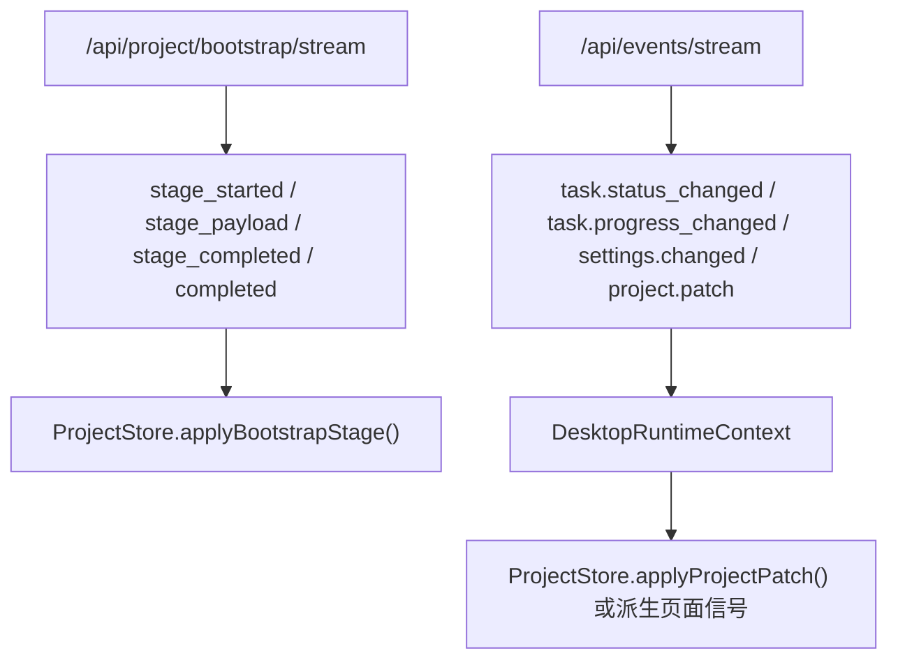

# LinguaGacha API 文档

## 一句话总览
`api/` 是 LinguaGacha Python Core 对外暴露的唯一本地 HTTP / SSE 协议边界。本文只保留调用方必须知道的稳定契约：谁在消费它、路由族如何分组、响应壳和错误码如何解释、bootstrap 与 `project.patch` 如何驱动运行态，以及哪些写接口属于同步 mutation、哪些属于异步任务。

## 协议消费者与边界

| 消费者 | 接入方式 | 边界约束 |
| --- | --- | --- |
| Electron 渲染层 | `frontend/src/renderer/app/desktop-api.ts` | 页面不得绕过它直连 `fetch` / `EventSource` 到随意路径 |
| 渲染层项目运行态 | `/api/project/bootstrap/stream` + `/api/events/stream` | `ProjectStore` 依赖 bootstrap + `project.patch` 建立最小事实源 |
| Python 侧对象化客户端 | `api/Client/*.py` + `api/Models/*.py` | 客户端负责请求包装与对象化，不负责运行态缓存 |

协议层真实分工：
- `api/Server/` 负责本地 HTTP 服务、路由注册与统一错误映射。
- `api/Application/` 负责把 Core 状态整理成稳定业务语义。
- `api/Contract/` 负责 HTTP 响应壳、bootstrap 行块和 SSE 线格式。
- `api/Bridge/` 负责公开 topic 与 `project.patch`。
- `api/Models/` 与 `api/Client/` 负责 Python 侧对象化契约。

## 路由族与路径前缀

| 路由族 | 代表路径 | 用途 |
| --- | --- | --- |
| 探活 | `/api/health` | 渲染层启动前探活 |
| 长期事件流 | `/api/events/stream` | 公开 SSE topic 与 `project.patch` |
| bootstrap 首包 | `/api/project/bootstrap/stream` | 一次性阶段化项目首包 |
| 项目与同步 mutation | `/api/project/*` | 工程、工作台、校对、reset、导入术语等 |
| 项目派生工具 | `/api/project/text-preserve/preset-rules`、`/api/project/export-converted-translation` | 为 TS 侧工具页提供预置规则读取与转换结果文件写出 |
| 后台任务 | `/api/tasks/*` | 翻译与分析任务启动、停止、快照 |
| 模型页 | `/api/models/*` | 快照、更新、激活、增删、重排、测试与可选模型查询 |
| 质量规则与提示词 | `/api/quality/rules/*`、`/api/quality/prompts/*` | 规则、预设与提示词读写 |
| 应用设置 | `/api/settings/*` | 应用设置快照、更新、最近项目维护 |

路径不变量：
- 主业务协议统一落在 `/api/` 前缀，不扩展新的并行根前缀。
- 公开 `GET` 稳定只有 `/api/health`、`/api/events/stream`、`/api/project/bootstrap/stream` 三类；其余公开接口默认走 `POST + JSON body`。
- `OPTIONS` 由服务器统一回 `204`，CORS 统一开放到 `Origin * / Methods GET,POST,OPTIONS / Headers Content-Type`。

## HTTP 响应壳

成功响应固定为：

```json
{
  "ok": true,
  "data": {}
}
```

失败响应固定为：

```json
{
  "ok": false,
  "error": {
    "code": "invalid_request",
    "message": "..."
  }
}
```

### 错误码边界

| `error.code` | 触发条件 | 维护含义 |
| --- | --- | --- |
| `not_found` | 路由不存在，或内部抛出 `FileNotFoundError` | 只能当作“资源或路径不存在”级别错误 |
| `invalid_request` | 内部抛出 `ValueError` | 大部分业务校验失败会折叠到这里 |
| `internal_error` | 其他未捕获异常 | 不能用来区分业务分支 |

需要记住：
- 当前没有稳定的业务错误码体系；revision 冲突、工程未加载、任务忙碌等大多仍表现为 `invalid_request + message`。
- 调用方不要依赖 `error.code` 去穷举所有业务失败分支。

## SSE、bootstrap 与 patch 规则



### 普通事件流
- `/api/events/stream` 使用 `EventEnvelope.to_sse_payload()` 生成 SSE 载荷。
- 线格式只包含 `event:` 与 `data:`，没有额外 `event_id`、`timestamp` 或 `topic` 回显。
- 空闲时服务端发送 `: keepalive`。

### bootstrap 首包

`/api/project/bootstrap/stream` 是一次性阶段化首包，不是长期订阅流。稳定事件型别如下：

| `event:` | 字段 | 用途 |
| --- | --- | --- |
| `stage_started` | `stage`、`message` | 某个阶段开始 |
| `stage_payload` | `stage`、`payload` | 当前阶段有效载荷 |
| `stage_completed` | `stage` | 当前阶段结束 |
| `completed` | `projectRevision`、`sectionRevisions` | 首包整体完成 |

稳定 stage 顺序固定为：
1. `project`
2. `files`
3. `items`
4. `quality`
5. `prompts`
6. `analysis`
7. `proofreading`
8. `task`

### `RowBlock` 的稳定边界

只有两个 stage 依赖 `RowBlock(fields, rows)` 作为稳定协议：

| stage | 字段顺序 | 渲染层落地键 |
| --- | --- | --- |
| `files` | `rel_path`、`file_type`、`sort_index` | `files[rel_path]` |
| `items` | `item_id`、`file_path`、`row_number`、`src`、`dst`、`name_src`、`name_dst`、`status`、`text_type`、`retry_count` | `items[item_id]` |

块类型由 stage 决定，不额外携带 `schema` 标签。

### 公开 topic 与 `project.patch`

| topic | 稳定事实 |
| --- | --- |
| `project.changed` | 只广播工程是否已加载与当前路径，不携带整页运行态 |
| `task.progress_changed` | 只发送当前事件中真实出现的字段，不补齐缺失统计 |
| `task.status_changed` | `DONE / ERROR / IDLE` 是桥接层对内部终态的公开解释 |
| `settings.changed` | 是设置广播，不等于页面必须整页刷新 |
| `project.patch` | 由 `ProjectPatchEventBridge` 额外补出的运行态补丁事件 |

`project.patch` 的稳定语义：
- 至少包含 `source`、`updatedSections` 与 `patch`，在可用时带 `projectRevision`、`sectionRevisions`。
- 调用方应把它当成可直接合并进 `ProjectStore` 的运行态补丁，而不是“请刷新页面”的提示。
- 异步任务终态、校对重译，以及后端显式发出的 `PROJECT_RUNTIME_PATCH` 都可能产生它。

## 同步 mutation 与异步任务的区别

| 类型 | 代表接口 | 运行态推进方式 |
| --- | --- | --- |
| 同步 mutation | 工作台 `add-file / reset-file / delete-file / delete-file-batch / reorder-files`，校对 `save-item / save-all / replace-all`，`translation/reset`，`analysis/reset`，`analysis/import-glossary` | 前端先本地 patch，再由服务端持久化并回 `ProjectMutationAck { accepted, projectRevision, sectionRevisions }` |
| 只读预演 | `translation/reset-preview`、`analysis/reset-preview`、`workbench/parse-file`、`prompts/import` | 返回预演结果，不改运行态事实 |
| 异步任务 | `tasks/*`、`retranslate-items` | 依赖任务事件与必要的 `project.patch` 推进运行态 |

翻译任务补充：
- 翻译任务完成只保存项目事实，不自动写出译文文件。
- 生成译文文件由前端确认后显式调用 `/api/tasks/export-translation`，该接口仍复用现有 `POST + JSON body` 形状。

项目派生工具补充：
- 简繁转换页在 TS 侧完成 OpenCC 转换，只把已转换的 `item_id / dst / name_dst` 载荷交给 `/api/project/export-converted-translation` 写出文件；该接口不写回 `.lg` 项目运行态，也不发 `project.patch`。
- `/api/project/text-preserve/preset-rules` 只读取指定 `text_type` 的预置文本保护规则，供 TS 侧按当前文本保护模式自行编译与分段保护。

额外约束：
- `tasks/translate-single` 只给页面派生工具低频调用，Python Core 创建临时 `Item` 并复用引擎单条翻译入口；姓名字段解析、格式兜底与导入术语表合并仍由渲染层完成。
- `reorder-files` 的 `ordered_rel_paths` 必须完整覆盖当前文件集合。
- `analysis/import-glossary` 会分别校验运行态 section revision 与 glossary 自身 revision。
- `tasks/snapshot` 是按需快照，不是订阅入口。
- `settings/update` 只处理 `SettingsAppService.SETTING_KEYS` 白名单字段；应用语言只支持 `ZH` / `EN`。
- `models/update` 只接受 `PATCH_ALLOWED_KEYS` 白名单字段；`models/reorder` 只能重排单一模型分组，`ordered_model_ids` 必须完整匹配该分组。

## Python 客户端边界

| 关注点 | 当前规则 |
| --- | --- |
| `ApiClient` | 默认只取响应体中的 `data`，不会校验 `ok`、保留 `error` 或主动抛出结构化业务异常 |
| 对象化覆盖 | `SettingsApiClient`、`ProjectApiClient`、`ProofreadingApiClient` 主路径以对象化结果为主 |
| 混合返回 | `TaskApiClient.export_translation()`、`ModelApiClient.test_model()`、`WorkbenchApiClient.parse_file()` 仍可能返回原始结构 |

这意味着：
- Python 客户端擅长做请求包装与 DTO 化，不承担 `ProjectStore` 风格的长期状态同步层。
- 若要扩展稳定 DTO 边界，改动通常要同时落在 `api/Models/*` 与对应 `api/Client/*`。

## 什么时候必须更新本文

- 路由前缀、路由分组或监听地址规则变化
- HTTP 响应壳或错误映射口径变化
- bootstrap stage、`RowBlock` 字段顺序、事件型别变化
- 公开 topic 或 `project.patch` 语义变化
- `ProjectMutationAck` 的稳定字段变化
- Python 客户端对象化覆盖边界变化
