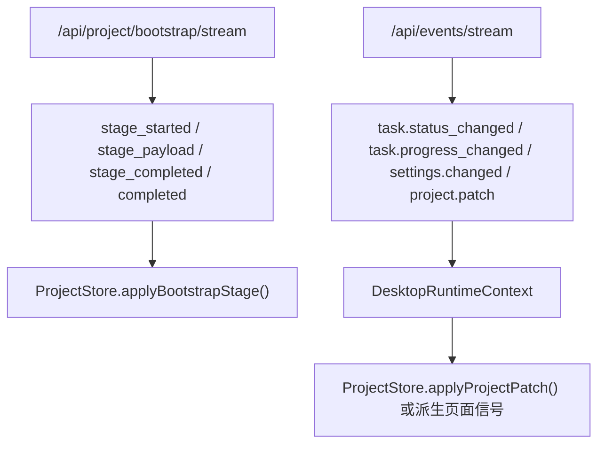

# LinguaGacha API 文档

## 一句话总览
Electron 运行时公开 `/api/*` 入口由 `frontend/src/main/api/` 的 TS Gateway 持有；项目轻生命周期、项目同步 mutation、reset preview、bootstrap 运行态编码、`project.patch` 补全与 section revision 收口在 `frontend/src/main/project/`，公开任务协议、task snapshot、进程内任务数据服务与事件 hub 收口在 `frontend/src/main/task/`，后台任务生命周期、调度、限流、停止、重试与提交循环收口在 `frontend/src/main/task-engine/`，单个 work unit 的文本处理、prompt、pi-ai LLM adapter 与响应解析收口在 `frontend/src/main/task-worker/`，文件解析 / 写回收口在 `frontend/src/main/file/`，模型页快照、CRUD、远端模型列表与模型连通性测试收口在 `frontend/src/main/model/`，应用设置、质量规则 / 提示词、校对同步保存与路径规则收口在 `frontend/src/main/service/`。本文只保留调用方必须知道的稳定契约：谁在消费它、路由族如何分组、响应壳和错误码如何解释、bootstrap 与 `project.patch` 如何驱动运行态，以及哪些写接口属于同步 mutation、哪些属于异步任务。

## 协议消费者与边界

| 消费者 | 接入方式 | 边界约束 |
| --- | --- | --- |
| Electron 渲染层 | `frontend/src/renderer/app/desktop/desktop-api.ts` -> TS Gateway baseUrl | 页面不得绕过它直连 `fetch` / `EventSource` 到随意路径 |
| 渲染层项目运行态 | `/api/project/bootstrap/stream` + `/api/events/stream` | `ProjectStore` 依赖 bootstrap + `project.patch` 建立最小事实源 |
| Electron 独立日志窗口 | `/api/logs/stream` | 只消费 TS `LogManager` 诊断日志事件，不进入项目运行态 |

内部 Database Service 不属于公开 `api/` 协议：它由 Electron main 启动，只供 TS Gateway 进程内服务调用。renderer 和外部调试脚本不应依赖 `/internal/database/*` 或任何内部监听地址；任务数据不再暴露 HTTP 回环。

协议层真实分工：
- `frontend/src/main/api/` 负责 Electron 公开 Gateway、CORS、`/api/health`、路由编排和统一响应壳；TS 项目域实现收口在 `frontend/src/main/project/`，公开任务实现收口在 `frontend/src/main/task/`，后台任务执行态收口在 `frontend/src/main/task-engine/`，模型页实现收口在 `frontend/src/main/model/`，其它业务实现与路径解析收口在 `frontend/src/main/service/`。
- `frontend/src/main/project/` 负责项目轻生命周期、项目同步 mutation、reset preview、公开 bootstrap 首包、`project.patch` 运行态补全与 section revision 编码；`load/create-commit/open-preview` 也是 TS 项目域公开实现，其中 runtime encoder 和 patch adapter 只做按需读取和请求内快照，不持有长期项目缓存。
- `frontend/src/main/task/` 负责公开 `/api/tasks/*` 的命令校验、任务回执、task snapshot、任务运行态、事件 hub 与进程内 `TaskDataService`；`frontend/src/main/task-engine/` 负责翻译、分析、重翻和单条翻译的执行编排；`frontend/src/main/task-worker/` 负责单个 work unit 的确定性处理、prompt、pi-ai LLM 请求、响应清洗 / 解码 / 校验和结果归一；持久进度从 Electron main Database Service 读取，实时忙碌态、请求中数量、活跃任务类型和重翻条目由 TS `TaskRuntimeState` 吸收命令受理、TS 任务事件与 `project.patch` 后维护。
- `frontend/src/main/file/` 负责公开文件解析 / 写回：`create-preview`、`workbench/parse-file`、translation reset all 的 asset 重解析、`tasks/export-translation` 和 `export-converted-translation` 的写回都走 TS 文件域。
- `frontend/src/main/model/` 负责模型页快照、CRUD、重排、激活模型回退、模型配置读取、远端模型列表查询和模型连通性测试；列表 / 测试按请求读取最新配置，不经外部代理。
- 运行态不保留跨语言 route、client DTO 或 topic bridge；公开协议字段以 TS Gateway 与渲染层 `desktop-api.ts` 为准。

## 路由族与路径前缀

| 路由族 | 代表路径 | 用途 |
| --- | --- | --- |
| 探活 | `/api/health` | Electron main 与渲染层启动前探活 |
| 长期事件流 | `/api/events/stream` | 公开 SSE topic 与 `project.patch` |
| 诊断日志流 | `/api/logs/stream` | 独立日志窗口订阅 TS `LogManager` 纯文本日志 |
| bootstrap 首包 | `/api/project/bootstrap/stream` | 一次性阶段化项目首包 |
| 项目与同步 mutation | `/api/project/*` | 工程、工作台、校对、reset、导入术语等 |
| 项目派生工具 | `/api/project/export-converted-translation` | 为 TS 侧工具页提供转换结果文件写出；内置文本保护预设读取复用质量规则预设 IO |
| 后台任务 | `/api/tasks/*` | 翻译、分析与重翻任务启动、停止、快照 |
| 模型页 | `/api/models/*` | TS Gateway 承载快照、更新、激活、增删、重排、远端模型列表与模型连通性测试 |
| 质量规则与提示词 | `/api/quality/rules/*`、`/api/quality/prompts/*` | TS Gateway 承载页面 CRUD、导入导出与预设 IO |
| 应用设置 | `/api/settings/*` | TS Gateway 承载应用设置快照、更新、最近项目维护 |

路径不变量：
- 主业务协议统一落在 `/api/` 前缀，不扩展新的并行根前缀。
- `/internal/database/*` 是 Electron main 进程内 database server 的受保护内部路由；任务数据由 TS Task Engine 直接调用进程内 `TaskDataService`，不再通过 HTTP 路由。LLM 请求不占用内部 HTTP 路由，统一由 TS task worker 的 pi-ai adapter 在 worker 边界内执行；公开文件能力统一由 TS Gateway 的 `frontend/src/main/file/` 执行。
- 公开 `GET` 稳定只有 `/api/health`、`/api/events/stream`、`/api/logs/stream`、`/api/project/bootstrap/stream` 四类；其余公开接口默认走 `POST + JSON body`。
- `OPTIONS` 由服务器统一回 `204`，CORS 统一开放到 `Origin * / Methods GET,POST,OPTIONS / Headers Content-Type`。

`/api/health` 由 TS Gateway 响应，成功响应固定包含 `status`、`service` 与纯数值 `version`；该响应不携带授权 token。

## HTTP 响应壳

成功响应固定为：

```json
{
  "ok": true,
  "data": {}
}
```

失败响应固定为：

```json
{
  "ok": false,
  "error": {
    "code": "invalid_request",
    "message": "..."
  }
}
```

### 错误码边界

| `error.code` | 触发条件 | 维护含义 |
| --- | --- | --- |
| `not_found` | 路由不存在，或内部抛出 `FileNotFoundError` | 只能当作“资源或路径不存在”级别错误 |
| `invalid_request` | 内部抛出 `ValueError` | 大部分业务校验失败会折叠到这里 |
| `internal_error` | 其他未捕获异常 | 不能用来区分业务分支 |

需要记住：
- 当前没有稳定的业务错误码体系；revision 冲突、工程未加载、任务忙碌等大多仍表现为 `invalid_request + message`。
- 调用方不要依赖 `error.code` 去穷举所有业务失败分支。

## SSE、bootstrap 与 patch 规则



### 普通事件流
- `/api/events/stream` 由 TS Gateway 的事件 hub 响应；hub 接收 TS Task Engine、本地 mutation 和设置变更事件并广播给 renderer，空闲时由 TS 侧发送 keepalive。
- 普通任务事件保持公开 topic 形状，`task.status_changed` 是释放 TS 忙碌态的权威信号；TS Task Engine 是翻译、分析和重翻任务事件的当前来源；`event: project.patch` 在广播前由 TS Gateway 补全项目运行态块与 section revision。
- 线格式只包含 `event:` 与 `data:`，没有额外 `event_id`、`timestamp` 或 `topic` 回显。
- 空闲时服务端发送 `: keepalive`。
- item / analysis / proofreading 运行态块、task block 和 section revision 由 TS Gateway 从 database workflow 与 `TaskRuntimeState` 补全，renderer 不需要知道内部事件最小载荷。

### 诊断日志流
- `/api/logs/stream` 由 TS Gateway 直接提供，独立于 `/api/events/stream`，只推送日志窗口需要的诊断日志，不混入 `ProjectStore` 运行态。
- 连接建立后先回放当前进程内 TS `LogManager` ring buffer，再持续推送新增日志；持久排障历史以 `DATA_ROOT/log/app.yyyymmdd.log` 为准。
- SSE 事件名固定为 `log.appended`，`data` 是扁平 `LogEvent`：`id`、`sequence`、`created_at`、`level`、`message`。
- `level` 只使用 `debug / info / warning / error / fatal`；`message` 永远是纯文本，多行详情靠换行、缩进和 ASCII 标签表达。
- TS-only 运行态不提供日志写入 POST；日志窗口只消费 Electron main 的 TS `LogManager`。

### bootstrap 首包

`/api/project/bootstrap/stream` 由 TS Gateway 直接响应，是一次性阶段化首包，不是长期订阅流。TS 运行态编码器直接读取 Electron main Database Service 构建 `project / files / items / quality / prompts / analysis / proofreading` block，并复用 TS task snapshot builder 构建 `task` block；稳定事件型别如下：

| `event:` | 字段 | 用途 |
| --- | --- | --- |
| `stage_started` | `stage`、`message` | 某个阶段开始 |
| `stage_payload` | `stage`、`payload` | 当前阶段有效载荷 |
| `stage_completed` | `stage` | 当前阶段结束 |
| `completed` | `projectRevision`、`sectionRevisions` | 首包整体完成 |

稳定 stage 顺序固定为：
1. `project`
2. `files`
3. `items`
4. `quality`
5. `prompts`
6. `analysis`
7. `proofreading`
8. `task`

### `RowBlock` 的稳定边界

只有两个 stage 依赖 `RowBlock(fields, rows)` 作为稳定协议：

| stage | 字段顺序 | 渲染层落地键 |
| --- | --- | --- |
| `files` | `rel_path`、`file_type`、`sort_index` | `files[rel_path]` |
| `items` | `item_id`、`file_path`、`row_number`、`src`、`dst`、`name_src`、`name_dst`、`status`、`text_type`、`retry_count` | `items[item_id]` |

块类型由 stage 决定，不额外携带 `schema` 标签。

### 公开 topic 与 `project.patch`

| topic | 稳定事实 |
| --- | --- |
| `project.changed` | 只广播工程是否已加载与当前路径，不携带整页运行态 |
| `task.progress_changed` | 只发送当前事件中真实出现的字段，不补齐缺失统计 |
| `task.status_changed` | `DONE / ERROR / IDLE` 是桥接层对内部终态的公开解释 |
| `settings.changed` | 是设置广播，不等于页面必须整页刷新 |
| `project.patch` | TS Task Engine、同步 mutation 或内部 TS 事件触发后由 TS Gateway 补全的运行态补丁事件 |

`project.patch` 的稳定语义：
- 对 renderer 至少包含 `source`、`updatedSections`、`patch`、`projectRevision` 与 `sectionRevisions`；内部事件可只携带 item id、分析变更或任务快照等最小语义。
- 调用方应把它当成可直接合并进 `ProjectStore` 的运行态补丁，而不是“请刷新页面”的提示。
- 任务数据提交、重翻提交，以及后端显式发出的 `PROJECT_RUNTIME_PATCH` 都可能产生它；完整旧载荷在迁移窗口内可透传，但任务忙碌 / 终态事实仍以 `task.status_changed` 与 TS `TaskRuntimeState` 为准。

## 同步 mutation 与异步任务的区别

| 类型 | 代表接口 | 运行态推进方式 |
| --- | --- | --- |
| 同步 mutation | 工作台 `add-file / reset-file / delete-file / reorder-files`，项目 `settings-alignment/apply`、`translation/reset`、`analysis/reset`、`analysis/import-glossary`，质量规则 `rules/save-entries / rules/update-meta`，提示词 `prompts/save`，校对 `save-item / save-all / replace-all` | 前端先本地 patch，再由服务端持久化并回 `ProjectMutationAck { accepted, projectRevision, sectionRevisions }` |
| 只读预演 | `create-preview`、`open-preview`、`translation/reset-preview`、`analysis/reset-preview`、`workbench/parse-file`、`prompts/import` | 返回预演结果，不改运行态事实 |
| 异步任务 | `tasks/*`，含 `/api/tasks/start-retranslate` | 公开命令由 TS task service 受理，TS Task Engine 负责后台生命周期、调度、限流、停止、重试和提交；TS task worker 执行单个 work unit 的确定性处理、pi-ai LLM 请求与响应归一，运行态依赖 TS 任务事件与必要的 `project.patch` 推进 |

翻译任务补充：
- 翻译任务完成只保存项目事实，不自动写出译文文件。
- 生成译文文件由前端确认后显式调用 `/api/tasks/export-translation`，该接口仍复用现有 `POST + JSON body` 形状。

重翻任务补充：
- 重翻只通过 `/api/tasks/start-retranslate` 启动，不再挂在 `/api/project/proofreading/*` 同步 mutation 族下。
- 请求体稳定包含 `item_ids`、`expected_section_revisions` 与当前 `quality_snapshot`；其中 `expected_section_revisions.items` 校验 items section，`expected_section_revisions.proofreading` 校验校对视图 revision，`quality_snapshot` 保证重翻与普通翻译使用同一份术语、文本保护、替换和提示词快照。
- 响应体是任务回执：`{ accepted: true, task }`。`task.task_type` 为 `retranslate`，进行中条目由 `task.retranslating_item_ids` 表达。
- 每批提交会发 `project.patch` 推进运行态，补丁至少携带 `merge_items` 与 `replace_task`，并在可用时同步 `replace_proofreading` 与 section revision。

项目派生工具补充：
- 简繁转换页在 TS 侧完成 OpenCC 转换，只把已转换的 `item_id / dst / name_dst` 载荷交给 `/api/project/export-converted-translation` 写出文件；该接口不写回 `.lg` 项目运行态，也不发 `project.patch`。
- 简繁转换页按 `text_type` 读取内置文本保护规则时复用 `/api/quality/rules/presets/read`，请求 `preset_dir_name: "text_preserve"` 与 `virtual_id: "builtin:{lower_text_type}.json"`，页面只消费返回 `entries[].src`。
- 项目轻生命周期中的 `/api/project/snapshot`、`/api/project/load`、`/api/project/create-commit`、`/api/project/open-preview`、`/api/project/unload`、`/api/project/preview`、`/api/project/source-files` 由 TS Gateway 的 `frontend/src/main/project/project-lifecycle-service.ts` 直处理；`create-preview` 由 `frontend/src/main/file/file-preview-service.ts` 解析源文件草稿。`load` 由 TS 完成文件校验、`updated_at` 写入、打开期兼容迁移和 TS 会话状态更新；`create-commit` 由 TS database workflow 创建 `.lg`、初始化默认预设、写入 asset/items/meta 后复用同一加载流程；`open-preview` 是只读设置对齐预演；`unload` 只清空 TS 会话状态并释放 TS database 缓存。
- P2 项目同步 mutation 由 TS Gateway 的 `frontend/src/main/project/project-sync-mutation-service.ts` 直接写 `.lg`，reset preview 由 `frontend/src/main/project/project-reset-preview-service.ts` 直处理，校对 `save-item / save-all / replace-all` 由 `frontend/src/main/service/proofreading-service.ts` 直接写 `.lg`；写入后由 TS Task Engine 通过 `TaskDataService` 读取最新数据库事实。translation reset preview 的 all 模式直接用 TS 文件域解析 asset。translation / analysis reset 按 TS `TaskRuntimeState` 忙碌态拒绝同步写入，工作台文件写 mutation 使用 TS 文件操作互斥；`workbench/parse-file`、转换导出和 `tasks/export-translation` 的文件能力由 TS 直处理，公开 `tasks/*` 命令与快照由 TS task service 直处理。

额外约束：
- `tasks/translate-single` 只给页面派生工具低频调用；TS task service 先做空文本和激活模型基础校验，再复用 TS task worker 的单条翻译链路调用 pi-ai adapter。姓名字段解析、格式兜底与导入术语表合并仍由渲染层完成。
- `reorder-files` 的 `ordered_rel_paths` 必须完整覆盖当前文件集合。
- 工作台文件协议的路径语义固定为动作路径表达业务动作、数组字段表达数量：`parse-file` 接收 `source_paths` 并返回 `files[]`，`add-file` 接收 `files[]`，`delete-file` 与 `reset-file` 接收 `rel_paths[]`。
- `source-files`、`create-preview`、`create-commit` 的新建工程链路统一接收批量 `source_paths`；选择单个文件或文件夹时也按单元素数组传入。
- `create-preview` 只解析源路径草稿，并在 `draft.files[]` 为每个文件回填 `source_path`；`create-commit` 接收前端预过滤后的 items、`translation_extras`、`prefilter_config` 与项目设置镜像，一次性落盘并加载，落盘资产优先使用草稿文件记录里的 `source_path`。
- `open-preview` 在工程未进入 loaded 前读取项目设置镜像；仅 `target_language` 不一致时返回 `settings_only`，`source_language`、`mtool_optimizer_enable` 或 `skip_duplicate_source_text_enable` 不一致 / 缺失时返回完整草稿。
- `settings-alignment/apply` 是项目设置镜像与前端预过滤结果的唯一写入口：`settings_only` 只写 `source_language / target_language / mtool_optimizer_enable / skip_duplicate_source_text_enable`，`prefiltered_items` 同事务写 items、`translation_extras`、`prefilter_config` 并清空分析事实。
- `settings-alignment/apply` 可带 `path` 在未 loaded 的既有 `.lg` 上直接写入；显式 `path` 不存在时拒绝写入，不创建新库。
- `translation/reset`、`analysis/reset` 会持久化 TS 侧 planner 生成的最终条目或分析载荷；它们属于同步 mutation，不走后台任务生命周期。
- 同步 mutation 的状态载荷边界固定为：条目翻译事实随 `items.status` 更新，任务进度镜像随 `translation_extras` / `analysis_extras` 与 `task` 运行态更新，工程忙碌与终态由任务事件表达。
- `quality/rules/save-entries`、`quality/rules/update-meta` 与 `quality/prompts/save` 会回 `ProjectMutationAck`，页面需要用它们对齐 `quality` 或 `prompts` section revision。
- `analysis/import-glossary` 会分别校验运行态 section revision 与 glossary 自身 revision。
- `tasks/snapshot` 是按需快照，不是订阅入口。
- `settings/update` 由 TS Gateway 写 `DATA_ROOT/userdata/config.json`，只处理设置白名单字段；应用语言只支持 `ZH` / `EN`，写入后由 TS Gateway 本地发布 `settings.changed`。
- `models/update` 由 `frontend/src/main/model/` 写同一份 `config.json`，只接受模型 patch 白名单字段；`models/reorder` 只能重排单一模型分组，`ordered_model_ids` 必须完整匹配该分组；`list-available` 与 `test` 由 TS `ModelService` 按请求读取最新配置，远端模型列表使用供应商 HTTP API，连通性测试复用 TS pi-ai LLM adapter。

## 什么时候必须更新本文

- 路由前缀、路由分组或监听地址规则变化
- HTTP 响应壳或错误映射口径变化
- bootstrap stage、`RowBlock` 字段顺序、事件型别变化
- 公开 topic 或 `project.patch` 语义变化
- `ProjectMutationAck` 的稳定字段变化
- 公开 API 消费者或 TS Gateway 路由拥有者变化
