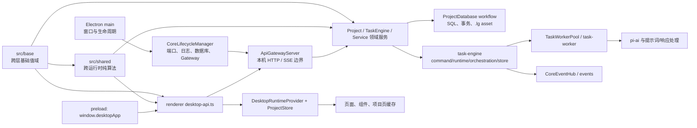
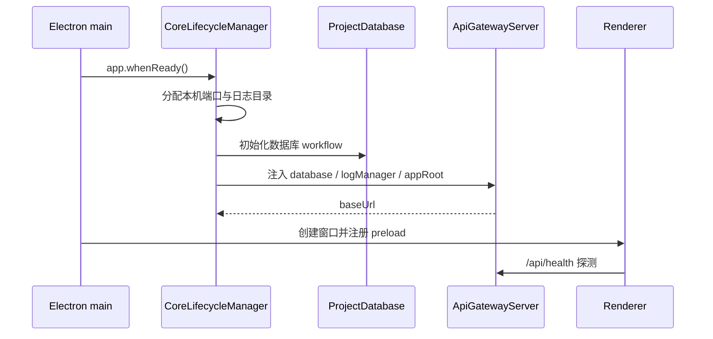
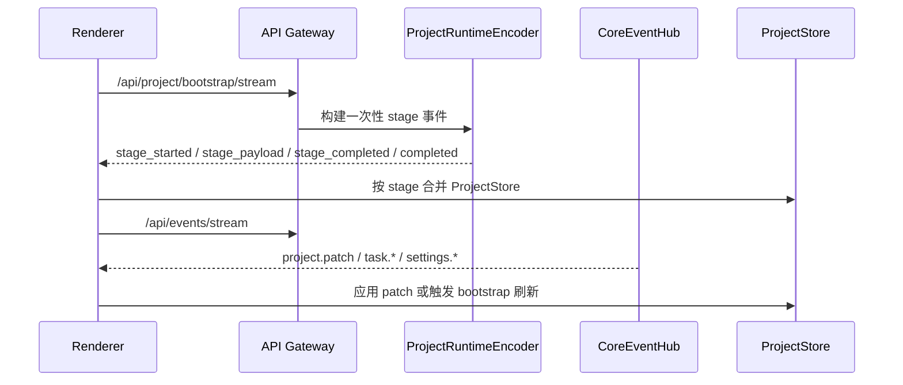

# LinguaGacha 架构地图

本文件只回答系统如何分层、跨层边界在哪里、未来任务应该先读哪里。协议字段、状态写入口、前端消费细节和验证矩阵分别归入对应专题文档。

## 1. 阅读路由

| 任务判断 | 先读 | 再读 |
| --- | --- | --- |
| 改系统分层、跨进程链路、模块归属 | 本文 | [`docs/BACKEND.md`](BACKEND.md) 或 [`docs/FRONTEND.md`](FRONTEND.md) |
| 改跨 main / renderer / worker 的基础值域、纯算法、normalize 或派生判断 | 本文 | [`docs/BACKEND.md`](BACKEND.md)、[`docs/FRONTEND.md`](FRONTEND.md) |
| 改 HTTP / SSE / bootstrap / mutation / 错误码 | [`docs/BACKEND.md`](BACKEND.md) | 相关 service 与测试 |
| 改数据库、`.lg` 存储、迁移、任务运行态写入口 | [`docs/BACKEND.md`](BACKEND.md) | `src/main/database/`、`src/main/project/`、`src/main/task-engine/` |
| 改 Electron preload、renderer、`ProjectStore`、导航、页面状态 | [`docs/FRONTEND.md`](FRONTEND.md) | 相关页面和组件测试 |
| 判断要跑哪些检查、是否同步文档 | [`docs/WORKFLOW.md`](WORKFLOW.md) | 本文与对应专题文档 |

## 2. 运行时分层

- Electron main 是桌面宿主和 Core 的同一进程；当前运行态没有独立 backend 子进程或内部 HTTP 回环服务。
- `src/base` 是 main、renderer、preload、worker 和测试共享的基础值域层，只承载跨层稳定数据结构、合法值集合、normalize/type guard 和派生判断；不能反向依赖 main、renderer 或 Electron 宿主边界。
- `src/shared` 是 main、renderer、worker 和测试可复用的纯算法层，只承载无状态文本工具、fixer、prefilter 和压缩能力；跨层基础值域仍归 `src/base`。
- `CoreLifecycleManager` 按 `LogManager -> ProjectDatabase -> ApiGatewayServer` 启动，退出时逆序关闭，避免 Gateway 仍持有数据库或日志句柄。
- `ApiGatewayServer` 只监听 `127.0.0.1`，是 renderer 可见的唯一 Core API 边界。
- `ProjectDatabase` 是 `.lg` 物理读写和 SQLite 句柄缓存的唯一入口；上层只发送 database operation，不直接持有 SQL 连接。
- `task-engine` 是任务域主控包：`command` 受理 `/api/tasks/*`，`runtime` 持有公开运行态和快照，`orchestration` 编排任务，`store` 读写项目任务事实。
- `TaskEngine` 通过 `ProjectTaskStore` 取项目事实，通过 `TaskWorkerPool` 执行 work unit；任务事件经 `CoreEventHub` 广播，并由 `TaskRuntimeProjector` 投影回 `TaskRuntimeState`。
- renderer 只通过 preload 暴露的 `window.desktopApp` 获得宿主能力和 Core API base URL，再由 `desktop-api.ts` 发起 HTTP / SSE。

## 3. 主链路

### 启动链路

### 项目运行态链路

- `bootstrap` 是项目运行态初始化主链路，事件顺序由后端编码器和前端 store 共同承诺。
- `/api/events/stream` 是运行期增量事件主链路；页面不应通过整页快照轮询替代 `project.patch`。
- 同步 mutation 的 HTTP ack 只用于 revision 对齐；真实页面事实仍以 bootstrap 和 `project.patch` 进入 `ProjectStore`。

## 4. 模块关系边界

| 层 | 固定职责 | 不能承接 |
| --- | --- | --- |
| `src/base/` | 跨层基础值域、normalize/type guard、不可变映射和派生判断 | HTTP 路由、数据库 workflow、页面状态、文件格式算法 |
| `src/shared/` | 跨运行时无状态算法：文本工具、fixer、prefilter、压缩能力 | 基础值域权威、HTTP 路由、数据库 workflow、页面状态 |
| `src/main/lifecycle/` | Core 启停顺序、端口分配、日志和 Gateway 生命周期 | 业务路由、数据库 schema、renderer 状态 |
| `src/main/api/` | 公开 HTTP / SSE 路由、响应壳、CORS、错误映射 | 直接 SQL、页面缓存、文件格式实现 |
| `src/main/project/` | 项目会话、bootstrap 编码、project patch、同步 mutation | Electron preload、页面局部状态 |
| `src/main/task-engine/` | 任务命令、运行态、快照、编排、项目任务事实读写 | worker 内提示词、LLM 请求、响应清洗解码 |
| `src/main/task-worker/` | work unit 执行、提示词构建、pi-ai 请求、响应清洗解码 | 数据库写入、全局任务状态、任务进度提交 |
| `src/main/events/` | Core 公开运行期事件总线与 SSE 连接管理 | 任务编排、项目 patch 补全、领域状态规则 |
| `src/main/database/` | SQL、事务、`.lg` asset 压缩读写、database operation | HTTP 协议和页面 DTO |
| `src/preload/` | 窄宿主桥接、原生对话框和 Core base URL 暴露 | Core 业务实现、Node 能力泛开放 |
| `src/renderer/app/` | 桌面运行时、导航、shell、页面 runtime provider | 后端协议权威或数据库规则 |
| `src/renderer/pages/` | 页面交互和本地派生状态 | 共享项目事实的最终写入口 |

## 5. 更新触发条件

- 新增或重排运行时层、跨进程通信方式、Core 生命周期资源，必须更新本文。
- 新增跨 main / renderer / worker 共享值域、合法值集合、基础派生判断或纯算法，必须先判断归属 `src/base` 还是 `src/shared`，并在分层关系变化时更新本文。
- 改公开 API、SSE、状态写入口、数据库存储、任务事件语义，更新 [`docs/BACKEND.md`](BACKEND.md)，本文只在链路或层级改变时同步。
- 改 preload、`ProjectStore`、导航、页面运行态消费方式，更新 [`docs/FRONTEND.md`](FRONTEND.md)，本文只保留分层关系。
- 改验证命令、任务起手式或文档同步要求，更新 [`docs/WORKFLOW.md`](WORKFLOW.md)。
