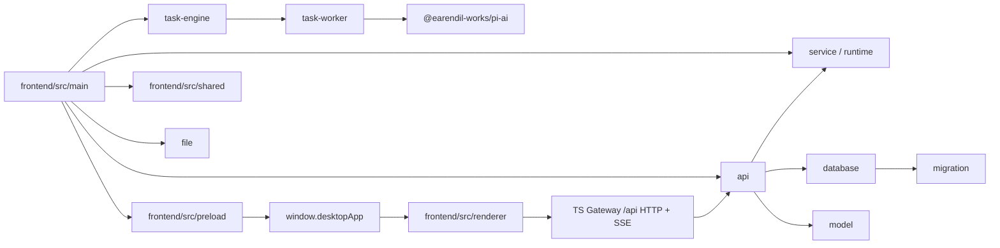
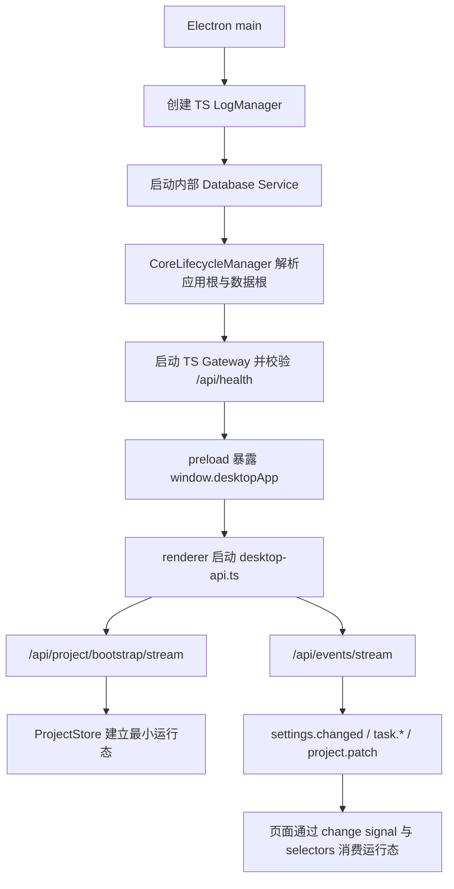
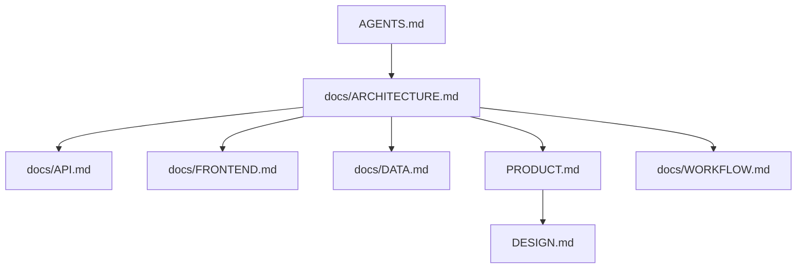

# LinguaGacha 架构文档

## 一句话总览
LinguaGacha 是“Electron main TS Gateway + 内部 Database Service + TS Task Engine + TS task-worker / pi-ai LLM adapter + Electron 桌面前端”的本机多进程工程；运行态不再保留 Python API / Data / Engine / Model 兼容层，Python 只留下配置、迁移、文本、过滤、路径解析和工具类模块。本文只回答系统如何分层、跨层边界在哪里、运行时主链路如何流动，以及读哪份文档才能做出正确维护判断。

## 系统分层图

分层规则：
- `frontend/src/main` 处理 Electron 宿主、窗口、原生对话框、开发态调试入口、公开 TS Gateway、已迁移页面领域服务、公开文件解析 / 写回和内部 Database Service。
- `frontend/src/preload` 只负责通过 `contextBridge` 暴露 `window.desktopApp`。
- `frontend/src/renderer` 只通过 `window.desktopApp` 和 `desktop-api.ts` 接入宿主与 Core API。
- `frontend/src/main/api/` 是 Electron 运行时公开 `/api/*` HTTP / SSE 编排入口；`project/` 承载项目轻生命周期、项目同步 mutation、reset preview、公开 bootstrap 运行态编码、`project.patch` 补全和 section revision 口径；`task/` 承载公开任务命令、任务回执、任务运行态和 task snapshot；`task-engine/` 承载后台任务生命周期、调度、限流、停止、重试与提交循环；`task-worker/` 承载单个 work unit 的确定性文本处理、prompt、pi-ai LLM adapter、响应解析和结果归一；`file/` 承载公开文件解析 / 写回、create preview 草稿解析和导出目录语义；`model/` 承载模型页快照、CRUD、重排、激活回退、远端模型列表与模型连通性测试；`service/` 承载应用设置、质量规则 / 提示词、校对同步保存与 Electron main 运行期路径规则。
- Python 目录不承载运行态 API、数据门面、任务引擎或模型配置权威；保留模块只服务离线迁移、文本 / 过滤 / 质量规则工具、路径解析和配置文件读写。

## 跨层边界

| 边界 | 当前规则 | 为什么重要 |
| --- | --- | --- |
| Renderer -> Electron | 只能走 `window.desktopApp` | 防止页面绕过 preload 直接碰 Node / Electron |
| Renderer -> Core API | 只能走 `frontend/src/renderer/app/desktop/desktop-api.ts` -> TS Gateway `/api/` | 保持前后端协议单点可维护 |
| API -> Data | 公开工程事实、规则、分析与校对辅助由 TS project / service / task data 域通过 database workflow 提供 | 防止 API 层直接拼装会话与数据库 |
| API -> Task Engine / Task Worker / pi-ai LLM adapter | 后台任务启动、停止、调度、进度与终态语义由 `frontend/src/main/task-engine` 提供；单个 work unit 的确定性处理、prompt、真实 LLM 请求、响应归一和 provider 差异由 `frontend/src/main/task-worker` 提供 | 防止数据层、界面层或兼容 Python 模块偷持任务生命周期或并行解析业务结果 |
| File format | 公开文件解析与写回统一落在 `frontend/src/main/file/`，包括 EPUB AST / legacy 写回兼容 | 防止格式实现分散到兼容 Python 模块或 API 编排层 |
| Data -> Database | TS Project / Service / TaskDataService 通过 Electron main database workflow 读写项目事实；SQL / 事务 / `.lg` asset 读写只落在 `frontend/src/main/database/`，Zstd 压缩参数与压缩 / 解压工具只落在 `frontend/src/shared/utils/zstd-tool.ts`，`.lg` 打开期 schema 与旧物理格式迁移统一落在 `frontend/src/main/migration/project-database-migration-service.ts` | 防止事务、schema 与压缩格式多处并行 |

仓库级不变量：
- Electron 运行时公开协议只允许落在 TS Gateway 的 `/api/` 前缀；内部 database 路由不能暴露给 preload 或 renderer，任务数据由 TS Task Engine 进程内直接调用 `TaskDataService`。
- SQL、事务和 `.lg` 内 asset 读写只允许落在 Electron main 的 `frontend/src/main/database/`；Zstd 压缩参数与压缩 / 解压工具只允许落在 `frontend/src/shared/utils/zstd-tool.ts`；`.lg` 打开期 schema migration 与旧物理格式兼容规则只允许落在 `frontend/src/main/migration/`；API 层不得直接持有 database handle。
- 长期用户文案分成两处维护：Python 工具模块在 `module/Localizer/`，渲染层在 `frontend/src/renderer/i18n/`。
- 跨层载荷优先传 `id`、值对象或不可变快照，不共享可变对象引用。

## 运行时主链路

运行时主链路的稳定事实：
- Electron main 是 TS Gateway、TS `LogManager` 与内部 Database Service 的生命周期拥有者；启动顺序固定为 `TS LogManager -> Database Service -> TS Gateway 公开端口 -> renderer`。`CoreLifecycleManager` 在高位端口范围内选择公开 Gateway 端口，并负责解析应用根、数据根和打包资源位置。开发态应用根优先取 npm 保留的原始目录 `INIT_CWD`，不存在时回退到 Electron 主进程当前工作目录；打包态应用根固定为 Electron 可执行文件所在目录，macOS 为 `.app/Contents/MacOS`。
- 运行时路径统一收敛为两根：应用根承载 `resource/` 与 `version.txt`，数据根承载 `userdata/` 与 `log/`。AppImage 与 macOS `.app` 固定把数据根放到 `~/LinguaGacha`，其他场景优先使用可写的应用根，不可写时回退 `~/LinguaGacha`。
- Electron 侧公开 Core API 地址由 `CoreLifecycleManager` 写入 `LINGUAGACHA_CORE_API_BASE_URL`，其值指向 TS Gateway；Database Service 地址只留在 Electron main 内部服务之间，不进入 preload、`window.desktopApp` 或 renderer。`/api/health` 不返回授权 token，日志只通过 TS `LogManager` 和 `/api/logs/stream` 对外可读。
- 应用退出时 Electron main 先关闭 TS Gateway，再关闭 Database Service 并释放 SQLite handle，渲染层不直接管理后端进程或内部服务。
- 渲染层项目运行态由 TS bootstrap 首包和 TS Gateway 适配后的事件流共同驱动，而不是单次整页快照。
- `ProjectStore` 是渲染层项目运行态最小事实仓库；页面本地筛选、弹窗、交互态不应上提到这里。
- 校对页不会把 warnings、筛选面板 facets、搜索排序结果等派生事实塞回 `ProjectStore`；这些派生缓存由独立 worker 持有，主线程只同步原始 `project / items / quality` 输入并消费查询结果。

## 文档地图

| 文档 | 唯一回答的问题 |
| --- | --- |
| `AGENTS.md` | Agent 协作入口、编码硬约束与交付硬约束 |
| `docs/ARCHITECTURE.md` | 系统分层、跨层边界、运行时主链路和模块关系 |
| `docs/API.md` | HTTP / SSE / bootstrap / topic / 错误码 / mutation 契约 |
| `docs/FRONTEND.md` | Electron / preload / renderer / `ProjectStore` / 导航与样式边界 |
| `docs/DATA.md` | 数据域、状态拥有者、唯一写入口和 `.lg` 物理存储落点 |
| `docs/WORKFLOW.md` | 任务起手式、验证矩阵、文档同步与交付自检 |
| `PRODUCT.md` -> `DESIGN.md` | 产品语境与设计权威 |

## 模块关系矩阵

| 模块 | 核心职责 | 主要邻接层 | 详细规则所在 |
| --- | --- | --- | --- |
| `frontend/src/main/api` | Electron 运行时公开 HTTP / SSE Gateway、响应壳、代理与路由编排 | `frontend/src/renderer`、`frontend/src/main/project`、`frontend/src/main/task`、`frontend/src/main/task-engine`、`frontend/src/main/model`、`frontend/src/main/service`、`api/` | [`API.md`](./API.md) |
| `frontend/src/main/project` | 项目轻生命周期、项目同步 mutation、reset preview、公开 bootstrap 运行态编码、`project.patch` 补全与 section revision 口径 | `frontend/src/main/api`、`frontend/src/main/database` | [`API.md`](./API.md)、[`DATA.md`](./DATA.md) |
| `frontend/src/main/task` | 公开任务命令、进程内任务数据服务、事件 hub、任务运行态、任务回执和 task snapshot 组装 | `frontend/src/main/api`、`frontend/src/main/project`、`frontend/src/main/database`、`frontend/src/main/task-engine` | [`API.md`](./API.md)、[`DATA.md`](./DATA.md) |
| `frontend/src/main/task-engine` | 后台任务生命周期、调度、限流、停止、重试和提交循环 | `frontend/src/main/task`、`frontend/src/main/database`、`frontend/src/main/task-worker` | [`API.md`](./API.md)、[`DATA.md`](./DATA.md) |
| `frontend/src/main/task-worker` | 单个翻译 / 分析 / 重翻 / 低频单条翻译 work unit 的文本处理、prompt、pi-ai LLM adapter、响应解码、校验和结果归一 | `frontend/src/main/task-engine`、`frontend/src/shared/text`、`@earendil-works/pi-ai` | [`API.md`](./API.md)、[`DATA.md`](./DATA.md) |
| `frontend/src/main/file` | 文件解析 / 写回、工作台 parse 预演、新建工程 create preview 解析、导出目录与重复译文补齐 | `frontend/src/main/api`、`frontend/src/main/database`、`frontend/src/main/service`、`frontend/src/main/project` | [`API.md`](./API.md)、[`DATA.md`](./DATA.md) |
| `frontend/src/main/model` | 模型页快照、CRUD、重排、激活模型回退、远端模型列表与模型连通性测试 | `frontend/src/main/api`、`frontend/src/main/service`、`frontend/src/main/task-worker/llm` | [`API.md`](./API.md)、[`DATA.md`](./DATA.md) |
| `frontend/src/main/service` | 配置 / 质量 / 校对同步保存领域服务与 Electron main 运行期路径规则 | `frontend/src/main/api`、`frontend/src/main/database` | [`DATA.md`](./DATA.md) |
| `frontend/` | Electron 宿主、bridge、React 渲染层、`ProjectStore` 消费 | `api/`、根目录 `DESIGN.md` 对应的前端语义 | [`FRONTEND.md`](./FRONTEND.md) |
| `module/` 保留工具模块 | 配置读写、userdata 迁移、文本 / 过滤 / 质量规则工具、路径解析与本地日志兜底 | `base/`、`resource/`、`userdata/` | [`DATA.md`](./DATA.md) |
| 根目录 `DESIGN.md` 对应权威源 | 视觉 token、壳层节奏、页面骨架、组件语义 | `frontend/src/renderer` | [`DESIGN.md`](../DESIGN.md) |

## 维护约束

- 本文只保留系统分层、运行时主链路、跨层边界和文档地图，不平铺 API 字段表、样式 token 或任务流程清单。
- 若一次改动会改变阅读路径、模块关系矩阵或跨层边界，必须同步更新本文。
- 若你发现一条规则更适合 `API`、`FRONTEND`、`DESIGN`、`WORKFLOW` 或 `DATA`，就把它迁过去，不要继续把本文写成并行总纲。
