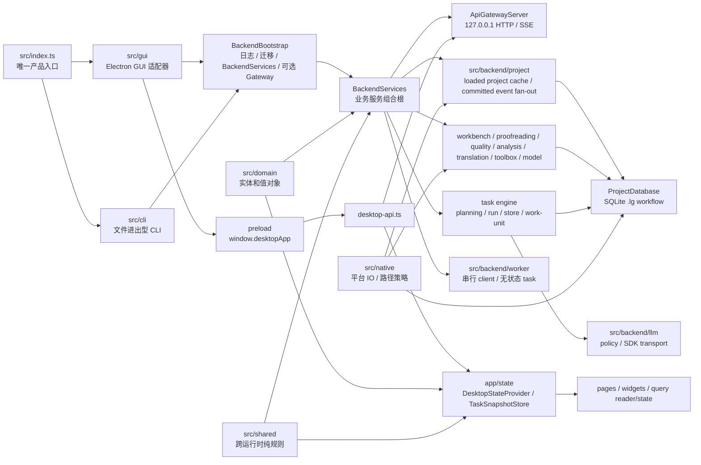

# LinguaGacha 架构地图

本文件只回答系统如何分层、跨层边界在哪里、运行时主链路如何串起来。CLI 命令协议、后端状态与存储、前端运行态和验证流程分别进入各自唯一归宿。

## 1. 专题归宿

| 需要判断的问题 | 唯一归宿 |
| --- | --- |
| 系统分层、跨层边界、运行时主链路、模块关系 | 本文 |
| CLI 入口、命令、临时 `.lg`、资源注入、输出、平台启动器 | [`docs/CLI.md`](CLI.md) |
| 后端公开协议、状态拥有者、任务、数据库、`.lg` 物理存储 | [`docs/BACKEND.md`](BACKEND.md) |
| Electron / preload / renderer / 页面 query reader/state / 导航 / 样式消费 | [`docs/FRONTEND.md`](FRONTEND.md) |
| 阅读路径、验证矩阵、文档同步、交付自检 | [`docs/WORKFLOW.md`](WORKFLOW.md) |
| 产品语义与设计权威 | `PRODUCT.md` / `DESIGN.md`，不并入本技能长期文档 |

## 2. 运行时分层

- `src/index.ts` 只按显式 `--cli` 分发 GUI 或 CLI，并把入口层解析出的 `BackendWorkerExecution` 继续下传；它不持有业务服务、命令语义或窗口生命周期。
- GUI 与后端能力层同在 Electron 主进程内运行；当前没有独立 backend 子进程，也没有内部 database HTTP 服务。
- GUI 模式由 `BackendBootstrap(exposeApiGateway=true)` 暴露本机 Gateway 给前端；CLI 模式由 `BackendBootstrap(exposeApiGateway=false)` 直接复用 `BackendServices`，不启动 HTTP / SSE Gateway。
- `BackendServices` 是 Gateway 与 CLI job 共用的业务组合根；底层数据库、cache、worker client 与事件总线只在组合根内部装配。
- `src/backend/worker` 只承接非 engine 的无状态后台派生；engine planning / work-unit worker 仍归 `src/backend/engine`。
- `src/domain` 承载跨层实体和值对象的 JSON 边界、合法值集合和贴身派生判断；它不得反向依赖 backend、frontend 或 Electron。
- `src/shared` 承载运行时无关逻辑、跨边界词表、reader 和纯工具；它只依赖普通数据结构并输出普通数据结构，不触碰 React、DOM、Electron、Node FS、SQLite、服务单例或可变全局状态。
- `src/gui/bridge`、`src/gui/ipc`、`src/gui/shell-contract.ts` 是桌面宿主契约；前端只能通过白名单契约或 `@backend/api/api-base-url` 接触宿主边界。
- `src/native` 是 backend / worker 可用的原生平台门面，真实磁盘 IO、Windows 长路径和路径身份比较经由这里收口。

## 3. 主链路

### GUI 启动

1. `src/index.ts` 解析桌面 bundle 根目录，构造 `worker_threads` 后端 worker 执行配置。
2. `src/gui/gui-entry.ts` 在 `app.whenReady()` 后启动 `BackendBootstrap`。
3. `BackendBootstrap` 先启动日志和启动期迁移，再创建设置、数据库和 `BackendServices`，最后按需启动 Gateway。
4. GUI 在拿到 `apiBaseUrl` 后创建日志窗口和主窗口，并通过 preload 暴露给前端。
5. 前端由 `desktop-api.ts` 探测 `/api/health` 后进入状态 hydration。

### CLI 执行

1. `src/index.ts` 只读取 `--cli` 之后的用户参数。
2. `src/cli` 解析命令并启动无 Gateway 的 `BackendBootstrap`。
3. CLI job 创建一次性临时 `.lg`，把输入文件、语言和显式资源写入后端事实链路。
4. job 通过 `TaskService` 启动翻译或分析任务，订阅 `ApiStreamHub` 的 `task.snapshot_changed`，最后把产物导出到 `--output-dir`。

CLI 协议、退出码和平台启动器只看 [`docs/CLI.md`](CLI.md)。

### 项目状态

- 后端 loaded 工程只有一套项目热读缓存；工程加载以缓存热机成功为准，卸载时同步释放缓存和 session 身份。
- 前端用 session manifest 校验项目身份，页面通过各功能域 view API 读取自身 view model；前端不再维护完整项目事实缓存。
- 项目写入必须在数据库事务提交后进入 committed event 链路；公开写入结果与 SSE 只作为前端刷新信号，项目事实仍由后端 query 返回。
- 项目事实与任务状态分离：项目数据不包含 task，任务 snapshot 不写入项目 query 缓存。

## 4. 模块边界速查

| 层 / 模块 | 固定职责 | 不承接 |
| --- | --- | --- |
| `src/index.ts` | GUI / CLI 分发、appRoot 与 bundle 根解析、`BackendWorkerExecution` 注入 | 业务服务、命令语义、窗口状态 |
| `src/gui` | Electron 窗口、IPC、preload、桌面宿主契约和外链策略 | 后端领域实现、前端页面状态 |
| `src/cli` | 命令解析、stdout/stderr、同步 job、临时工程生命周期 | HTTP 协议、GUI 项目心智、领域服务实现 |
| `src/domain` | 基础实体、值对象、合法值集合、贴身派生判断 | 页面策略、服务编排、传输外壳 |
| `src/shared` | 运行时无关逻辑、跨边界词表、reader、纯工具 | React、DOM、Electron、Node FS、SQLite、服务单例、可变全局状态 |
| `src/backend/app` | 应用根解析、应用路径、应用元信息和设置文件读写 | 后端生命周期编排、Gateway 外壳、领域服务组合 |
| `src/backend/bootstrap` | Backend 启停顺序、服务组合根、Gateway 生命周期 | 路由字段、数据库 schema、页面缓存 |
| `src/backend/api` | 公开 HTTP / SSE、响应壳、错误载荷组装、CORS | 直接 SQL、前端状态、文件格式实现 |
| `src/backend/project` | loaded 工程身份、热读缓存、数据读取、committed event 与公开项目变更事件 | 页面局部状态、各领域写入和派生规则 |
| `src/backend/{workbench,proofreading,quality,analysis,translation,toolbox,model}` | 项目领域服务；workbench 管结构性项目写入，translation 管译文文件产物导出，toolbox 管工具箱分支功能，其它领域只管各自 query、写入或派生 | Gateway 外壳、项目 session/cache/event 总线、任务引擎 |
| `src/backend/worker` | 非 engine worker 执行契约、串行后台 client、无状态 task 分发 | 项目 cache、数据库读写、任务引擎 planning / work-unit worker |
| `src/backend/network` | 后端出站网络策略、系统代理快照、Undici dispatcher 安装 | 应用路径、Gateway 路由、LLM provider SDK 细节 |
| `src/backend/engine` | 翻译 / 分析任务引擎、任务状态、规划、执行、artifact 写回 | provider SDK 细节、页面派生缓存、项目 query 派生 |
| `src/backend/llm` | provider policy、request policy、官方 SDK transport、请求结果归一 | 任务编排、数据库写入、项目事实读取 |
| `src/backend/database` | SQLite、事务、`.lg` asset、database operation | HTTP DTO、页面状态 |
| `src/frontend/app` | 桌面宿主接入、主窗口状态、导航、session、错误与反馈展示入口 | 后端协议权威、数据库规则、页面局部状态 |
| `src/frontend/pages` | 页面交互、弹窗、排序参数和局部 UI 状态 | 共享项目事实最终写入口、可跨运行时复用的稳定纯逻辑 |
| `src/frontend/widgets` | 可复用 UI 组件、表格 / 编辑器等组件组合、通用 UI 交互行为 | 桌面宿主桥、后端 API、页面事实缓存 |
| `src/frontend/styling` | 极窄样式基础工具，如 className 合并 | React 运行态、桌面宿主桥、页面业务语义 |

## 5. 更新触发条件

- 改 GUI / CLI 分发、进程边界、Gateway 暴露方式、BackendBootstrap 生命周期资源或 worker 执行入口，更新本文。
- 改 `src/domain`、`src/shared`、GUI 宿主契约或 `src/native` 的分层职责，更新本文。
- 改 API、SSE、状态写入口、数据库或任务事件语义，更新 [`docs/BACKEND.md`](BACKEND.md)；本文只在主链路或层级变化时同步。
- 改 CLI 命令、资源、输出或平台启动器，更新 [`docs/CLI.md`](CLI.md)。
- 改 preload、`desktop-api.ts`、页面 query reader/state、导航、项目页 state 或样式消费边界，更新 [`docs/FRONTEND.md`](FRONTEND.md)。
- 改验证命令、阅读路径或交付要求，更新 [`docs/WORKFLOW.md`](WORKFLOW.md)。
