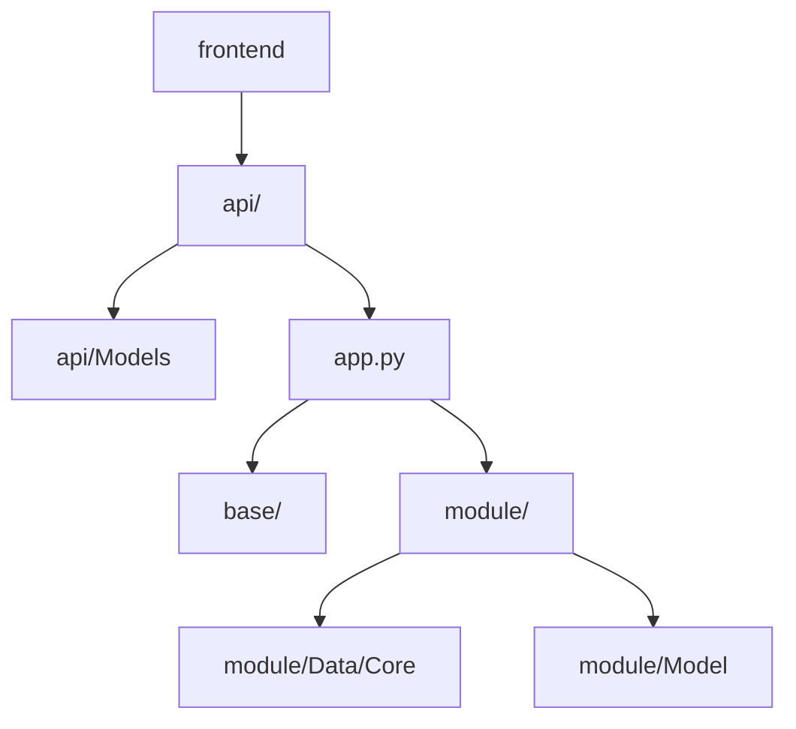
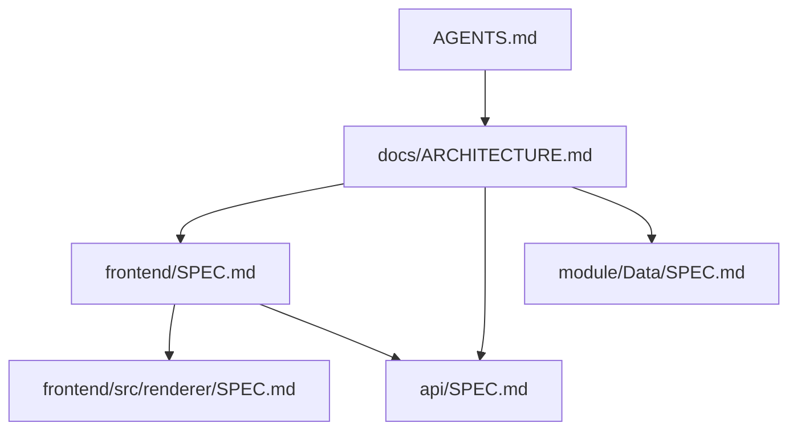
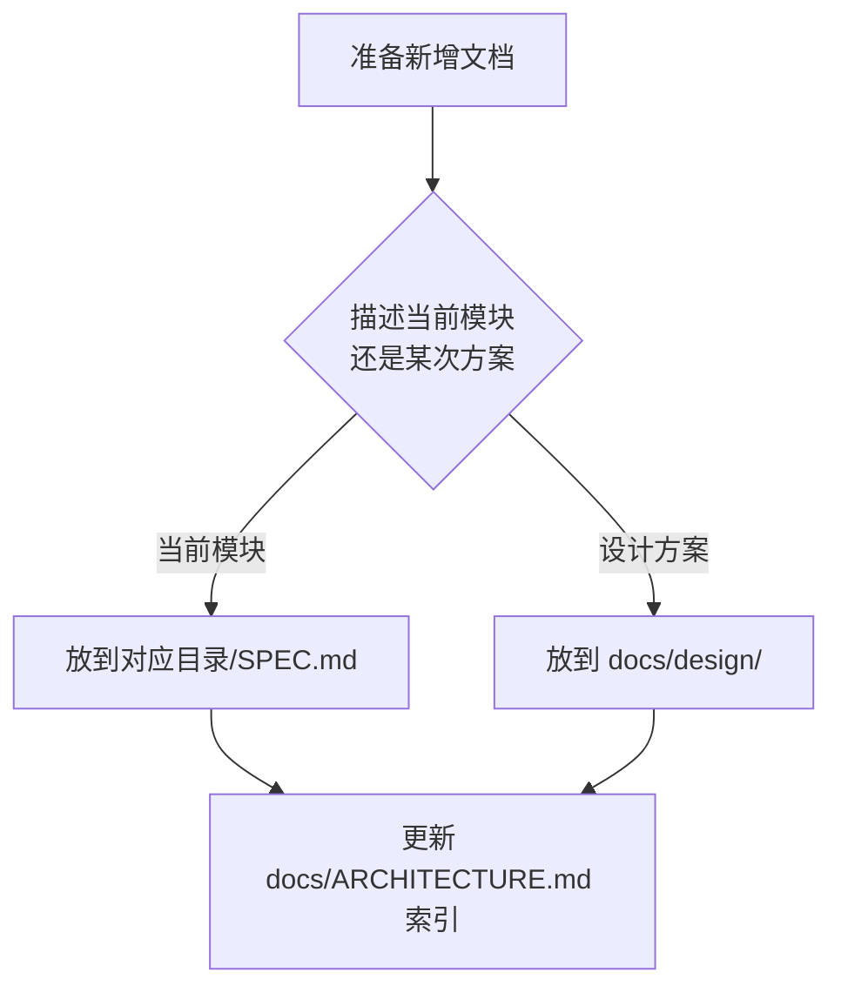

# LinguaGacha 仓库结构

## 一句话总览
LinguaGacha 当前由无头 Python Core 与 Electron 前端组成：`app.py` 负责运行时入口、CLI 分流与本地 Core API 启停，`api/` 暴露 HTTP / SSE 契约，`frontend/` 承载桌面前端，`module/` 承担核心业务实现。

## 核心模块关系

## 仓库结构
| 路径 | 职责 |
| --- | --- |
| `app.py` | Python Core 入口、CLI 分流、Core API 启停与退出清理 |
| `api/` | 本地 Core API、HTTP / SSE 契约与前后端边界 |
| `api/Models/` | Python 侧冻结 DTO、SSE patch 与客户端对象化消费模型 |
| `base/` | 事件、日志、路径、版本、命令行等基础设施 |
| `frontend/` | Electron + React 前端子工程、桌面桥接与渲染层实现 |
| `module/` | 数据层、任务引擎、文件处理、本地化与其他业务模块 |
| `module/Model/` | 模型配置领域对象与模型管理流程 |
| `resource/` | 预设、模板、图标与运行时资源 |
| `buildtools/` | 构建流程与辅助脚本 |
| `tests/` | 自动化测试 |

## 文档入口

规则：
- `AGENTS.md` 只给出规则和仓库级入口。
- 本文负责分发现有模块文档，并作为文档索引、阅读路径与同步矩阵的唯一权威来源。
- 模块 `SPEC.md` 只继续链接更下游的局部说明或真实依赖方向上的文档，不反向回链本文。

## 推荐阅读路径
| 场景 | 阅读顺序 |
| --- | --- |
| 仓库整体结构 | `docs/ARCHITECTURE.md` -> `app.py` -> `base/*` |
| Electron / React 前端 | `docs/ARCHITECTURE.md` -> [`frontend/SPEC.md`](../frontend/SPEC.md) -> [`frontend/src/renderer/SPEC.md`](../frontend/src/renderer/SPEC.md) |
| HTTP / SSE 契约 | `docs/ARCHITECTURE.md` -> [`api/SPEC.md`](../api/SPEC.md) -> `api/Application/*` / `api/Server/*` |
| V2 项目运行态协议 | `docs/ARCHITECTURE.md` -> [`api/SPEC.md`](../api/SPEC.md) -> [`frontend/SPEC.md`](../frontend/SPEC.md) -> [`frontend/src/renderer/SPEC.md`](../frontend/src/renderer/SPEC.md) -> [`module/Data/SPEC.md`](../module/Data/SPEC.md) |
| 工程加载、规则、分析、工作台数据 | `docs/ARCHITECTURE.md` -> [`module/Data/SPEC.md`](../module/Data/SPEC.md) -> `module/Data/DataManager.py` |
| 模型页与模型配置 | `docs/ARCHITECTURE.md` -> [`module/Model/SPEC.md`](../module/Model/SPEC.md) -> `module/Model/Manager.py` |
| 任务调度与请求生命周期 | `docs/ARCHITECTURE.md` -> `module/Engine/Engine.py` -> `module/Engine/*` |
| 文件导入、资产解析、导出格式 | `docs/ARCHITECTURE.md` -> `module/File/FileManager.py` -> `module/File/*` |

当前项目运行态协议已经完成 V1 退场；涉及项目加载、工作台、校对、规则、模型、任务回灌与事件流时，默认只阅读 `/api/v2/...` 与 `V2` / `v2` 边界目录对应的实现与文档。

## 模块文档索引
| 文档 | 对应目录 | 说明 |
| --- | --- | --- |
| [`frontend/SPEC.md`](../frontend/SPEC.md) | `frontend/` | Electron 子工程根目录、主进程、预加载、共享契约与改动入口 |
| [`frontend/src/renderer/SPEC.md`](../frontend/src/renderer/SPEC.md) | `frontend/src/renderer/` | 渲染层页面结构、状态组织、组件落位与样式边界 |
| [`api/SPEC.md`](../api/SPEC.md) | `api/` | 本地 Core API 的 HTTP / SSE 契约、Python 侧对象化客户端边界与前端运行时接入规则 |
| [`module/Data/SPEC.md`](../module/Data/SPEC.md) | `module/Data/` | 数据层公开入口、内部拆分与主流程 |
| [`module/Model/SPEC.md`](../module/Model/SPEC.md) | `module/Model/` | 模型配置领域对象、模型预设管理与模型页后端入口 |

## 文档放置规则
| 文档类型 | 位置 | 用途 |
| --- | --- | --- |
| `AGENTS.md` | 仓库根目录 | 规则、约束、仓库级入口 |
| `docs/ARCHITECTURE.md` | `docs/` | 仓库结构总览与模块文档索引 |
| `*/SPEC.md` | 模块目录内 | 当前模块的结构、边界、主流程和改动建议 |
| `docs/design/*.md` | `docs/design/` | 设计方案与取舍记录 |

## 更新规则
| 变更类型 | 必须同步的文档 |
| --- | --- |
| 仓库结构、阅读路径或文档引用规则变化 | `docs/ARCHITECTURE.md` |
| 前端子工程入口、桥接边界或阅读顺序变化 | `frontend/SPEC.md` |
| 渲染层页面结构、状态组织或样式边界变化 | `frontend/src/renderer/SPEC.md` |
| API 契约、Python 侧客户端边界或前端接入规则变化 | `api/SPEC.md` |
| 数据层职责、主流程或公开入口变化 | `module/Data/SPEC.md` |
| 模型配置对象、模型管理器或模型页后端入口变化 | `module/Model/SPEC.md` |
| 设计方案与取舍记录 | `docs/design/*.md` |

## 新增文档时怎么判断位置

## 维护约束
- 本文只写仓库级总览和真实存在的文档入口，不为不存在的局部说明预留占位条目。
- 模块文档只写当前代码与资源现状，不记录对开发没有帮助的历史叙述。
- 代码改动如果会让文档失真，应在同一任务内同步修正文档。
