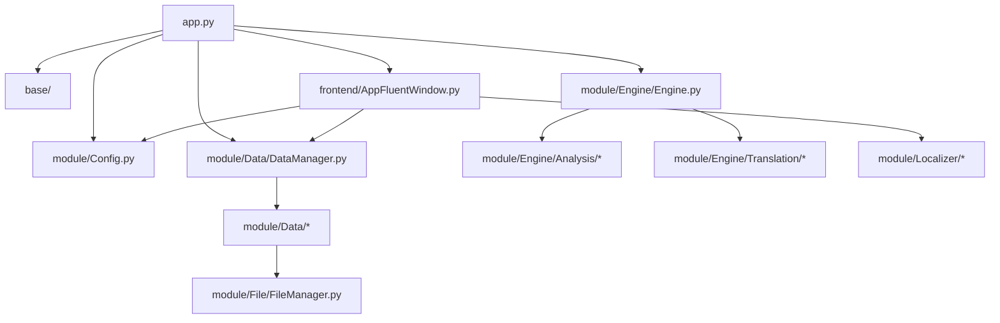

# LinguaGacha 仓库结构说明

## 一句话总览
LinguaGacha 以 `app.py -> base / frontend / module` 作为主应用分层，同时维护 `frontend-vite/` Electron + React 子工程与 `api/` 本地 Core API 契约：`app.py` 负责启动与退出清理，`base/` 提供事件、日志和运行时基础设施，`frontend/` 组织 Qt 页面与导航，`module/` 承担核心业务，`model/` 与 `widget/` 分别承载数据对象和通用控件。

## 推荐阅读路径
1. 从 `app.py` 进入，确认 GUI / CLI 分流、启动顺序和退出清理。
2. 再读 `base/Base.py`、`base/EventManager.py`、`base/LogManager.py`，理解事件总线和基础能力。
3. 然后看 `frontend/AppFluentWindow.py`，把页面导航、工程加载态和全局交互串起来。
4. 如果任务落在 Electron / React 子工程，转去看 [`frontend-vite/SPEC.md`](../frontend-vite/SPEC.md)。
5. 数据与工程状态相关问题继续读 `module/Data/DataManager.py`。
6. 任务调度与请求生命周期问题继续读 `module/Engine/Engine.py`。
7. 文件格式支持、导入导出问题继续读 `module/File/FileManager.py`。
8. HTTP / SSE 契约与 UI / Core 边界问题继续读 [`api/SPEC.md`](../api/SPEC.md)。

## 仓库结构
| 路径 | 职责 |
| --- | --- |
| `app.py` | 应用入口、启动顺序、CLI / GUI 分流、退出清理 |
| `api/` | 本地 Core API、HTTP / SSE 契约与 UI / Core 边界 |
| `base/` | 事件、日志、路径、版本、命令行等基础设施 |
| `frontend/` | Qt / QFluentWidgets 页面、导航和界面交互 |
| `frontend-vite/` | Electron + React 前端子工程、桌面桥接与渲染层设计系统 |
| `module/` | 数据层、任务引擎、文件层、本地化与其他业务模块 |
| `model/` | `Item`、`Project` 等核心数据对象 |
| `widget/` | 可复用界面组件 |
| `resource/` | 图标、提示词模板、预设与更新脚本资源 |
| `buildtools/` | 构建流程与辅助脚本 |
| `tests/` | 自动化测试 |

## 核心模块关系

说明：`frontend-vite/` 与 `api/` 是独立子工程 / 契约层，这张图只展开当前 PySide 主应用调用链；相关局部结构请分别阅读 [`frontend-vite/SPEC.md`](../frontend-vite/SPEC.md) 与 [`api/SPEC.md`](../api/SPEC.md)。

## 模块入口速查
| 关注问题 | 优先阅读 |
| --- | --- |
| 应用怎么启动、何时清理工程状态 | `app.py` |
| 事件怎么发、状态怎么共享 | `base/Base.py`、`base/EventManager.py` |
| 日志、异常、版本与路径 | `base/LogManager.py`、`base/VersionManager.py`、`base/BasePath.py` |
| 主窗口导航与页面跳转 | `frontend/AppFluentWindow.py` |
| Electron / React 子工程如何分层与落位 | [`frontend-vite/SPEC.md`](../frontend-vite/SPEC.md) |
| 工程加载、规则、分析、工作台数据如何汇总 | `module/Data/DataManager.py` |
| 任务引擎如何初始化与判断忙碌态 | `module/Engine/Engine.py` |
| 文件导入、资产解析、导出格式支持 | `module/File/FileManager.py` |
| 本地 HTTP / SSE 契约与 UI / Core 边界 | [`api/SPEC.md`](../api/SPEC.md) |
| 用户可见文本如何统一管理 | `module/Localizer/` |

## 模块局部说明入口
- [`frontend-vite/SPEC.md`](../frontend-vite/SPEC.md)：Electron + React 子工程的目录结构、分层边界与改动入口。
- [`api/SPEC.md`](../api/SPEC.md)：本地 Core API 的 HTTP / SSE 契约与 UI / Core 边界。
- [`module/Data/SPEC.md`](../module/Data/SPEC.md)：数据层的公开入口、内部拆分与主流程说明。
- `module/Engine/SPEC.md`：当前尚未补齐，后续需要时新增并从本文链接。
- `module/File/SPEC.md`：当前尚未补齐，后续需要时新增并从本文链接。

## 设计文档入口
- [`docs/DESIGN.md`](./DESIGN.md)：LinguaGacha 的全局设计语言、组件基线与 UI 约束。
- `docs/design/*.md`：后续按功能或方案沉淀单次设计决策与取舍记录。

## 维护约束
- 仓库级文档负责导航与总览，不复制模块 `SPEC.md` 的正文。
- 模块职责、边界或阅读顺序发生变化时，优先更新对应模块的 `SPEC.md`，再检查本文链接与概览是否需要同步。
- 新增模块级说明时，先把 `SPEC.md` 放到模块目录内，再回到本文补入口。

