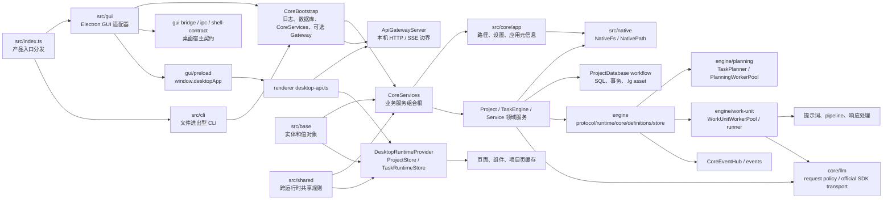
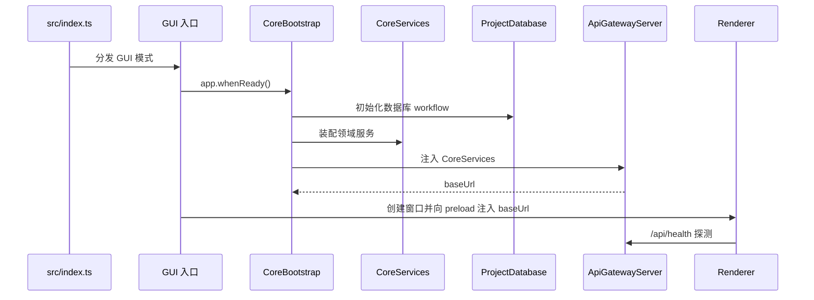
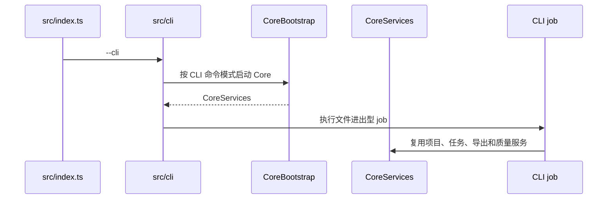
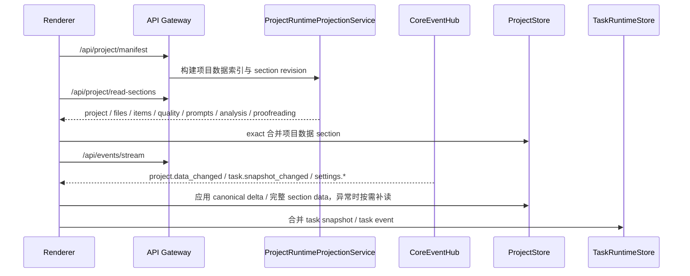

# LinguaGacha 架构地图

本文件只回答系统如何分层、跨层边界在哪里、专题边界怎么分。CLI 命令模式、协议字段、状态写入口、前端消费细节和验证矩阵分别归入对应专题文档。

## 1. 专题边界地图

| 你要判断的问题 | 唯一归宿 |
| --- | --- |
| 系统分层、跨层边界、运行时主链路、模块关系 | 本文 |
| CLI 命令模式、入口分发、命令协议、临时工程、输出和平台启动器 | [`docs/CLI.md`](CLI.md) |
| 后端公开协议、HTTP / SSE、状态拥有者、数据库、`.lg`、任务引擎 | [`docs/BACKEND.md`](BACKEND.md) |
| Electron、preload、renderer、`ProjectStore`、导航和样式消费边界 | [`docs/FRONTEND.md`](FRONTEND.md) |
| 起手式、任务阅读路径、验证矩阵、文档同步和交付自检 | [`docs/WORKFLOW.md`](WORKFLOW.md) |

## 2. 运行时分层

- `src/index.ts` 是唯一产品入口，只按显式 `--cli` 标记分发到 GUI 或 CLI，不持有业务服务；CLI 命令模式和平台入口细节归 [`docs/CLI.md`](CLI.md)。
- `src/gui` 承载 Electron GUI 适配层：窗口、IPC、preload、桌面桥接类型、标题栏壳层和外链策略；renderer 读取这些契约必须走 `@gui/*` 白名单或 `@core/api/core-api-endpoint`。
- `src/cli` 承载文件进出型命令入口；命令参数、临时工程、资源注入、输出和启动器规则归 [`docs/CLI.md`](CLI.md)。
- `src/core` 承载业务内核、公开 API、领域服务、任务引擎、数据库和 bootstrap；API 留在 `src/core/api`，由 GUI Gateway 暴露给 renderer，CLI 直接复用 `CoreServices`。
- Electron GUI 和 Core 当前在同一 Electron 主进程内运行；运行态没有独立 backend 子进程或内部 database HTTP 服务。
- `src/base` 只承载跨层数据实体和值对象的序列化、反序列化、合法值集合和贴身派生判断；不能反向依赖 Core、renderer 或 Electron 宿主边界。
- `src/shared` 承载 Core、renderer、worker 和测试复用的跨运行时共享规则、协议词表与纯工具，包括 error、task、quality、language、log、i18n、文本工具、fixer、prefilter、纯 JSON 和压缩能力；翻译质量规则中的残留、相似度和重试人工阈值以 `src/shared/text/translation-quality-rules.ts` 为唯一规则入口，Core 只做任务裁决，Project UI Worker 只做 UI 派生；Electron 桌面宿主契约与文件系统能力不放在这里。
- `src/core/app` 承载应用级文件事实：应用根和数据根路径、`userdata/config.json` 设置读写缓存、`version.txt` 应用元信息和 LLM User-Agent。
- `src/native` 只承载 Core / worker 可用的原生平台能力；`NativeFs` 与 `NativePathPolicy` 是磁盘 IO、Windows 长路径转换和路径身份比较的唯一入口。
- `CoreBootstrap` 按 `LogManager -> 启动迁移 / AppSettingService -> 启动期系统代理快照 -> CoreServices -> 可选 ApiGatewayServer` 启动，退出时逆序关闭，避免 Gateway、代理 dispatcher、worker、数据库或日志资源互相悬挂。
- `CoreServices` 是 GUI API Gateway 与 CLI job 共用的服务组合根；领域服务只在这里装配一次，Gateway 不再自行 new 业务依赖。
- `ApiGatewayServer` 只监听 `127.0.0.1`，是 renderer 可见的唯一 Core API 边界；CLI 不启动 Gateway。
- `ProjectDatabase` 是 `.lg` 物理读写和 SQLite 连接生命周期的唯一入口；上层只发送 database operation，不直接持有 SQL 连接。
- `src/core/engine` 是任务域主控包：`command` 受理统一 `/api/tasks/start|stop|snapshot`，`protocol` 持有任务词表与跨 worker 协议，`runtime` 持有公开运行态和快照，`core` 编排任务，`planning` 构建任务 work unit 计划，`definitions` 承接任务差异，`store` 通过 artifact 写入项目任务事实。
- `src/core/llm` 是 Core 进程内 LLM 能力层，承接 provider policy、request policy、official SDK transport、ProviderClientPool 和请求结果归一；`model`、`engine/core`、`engine/work-unit` 只能消费它，不能反向成为它的依赖。
- `TaskEngine` 通过 `ProjectTaskStore` 取项目事实，通过 `TaskPlanner` 构建 work unit 计划，再经 `ModelKeyLeasePool`、`WorkUnitExecutor` / `WorkUnitWorkerPool` 执行统一 `WorkUnit`；任务运行态只经 `TaskRuntimePublisher` 写入 `TaskRuntimeState` 并广播完整 `task.snapshot_changed`。
- renderer 只通过 preload 暴露的 `window.desktopApp` 获得宿主能力和 Core API base URL，再由 `desktop-api.ts` 发起 HTTP / SSE。

## 3. 主链路

### 启动链路

### CLI 链路

CLI 命令协议、临时工程、资源注入、输出和平台启动器规则归 [`docs/CLI.md`](CLI.md)。

### 项目运行态链路

- `/api/project/manifest` 与 `/api/project/read-sections` 是项目数据初始化主链路；运行态不再保留 full bootstrap stream。
- `/api/events/stream` 是运行期增量事件主链路；项目数据通过 `project.data_changed` 更新，任务运行态通过 `task.snapshot_changed` 更新，页面初始化或项目切换时可按需读取 `/api/tasks/snapshot`。
- 同步 mutation 的 HTTP 返回使用 `ProjectMutationResult`，页面先应用其中的后端 canonical `changes`，再用 `eventId` 跳过同源 `project.data_changed` 重放；项目读取接口、项目变更事件和任务事件分别进入各自 store。

## 4. 模块关系边界

| 层 | 固定职责 | 不能承接 |
| --- | --- | --- |
| `src/index.ts` | 产品入口分发：GUI、CLI、应用根解析 | 业务服务、命令参数语义、窗口生命周期 |
| `src/cli/` | CLI 参数解析、stdout/stderr、文件进出型 job、临时工程生命周期 | GUI 项目文件认知、renderer 协议、领域服务实现 |
| `src/gui/bridge/`、`src/gui/ipc/`、`src/gui/shell-contract.ts` | Electron GUI / preload / renderer 共享桌面契约：桥接 API、IPC、标题栏壳层、Core API 地址注入、外链策略 | Core 业务实现、数据库 workflow、renderer 页面状态、平台文件 IO |
| `src/base/` | 数据实体和值对象的 JSON 边界、合法值集合和贴身派生判断 | HTTP 路由、数据库 workflow、页面状态、文件格式算法、跨运行时通用工具 |
| `src/shared/` | 跨运行时业务共享规则、协议词表和纯工具：error、task、quality、language、log、i18n、文本工具、fixer、prefilter、纯 JSON、压缩能力 | HTTP 路由、数据库 workflow、页面状态、实体持久化语义、Electron 宿主桥接、文件系统能力 |
| `src/core/app/` | 应用级路径、设置文件读写缓存、应用版本和 User-Agent 元信息 | 原生文件系统策略、项目数据库、HTTP 路由、页面状态 |
| `src/native/` | Core / worker 原生平台门面：文件系统 IO、路径原生化、路径身份比较、长路径策略 | 业务协议、数据库 operation 语义、renderer / preload 桌面契约 |
| `src/gui/shell/` | Electron GUI 宿主实现：窗口生命周期、IPC 注册、原生 dialog、日志窗口、DevTools 入口 | Core 领域服务、数据库 workflow、renderer 页面状态、共享契约权威 |
| `src/core/bootstrap/` | Core 启停顺序、服务组合根、日志、数据库和 Gateway 生命周期 | 业务路由、数据库 schema、renderer 状态、CLI 参数语义 |
| `src/core/api/` | 公开 HTTP / SSE 路由、响应壳、CORS、错误映射 | 直接 SQL、页面缓存、文件格式实现 |
| `src/core/project/` | 项目会话、项目数据投影、项目数据变更事件、同步 mutation 协调、项目 mutation 派生 | Electron preload、页面局部状态 |
| `src/core/engine/{command,protocol,runtime,core,definitions,store}` | 任务命令、协议词表、运行态、快照、编排、任务差异解释、artifact 提交和项目任务事实读写 | worker 内提示词、provider 请求策略、响应清洗解码、规划期 token 计数 |
| `src/core/engine/planning/` | 任务启动前的 work unit 规划、精确 token 计数调度、进程内 token metric cache | 数据库写入、任务 artifact 提交、LLM 请求执行、项目公开投影 |
| `src/core/llm/` | Core 进程内 LLM provider policy、request policy、official SDK transport、ProviderClientPool、请求结果归一 | 任务编排、项目事实读取、数据库写入、worker 提示词和响应业务解析 |
| `src/core/engine/work-unit/` | work unit 执行、提示词构建、runner、pipeline、响应清洗解码、worker_threads 边界 | 数据库写入、全局任务状态、任务进度提交、任务级 Key 轮换、provider policy 与 SDK transport |
| `src/core/events/` | Core 公开运行期事件总线与 SSE 连接管理 | 任务编排、项目变更事件适配、领域状态规则 |
| `src/core/database/` | SQL、事务、`.lg` asset 压缩读写、database operation | HTTP 协议和页面 DTO |
| `src/gui/preload/` | 窄宿主桥接、原生对话框和 Core base URL 暴露 | Core 业务实现、Node 能力泛开放 |
| `src/renderer/app/` | 桌面运行时、导航、shell、页面 runtime provider | 后端协议权威或数据库规则 |
| `src/renderer/pages/` | 页面交互和本地派生状态 | 共享项目事实的最终写入口 |

## 5. 更新触发条件

- 新增或重排运行时层、跨进程通信方式、桌面宿主契约层、Core 生命周期资源，必须更新本文。
- 新增跨 Core / renderer / worker 共享规则、协议词表、合法值集合、基础派生判断或纯工具，必须先判断归属 `src/base`、`src/shared` 还是 GUI 桌面契约，并在分层关系变化时更新本文。
- 改公开 API、SSE、状态写入口、数据库存储、任务事件语义，更新 [`docs/BACKEND.md`](BACKEND.md)，本文只在链路或层级改变时同步。
- 改 CLI 命令模式、参数、临时工程、资源、输出或平台启动器，更新 [`docs/CLI.md`](CLI.md)，本文只在入口分层或主链路改变时同步。
- 改 preload、`ProjectStore`、导航、页面运行态消费方式，更新 [`docs/FRONTEND.md`](FRONTEND.md)，本文只保留分层关系。
- 改验证命令、任务起手式或文档同步要求，更新 [`docs/WORKFLOW.md`](WORKFLOW.md)。
