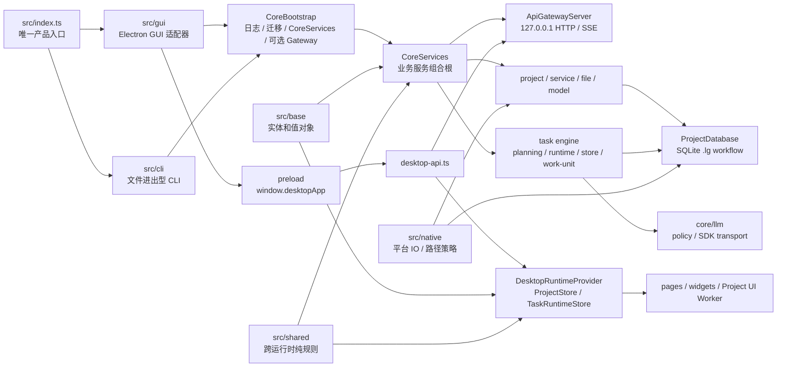

# LinguaGacha 架构地图

本文件只回答系统如何分层、跨层边界在哪里、运行时主链路如何串起来。CLI 命令协议、后端状态与存储、前端运行态和验证流程分别进入各自唯一归宿。

## 1. 专题归宿

| 需要判断的问题 | 唯一归宿 |
| --- | --- |
| 系统分层、跨层边界、运行时主链路、模块关系 | 本文 |
| CLI 入口、命令、临时 `.lg`、资源注入、输出、平台启动器 | [`docs/CLI.md`](CLI.md) |
| 后端公开协议、状态拥有者、任务、数据库、`.lg` 物理存储 | [`docs/BACKEND.md`](BACKEND.md) |
| Electron / preload / renderer / `ProjectStore` / 导航 / 样式消费 | [`docs/FRONTEND.md`](FRONTEND.md) |
| 阅读路径、验证矩阵、文档同步、交付自检 | [`docs/WORKFLOW.md`](WORKFLOW.md) |
| 产品语义与设计权威 | `PRODUCT.md` / `DESIGN.md`，不并入本技能长期文档 |

## 2. 运行时分层

- `src/index.ts` 只按显式 `--cli` 分发 GUI 或 CLI，并把入口层解析出的 `EngineExecution` 继续下传；它不持有业务服务、命令语义或窗口生命周期。
- GUI 与 Core 同在 Electron 主进程内运行；当前没有独立 backend 子进程，也没有内部 database HTTP 服务。
- GUI 模式由 `CoreBootstrap(exposeApiGateway=true)` 暴露本机 Gateway 给 renderer；CLI 模式由 `CoreBootstrap(exposeApiGateway=false)` 直接复用 `CoreServices`，不启动 HTTP / SSE Gateway。
- `CoreServices` 是 Gateway 与 CLI job 共用的业务组合根；领域服务、任务引擎、worker pool、项目投影、事件总线和数据库 workflow 只在这里装配。
- `src/base` 承载跨层实体和值对象的 JSON 边界、合法值集合和贴身派生判断；它不得反向依赖 Core、renderer 或 Electron。
- `src/shared` 承载 Core、renderer、worker 和测试复用的纯规则、协议词表和工具；Electron 桌面契约、Node / 文件系统能力和数据库 workflow 不进入这里。
- `src/gui/bridge`、`src/gui/ipc`、`src/gui/shell-contract.ts` 是桌面宿主契约；renderer 只能通过白名单契约或 `@core/api/core-api-endpoint` 接触宿主边界。
- `src/native` 是 Core / worker 可用的原生平台门面，真实磁盘 IO、Windows 长路径和路径身份比较经由这里收口。

## 3. 主链路

### GUI 启动

1. `src/index.ts` 解析桌面 bundle 根目录，构造 `worker_threads` 任务执行入口。
2. `src/gui/gui-entry.ts` 在 `app.whenReady()` 后启动 `CoreBootstrap`。
3. `CoreBootstrap` 先启动日志和启动期迁移，再创建设置、数据库和 `CoreServices`，最后按需启动 Gateway。
4. GUI 在拿到 `apiBaseUrl` 后创建日志窗口和主窗口，并通过 preload 暴露给 renderer。
5. renderer 由 `desktop-api.ts` 探测 `/api/health` 后进入运行态 hydration。

### CLI 执行

1. `src/index.ts` 只读取 `--cli` 之后的用户参数。
2. `src/cli` 解析命令并启动无 Gateway 的 Core。
3. CLI job 创建一次性临时 `.lg`，把输入文件、语言和显式资源写入 Core 事实链路。
4. job 通过 `TaskService` 启动翻译或分析任务，订阅 `CoreEventHub` 的 `task.snapshot_changed`，最后把产物导出到 `--output-dir`。

CLI 协议、退出码和平台启动器只看 [`docs/CLI.md`](CLI.md)。

### 项目运行态

- renderer 初始化项目时先读 `/api/project/manifest`，再用 `/api/project/read-sections` 读取 `project / files / items / quality / prompts / analysis / proofreading`；这条链路是项目快照进入 `ProjectStore` 的主入口。
- 运行期增量只通过同步 mutation 返回的 `ProjectMutationResult.changes` 与 SSE `project.data_changed` 进入前端；任务运行态只通过 `/api/tasks/snapshot`、任务命令 ack 和 `task.snapshot_changed` 进入 `TaskRuntimeStore`。
- 后端项目事实与任务运行态是两套事实源：项目数据不包含 task，任务 snapshot 不写入 `ProjectStore`。

## 4. 模块边界速查

| 层 / 模块 | 固定职责 | 不承接 |
| --- | --- | --- |
| `src/index.ts` | GUI / CLI 分发、appRoot 与 bundle 根解析、`EngineExecution` 注入 | 业务服务、命令语义、窗口状态 |
| `src/gui` | Electron 窗口、IPC、preload、桌面宿主契约和外链策略 | Core 领域实现、renderer 页面状态 |
| `src/cli` | 命令解析、stdout/stderr、同步 job、临时工程生命周期 | HTTP 协议、GUI 项目心智、领域服务实现 |
| `src/core/bootstrap` | Core 启停顺序、服务组合根、Gateway 生命周期 | 路由字段、数据库 schema、页面缓存 |
| `src/core/api` | 公开 HTTP / SSE、响应壳、错误投影、CORS | 直接 SQL、renderer 状态、文件格式实现 |
| `src/core/project` | 项目会话、投影、同步 mutation、项目变更事件 | preload / renderer 局部状态 |
| `src/core/engine` | 任务命令、运行态、规划、执行、artifact 写回 | provider SDK 细节、页面派生缓存 |
| `src/core/llm` | provider policy、request policy、官方 SDK transport、请求结果归一 | 任务编排、数据库写入、项目事实读取 |
| `src/core/database` | SQLite、事务、`.lg` asset、database operation | HTTP DTO、页面状态 |
| `src/renderer/app` | 桌面运行态、导航、页面 runtime provider、错误展示入口 | 后端协议权威、数据库规则 |
| `src/renderer/pages` | 页面交互、本地筛选、弹窗、排序和局部派生状态 | 共享项目事实最终写入口 |

## 5. 更新触发条件

- 改 GUI / CLI 分发、进程边界、Gateway 暴露方式、Core 生命周期资源或 worker 执行入口，更新本文。
- 改 `src/base`、`src/shared`、GUI 宿主契约或 `src/native` 的分层职责，更新本文。
- 改 API、SSE、状态写入口、数据库或任务事件语义，更新 [`docs/BACKEND.md`](BACKEND.md)；本文只在主链路或层级变化时同步。
- 改 CLI 命令、资源、输出或平台启动器，更新 [`docs/CLI.md`](CLI.md)。
- 改 preload、`desktop-api.ts`、`ProjectStore`、导航、项目页 runtime 或样式消费边界，更新 [`docs/FRONTEND.md`](FRONTEND.md)。
- 改验证命令、阅读路径或交付要求，更新 [`docs/WORKFLOW.md`](WORKFLOW.md)。
