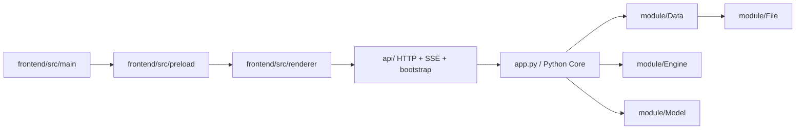
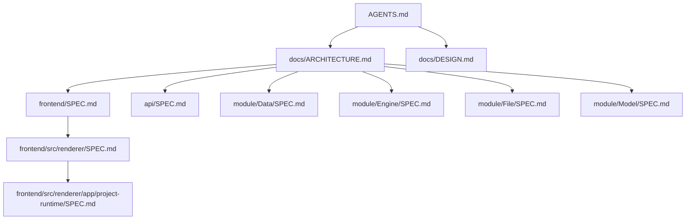

# LinguaGacha 仓库结构

## 一句话总览
LinguaGacha 是“无头 Python Core + Electron 桌面前端”的双进程工程。本文只保留仓库级阅读路径、跨层关系和模块落点，不重复各模块 `SPEC.md` 内部已经拥有的细节。

## 运行时主链路

规则：
- Electron 渲染层只通过 `window.desktopApp` 暴露的宿主能力进入桌面环境，再通过 `frontend/src/renderer/app/desktop-api.ts` 访问 Core API。
- Python Core 对前端暴露的唯一协议边界是 `api/`；运行态主路径固定为 `/api/project/bootstrap/stream` 与 `/api/events/stream`。
- `module/Data` 持有工程事实与数据编排，`module/Engine` 负责任务生命周期，`module/File` 负责格式解析与写回；三者边界变化要回到对应 `SPEC.md` 调整。

## 文档地图

规则：
- `AGENTS.md` 负责仓库级协作约束、验证下限和任务起手式。
- 本文是仓库级阅读路径、跨层关系和文档同步矩阵的权威入口。
- `docs/DESIGN.md` 只保留长期设计语义与权威来源。
- 模块 `SPEC.md` 只保留模块内部边界、真实入口和唯一写入口。

## 推荐阅读路径
| 场景 | 阅读顺序 |
| --- | --- |
| 仓库整体结构 | `docs/ARCHITECTURE.md` -> `app.py` -> `base/*` |
| Electron 壳层、桥接与构建入口 | `docs/ARCHITECTURE.md` -> [`frontend/SPEC.md`](../frontend/SPEC.md) |
| 渲染层页面、导航与组件落位 | `docs/ARCHITECTURE.md` -> [`frontend/SPEC.md`](../frontend/SPEC.md) -> [`frontend/src/renderer/SPEC.md`](../frontend/src/renderer/SPEC.md) |
| 项目运行态 / `ProjectStore` / bootstrap | `docs/ARCHITECTURE.md` -> [`frontend/SPEC.md`](../frontend/SPEC.md) -> [`frontend/src/renderer/SPEC.md`](../frontend/src/renderer/SPEC.md) -> [`frontend/src/renderer/app/project-runtime/SPEC.md`](../frontend/src/renderer/app/project-runtime/SPEC.md) -> [`api/SPEC.md`](../api/SPEC.md) |
| HTTP / SSE 契约与 Python 侧对象化客户端 | `docs/ARCHITECTURE.md` -> [`api/SPEC.md`](../api/SPEC.md) |
| 工程加载、工作台、校对与质量规则数据流 | `docs/ARCHITECTURE.md` -> [`module/Data/SPEC.md`](../module/Data/SPEC.md) |
| 任务调度、请求生命周期、停止与重试 | `docs/ARCHITECTURE.md` -> [`module/Engine/SPEC.md`](../module/Engine/SPEC.md) |
| 文件导入导出、格式解析与回写 | `docs/ARCHITECTURE.md` -> [`module/File/SPEC.md`](../module/File/SPEC.md) |
| 模型配置、预设模板与模型页后端入口 | `docs/ARCHITECTURE.md` -> [`module/Model/SPEC.md`](../module/Model/SPEC.md) -> [`api/SPEC.md`](../api/SPEC.md) |

## 稳定职责矩阵

| 领域 | 权威落点 | 需要先记住的边界 |
| --- | --- | --- |
| Electron 宿主、预加载、共享契约 | [`frontend/SPEC.md`](../frontend/SPEC.md) | 只有 `window.desktopApp` 可以把桌面能力交给渲染层 |
| React 页面、导航、样式归属 | [`frontend/src/renderer/SPEC.md`](../frontend/src/renderer/SPEC.md) | 页面逻辑在 `pages/`，跨页面稳定组合层在 `widgets/` |
| 项目运行态、`ProjectStore`、变更信号 | [`frontend/src/renderer/app/project-runtime/SPEC.md`](../frontend/src/renderer/app/project-runtime/SPEC.md) | 页面消费 bootstrap + `project.patch`，不重建第二套运行态客户端 |
| 本地 HTTP / SSE / bootstrap 契约 | [`api/SPEC.md`](../api/SPEC.md) | `api/` 是前端进入 Python Core 的唯一协议边界 |
| 工程事实、规则、分析、校对与 Extra 数据服务 | [`module/Data/SPEC.md`](../module/Data/SPEC.md) | `DataManager` 是工程级数据门面，SQL 仍只在 `Storage/LGDatabase.py` |
| 任务生命周期、请求和停止语义 | [`module/Engine/SPEC.md`](../module/Engine/SPEC.md) | `Engine` 不持有项目事实，只负责任务执行骨架 |
| 文件格式解析与写回 | [`module/File/SPEC.md`](../module/File/SPEC.md) | `FileManager` 负责格式分发，不负责工程生命周期与事务 |
| 模型配置与模板整理 | [`module/Model/SPEC.md`](../module/Model/SPEC.md) | `Manager.py` 是模型排序、模板补齐和默认回退的唯一规则入口 |

## 仓库级不变量

- `api/` 之外不新增前后端并行协议边界。
- SQL 只允许落在 `Storage/LGDatabase.py`；API 层不直接持有数据库连接，也不直接持有 `ProjectSession`。
- 长期用户文案分成两处维护：Python Core 在 `module/Localizer/`，渲染层在 `frontend/src/renderer/i18n/`。
- 同一条长期规则只保留一个权威归宿；本文只负责入口、阅读路径和跨层关系。

## 更新规则
| 变更类型 | 必须同步的文档 |
| --- | --- |
| 仓库结构、阅读路径、文档索引或同步矩阵变化 | `docs/ARCHITECTURE.md` |
| Electron 子工程根目录、桥接边界、构建命令或共享契约变化 | `frontend/SPEC.md` |
| 渲染层目录职责、导航映射、页面落位或样式边界变化 | `frontend/src/renderer/SPEC.md` |
| `ProjectStore`、bootstrap stage、`project.patch`、运行态变更信号变化 | `frontend/src/renderer/app/project-runtime/SPEC.md` + `api/SPEC.md` |
| API 路径、请求/响应字段、错误码、SSE topic 或客户端对象化范围变化 | `api/SPEC.md` |
| 数据层职责、工作台/校对/规则/分析主链路变化 | `module/Data/SPEC.md` |
| 任务生命周期、请求器、共享流水线或停止语义变化 | `module/Engine/SPEC.md` |
| 文件格式支持、解析分发或写回策略变化 | `module/File/SPEC.md` |
| 模型配置字段、模板、排序或模型页后端入口变化 | `module/Model/SPEC.md` |

## 维护约束
- 本文只列出真实存在、且对开发有帮助的文档入口，不为“以后可能会写”的文档预留占位。
- 模块文档优先写状态来源、唯一写入口、跨层载荷和非显然约束，不重复代码表面行为。
- 代码改动如果会让现有阅读路径或模块边界失真，必须在同一任务内同步修正文档。
