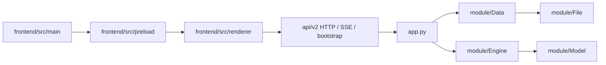
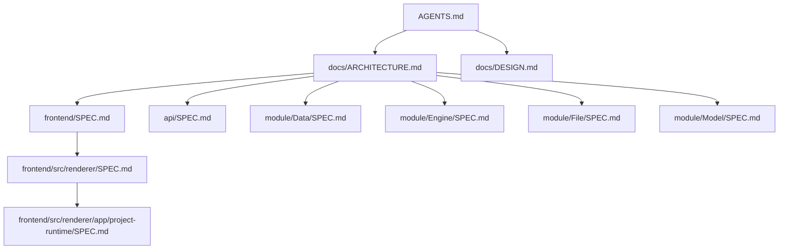

# LinguaGacha 仓库结构

## 一句话总览
LinguaGacha 是“无头 Python Core + Electron 桌面前端”的双进程工程。`app.py` 负责无头运行时与 Core API 启停；`api/v2/` 负责本地 HTTP / SSE / bootstrap 边界；`module/Data/` 持有工程事实与数据编排；`module/Engine/` 负责后台任务执行；`module/File/` 负责格式解析与回写；`frontend/` 承载 Electron 壳层与 React 渲染层。

## 核心运行时关系

## 文档入口

规则：
- `AGENTS.md` 只保留协作规则、交付约束和仓库级入口。
- 本文是仓库级文档索引、阅读路径和同步矩阵的唯一权威来源。
- `docs/DESIGN.md` 是面向代理的前端设计系统文档，用于约束界面风格、组件气质与生成方向。
- 模块 `SPEC.md` 只写模块的稳定边界、真实入口和改动落点，不记录对开发没有帮助的历史叙述。

## 推荐阅读路径
| 场景 | 阅读顺序 |
| --- | --- |
| 仓库整体结构 | `docs/ARCHITECTURE.md` -> `app.py` -> `base/*` |
| Electron 壳层、桥接与构建入口 | `docs/ARCHITECTURE.md` -> [`frontend/SPEC.md`](../frontend/SPEC.md) |
| 渲染层页面、导航与组件落位 | `docs/ARCHITECTURE.md` -> [`frontend/SPEC.md`](../frontend/SPEC.md) -> [`frontend/src/renderer/SPEC.md`](../frontend/src/renderer/SPEC.md) |
| V2 项目运行态 / `ProjectStore` / bootstrap | `docs/ARCHITECTURE.md` -> [`frontend/SPEC.md`](../frontend/SPEC.md) -> [`frontend/src/renderer/SPEC.md`](../frontend/src/renderer/SPEC.md) -> [`frontend/src/renderer/app/project-runtime/SPEC.md`](../frontend/src/renderer/app/project-runtime/SPEC.md) -> [`api/SPEC.md`](../api/SPEC.md) |
| HTTP / SSE 契约与 Python 侧对象化客户端 | `docs/ARCHITECTURE.md` -> [`api/SPEC.md`](../api/SPEC.md) |
| 工程加载、工作台、校对与质量规则数据流 | `docs/ARCHITECTURE.md` -> [`module/Data/SPEC.md`](../module/Data/SPEC.md) |
| 任务调度、请求生命周期、停止与重试 | `docs/ARCHITECTURE.md` -> [`module/Engine/SPEC.md`](../module/Engine/SPEC.md) |
| 文件导入导出、格式解析与回写 | `docs/ARCHITECTURE.md` -> [`module/File/SPEC.md`](../module/File/SPEC.md) |
| 模型配置、预设模板与模型页后端入口 | `docs/ARCHITECTURE.md` -> [`module/Model/SPEC.md`](../module/Model/SPEC.md) -> [`api/SPEC.md`](../api/SPEC.md) |

## 模块文档索引
| 文档 | 对应目录 | 说明 |
| --- | --- | --- |
| [`frontend/SPEC.md`](../frontend/SPEC.md) | `frontend/` | Electron 子工程根目录、主进程、预加载、共享契约、构建命令与壳层边界 |
| [`frontend/src/renderer/SPEC.md`](../frontend/src/renderer/SPEC.md) | `frontend/src/renderer/` | 渲染层目录职责、页面落位、导航映射、组件层级与样式边界 |
| [`frontend/src/renderer/app/project-runtime/SPEC.md`](../frontend/src/renderer/app/project-runtime/SPEC.md) | `frontend/src/renderer/app/project-runtime/` | `ProjectStore`、bootstrap 分段、`project.patch`、页面变更信号与 V2 运行态主路径 |
| [`api/SPEC.md`](../api/SPEC.md) | `api/` | 本地 Core API 的 HTTP / SSE / bootstrap 契约、错误边界、Python 客户端对象化范围与前端接入点 |
| [`module/Data/SPEC.md`](../module/Data/SPEC.md) | `module/Data/` | 工程事实、工作台、规则、分析、校对和 Extra 数据服务的真实入口 |
| [`module/Engine/SPEC.md`](../module/Engine/SPEC.md) | `module/Engine/` | 翻译/分析任务生命周期骨架、共享流水线、请求器、并发与停止语义 |
| [`module/File/SPEC.md`](../module/File/SPEC.md) | `module/File/` | 文件格式接入、解析分发、写回策略与新增格式时的真实落点 |
| [`module/Model/SPEC.md`](../module/Model/SPEC.md) | `module/Model/` | 模型配置对象、模板补齐、预设迁移、分组排序与模型页后端入口 |

## 最值得记住的边界
- V2 项目运行态主路径固定为 `/api/v2/project/bootstrap/stream` + `/api/v2/events/stream`；页面通过 bootstrap 与 `project.patch` 建立运行态事实源。
- `DataManager` 负责工程事实与数据编排，`Engine` 负责后台任务生命周期，`FileManager` 只负责格式解析与回写；三者不要互相吞职责。
- Electron 渲染层只通过 `window.desktopApp` 暴露的桌面能力接入宿主，再通过 `desktop-api.ts` 探活并请求 Core API。
- 同一条稳定规则只保留在一个权威文档；本文只负责入口、索引和同步矩阵，不接管模块内部规则。

## 更新规则
| 变更类型 | 必须同步的文档 |
| --- | --- |
| 仓库结构、阅读路径、文档索引或同步矩阵变化 | `docs/ARCHITECTURE.md` |
| Electron 子工程根目录、桥接边界、构建命令或共享契约变化 | `frontend/SPEC.md` |
| 渲染层目录职责、导航映射、页面落位或样式边界变化 | `frontend/src/renderer/SPEC.md` |
| `ProjectStore`、bootstrap stage、`project.patch`、运行态变更信号变化 | `frontend/src/renderer/app/project-runtime/SPEC.md` + `api/SPEC.md` |
| API 路径、请求/响应字段、错误码、SSE topic 或客户端对象化范围变化 | `api/SPEC.md` |
| 数据层职责、工作台/校对/规则/分析主链路变化 | `module/Data/SPEC.md` |
| 任务生命周期、请求器、共享流水线或停止语义变化 | `module/Engine/SPEC.md` |
| 文件格式支持、解析分发或写回策略变化 | `module/File/SPEC.md` |
| 模型配置字段、模板、排序或模型页后端入口变化 | `module/Model/SPEC.md` |

## 维护约束
- 本文只列出真实存在、且对开发有帮助的文档入口，不为“以后可能会写”的文档预留占位。
- 模块文档优先写状态来源、唯一写入口、跨层载荷和不明显的兼容约束，不重复显而易见的代码表面行为。
- 代码改动如果会让现有阅读路径或模块边界失真，必须在同一任务内同步修正文档。
