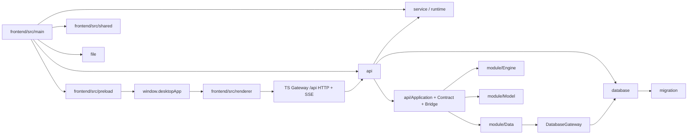
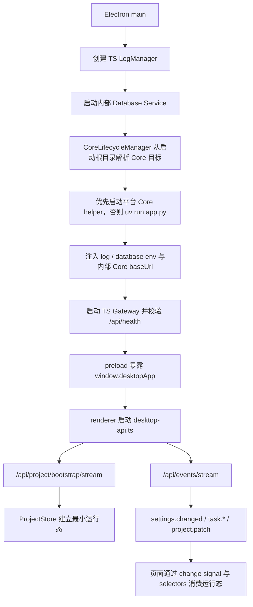
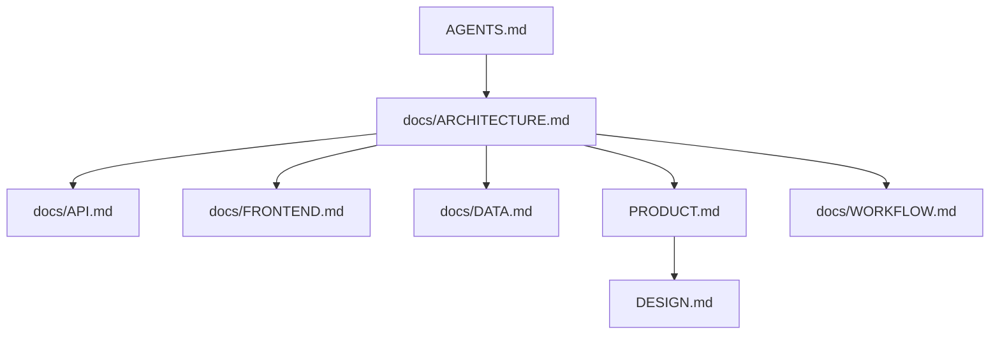

# LinguaGacha 架构文档

## 一句话总览
LinguaGacha 是“Electron main TS Gateway + 内部 Database Service + 无头 Python Core + Electron 桌面前端”的本机多进程工程。本文只回答系统如何分层、跨层边界在哪里、运行时主链路如何流动，以及读哪份文档才能做出正确维护判断。

## 系统分层图

分层规则：
- `frontend/src/main` 处理 Electron 宿主、窗口、原生对话框、开发态调试入口、公开 TS Gateway、已迁移页面领域服务、公开文件解析 / 写回和内部 Database Service。
- `frontend/src/preload` 只负责通过 `contextBridge` 暴露 `window.desktopApp`。
- `frontend/src/renderer` 只通过 `window.desktopApp` 和 `desktop-api.ts` 接入宿主与 Core API。
- `frontend/src/main/api/` 是 Electron 运行时公开 `/api/*` HTTP / SSE 编排入口；`project/` 承载已迁移项目轻生命周期、项目同步 mutation、reset preview、公开 bootstrap 运行态编码、`project.patch` 补全和 section revision 口径；`file/` 承载公开文件解析 / 写回、create preview 草稿解析和导出目录语义；`service/` 承载应用设置、模型页、质量规则 / 提示词、校对同步保存与 Electron main 运行期路径规则；`core/` 承载 Python Core 内部桥。未迁移业务由 API 编排层代理到内部 Python Core。
- `api/` 保留 Python Core 的内部协议、事件、任务和 Python 客户端对象化契约；公开 bootstrap、文件预演 / 导出、reset preview、section revision 和前端运行态 patch 编码权威在 TS Gateway，不再由 Python Core 公开承载。
- `module/Data` 持有工程事实，`module/Engine` 持有任务生命周期，`module/Model` 持有模型配置领域规则。

## 跨层边界

| 边界 | 当前规则 | 为什么重要 |
| --- | --- | --- |
| Renderer -> Electron | 只能走 `window.desktopApp` | 防止页面绕过 preload 直接碰 Node / Electron |
| Renderer -> Core API | 只能走 `frontend/src/renderer/app/desktop/desktop-api.ts` -> TS Gateway `/api/` | 保持前后端协议单点可维护 |
| API -> Data | 工程事实、规则、分析与校对辅助由 `module/Data` 提供 | 防止 API 层直接拼装会话与数据库 |
| API -> Engine | 后台任务启动、停止、进度与终态语义由 `module/Engine` 提供 | 防止数据层和界面层偷持任务生命周期 |
| File format | 公开文件解析与写回统一落在 `frontend/src/main/file/`，包括 EPUB AST / legacy 写回兼容 | 防止格式实现分散到 Python Core 或 API 编排层 |
| Data -> Database | Python 只通过 `module/Data/Database/DatabaseGateway.py` 调 Electron main 内部 database workflow；SQL / 事务 / `.lg` asset 读写只落在 `frontend/src/main/database/`，Zstd 压缩参数与压缩 / 解压工具只落在 `frontend/src/utils/zstd-tool.ts`，`.lg` 打开期 schema 与旧物理格式迁移统一落在 `frontend/src/main/migration/project-database-migration-service.ts` | 防止事务、schema 与压缩格式在 Python / TS 两侧并行 |

仓库级不变量：
- Electron 运行时公开协议只允许落在 TS Gateway 的 `/api/` 前缀；Python Core 退为 Electron main 内部服务，不能把内部端口暴露给 preload 或 renderer。
- SQL、事务和 `.lg` 内 asset 读写只允许落在 Electron main 的 `frontend/src/main/database/`；Zstd 压缩参数与压缩 / 解压工具只允许落在 `frontend/src/utils/zstd-tool.ts`；`.lg` 打开期 schema migration 与旧物理格式兼容规则只允许落在 `frontend/src/main/migration/`；API 层不得直接持有 database handle 或 `ProjectSession`。
- 长期用户文案分成两处维护：Python Core 在 `module/Localizer/`，渲染层在 `frontend/src/renderer/i18n/`。
- 跨层载荷优先传 `id`、值对象或不可变快照，不共享可变对象引用。

## 运行时主链路

运行时主链路的稳定事实：
- Electron main 是 TS Gateway、TS `LogManager`、内部 Database Service 与 Python Core 伴生进程的生命周期拥有者；启动顺序固定为 `TS LogManager -> Database Service -> Python Core 内部端口 -> TS Gateway 公开端口 -> renderer`。`CoreLifecycleManager` 在高位端口范围内分别选择公开 Gateway 端口与 Python Core 内部端口，并从启动根目录优先拉起平台 Core helper（Windows 为 `core.exe`，macOS / Linux 为 `core`），不存在时回退到 `uv run app.py`。开发态启动根目录优先取 npm 保留的原始目录 `INIT_CWD`，不存在时回退到 Electron 主进程当前工作目录；打包态启动根目录固定为 Electron 可执行文件所在目录，macOS 为 `.app/Contents/MacOS`。
- Python Core 的运行时路径统一收敛为两根：`APP_ROOT` 是应用根，开发态为仓库根、发布态为程序运行目录，承载 `resource/`、`version.txt` 和 Core 启动目标；`DATA_ROOT` 是可写数据根，承载 `userdata/` 与 `log/`。AppImage 与 macOS `.app` 固定把 `DATA_ROOT` 放到 `~/LinguaGacha`，其他场景优先使用可写的 `APP_ROOT`，不可写时回退 `~/LinguaGacha`。
- Electron 侧公开 Core API 地址由 `CoreLifecycleManager` 写入 `LINGUAGACHA_CORE_API_BASE_URL`，其值指向 TS Gateway；Python Core 内部 baseUrl、Python token、Database Service 地址和 database token 只留在 Electron main 与 Python Core 之间，不进入 preload、`window.desktopApp` 或 renderer。Python 日志通过 TS Gateway 的 `/api/logs/append` 提交，使用同一份 Core token。`frontend/src/shared/core-api-base-url.ts` 仍保留环境变量、启动参数和默认端口解析，供 preload 与外部调试兼容。
- 应用退出时 Electron main 会优先调用内部 `/api/lifecycle/shutdown`，失败或超时后按平台清理 Core 进程树；Python Core 退出后再关闭 Database Service 并释放 SQLite handle，渲染层不直接管理后端进程。
- 渲染层项目运行态由 TS bootstrap 首包和 TS Gateway 适配后的事件流共同驱动，而不是单次整页快照。
- `ProjectStore` 是渲染层项目运行态最小事实仓库；页面本地筛选、弹窗、交互态不应上提到这里。
- 校对页不会把 warnings、筛选面板 facets、搜索排序结果等派生事实塞回 `ProjectStore`；这些派生缓存由独立 worker 持有，主线程只同步原始 `project / items / quality` 输入并消费查询结果。

## 文档地图

| 文档 | 唯一回答的问题 |
| --- | --- |
| `AGENTS.md` | Agent 协作入口、编码硬约束与交付硬约束 |
| `docs/ARCHITECTURE.md` | 系统分层、跨层边界、运行时主链路和模块关系 |
| `docs/API.md` | HTTP / SSE / bootstrap / topic / 错误码 / mutation 契约 |
| `docs/FRONTEND.md` | Electron / preload / renderer / `ProjectStore` / 导航与样式边界 |
| `docs/DATA.md` | Python Core 数据域、状态拥有者、唯一写入口和 `.lg` 物理存储落点 |
| `docs/WORKFLOW.md` | 任务起手式、验证矩阵、文档同步与交付自检 |
| `PRODUCT.md` -> `DESIGN.md` | 产品语境与设计权威 |

## 模块关系矩阵

| 模块 | 核心职责 | 主要邻接层 | 详细规则所在 |
| --- | --- | --- | --- |
| `frontend/src/main/api` | Electron 运行时公开 HTTP / SSE Gateway、响应壳、代理与路由编排 | `frontend/src/renderer`、`frontend/src/main/project`、`frontend/src/main/service`、`frontend/src/main/core`、`api/` | [`API.md`](./API.md) |
| `frontend/src/main/project` | 项目轻生命周期、项目同步 mutation、reset preview、公开 bootstrap 运行态编码、`project.patch` 补全与 section revision 口径 | `frontend/src/main/api`、`frontend/src/main/database`、`frontend/src/main/core` | [`API.md`](./API.md)、[`DATA.md`](./DATA.md) |
| `frontend/src/main/file` | 文件解析 / 写回、工作台 parse 预演、新建工程 create preview 解析、导出目录与重复译文补齐 | `frontend/src/main/api`、`frontend/src/main/database`、`frontend/src/main/service`、`frontend/src/main/project` | [`API.md`](./API.md)、[`DATA.md`](./DATA.md) |
| `frontend/src/main/service` | 配置 / 模型 / 质量 / 校对同步保存领域服务与 Electron main 运行期路径规则 | `frontend/src/main/api`、`frontend/src/main/database`、`frontend/src/main/core` | [`DATA.md`](./DATA.md) |
| `frontend/src/main/core` | Python Core 内部桥客户端 | `frontend/src/main/api`、`frontend/src/main/project`、`frontend/src/main/service`、`api/` | [`API.md`](./API.md)、[`DATA.md`](./DATA.md) |
| `api/` | 内部 Python Core HTTP / SSE 契约、错误映射、事件桥、任务与 Python 客户端兼容 | TS Gateway、`api/Client`、`module/*` | [`API.md`](./API.md) |
| `frontend/` | Electron 宿主、bridge、React 渲染层、`ProjectStore` 消费 | `api/`、根目录 `DESIGN.md` 对应的前端语义 | [`FRONTEND.md`](./FRONTEND.md) |
| `module/Data` | 工程事实、规则、分析、翻译结果、校对辅助 | `api/`、Electron main Database Service | [`DATA.md`](./DATA.md) |
| `module/Engine` | 后台任务生命周期、请求调度、停止与重试 | `api/`、`module/Data` | [`DATA.md`](./DATA.md) |
| `module/Model` | 模型配置类型、模板补齐、排序与默认回退 | `api/`、`Config` | [`DATA.md`](./DATA.md) |
| 根目录 `DESIGN.md` 对应权威源 | 视觉 token、壳层节奏、页面骨架、组件语义 | `frontend/src/renderer` | [`DESIGN.md`](../DESIGN.md) |

## 维护约束

- 本文只保留系统分层、运行时主链路、跨层边界和文档地图，不平铺 API 字段表、样式 token 或任务流程清单。
- 若一次改动会改变阅读路径、模块关系矩阵或跨层边界，必须同步更新本文。
- 若你发现一条规则更适合 `API`、`FRONTEND`、`DESIGN`、`WORKFLOW` 或 `DATA`，就把它迁过去，不要继续把本文写成并行总纲。
