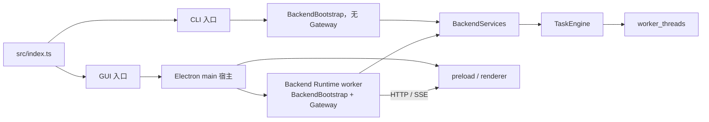

# LinguaGacha 架构边界

本文只记录进程拓扑、跨层依赖和运行时主链路。命令、后端协议、前端运行态与验证流程分别进入对应专题文档；产品语义和视觉权威不在这里展开。

## 1. 专题地图

| 问题 | 唯一归宿 |
| --- | --- |
| 系统分层、进程拓扑、跨层边界、运行时主链路 | 本文 |
| CLI 入口、命令、临时工程、资源、输出、平台启动器 | [`CLI.md`](CLI.md) |
| 后端 API / SSE、状态、任务、数据库、`.lg` 存储 | [`BACKEND.md`](BACKEND.md) |
| Electron / preload / renderer、共享运行态、页面 query、导航、样式消费 | [`FRONTEND.md`](FRONTEND.md) |
| 阅读路径与验证矩阵 | [`WORKFLOW.md`](WORKFLOW.md) |

## 2. 运行时拓扑

- `src/index.ts` 是唯一产品入口，只按显式 `--cli` 分发 GUI 或 CLI；入口层解析 CLI 应用根与桌面 bundle 根，并分别注入 GUI Backend Runtime worker 入口或 CLI `BackendWorkerExecution`。
- GUI 的完整 Backend Runtime 运行在独立 `worker_thread`，其中拥有 `BackendBootstrap`、Gateway、服务、数据库、Agent、cache 与日志；Electron main 只拥有应用、窗口、IPC、shell 和更新器。renderer 仍通过本机 HTTP / SSE 消费 Gateway，不直接使用线程消息。
- GUI main 与 Backend Runtime 只交换 `src/shared/backend-runtime.ts` 定义的结构化控制协议：ready、stop、语言读取、宿主诊断，以及代理解析、打开输出目录和受控网页抓取三项宿主回调。宿主操作以 requestId 隔离并发；worker 取消或退出会中止 main 中对应操作并忽略迟到结果。worker 意外退出直接结束应用，不回退同进程、不自动重启。
- CLI 仍在当前进程通过 `BackendBootstrap` 组装 `BackendServices`，关闭 Gateway 并直接消费类型化服务与任务快照订阅。
- GUI Backend Runtime 在发布态固定运行于独立 `worker_thread`；work-unit、planning 和 compute 的正式执行统一注入 `worker_threads`，三者的 `in_process` 只允许测试或源码运行显式选择，不作为失败回退。
- `BackendServices` 是 Gateway、CLI job 与任务引擎共用的组合根，运行期服务只在这里装配。
- `BackendBootstrap` 是进程资源生命周期权威：start / stop 串行，GUI、CLI 的正常退出与首个错误退出统一等待同一 stop；关闭顺序固定为 Gateway 停止接入并排空请求 → `BackendServices` 等待任务和 worker → 系统代理 → `ProjectDatabase` → `LogManager`，单项失败不跳过后续释放。

```mermaid
flowchart LR
    I["src/index.ts"] --> G["GUI 入口"]
    I --> C["CLI 入口"]
    G --> M["Electron main 宿主"]
    M --> BG["Backend Runtime worker\nBackendBootstrap + Gateway"]
    C --> BC["BackendBootstrap，无 Gateway"]
    BG --> S["BackendServices"]
    BC --> S
    S --> E["TaskEngine"]
    E --> W["worker_threads"]
    BG -->|"HTTP / SSE"| R["preload / renderer"]
    M --> R
```

## 3. 跨层依赖

- `src/domain` 只承载跨层实体、值对象、合法值集合和贴身判断规则，不反向依赖 backend、frontend 或 Electron。
- `src/shared` 承载可复用的纯规则、协议词表、reader 与无状态工具，不依赖 React、DOM、Electron、Node FS、SQLite、服务单例或可变全局状态。
- `src/native` 收口真实磁盘 IO、路径身份和平台路径策略；backend 与 worker 不绕过它处理平台差异。
- `src/backend` 拥有项目事实、任务执行、数据库和出站模型请求，不依赖 renderer。
- `src/gui` 是 Electron 宿主、Backend Runtime 客户端、IPC、preload、窗口和外链策略边界；生产代码除 API base URL 参数编码外不得导入 backend 实现，该约束由 `npm run check` 验证。
- `src/frontend` 只消费宿主契约、后端公开协议、`src/domain` 与 `src/shared`，不导入 backend 或 native 实现。
