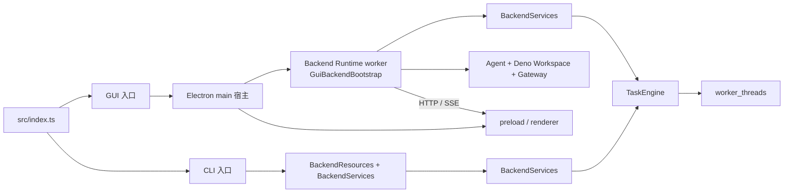

# LinguaGacha 架构边界

本文只记录进程拓扑、跨层依赖和运行时主链路。命令、后端共享边界、产品 Agent、前端运行态与验证流程分别进入对应专题文档；产品语义和视觉权威不在这里展开。

## 1. 专题地图

|问题|唯一归宿|
|---|---|
|系统分层、进程拓扑、跨层边界、运行时主链路|本文|
|CLI 入口、命令、临时工程、资源、输出、平台启动器|[`CLI.md`](CLI.md)|
|后端 API / SSE、状态、任务、数据库、`.lg` 存储|[`BACKEND.md`](BACKEND.md)|
|产品 Agent 会话、模型历史、启动资源、skill、工具、宿主能力、页面消费|[`AGENT_RUNTIME.md`](AGENT_RUNTIME.md)|
|Electron / preload / renderer、共享运行态、页面 query、导航、样式消费|[`FRONTEND.md`](FRONTEND.md)|
|阅读路径与验证矩阵|[`WORKFLOW.md`](WORKFLOW.md)|

## 2. 运行时拓扑

- `src/index.ts` 是唯一产品入口，只按显式 `--cli` 分发 GUI 或 CLI；入口适配器显式注入安装根、只读内置资产根、桌面 bundle 与 `BackendWorkerExecution`，Backend 和 worker 不从当前目录反推这些边界。`builtin` 随主应用打进 `app.asar`。
- GUI 的完整 Backend Runtime 运行在独立 `worker_thread`，其中由 `GuiBackendBootstrap` 组装共享资源、业务服务、Agent、事件流与 Gateway；Electron main 只拥有应用、窗口、IPC、shell 和更新器。renderer 仍通过本机 HTTP / SSE 消费 Gateway，不直接使用线程消息。
- GUI main 与 Backend Runtime 只交换 `src/shared/backend-runtime.ts` 定义的结构化控制协议和 `AgentWorkspaceRuntimePaths` 固定资产路径：ready、stop、语言读取、宿主诊断，以及代理解析和打开输出目录宿主回调。宿主操作以 requestId 隔离并发；worker 取消会中止 main 中对应操作，runtime 关闭强制拒绝全部待处理请求。Agent 工作区脚本由 Backend Runtime worker 直接启动受限 Deno 子进程，不经过 main。worker 意外退出直接结束应用，不回退同进程、不自动重启。
- CLI 在当前进程线性创建 `BackendResources` 与 `BackendServices`，通过窄 `CLIJobServices` 消费类型化业务能力和任务快照订阅。
- GUI Backend Runtime 在发布态固定运行于独立 `worker_thread`；work-unit、planning 和 compute 的正式执行统一注入 `worker_threads`，三者的 `in_process` 只允许测试或源码运行显式选择，不作为失败回退。
- `BackendResources` 统一拥有路径、迁移、设置、普通 HTTP transport、数据库与日志；`BackendServices` 统一拥有工程、任务、cache、模型、质量和文件能力，并向 GUI Agent 暴露同一组工程会话、运行门禁、cache 与唯一写入口。两者都不依赖 Agent 或 API 适配层。
- Backend Runtime worker 在进入 `GuiBackendBootstrap` 前校验固定 Deno runtime；随后由 `GuiBackendBootstrap` 串行管理共享资源 → 业务服务 → Agent → Gateway 的启动和严格逆序关闭，单项失败不跳过后续释放。CLI 按 job 的线性生命周期逆序释放业务服务和共享资源。transport 的网络语义归 [`BACKEND.md`](BACKEND.md)。

```mermaid
flowchart LR
    I["src/index.ts"] --> G["GUI 入口"]
    I --> C["CLI 入口"]
    G --> M["Electron main 宿主"]
    M --> BG["Backend Runtime worker\nGuiBackendBootstrap"]
    C --> BC["BackendResources + BackendServices"]
    BG --> GS["BackendServices"]
    BG --> D["Agent + Deno Workspace + Gateway"]
    BC --> CS["BackendServices"]
    GS --> E["TaskEngine"]
    CS --> E
    E --> W["worker_threads"]
    BG -->|"HTTP / SSE"| R["preload / renderer"]
    M --> R
```

## 3. 跨层依赖

- `src/domain` 只承载跨层实体、值对象、合法值集合和贴身判断规则，不反向依赖 backend、frontend 或 Electron。
- `src/shared` 承载可复用的纯规则、协议词表、reader 与无状态工具，不依赖 React、DOM、Electron、Node FS、SQLite、服务单例或可变全局状态。
- `src/native` 收口真实磁盘 IO、路径身份和平台路径策略；backend 与 worker 不绕过它处理平台差异。
- `src/backend` 拥有项目事实、任务执行、数据库和出站模型请求，不依赖 renderer。
- `src/gui` 是 Electron 宿主、Backend Runtime 客户端、IPC、preload、窗口和外链策略边界；生产代码除 API base URL 参数编码外不得导入 backend 实现，该约束由 `npm run check` 验证。
- `src/frontend` 只消费宿主契约、后端公开协议、`src/domain` 与 `src/shared`，不导入 backend 或 native 实现。
