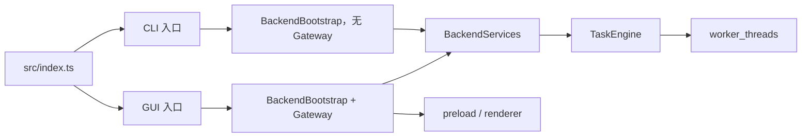

# LinguaGacha 架构边界

本文只记录进程拓扑、跨层依赖和运行时主链路。命令、后端协议、前端运行态与验证流程分别进入对应专题文档；产品语义和视觉权威不在这里展开。

## 1. 专题地图

| 问题 | 唯一归宿 |
| --- | --- |
| 系统分层、进程拓扑、跨层边界、运行时主链路 | 本文 |
| CLI 入口、命令、临时工程、资源、输出、平台启动器 | [`CLI.md`](CLI.md) |
| 后端 API / SSE、状态、任务、数据库、`.lg` 存储 | [`BACKEND.md`](BACKEND.md) |
| Electron / preload / renderer、共享运行态、页面 query、导航、样式消费 | [`FRONTEND.md`](FRONTEND.md) |
| 阅读路径、验证矩阵、文档同步和交付自检 | [`WORKFLOW.md`](WORKFLOW.md) |

## 2. 运行时拓扑

- `src/index.ts` 是唯一产品入口，只按显式 `--cli` 分发 GUI 或 CLI；入口层只解析应用根、桌面 bundle 根和 `BackendWorkerExecution`，不持有业务服务、命令协议或窗口状态。
- GUI 与后端能力层同在 Electron 主进程，当前没有独立 backend 子进程或 database HTTP 服务。
- GUI 与 CLI 都通过 `BackendBootstrap` 组装同一 `BackendServices`；GUI 开启本机 Gateway，CLI 关闭 Gateway 并直接消费服务与同进程事件流。
- 发布态后端 worker 由产品入口配置为 `worker_threads`；`in_process` 只允许测试或源码运行显式选择，不作为失败回退。
- `BackendServices` 是 Gateway、CLI job 与任务引擎共用的组合根，运行期服务只在这里装配。

```mermaid
flowchart LR
    I["src/index.ts"] --> G["GUI 入口"]
    I --> C["CLI 入口"]
    G --> BG["BackendBootstrap + Gateway"]
    C --> BC["BackendBootstrap，无 Gateway"]
    BG --> S["BackendServices"]
    BC --> S
    S --> E["TaskEngine"]
    E --> W["worker_threads"]
    BG --> R["preload / renderer"]
```

## 3. 跨层依赖

- `src/domain` 只承载跨层实体、值对象、合法值集合和贴身判断规则，不反向依赖 backend、frontend 或 Electron。
- `src/shared` 承载可复用的纯规则、协议词表、reader 与无状态工具，不依赖 React、DOM、Electron、Node FS、SQLite、服务单例或可变全局状态。
- `src/native` 收口真实磁盘 IO、路径身份和平台路径策略；backend 与 worker 不绕过它处理平台差异。
- `src/backend` 拥有项目事实、任务执行、数据库和出站模型请求，不依赖 renderer。
- `src/gui` 是 Electron 宿主、IPC、preload、窗口和外链策略边界；renderer 只通过 `window.desktopApp` 与后端 API 接触宿主和后端能力。
- `src/frontend` 只消费宿主契约、后端公开协议、`src/domain` 与 `src/shared`，不导入 backend 或 native 实现。

## 4. 更新条件

只有进程拓扑、产品入口分发、Bootstrap / Gateway 关系、worker 执行方式或跨层依赖方向变化时更新本文；命令、协议、状态、存储、页面或验证细节只更新对应专题文档。
