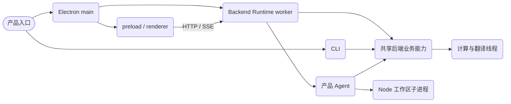

# LinguaGacha 架构设计

LinguaGacha 让 GUI、CLI 与产品 Agent 共用后端业务能力，工程事实由同一套写入流程维护。

进程隔离用于保持桌面响应，并让计算、取消和资源释放有各自的执行边界。

## 🧭 专题入口

|需要理解的设计意图|归宿|
|---|---|
|进程隔离、依赖方向与资源生命周期|本文|
|CLI 的临时工程、设置继承与机器输出|[CLI](CLI.md)|
|工程一致性、任务恢复、文件存储与网络策略|[BACKEND](BACKEND.md)|
|产品 Agent 的会话、工作材料、授权与运行环境|[AGENT_RUNTIME](AGENT_RUNTIME.md)|
|前端状态寿命、交互恢复、宿主接入与应用更新|[FRONTEND](FRONTEND.md)|
|源码定位、开发命令与验证选择|[WORKFLOW](WORKFLOW.md)|

文档收录与维护规则见 [AGENTS.md](../AGENTS.md)。

## 🧩 进程隔离

GUI 将完整后端放入独立 `worker_thread`，使业务执行与 Electron 窗口生命周期分开。

- renderer 通过本机 HTTP / SSE 消费后端。
- main 与后端通过线程消息处理启动、关闭和宿主回调。
- CLI 在当前进程中创建共享后端，按单次任务释放服务。

```mermaid
flowchart LR
    Entry(["产品入口"]) --> Main("Electron main")
    Entry --> CLI("CLI")
    Main --> Runtime("Backend Runtime worker")
    Main --> Renderer("preload / renderer")
    Renderer -->|"HTTP / SSE"| Runtime
    Runtime --> Services("共享后端业务能力")
    CLI --> Services
    Runtime --> Agent("产品 Agent")
    Agent --> Services
    Agent --> Workspace("Node 工作区子进程")
    Services --> Workers("计算与翻译线程")
```

GUI 与 CLI 在各自环境中实例化共享后端，让翻译、工程写入和导出沿用同一套业务语义。GUI 的 `GuiBackendBootstrap` 额外装配 Agent 与 Gateway。

资源路径由入口显式注入：安装根、只读内置资源根和工作区运行目录随应用版本确定。这样，工作目录变化不会改变线程或子进程使用的资源。

正式运行的执行策略有两条约束：

- GUI 后端与重型计算使用独立线程。`in_process` 供测试或源码运行显式选择。
- 后端 worker 意外退出会结束应用。继续运行需要重新建立工程会话、运行占用和所有在途操作的一致状态。

## 🔗 依赖方向

共享能力按依赖范围放置：

- `src/domain` 与 `src/shared` 保存领域值和纯规则，让后端、renderer 与工作区使用相同语义。
- `src/native` 处理平台 IO，使平台差异集中在文件与宿主边界。
- 界面通过公开协议消费业务能力，依赖方向由 `buildtools/check/` 校验。

后端装配分为基础资源和业务服务：

- `BackendResources` 管理基础资源。
- `BackendServices` 组织业务服务，供 CLI 和产品 Agent 复用。
- Gateway 将已装配的服务适配为公开协议。

## ⏳ 关闭与宿主操作

关闭沿依赖关系逆序进行：

1. 停止受理并取消在途操作。
2. 等待使用者收尾。
3. 释放业务服务和基础资源。

单项清理失败后仍继续后续释放，并保留错误，避免遗留仍在运行的下层资源。

### Chromium 宿主

图片编解码和 HTML 打印需要 Chromium，由 main 持有隐藏窗口。

- 后端决定业务策略并写入文件。
- 宿主执行图像或打印操作。
- 打印文档使用内嵌资源，并禁用脚本和外部访问，限制生成内容的资源访问范围。

### 取消与交付

图片和打印的宿主回包确认原生资源已释放。后端收到确认后才释放 PDF 计算线程或 Agent 子进程的运行占用，避免新任务与旧任务争用资源。取消原因由后端原始信号保留。

其它原生操作取消后结束调用方等待，并丢弃迟到回包。

PDF 的正式预览与导出共用文档实现：后端在独立线程中计算，Agent 在已有 Node 子进程中调用同一模块，使预览与交付使用相同的排版语义。
