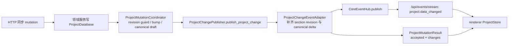

# LinguaGacha 后端权威边界

本文件统一承载公开协议、后端领域边界、状态拥有者、唯一写入口、数据库与 `.lg` 物理存储规则。字段级细节和局部算法优先留在类型、实现和测试中。

## 1. 公开协议边界

- `src/main/api/api-gateway-server.ts` 是 Electron 运行态公开 `/api/*` 协议的唯一注册点；路由注册集中在该文件，POST JSON 路由统一返回响应壳。
- Gateway 只监听 `127.0.0.1`，CORS 只允许 `Content-Type`，renderer 不依赖额外私有请求头。
- 所有 POST JSON 路由返回统一响应壳：成功为 `{ ok: true, data }`，失败为 `{ ok: false, error: { code, message, message_key, request_id, details?, action?, action_key? } }`。
- `src/shared/error` 是公开错误 code、HTTP status、日志分级、API envelope 投影和日志投影的唯一模型；用户可见错误文案只从 `src/shared/i18n` 的 `message_key` / `action_key` 解析。
- 稳定错误码使用点分语义码：请求与路由归 `request.*`，项目归 `project.*`，文件归 `file.*`，数据一致性归 `data.*` / `database.*`，任务归 `task.*`，模型归 `model.*`，worker 归 `worker.*`，运行时归 `runtime.*`。文件域必须区分不支持格式、内容解析失败、结构不符合格式和读写失败；运行时资源释放、主动取消和内部不变量失败不能混用同一错误码。业务代码需要抛错时使用 `src/shared/error` 的语义化 `AppError` 子类，不再通过 API 层手拼 code/message/details。
- `message` 和 `action` 是 Gateway 按当前应用语言解析出的安全展示文本；`message_key` 和 `action_key` 是 renderer 可复用的稳定 i18n key；`details` 只允许安全 JSON 字段，内部 stack、完整敏感路径、API key、Authorization header、provider 原始响应和 cause 只能进入日志。
- `AppError` 构造不写日志；Gateway、任务和 Electron main 需要记录错误时通过日志投影写入 `LogManager`，日志窗口仍只暴露安全摘要，文件和控制台保留结构化诊断上下文与 cause 链。
- 公开 SSE frame 的 data 负载必须使用严格 JSON 序列化，不能把事件对象、模板拼接结果或可变引用直接写入 frame。

| 路径 | 语义 | 维护边界 |
| --- | --- | --- |
| `GET /api/health` | Core 可用性与版本探测 | `desktop-api.ts` 用它校验 base URL |
| `POST /api/project/manifest` | 项目数据索引、工程快照和 section revision | renderer 初始化项目数据的主入口 |
| `POST /api/project/read-sections` | 按 section 读取项目公开投影 | 只能读取 `ProjectDataSection` 项目数据，不承载 task |
| `POST /api/project/items/read-by-ids` | 按 item id 读取公开 item map | 供 ids-only 事件和页面缓存补读 |
| `GET /api/events/stream` | 项目、任务、设置的运行期增量事件 | 页面运行态主事件源 |
| `GET /api/logs/stream` | 日志窗口增量事件 | 只暴露 `log.appended` |
| `POST /api/settings/*` | 应用设置和最近项目 | 由 `AppSettingService` 写入并发 `settings.changed` |
| `POST /api/models/*` | 模型配置、激活、测试 | 由 `ModelService` 和配置服务持有 |
| `POST /api/project/*` | 工程生命周期、工作台、reset、导出、校对 mutation | 按领域服务分发，不能在路由层写数据库 |
| `POST /api/tasks/start`、`/stop`、`/snapshot`、`/translate-single` | 统一任务命令、任务快照和单条翻译工具调用 | 由 `TaskService`、`TaskEngine` 承接；重翻是 translation 的 items scope |
| `POST /api/tasks/generate-translation` | 生成译文文件 | 由文件导出服务承接 |
| `POST /api/quality/*` | 质量规则与提示词 | 由 `QualityService` 持有写入口 |

## 2. 项目读取契约

项目数据 section 固定为：

```text
project -> files -> items -> quality -> prompts -> analysis -> proofreading
```

`/api/project/manifest` 只返回项目快照、项目 revision、section revision 和轻量索引，不预热大 section。`/api/project/read-sections` 按需返回与 `ProjectStore` 同口径的 section payload；读取 `quality`、`prompts`、`project`、`proofreading` 不能隐式扫描完整 items。`items` section 与 `/api/project/items/read-by-ids` 的 item 行必须是 `src/base/item` 派生的完整公开 DTO，公开字段使用 `item_id` / `row_number`，不得把数据库内部 `id` / `row` 泄漏给 renderer。`/api/project/items/read-by-ids` 随响应返回当前 `projectRevision` 与 `sectionRevisions`，供 renderer 丢弃过期补读结果。

新增、删除或重排项目数据 section 时，必须同时更新：

- `src/shared/project/event.ts` 的 `PROJECT_DATA_SECTIONS`。
- `ProjectRuntimeProjectionService` 的 manifest、section payload 和按 id 补读口径。
- renderer `ProjectStoreStage`、项目读取合并逻辑和相关测试。
- 本文与前端文档中的运行态消费说明。

## 3. 公开事件与 mutation



- `ProjectMutationResult` 是同步项目 mutation 的统一返回形状：`accepted: true` 表示事务已提交，`changes` 承载本次提交产生的后端 canonical `ProjectChangeEvent` 列表。
- `project.data_changed` 与 `ProjectMutationResult.changes` 复用同一批项目数据增量事实；`ProjectChangeEvent.projectPath` 必须是后端当前 loaded 工程路径，发起 mutation 的 renderer 可先应用 HTTP 返回的 `changes`，随后用 `eventId` 跳过同源 SSE 重放。
- 任务启动和会重写 `files` / `items` / `analysis` 的结构性项目 mutation 通过 `ProjectOperationGate` 统一互斥；工作台文件操作、`prefiltered_items` 设置对齐、translation reset 和 analysis reset 从慢准备阶段开始持有 mutation lease，期间 `/api/tasks/start` 与另一段结构性项目 mutation 返回 `task.busy`。任务内部 artifact commit 已处在 Engine 生命周期内，只经 `TaskArtifactCommitter` / `ProjectTaskStore` 写回，不再进入该 gate。
- 同步 mutation 的慢准备阶段只能读取用户源文件或当前 asset 内容，并生成不绑定当前 section revision 保护可写事实的解析草稿；revision guard、当前 `items` / `meta` 读取、用于路径冲突或预过滤派生的最终 `files` 读取、item id 分配、译文继承、预过滤派生和 revision bump 必须在 `ProjectMutationCoordinator` 的提交阶段连续完成。`.lg` 事务提交成功后再生成变更草稿并交给 `ProjectChangePublisher` 发布项目数据变更；变更草稿必须携带本次写入的目标工程路径，调用方只声明变更 section、payload mode 和可选 ids。
- `ProjectChangeEventAdapter` 负责把变更草稿转换为公开 `ProjectChangeEvent`，并通过 `ProjectRuntimeProjectionService` 按目标工程路径补齐 canonical delta 与本次更新 section revision；目标工程不是当前 loaded 工程时返回空 `changes` 且不广播 SSE。
- `ProjectChangeEvent` 的 payload mode 只有 `canonical-delta`、`ids-only`、`section-invalidated`；`items` / `files` 的行级 upsert 由 adapter 按 id / path 从数据库投影回读，完整替换和非行级 section 在 canonical-delta 下由 `ProjectRuntimeProjectionService` 返回完整 section data，调用方不能手拼公开 data。正常 mutation 不发布 `section-invalidated`；它只保留给异常恢复或无法携带 canonical payload 的事件。
- `ProjectLifecycleService.create_project_commit`、`ProjectSyncMutationService`、`ProofreadingService` 与 `QualityService` 是 renderer 可触发项目事实 mutation 的后端权威入口。新建工程只接收源路径、目标路径和当前设置镜像；打开前 settings alignment 预演只返回 action、设置差异和所需 section revision，不返回可提交的 `files` / `items` 草稿；工作台文件操作、`prefiltered_items` 设置对齐、translation reset、analysis reset、质量规则、提示词、校对保存/替换/重置只接收用户意图、当前设置和 `expected_section_revisions`；最终 `items`、`translation_extras`、`prefilter_config`、`analysis_extras`、继承译文、预过滤状态、校对状态和重试次数都由后端从当前源文件、`.lg` 或数据库事实派生。项目 mutation 派生模块只落在 `src/main/project/`，`src/shared/prefilter` 只提供规则谓词，不输出可写项目事实。
- 同步项目事实 mutation 必须携带所有依赖 section 的 `expected_section_revisions`；锁值只接受非负 JSON number 整数，缺少对象、缺少依赖 section、字符串、布尔值、小数、坏值或负数是请求校验失败，当前 revision 不一致是 `data.revision_conflict`。旧最终事实载荷和旧单 revision 字段不能作为兼容层保留，出现 `draft`、`files`、`items`、`translation_extras`、`prefilter_config`、`analysis_extras`、`parsed_items`、`file_record` 或 `expected_glossary_revision` 等旧事实字段时应在服务边界拒绝。
- translation reset-all 提交必须重新读取 `.lg` asset 并按 `file_path + row` 回填当前 item id；preview 路由只服务 UI 展示，不能成为提交事实来源。文件重排只能改变展示顺序，不能让数组下标决定 item 身份。
- `project` section 只表达工程加载态和路径；项目设置 meta 不进入 `ProjectStore.project`，settings-only mutation 只写 meta 并返回空 `changes`，不发布不可消费的 project data 事件。
- `/api/project/analysis/import-glossary` 只接收用户确认后的术语表快照和 `consumed_candidate_srcs`；后端在同一事务消费对应分析候选聚合并重新派生 `analysis_candidate_count`，且只在术语表条目真实变化时推进 `quality` revision，候选池消费始终推进 `analysis` revision。
- `CoreEventHub` 是公开运行期事件总线，只广播领域层已经写好的公开事件，不再把 SSE topic 反向投影为内部状态。
- `TaskRuntimePublisher` 是任务运行态公开事件唯一出口；它先写 `TaskRuntimeState`，再构建完整 `TaskSnapshot` 并发布 `task.snapshot_changed`。
- `/api/tasks/stop` 命中当前 run 时由 Engine 写入并发布 `stopping`；HTTP ack 只返回 `TaskRuntimeState` 当前完整 snapshot，不强制旧停止意图覆盖已发布终态。
- 任务生命周期状态必须立即发布完整 snapshot；worker 结果经 `TaskPipeline` 的 500ms 提交窗口写入项目事实，提交完成后立即发布进度 snapshot。任务启动时也必须先把本轮初始进度写入 `.lg` meta，再发布首个进度 snapshot。仅 `request_in_flight_count` 这类请求压力展示允许在后端按 500ms 窗口合并，终态 snapshot 发布前必须先冲刷 pending 请求压力。
- `ProjectRuntimeProjectionService` 是 manifest、read-sections、按 id 补读、项目变更事件和任务输入快照共享的无状态项目数据投影归宿；项目读取响应必须携带后端会话确认的 `projectPath`，公开 block 只从 `.lg` 与 meta 生成，不持有长期缓存。
- 事件 topic、payload mode、section 集合或 mutation result 语义变化，都必须同步 `src/renderer/app/desktop/desktop-runtime-context.tsx` 与相关测试。

## 4. 后端领域边界

| 领域 | 权威职责 | 写入口 |
| --- | --- | --- |
| project | 工程加载态、项目读取、项目数据投影、工作台文件 mutation、reset、分析导入、项目 mutation 派生、项目数据变更适配、同步 mutation 协调、结构性 mutation 与任务启动互斥 | `ProjectLifecycleService`、`ProjectSyncMutationService`、`ProjectMutationCoordinator`、`ProjectOperationGate`、`ProjectRuntimeProjectionService`、`ProjectChangeEventAdapter` |
| events | 公开运行期事件广播、SSE 订阅和 keepalive | `CoreEventHub` |
| service/task-service | 统一任务命令、请求校验、命令回执 | `TaskService` |
| engine/protocol | TaskType、TaskRunStatus、TaskCommand、TaskSnapshot、WorkUnit、WorkerExecutionResult、TaskArtifact | `src/main/engine/protocol/` |
| engine/runtime | 任务快照、运行时 busy、请求中数量、translation extras 行级状态、完整 snapshot 发布 | `TaskRuntimeState`、`TaskSnapshotBuilder`、`TaskRuntimePublisher` |
| engine/core | 任务锁、流水线、LLM 请求资格限流、任务级 Key 租约、worker 调度、进度提交；后台 work unit 与公开单条翻译都必须先取得 limiter lease | `TaskEngine`、`ModelKeyLeasePool` |
| engine/definitions | 任务差异解释边界；新增任务类型应新增 definition，不改 Engine 主流程 | `TaskDefinitionRegistry`、`TaskDefinition` |
| engine/store | 任务输入读取、任务质量快照构建、artifact 提交、项目数据变更发布 | `ProjectTaskStore`、`TaskArtifactCommitter` |
| llm | main 进程 LLM provider policy、request policy、official SDK transport、ProviderClientPool、请求结果归一 | `LLMClient`、`LLMClientPolicy`、各 provider policy 与 transport |
| engine/worker | work unit 执行、提示词构建、runner、pipeline、响应清洗解码、worker_threads 边界 | `WorkerPool`、`worker-entry`、各 runner |
| app | 应用路径、设置文件读写缓存、应用版本和 User-Agent 元信息 | `AppPathService`、`AppSettingService`、`AppMetadataService` |
| platform | main / worker 原生文件系统与路径策略，含 Windows 长路径和路径身份比较 | `src/native/platform` 的 `NativeFs`、`NativePathPolicy` |
| file | 源文件解析、预览、导出、格式适配 | `FilePreviewService`、`FileExportService`、`src/main/file/formats/` |
| model | 模型配置、激活、可用模型、连通性测试 | `ModelService`、`ModelConfigResolver` |
| service | 质量规则、提示词、校对保存和任务命令门面 | `QualityService`、`ProofreadingService`、`TaskService` |
| log | 内部日志聚合、`AppError` 日志投影、fatal 兜底和日志 SSE | `LogManager`、`record_app_error` |

API 层只分发到领域服务和包装协议语义，不直接操作 database workflow，不持有 SQLite 句柄，不把内部服务对象暴露给 renderer。

## 5. 状态拥有者

| 状态事实 | 权威拥有者 | 规则 |
| --- | --- | --- |
| 当前工程是否 loaded、工程路径 | `ProjectSessionState` | 只由工程加载/创建/卸载成功后更新，返回不可变快照 |
| 任务 busy、status、active task、请求中数量、translation scope | `TaskRuntimeState` | 只由任务命令、任务引擎和 `TaskRuntimePublisher` 维护；`retranslate` 不作为 TaskType |
| 结构性项目 mutation lease、任务启动 admission | `ProjectOperationGate` | lease 只表示后端当前是否处在结构性项目 mutation 的慢准备或提交窗口；`ProjectSyncMutationService` 持有 lease，`TaskService` 在 `begin_task` 前同步检查 lease 与 `TaskRuntimeState.busy`，不替代 section revision guard |
| 项目持久事实、meta、runtime section revision | `ProjectDatabase` | 只通过 database operation 和事务写入 |
| 应用设置完整配置和 renderer settings 快照 | `AppSettingService` | 运行期只读写 `userdata/config.json`，服务实例持有缓存；启动迁移早于服务创建并可直接处理历史配置路径 |
| 应用版本与 LLM User-Agent 元信息 | `AppMetadataService` | 只读 `version.txt` 并缓存；路径由 `AppPathService` 提供，LLM policy 不直接读取文件 |
| 项目公开投影 block、分析覆盖率摘要 | `ProjectRuntimeProjectionService` | manifest、read-sections、项目变更事件和任务输入快照复用同一读取口径，不另建缓存 |
| 前端项目运行态 | renderer `ProjectStore` | 只消费项目读取接口、`ProjectMutationResult.changes` 和 `project.data_changed` |
| 页面局部筛选、弹窗、选择、临时预览 | 页面 hook 或组件本地状态 | 不写回共享运行态，除非通过领域 mutation |

跨线程、跨模块、跨前后端只传 `id`、值对象或不可变快照，禁止共享可变对象引用。新增状态前必须先判断它属于上表哪一层；没有固定拥有者的状态不能进入长期运行态。

任务启动命令统一走 `/api/tasks/start`，启动前先通过 `ProjectOperationGate` 排斥已有任务和结构性项目 mutation，并必须携带 `expected_section_revisions` 作为并发校验；翻译、分析至少校验 `quality`、`prompts`，translation 的 `scope.kind === "items"` 表示重翻并至少校验 `items`、`proofreading`、`quality`、`prompts`。任务执行所需的质量规则与提示词快照由后端从 `.lg` 当前事实构建，再作为稳定 work unit 输入传给 worker。Engine 到 worker 只传 `WorkUnit`，worker 返回 `WorkerExecutionResult`，项目事实只经 `TaskArtifactCommitter` / `ProjectTaskStore` 写入。

LLM 请求并发由 `TaskEngine` 在主线程解析为最终值：`concurrency_limit > 0` 时使用显式并发，否则 `rpm_limit > 0` 时用 RPM 一比一作为自动并发，两者都没有时为 8。`TaskLimiter` 只接收最终并发；有 RPM 时只用 RPM pacer 控制请求启动节奏，无 RPM 时按最终并发值作为隐藏 RPS 平滑补充启动资格。`request_in_flight_count` 只统计已取得 limiter lease 并真实进入执行中的 LLM work unit，不统计等待队列。`WorkerPool` 是 multiplexed pool，少量 worker_threads 可承载多个 in-flight work unit，worker_threads 数量不等于用户并发。

任务级多 Key 轮换由 `ModelKeyLeasePool` 在 work unit 即将进入 in-flight 前按 `api_format / api_url / model_id / normalized key list` 做全局 round-robin；它复用 `LLMClientPolicy.collect_api_keys` 的 key 归一规则，但不把任务级轮换下放到 worker。重试重新获取 Key，worker 内不做本地轮换。模型连通性测试遍历所有 Key，模型列表查询只使用 primary Key。

`src/main/llm` 的 LLM 请求链路固定为 `LLMClient -> LLMClientPolicy -> ProviderClientPool -> official SDK transport -> LLMRequestResult`，worker 通过 `LLMClientPort` 消费该能力。OpenAI-compatible 与 SakuraLLM 使用 `openai`，Google / Gemini 使用 `@google/genai`，Anthropic / Claude 使用 `@anthropic-ai/sdk`；核心请求链路不保留 pi-ai fallback。Google 的 `api_url` 在 `LLMClientPolicy` 归一为 `@google/genai` SDK base URL，末尾 `/v1`、`/v1beta`、`/v1alpha` 版本段由 SDK `apiVersion` 负责拼接，任务请求和 Google 模型列表共用同一规则。`LLMClientPolicy` 是模型族 thinking、generation、extra body/header 和 provider 强制删字段规则的唯一归宿；transport 只从 `ProviderClientPool` 取 SDK client、发送最终 payload、读取 stream 并归一响应。

## 6. 数据库与 `.lg` 物理存储

- SQL、事务、SQLite 连接生命周期和 `.lg` asset 读写落在 `src/main/database/`；迁移可在 `src/main/migration/` 直接使用数据库连接，普通领域服务不能持有 SQLite 句柄。
- main / worker 侧所有真实磁盘 IO 经 `src/native/platform` 的 `NativeFs`，业务层落盘和读取统一交给平台层处理。
- `NativePathPolicy` 是 Windows namespaced path 转换与跨平台路径身份比较的唯一策略入口；需要判断路径相等或传给 SQLite、文件格式库、日志、迁移、配置和导出链路时先走该策略。
- 旧版本迁移规则只允许落在 `src/main/migration/`，由单一编排器按 startup、project database schema、project database writeback、project open operation hook 执行；单个迁移文件只承载一个历史场景，不能恢复运行时兼容层。历史 item 缺失完整公开 DTO 所需稳定字段时只在 migration 层补齐，projection、ProjectStore 和写回入口不得现场猜默认值。
- Zstd 压缩/解压参数和运行时能力检查只允许落在 `src/shared/utils/zstd-tool.ts`。
- `ProjectDatabase.execute()` 是上层服务使用的窄 workflow；新增 operation 必须集中校验参数，避免 SQL 语义散落到 service。
- `execute_transaction()` 单个事务只允许绑定一个工程文件，避免跨 `.lg` 半提交。
- `schema_version` 只标记当前表结构能力；业务数据写回迁移使用 `applied_writeback_migrations` 按迁移 id 标记，避免既有工程因结构版本已是当前值而跳过数据归一。
- `.lg` 默认使用 SQLite `WAL+NORMAL`，但普通 database workflow 必须使用 scoped connection，用完通过 SQLite checkpoint / close 回到无常驻 `-wal` / `-shm` 的稳定态；不得手动删除 SQLite 副文件。
- 任务等可预见长写入流程必须通过 `ProjectDatabase` 租约显式保留连接；租约持有期间 `-wal` / `-shm` 可见是预期，释放最后一个租约后由 SQLite 正常收尾。
- asset 内容以 Zstd 压缩 blob 存储在 `.lg` 内；调用方读取时消费解压 bytes，不理解压缩格式。
- 运行态不保留独立 database gateway、full bootstrap stream 或旧 DTO bridge；历史格式兼容只在 migration 或 project change adapter 的明确边界内处理。
- 跨 API、数据库 payload、任务运行态和 worker 的实体和值对象从 `src/base` 导入；`Item`、`Setting`、`Model`、`Prompt`、`QualityRule` 负责 JSON 反序列化、序列化、合法值集合和贴身派生判断，后端领域服务只在 IO、数据库、路径、网络和事件边界处理副作用。
- 跨运行时复用的 task、quality、language、log、prefilter 规则谓词和纯 JSON 工具从 `src/shared` 导入；`JsonTool` 只负责解析、修复和序列化，不承载文件读取或写入。语言值域按源语言、目标语言和总表三类导出，后端提示词、预过滤和文件格式策略必须消费对应窄值域，不得恢复源/目标共用列表；质量规则合并、预演和任务快照归一只复用 `src/shared/quality`，运行态不得为这些共享规则另建并行词表或局部兜底。
- 质量规则预设接口以公开 `rule_type` 为入参，物理预设目录只由 `QualityRule` 派生；提示词目录、rules 表物理类型、meta key 和默认预设 setting key 只由 `Prompt` 派生。

## 7. 更新触发条件

必须同步更新本文的改动：

- 新增、删除、重命名或改变 `/api/*` 路由语义。
- 改响应壳、错误码、SSE topic、项目读取接口、`project.data_changed` 或 mutation result。
- 新增后端状态拥有者、写入口、任务事件来源或跨层载荷规则。
- 改 database operation、事务语义、`.lg` schema、asset 压缩、migration 或文件格式存储落点。
- 改任务引擎与 worker 的事实回流方式、LLM request policy、official SDK transport、ProviderClientPool、ModelKeyLeasePool 或并发推导语义。
- 改跨后端领域共享的实体值对象、共享规则、合法值集合、normalize 或派生判断。
