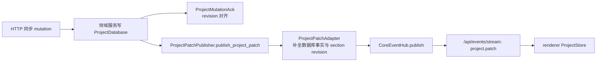

# LinguaGacha 后端权威边界

本文件统一承载公开协议、后端领域边界、状态拥有者、唯一写入口、数据库与 `.lg` 物理存储规则。字段级细节和局部算法优先留在类型、实现和测试中。

## 1. 公开协议边界

- `src/main/api/api-gateway-server.ts` 是 Electron 运行态公开 `/api/*` 协议的唯一注册点。
- Gateway 只监听 `127.0.0.1`，CORS 只允许 `Content-Type`，renderer 不依赖额外私有请求头。
- 所有 POST JSON 路由返回统一响应壳：成功为 `{ ok: true, data }`，失败为 `{ ok: false, error: { code, message } }`。
- 稳定错误码只包含 `not_found`、`invalid_request`、`internal_error`；新增错误码必须同步前端错误分支和本文。
- 公开 SSE frame 必须使用严格 JSON 序列化，不能手写拼接多行 `data` 负载。

| 路径 | 语义 | 维护边界 |
| --- | --- | --- |
| `GET /api/health` | Core 可用性与版本探测 | `desktop-api.ts` 用它校验 base URL |
| `GET /api/project/bootstrap/stream` | 一次性项目运行态 bootstrap | 事件顺序是前后端契约 |
| `GET /api/events/stream` | 项目、任务、设置的运行期增量事件 | 页面运行态主事件源 |
| `GET /api/logs/stream` | 日志窗口增量事件 | 只暴露 `log.appended` |
| `POST /api/settings/*` | 应用设置和最近项目 | 由 `ConfigService` 写入并发 `settings.changed` |
| `POST /api/models/*` | 模型配置、激活、测试 | 由 `ModelService` 和配置服务持有 |
| `POST /api/project/*` | 工程生命周期、工作台、reset、导出、校对 mutation | 按领域服务分发，不能在路由层写数据库 |
| `POST /api/tasks/*` | 翻译、分析、重翻、停止、任务快照和导出 | 由 `TaskCommandService`、`TaskEngine`、导出服务承接 |
| `POST /api/quality/*` | 质量规则与提示词 | 由 `QualityService` 持有写入口 |

## 2. Bootstrap 契约

`/api/project/bootstrap/stream` 是一次性 SSE。Gateway 会先完整构建所有事件，再开始写流，避免半截成功流。

固定 stage 顺序：

```text
project -> files -> items -> quality -> prompts -> analysis -> proofreading -> task
```

每个 stage 依次发送：

```text
stage_started -> stage_payload -> stage_completed
```

最后发送 `completed`，携带 `projectRevision` 与 `sectionRevisions`。新增、删除或重排 stage 时，必须同时更新：

- `ProjectRuntimeEncoder` 的 stage 定义。
- renderer `ProjectStoreStage`、bootstrap loader 和相关测试。
- 本文与前端文档中的运行态消费说明。

## 3. 公开事件与 mutation



- `project.patch` 是项目运行态增量事实的唯一公开事件；同步 mutation 的 HTTP ack 不替代 patch。
- `ProjectMutationAck` 只表达接受状态和 revision 对齐信息，不承载页面最终事实。
- `CoreEventHub` 是公开运行期事件总线；`TaskRuntimeProjector` 从 `task.*` 和 `project.patch` 投影 `TaskRuntimeState`，任务状态变更和 project patch 不能绕过各自发布入口。
- `ProjectPatchAdapter` 只适配 `project.patch`，负责把最小 patch 补成 renderer 可消费的项目事实，并补齐 section revision。
- 事件 topic 变化、patch operation 变化或 ack 语义变化，都必须同步 `src/renderer/app/desktop/desktop-runtime-context.tsx` 与相关测试。

## 4. 后端领域边界

| 领域 | 权威职责 | 写入口 |
| --- | --- | --- |
| project | 工程加载态、bootstrap 编码、工作台文件 mutation、reset、分析导入、project patch 适配 | `ProjectLifecycleService`、`ProjectSyncMutationService`、`ProjectRuntimeEncoder`、`ProjectPatchAdapter` |
| events | 公开运行期事件广播、SSE 订阅和 keepalive | `CoreEventHub` |
| task-engine/command | 任务命令、请求校验、命令回执 | `TaskCommandService` |
| task-engine/runtime | 任务快照、运行时 busy、请求中数量、重翻行级状态、事件投影 | `TaskRuntimeState`、`TaskSnapshotBuilder`、`TaskRuntimeProjector` |
| task-engine/orchestration | 任务锁、流水线、限流、worker 调度、进度提交 | `TaskEngine` |
| task-engine/store | 任务输入读取、任务结果提交、任务 project patch | `ProjectTaskStore` |
| task-worker | work unit 执行、提示词构建、pi-ai 请求、响应清洗解码 | `TaskWorkerPool`、`task-worker-entry`、各 work unit runner |
| file | 源文件解析、预览、导出、格式适配 | `FilePreviewService`、`FileExportService`、`src/main/file/formats/` |
| model | 模型配置、激活、可用模型、连通性测试 | `ModelService`、`ModelConfigResolver` |
| service | 设置、路径、质量规则、提示词、校对保存 | `ConfigService`、`QualityService`、`ProofreadingService` |
| log | 内部日志聚合、日志窗口和日志 SSE | `LogManager`、`LogWindowHost` |

API 层只分发到领域服务和包装协议语义，不直接操作 database workflow，不持有 SQLite 句柄，不把内部服务对象暴露给 renderer。

## 5. 状态拥有者

| 状态事实 | 权威拥有者 | 规则 |
| --- | --- | --- |
| 当前工程是否 loaded、工程路径 | `ProjectSessionState` | 只由工程加载/创建/卸载成功后更新，返回不可变快照 |
| 任务 busy、status、active task、请求中数量、重翻 item ids | `TaskRuntimeState` | 任务命令受理、任务事件和 `replace_task` patch 回灌共同维护 |
| 项目持久事实、meta、runtime section revision | `ProjectDatabase` | 只通过 database operation 和事务写入 |
| 前端项目运行态 | renderer `ProjectStore` | 只消费 bootstrap、`project.patch` 和本地乐观 patch |
| 页面局部筛选、弹窗、选择、临时预览 | 页面 hook 或组件本地状态 | 不写回共享运行态，除非通过领域 mutation |

跨线程、跨模块、跨前后端只传 `id`、值对象或不可变快照，禁止共享可变对象引用。新增状态前必须先判断它属于上表哪一层；没有固定拥有者的状态不能进入长期运行态。

## 6. 数据库与 `.lg` 物理存储

- SQL、事务、SQLite 句柄缓存和 `.lg` asset 读写只允许落在 `src/main/database/`。
- `.lg` 打开期 schema 与旧物理格式迁移只允许落在 `src/main/migration/project-database-migration-service.ts`。
- Zstd 压缩/解压参数和运行时能力检查只允许落在 `src/shared/utils/zstd-tool.ts`。
- `ProjectDatabase.execute()` 是上层服务使用的窄 workflow；新增 operation 必须集中校验参数，避免 SQL 语义散落到 service。
- `execute_transaction()` 单个事务只允许绑定一个工程文件，避免跨 `.lg` 半提交。
- asset 内容以 Zstd 压缩 blob 存储在 `.lg` 内；调用方读取时消费解压 bytes，不理解压缩格式。
- 运行态不保留独立 database gateway 或旧 DTO bridge；历史格式兼容只在 migration、runtime encoder 或 patch adapter 的明确边界内处理。

## 7. 更新触发条件

必须同步更新本文的改动：

- 新增、删除、重命名或改变 `/api/*` 路由语义。
- 改响应壳、错误码、SSE topic、bootstrap stage、`project.patch` 或 mutation ack。
- 新增后端状态拥有者、写入口、任务事件来源或跨层载荷规则。
- 改 database operation、事务语义、`.lg` schema、asset 压缩、migration 或文件格式存储落点。
- 改任务引擎与 worker 的事实回流方式。
