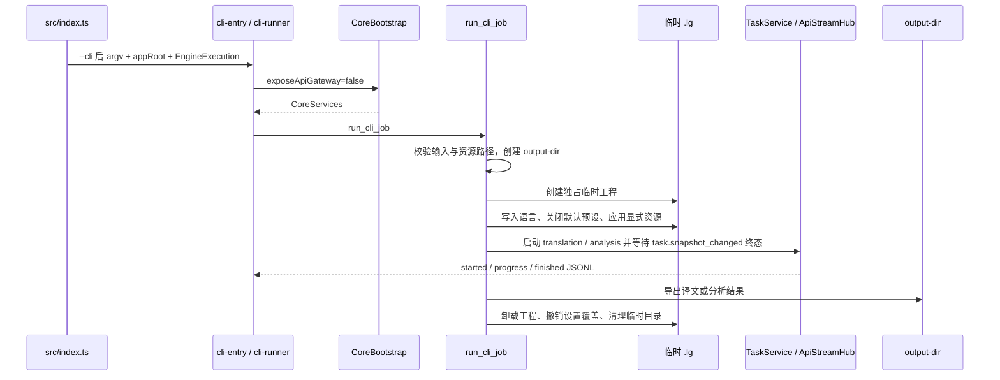

# LinguaGacha CLI 命令模式

本文件是 CLI 入口分发、命令协议、临时工程、外部资源、输出语义和平台启动器的唯一归宿。Core API、数据库和任务引擎规则只在 [`docs/BACKEND.md`](BACKEND.md) 展开。

## 1. 入口边界

- CLI 只能由产品入口中的显式 `--cli` 触发；用户参数从 `--cli` 后开始读取，平台启动器不得把文件名或进程名语义泄漏给 `src/index.ts`。
- 产品入口负责解析 appRoot 和桌面 bundle 根，并把 `EngineExecution` 原样传给 CLI；CLI、`CoreServices`、`WorkUnitWorkerPool` 和 `PlanningWorkerPool` 不探测 worker 文件，也不把 `in_process` 当失败回退。
- CLI 以 `CoreBootstrap(exposeApiGateway=false)` 启动 Core，不开放本机 HTTP / SSE Gateway；Core 控制台日志在 CLI job 中关闭，避免诊断文本污染 stdout JSONL。
- CLI 是文件进出型适配层：它只接收输入文件、输出目录、语言和本次命令显式资源，不承接 GUI 工程文件心智或 renderer 协议。

## 2. 命令协议

CLI 只接受单一动词命令；全局层只保留 `--help` 与 `--version`。

| 命令 | 必填参数 | 可选资源 | 产物 |
| --- | --- | --- | --- |
| `translate` | `--input` 可重复、`--output-dir`、`--source-language`、`--target-language` | `--prompt .txt`、`--glossary .json/.xlsx`、`--pre-replacement .json/.xlsx`、`--post-replacement .json/.xlsx`、`--text-preserve .json/.xlsx` | 译文导出到 `--output-dir` |
| `analyze` | `--input` 可重复、`--output-dir`、`--source-language`、`--target-language` | `--prompt .txt` | 术语候选导出到 `--output-dir` |

- `--source-language` 允许 `ALL`，`--target-language` 不允许 `ALL`；两者都必须走共享语言值域归一。
- `--input` 保留用户传入顺序；文件格式支持、路径身份和去重由文件域继续处理。
- 资源路径在参数解析阶段只校验非空值和扩展名；真实存在性统一在 job 边界检查。
- `analyze` 只接受 `--prompt`，翻译专属资源传给 `analyze` 必须报 usage 错误，不能静默忽略。
- usage 错误退出码为 `2`，运行期错误退出码为 `1`，帮助、版本和成功命令退出码为 `0`。

## 3. 同步 job 链路

- 每个 CLI job 独占一个临时 `.lg` 工程；成功、失败或任务报错后都必须撤销 transient 设置、卸载工程并删除临时目录。
- CLI 默认关闭术语表、文本保护、译前替换、译后替换、翻译提示词和分析提示词预设；只有命令参数显式传入的资源会写入本次临时工程。
- 外部质量规则和提示词仍走 `ProjectDatabase` operation 写入，并推进 `quality` / `prompts` revision；任务启动使用当前 section revision 构造 `expected_section_revisions`。
- CLI 等待任务时只订阅同进程 `ApiStreamHub` 的 `task.snapshot_changed`；不能新增独立轮询状态或另一套任务生命周期。
- 翻译命令启动 `translation` 全量任务后调用文件导出服务；分析命令启动 `analysis` 全量任务后调用质量服务导出候选结果。

## 4. 输出与进程语义

- help / version 输出普通文本；执行 job 时 stdout 只输出一行一个 JSON 的状态事件，事件类型固定为 `started`、`progress`、`finished`。
- `progress.stats` 是 CLI 对外稳定投影，字段为 `total`、`skipped`、`failed`、`completed`、`pending`、`percent`；不要把内部 `TaskSnapshot.progress` 字段名直接暴露成 CLI 协议。
- 成功的 `finished` 不再重复输出产物路径，调用方以自己传入的 `--output-dir` 作为产物位置；失败的 `finished` 携带稳定 `error.message`，进程返回运行期错误码。
- stderr 只承载参数错误、帮助回显或运行期错误；Core 诊断日志写入日志文件，不进入 job stdout。
- CLI 完成后 `src/index.ts` 必须按返回码主动结束 Electron 进程，避免 Windows console launcher 等待未退出子进程。
- CLI 不打开输出目录；`openOutputFolder` 在 CLI CoreBootstrap 中固定为空操作。

## 5. 平台启动器与打包

- Windows 发布包提供 Go 编译的 `cli.exe` console launcher，只定位同目录 `app.exe`、追加 `--cli`、继承 stdin/stdout/stderr，并返回子进程退出码。
- Windows launcher 在 `afterPack` 阶段构建并复制到发布目录；缺少 Go 工具链或 launcher 产物必须让打包失败，不能静默丢失 CLI 入口。
- macOS 使用主程序追加 `--cli`；Linux AppImage 使用 `LinguaGacha.AppImage --cli`。
- 发布资产的平台与架构由构建工作流的命令传入；CLI 文档不维护用户长教程，长示例留在 Wiki 与 help 链接。

## 6. 更新触发条件

- 新增、删除、重命名 CLI 命令、参数、资源类型、资源扩展名、语言约束、输出路径或退出码，更新本文。
- 改 `--cli` 分发、appRoot 解析、CLI 进程退出、`EngineExecution` 下传或平台启动器，更新本文。
- 改临时工程生命周期、默认预设关闭策略、资源写入、revision 推进、任务等待或导出链路，更新本文。
- 改 Core API、任务、数据库或 worker 执行契约，同步 [`docs/BACKEND.md`](BACKEND.md)；改验证要求，同步 [`docs/WORKFLOW.md`](WORKFLOW.md)。
