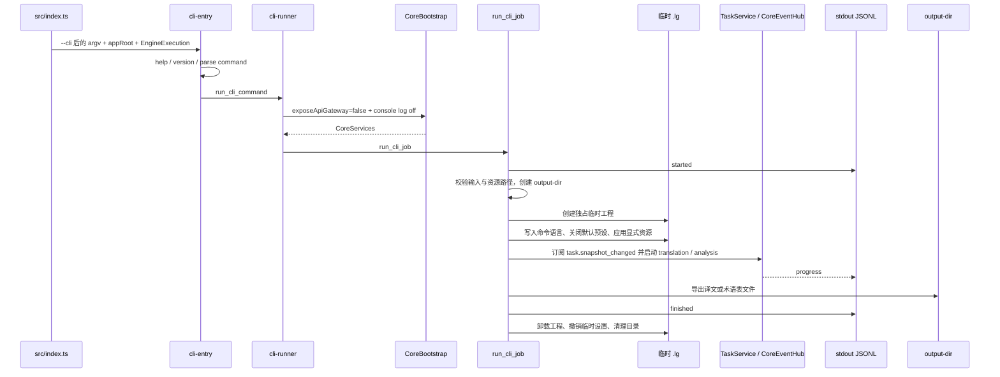

# LinguaGacha CLI 命令模式

本文件统一承载 CLI 命令模式、入口分发、参数和资源边界、临时工程、同步 job、输出语义与平台启动器规则。系统分层只在 [`docs/ARCHITECTURE.md`](ARCHITECTURE.md) 保留入口地图，Core 协议、状态、数据库和任务引擎规则仍归 [`docs/BACKEND.md`](BACKEND.md)，面向普通用户的完整教程保留在 Wiki 与 CLI help 文本。

## 1. 权威边界

- `src/index.ts` 是 GUI / CLI 的唯一产品入口；CLI 只能由显式 `--cli` 标记触发，用户参数从 `--cli` 后开始读取，入口本身不持有业务服务。
- `src/cli/` 是文件进出型命令适配层，负责参数解析、stdout / stderr、同步 job、临时工程生命周期和 JSONL 状态输出；它不承接 GUI 项目文件心智、renderer 协议或领域服务实现。
- CLI 通过 `CoreBootstrap` 以 `exposeApiGateway=false` 启动 Core，不开放本机 HTTP Gateway，并关闭 Core 控制台日志，避免人类诊断文本污染 stdout JSONL；`run_cli_command` 只把产品入口提供的 `EngineExecution` 原样下传给 Core，不在 CLI、`CoreServices`、`WorkUnitWorkerPool` 或 `PlanningWorkerPool` 内探测入口文件或执行模式。
- Windows 发布包提供 Go 编译的轻量 `cli.exe`，只转发到同目录 `app.exe --cli` 并保留用户参数顺序；macOS 使用 `LinguaGacha --cli`，Linux AppImage 使用 `LinguaGacha.AppImage --cli`。
- CLI 用户教程、长示例和语言说明不进入本文；`build_cli_help` 只输出当前可用命令的简短说明，并继续链接 Wiki。

## 2. 命令协议

CLI 只接受单一动词命令；全局层只保留 `--help` 和 `--version`。

| 命令 | 必填参数 | 可选资源 | 输出语义 |
| --- | --- | --- | --- |
| `translate` | `--input` 可重复、`--output-dir`、`--source-language`、`--target-language` | `--prompt .txt`、`--glossary .json/.xlsx`、`--pre-replacement .json/.xlsx`、`--post-replacement .json/.xlsx`、`--text-preserve .json/.xlsx` | stdout 输出 started / progress / finished JSONL，译文写入 `--output-dir` |
| `analyze` | `--input` 可重复、`--output-dir`、`--source-language`、`--target-language` | `--prompt .txt` | stdout 输出 started / progress / finished JSONL，术语表写入 `--output-dir` |

- `--source-language` 允许 `ALL`，`--target-language` 不允许 `ALL`；两者都必须通过共享语言值域归一。
- `--input` 保留用户传入顺序，文件域后续再按支持格式与路径身份处理；CLI 不接收 GUI 工程文件作为用户心智。
- 资源路径在解析阶段只收窄扩展名，真实存在性统一在 job 边界检查，避免内部工程创建后才暴露输入错误。
- 参数错误抛出 `CLIUsageError`，退出码固定为 `2`；运行期错误退出码为 `1`；帮助、版本和成功命令退出码为 `0`。

## 3. Job 链路

- 每次 CLI job 独占一个临时 `.lg` 工程，任务结束或失败后都必须卸载当前工程、撤销临时设置覆盖并清理临时目录。
- CLI 默认关闭术语表、文本保护、译前替换、译后替换、翻译提示词和分析提示词预设；只有命令显式传入的外部资源会写入本次临时工程事实。
- 外部质量规则和提示词写入仍走 `ProjectDatabase` database operation；资源写入后必须推进 `quality` / `prompts` revision，供任务启动的 `expected_section_revisions` 校验读取。
- CLI 任务启动复用 `TaskService`、`TaskRuntimeState`、`TaskRuntimePublisher`、导出服务和质量服务；同步等待订阅 `CoreEventHub` 的 `task.snapshot_changed`，不新增独立任务调度状态或轮询分支。
- 翻译命令启动 `translation` 全量任务后调用文件导出服务写入 `--output-dir`；分析命令启动 `analysis` 全量任务后调用质量服务导出术语候选文件。

## 4. 输出与进程语义

- stdout 在 help / version 时输出普通文本；执行 job 时只输出一行一个 JSON 的状态事件，事件类型固定为 `started`、`progress`、`finished`，对外只以 `command` 区分 `translate` / `analyze`。
- `progress.stats` 是 CLI 对外稳定的四卡片投影，字段固定为 `total`、`skipped`、`failed`、`completed`、`pending`、`percent`；它不直接暴露内部 `TaskSnapshot.progress` 字段名。
- `finished` 成功时不输出产物路径；调用方以自己传入的 `--output-dir` 作为产物位置。失败时 `finished` 携带稳定 `error.message`，进程仍返回运行期错误退出码。
- stderr 只输出参数错误、帮助回显、运行期错误和启动期系统代理提示；Core 诊断日志仍写文件，不进入 CLI job stdout。系统代理提示来自 `CoreBootstrap` 返回的脱敏 `SystemProxyStartupNotice`，只在检测到非 `DIRECT` 代理时按 `检查到系统代理设置 - [代理 URL]` 形式输出一次。
- `src/index.ts` 在 CLI 命令完成后必须用返回码主动结束 Electron 进程，避免 Windows `cli.exe` 启动器等待未退出的子进程。
- `--output-dir` 是 CLI 唯一用户可见输出位置，命令可创建该目录，并允许导出链路按既有服务语义覆盖同名产物。
- CLI 不打开输出目录；`openOutputFolder` 在 CLI CoreBootstrap 中固定为空操作。

## 5. 平台启动器与打包

- Windows `cli.exe` 是 console launcher，只定位同目录 `app.exe`，追加 `--cli`，继承 stdin / stdout / stderr，并返回 `app.exe` 的退出码。
- `buildtools/builder/electron-builder.json5` 只声明平台产物类型、命名模板和资源落点；目标平台与架构由 `.github/workflows/build.yml` 的构建命令唯一传入，避免同一 job 生成或上传其它架构的发布资产。
- Windows 发布资产由 electron-builder `zip` target 直接生成；`buildtools/builder/after-pack.mjs` 只在 Windows afterPack 阶段构建 `buildtools/builder/win-cli-launcher` Go 模块，再复制 `build/builder/win-cli-launcher/cli.exe` 到发布目录；缺少 Go 工具链或启动器产物必须立即失败，避免发布包静默丢失 CLI 入口。
- macOS 和 Linux 不生成额外 CLI 文件，用户通过主程序追加 `--cli` 进入命令模式。

## 6. 更新触发条件

必须同步更新本文的改动：

- 新增、删除、重命名 CLI 命令、参数、资源类型、资源扩展名、语言约束、输出路径或退出码语义。
- 改 `src/index.ts` 的 `--cli` 分发、appRoot 解析、CLI 退出流程或 `EngineExecution` 下传方式。
- 改 CLI 临时工程生命周期、默认预设关闭策略、资源写入、revision 推进、任务等待或导出链路。
- 改 Windows `cli.exe`、Go launcher、afterPack 复制规则、macOS / Linux CLI 入口展示或构建脚本。
- 改 CLI 相关验证要求时同步 [`docs/WORKFLOW.md`](WORKFLOW.md)；改 Core API、状态、数据库、任务引擎或 worker 执行契约时同步 [`docs/BACKEND.md`](BACKEND.md)。
