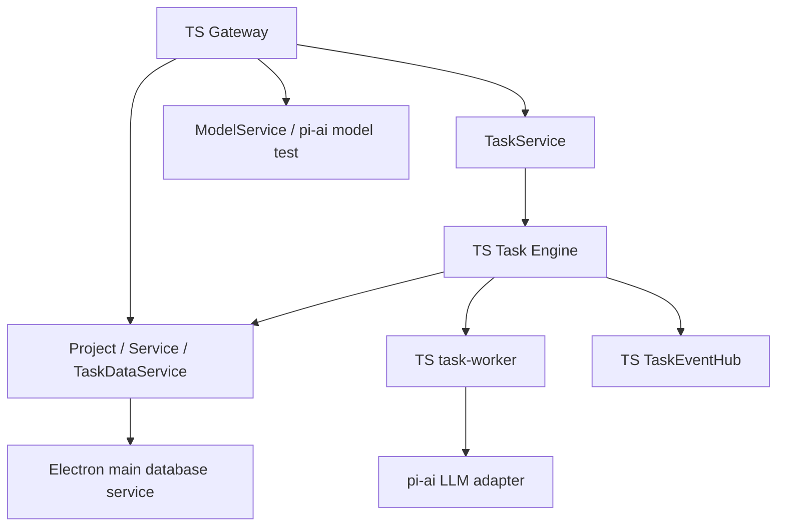
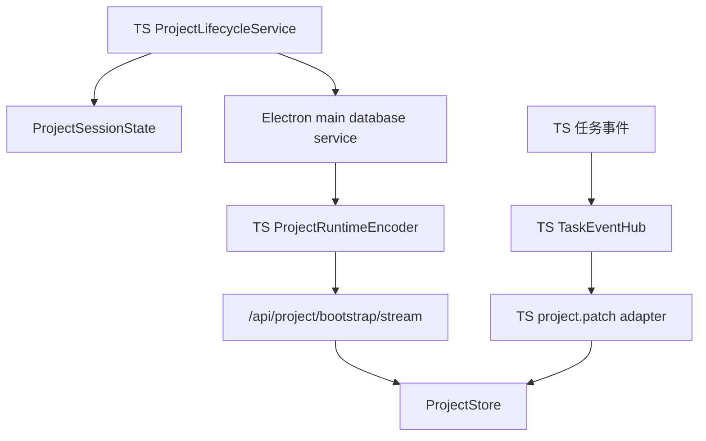
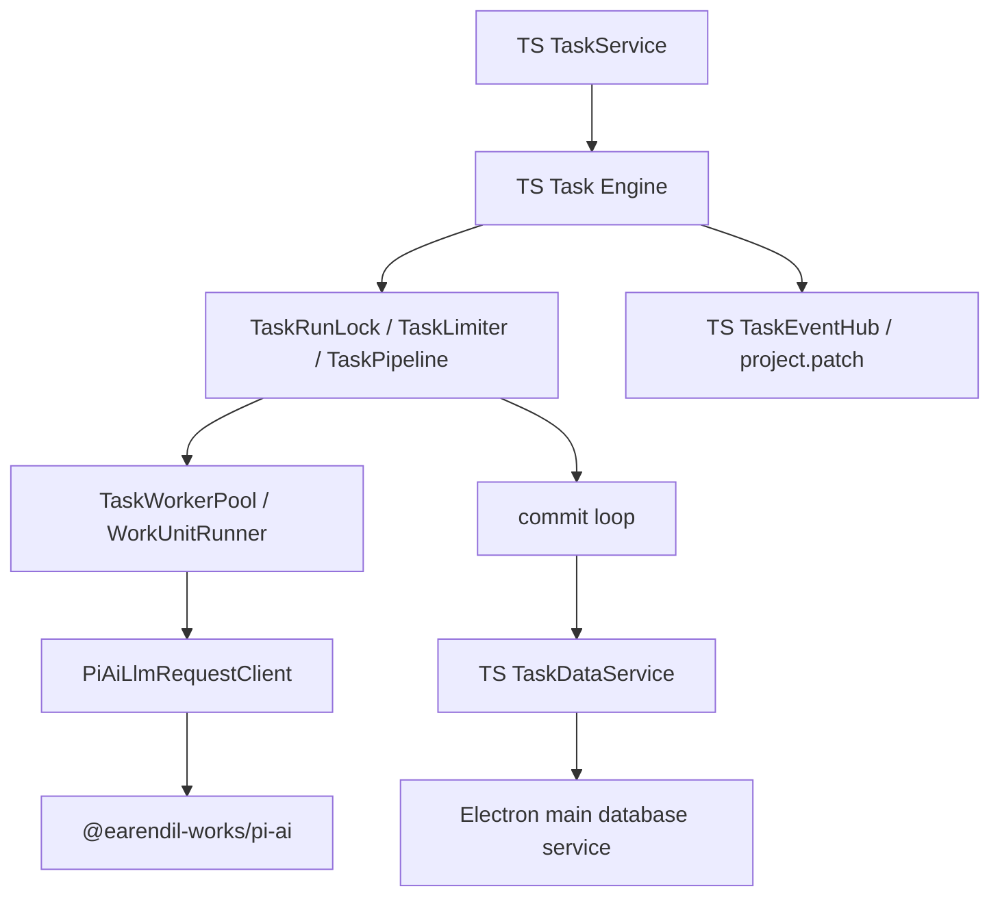
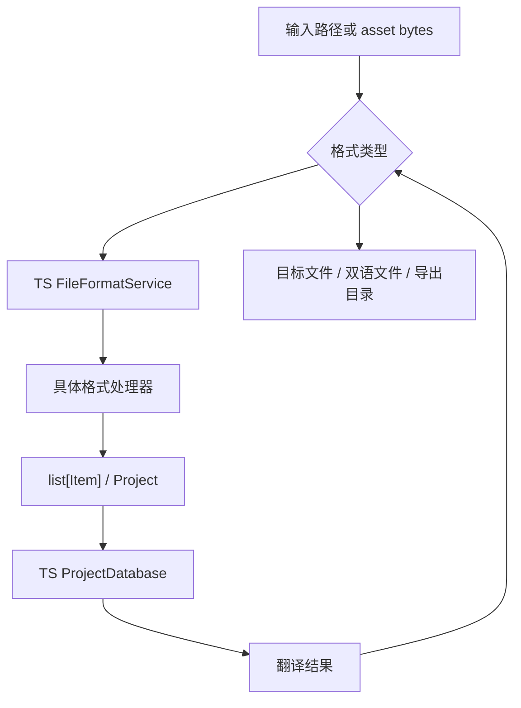

# LinguaGacha 数据域文档

## 一句话总览
LinguaGacha 的数据域由 Electron main TS API 编排层、TS Project / Service / Model 域、TS Task Engine、TS task worker / pi-ai LLM adapter、TS 任务数据 / 运行态服务，以及 Electron main Database Service 的 `.lg` 物理存储共同协作。本文回答的不是目录长什么样，而是：项目级状态应该落在哪里，唯一写入口怎么判断，`.lg` 物理存储为什么只由 Electron main Database Service 持有，以及哪些非显然规则会影响未来维护。

## `Data / Engine / File / Model` 的职责边界

| 领域 | 权威入口 | 稳定职责 | 不该做什么 |
| --- | --- | --- | --- |
| `frontend/src/main/task` | `TaskService`、`TaskDataService`、`TaskEventHub`、`TaskRuntimeState`、`TaskSnapshotBuilder` | 公开任务命令、内部任务数据读写、事件 hub、任务回执与 task snapshot；持久进度读 database，实时状态读 TS runtime state | 不绕过 Task Engine 执行后台任务，不绕过 database workflow，不把内部 token 暴露给 renderer |
| `frontend/src/main/task-engine` | `TaskEngine`、`TaskPipeline`、`TaskLimiter`、`TaskRunLock` | 后台任务生命周期、调度、限流、停止、重试、提交循环和真实请求中数量 | 不持有 UI 状态，不直接写 SQL，不执行单个 work unit 的文本处理，不把整场任务控制权交回旧兼容层 |
| `frontend/src/main/task-worker` | `TaskWorkerPool`、`WorkUnitRunner`、`TranslationWorkUnitRunner`、`AnalysisWorkUnitRunner`、`PiAiLlmRequestClient` | 单个 work unit 的译前处理、提示词、pi-ai LLM adapter 调用、响应清洗 / 解码 / 校验和结果归一 | 不持有后台任务生命周期，不提交 `.lg` 项目事实，不直接写 SQL，不把 provider 差异散到 work unit 之外 |
| `frontend/src/main/file` | `FileFormatService`、`FilePreviewService`、`FileExportService`、`formats/` | 公开文件格式分发、解析、导出写回、工作台 parse 预演与新建工程草稿解析 | 不直接持有 SQL，不绕过 Database Service，不把格式实现放回旧兼容层 |
| `frontend/src/main/model` | `ModelService`、`model-config-resolver` | 模型页快照、CRUD、重排、激活模型回退、配置写入、远端模型列表与模型连通性测试 | 不直接写 `.lg`，不把模型页面规则放回通用 service，不绕过 task-worker LLM adapter 重造测试请求语义 |

## 状态拥有者与唯一写入口

| 状态或语义 | 权威来源 | 唯一写入口或协调入口 |
| --- | --- | --- |
| 任务工程上下文与任务数据 | `frontend/src/main/task/task-data-service.ts` | TS Task Engine 进程内直接读取 / 提交，不通过 HTTP 回环 |
| 前端公开 loaded/path | `frontend/src/main/project/project-session-state.ts` | `/api/project/load`、`/api/project/create-commit` 成功后写入；`/api/project/unload` 成功后清空 |
| 工程创建、打开预演、加载与卸载编排 | `frontend/src/main/project/project-lifecycle-service.ts` + `project-session-state.ts` + `frontend/src/main/database/` | TS Gateway 调用项目轻生命周期服务 |
| 工作台文件集合 | `frontend/src/main/project/project-sync-mutation-service.ts` + `frontend/src/main/database/` | TS Gateway 调用项目同步 mutation 服务；文件写互斥由 TS main 内部状态维护 |
| 公开 bootstrap、`project.patch` 补全、ProjectMutationAck 与 section revision | `frontend/src/main/project/project-runtime-encoder.ts`、`project-patch-adapter.ts`、`project-section-revision.ts` | TS Gateway 按需读取 Electron main Database Service；`task` block 复用 `TaskSnapshotBuilder` 从 database + `TaskRuntimeState` 组装 |
| 公开任务命令、任务回执与 task snapshot | `frontend/src/main/task` + `frontend/src/main/task-engine` + `frontend/src/main/task-worker` | TS task service 校验公开请求并生成回执；TS Task Engine 持有后台任务执行态；TS task worker 执行单个 work unit 并通过 pi-ai adapter 调真实 LLM |
| 设置、最近项目 | `frontend/src/main/service` + `DATA_ROOT/userdata/config.json` | TS Gateway 调用 settings 服务 |
| 模型页 CRUD | `frontend/src/main/model` + `DATA_ROOT/userdata/config.json` | TS Gateway 调用 model 服务 |
| 质量规则、提示词页面 CRUD 与预设 IO | `frontend/src/main/service` + `frontend/src/main/database/` | TS Gateway 调用 quality 服务；任务后续读取通过 `TaskDataService` 取得最新数据库事实 |
| P2 项目同步 mutation | `frontend/src/main/project/project-sync-mutation-service.ts` + `frontend/src/main/database/` | TS Gateway 调用项目同步 mutation 服务；写入后回 `ProjectMutationAck` |
| 项目轻生命周期 | `frontend/src/main/project/project-lifecycle-service.ts` + `project-session-state.ts` + `frontend/src/main/database/` | `snapshot` 读取 TS 会话状态，`load/create-commit/open-preview/unload/preview/source-files` 都由 TS 侧处理数据库事实与公开响应 |
| reset preview 公开预演 | `frontend/src/main/project/project-reset-preview-service.ts` + `frontend/src/main/database/` + `frontend/src/main/file` | TS Gateway 计算公开响应；翻译 all 预演直接用 TS 文件域重解析 asset |
| 规则、提示词运行时读取 | `frontend/src/main/task/task-data-service.ts` | TS Task Engine 获取任务所需 quality snapshot，再作为不可变载荷传给 TS task worker |
| 分析候选、checkpoint、分析结果 | `frontend/src/main/task/task-data-service.ts` + `frontend/src/main/database/` | TS Task Engine 批量读取 / 提交，TS Gateway 统一推进持久事实；TS task worker 只返回单个分析 chunk 的候选结果 |
| 校对保存、校对 revision、重翻提交 | `frontend/src/main/service/proofreading-service.ts`、`frontend/src/main/task/task-data-service.ts` 与 `frontend/src/main/task-engine` | 校对同步保存由 TS Gateway 调用 proofreading 服务直接写 `.lg`；重翻由 TS task service 校验 revision 后启动 TS Task Engine，批次提交回到 TS task data 服务 |
| 全局忙碌态与实时请求数 | `frontend/src/main/task/task-runtime-state.ts` | TS task service 命令受理、TS 任务事件和 `project.patch` 共同更新 |
| 文件格式解析与写回 | `frontend/src/main/file` | TS Gateway 的文件预演、reset preview、导出服务；EPUB 由 TS `formats/epub-*` 实现 |
| 模型列表整理、模板补齐、排序与默认回退 | `frontend/src/main/model` + `DATA_ROOT/userdata/config.json` | TS model service |

判断规则：
- 如果它是工程事实、规则、条目、分析结果、校对辅助或导出前持久化事实，优先判断是否属于 `frontend/src/main/database/` 的 workflow 以及 TS project / service / task data 写入口。
- 如果它是任务生命周期、请求节奏、停止与重试，属于 `frontend/src/main/task-engine`。
- 如果它是格式识别、提取条目、EPUB AST 兼容或写回目标文件，属于 `frontend/src/main/file`。
- 如果它是模型配置对象、模板选择、排序或激活模型回退，属于 `frontend/src/main/model`。
- 如果它只是页面筛选、弹窗开关、表格交互态，不属于后端数据域，留在前端页面本地状态。

## `.lg` 物理存储唯一落点

- SQL、事务与 `.lg` 内 asset 读写只允许落在 `frontend/src/main/database/`；Zstd 压缩参数与压缩 / 解压工具只允许落在 `frontend/src/shared/utils/zstd-tool.ts`；`.lg` 打开期 schema 与旧物理格式迁移统一落在 `frontend/src/main/migration/project-database-migration-service.ts`。
- 任务热路径由 TS Task Engine 通过 `TaskDataService` 调 database workflow；运行态不保留跨语言数据门面或 database gateway。
- API 层不得直接持有 database handle。
- 若某个新需求看起来需要绕过 TS database workflow 顺手写 SQL，说明落点已经错了；database workflow 回到 `frontend/src/main/database/`，Zstd 参数化工具回到 `frontend/src/shared/utils/zstd-tool.ts`，打开期迁移规则回到 `frontend/src/main/migration/`。

## 典型数据流

### 工程加载与运行态编码

稳定事实：
- TS `ProjectRuntimeEncoder` 是公开 bootstrap block 与请求内运行态快照的编码权威，`project-patch-adapter.ts` 是任务事件补全为前端运行态 patch 的唯一入口，`project-section-revision.ts` 是 bootstrap、同步 mutation ack 与 patch revision 共享的 section revision 口径。
- `Config` 是应用设置权威；工程 meta 中的 `source_language`、`target_language`、`mtool_optimizer_enable` 与 `skip_duplicate_source_text_enable` 只是打开 / 新建时同步的项目镜像。
- 项目预过滤计算只在渲染层 runner / worker 中执行；create/open 草稿、打开对齐预演和事务化提交都由 TS 文件域 / 项目域提供，后台任务通过 TS Task Engine 读取当前工程上下文。
- 新建工程草稿由 TS `FilePreviewService` 归一、过滤和去重，提交由 TS `ProjectLifecycleService` 事务化写入 `.lg`；TS `source-files` 只负责公开枚举可导入路径。目录源保留相对该目录的层级，文件源使用文件名，出现相对路径冲突时由稳定后缀保证资产路径唯一。
- `source_language`、`mtool_optimizer_enable` 或 `skip_duplicate_source_text_enable` 不一致 / 缺失会要求前端重跑预过滤；仅 `target_language` 不一致时只同步项目镜像，不重写 items。

### 后台任务与数据提交

稳定事实：
- TS Task Engine 负责执行骨架、调度、停止、重试和提交；TS task worker 负责单个 work unit 的确定性文本处理、prompt、pi-ai LLM 请求、响应解析和校验。
- TS `TaskPipeline` 的 commit loop 是唯一允许生成 retry context 的地方。
- 停止语义是先切到 `STOPPING`，再由流水线与超时收尾，不是立刻中断网络 IO。
- 翻译任务终态只保存项目事实；译文文件写出属于用户确认后的显式导出动作，不挂在任务完成收尾上。

### 文件导入与导出

稳定事实：
- 公开 `/api/project/create-preview`、`/api/project/workbench/parse-file`、translation reset all 的 asset 重解析、`/api/tasks/export-translation` 与 `/api/project/export-converted-translation` 的文件能力由 TS `frontend/src/main/file/` 持有。
- EPUB 与其他格式共用 TS 文件域分发；解析保留 AST metadata 供块级写回，metadata 不完整时写回统一回退 legacy writer。
- `.lg` asset bytes 仍只能经 `frontend/src/main/database/` 读取或写入，TS writer 需要原始 asset 时只通过 Database Service 的窄读取入口取得解压 bytes。
- 导出路径规则在 TS 文件导出服务内承载 translated / bilingual 目录、自定义后缀与时间戳避让；具体 writer 只执行目标格式写回。

## 非显然规则速查

### 数据域
- `items.status` 只表达条目翻译事实，代码侧枚举为 `Base.ItemStatus`，当前有效集合为 `NONE / PROCESSED / ERROR / EXCLUDED / RULE_SKIPPED / LANGUAGE_SKIPPED / DUPLICATED`；打开旧 `.lg` 时会把 item `PROCESSED_IN_PAST` 持久化为 `PROCESSED`，把 item `PROCESSING` 持久化为 `NONE`。
- 工程忙碌态、任务按钮和任务进度由 TS `TaskRuntimeState`、TS 任务事件与 `translation_extras` / `analysis_extras` / `task` 运行态驱动；旧 `.lg` 中的 `meta.project_status` 只是历史字段，打开工程时保持原样。
- 应用路径只保留应用根与数据根两个根概念；应用配置不是独立根，固定为数据根下的 `userdata/config.json`。
- 应用设置、最近项目由 TS main 的 `service/` 服务读写 `DATA_ROOT/userdata/config.json`，模型页 CRUD、远端模型列表与模型连通性测试由 TS main 的 `model/` 服务读取同一份配置。任务每次由 TS Task Engine 传入配置、模型和质量快照，TS task worker 消费这些不可变快照，不依赖跨进程缓存刷新。
- 质量规则与提示词页面 CRUD / 预设 IO 由 TS main 的 `service/` 服务承载；`.lg` 写入仍只通过 Electron main `ProjectDatabase`，任务侧后续读取通过 `TaskDataService` 取得最新 database 事实。
- 工作台文件写 mutation、项目设置对齐、translation reset、analysis reset、analysis glossary import、reset preview、项目轻生命周期、公开 bootstrap 运行态编码与 `project.patch` 补全由 TS main 的 `project/` 项目域承载，公开任务命令、task snapshot、进程内任务数据服务与事件 hub 由 TS main 的 `task/` 任务域承载，后台任务执行态由 TS main 的 `task-engine/` 承载，单个 work unit 与真实 LLM 请求由 TS main 的 `task-worker/` 承载，校对同步保存仍由 TS main 的 `service/proofreading-service.ts` 承载；文件解析 / 写回由 TS main 的 `file/` 文件域承载。
- 分析候选导入术语的预演和筛选属于前端 planner；候选聚合、候选数缓存和分析结果持久化由 TS database / task data 域承载。
- `translation reset` 与 `analysis reset` 属于同步 mutation，不是后台任务链路。
- 校对 `save-item`、`save-all`、`replace-all` 属于 TS main 承载的同步 mutation，写入后推进 items 与 proofreading revision；重翻通过 TS task service 的 `/api/tasks/start-retranslate` 进入任务型链路，`TaskRuntimeState` 持有公开忙碌态与 `retranslating_item_ids`，批次提交经 TS Task Engine 回到 TS 数据层并发布 `project.patch`。

### 迁移入口

| 场景 | 迁移入口 | 保持在原领域的内容 |
| --- | --- | --- |
| `.lg` 打开期 schema、asset sort_order 与 item 状态升级 | `frontend/src/main/migration/` | `database` 只在打开工程时编排迁移，调用方只看到迁移后的 TS Gateway 读写结果 |
| 工程公开加载期 meta/rule 旧字段升级 | `frontend/src/main/project/project-lifecycle-service.ts` | `text_preserve_enable -> text_preserve_mode` 与旧 `CUSTOM_PROMPT_ZH/EN -> translation_prompt` 在 TS 公开加载流程中写回 |
迁移目录只承接会写回旧 userdata、旧配置事实或 `.lg` 打开期旧物理格式的行为；`.lg` schema 与旧物理格式读取兼容留在 Electron main 内部，具体规则统一放在 `frontend/src/main/migration/project-database-migration-service.ts`。payload 归一和文件格式 fallback 保留在原领域，例如 item 状态边界归一、TS 文件域格式 fallback 与 EPUB legacy writer fallback 都不是迁移入口。

### 引擎域
- TS `TaskRuntimeState` 是公开全局忙碌态的唯一权威来源。
- `request_in_flight_count` 表示“真正发出去的请求数”，不是限流器上限，也不是队列长度。
- `TRANSLATION_PROGRESS` 与 `ANALYSIS_PROGRESS` 在事件总线中按字段合并最新进度；实时请求数这类单字段补丁不能覆盖同批次里的行数、token、耗时等完整快照。
- 对 API / 前端暴露的终态仍由桥接层解释为 `DONE / ERROR / IDLE`。

### 文件域

| 场景 | 当前规则 |
| --- | --- |
| `.xlsx` 解析 | TS `file-format-service` 显式先试 `wolfxlsx-format` 再回退 `xlsx-format`；整目录读取时两个 reader 都会遍历 `.xlsx`，再由 `xlsx-format` 主动跳过 WOLF 表头完成分流 |
| `.json` 解析 | TS 文件域先尝试 `kvjson-format`，返回空条目时再回退到 `messagejson-format` |
| `.trans` | TS `trans-format` 会按 `project.gameEngine` 二次分发到不同处理器 |
| 公开文件入口 | 统一落在 TS `frontend/src/main/file/`，不通过外部格式 fallback |
| EPUB 写回 | 所有条目都带 `extra_field.epub.parts` 时走 AST writer，否则统一走 legacy writer |
| EPUB ruby 清理 | 文件层只在叶子 block 的 `extra_field.epub.ruby_clean_candidate` 记录可清理结构候选；是否启用由 TS `frontend/src/shared/text/text-processor.ts` / `fixer/ruby-cleaner.ts` 按任务配置快照的 `clean_ruby` 决定，写回层在候选启用后可走块级写回并让双语原文保留原始 `<ruby>/<rt>` |

### 模型域
- `frontend/src/main/model/` 是模型列表整理、分组排序、模板补齐和激活模型回退的唯一规则入口。
- 内置模型预设固定读取 `resource/model/preset` 单套资源，UI 语言切换不改变模型预设集合，也不会把现有 `PRESET` 模型改写成自定义模型。
- 新增模型供应商或模板时，优先扩展 `ModelType`、模板映射和预设资源，不把分支散到调用方。

## 新状态应归属哪里的判断规则

| 你想新增的东西 | 优先归宿 | 说明 |
| --- | --- | --- |
| 工程级持久化事实、revision、条目状态、规则快照 | `frontend/src/main/database/` + TS project / service / task data 域 | 由命名 database workflow 和对应 TS 服务协调，必要时下沉到具体 database operation |
| 后台任务执行态、并发节奏、停止请求、重试队列 | `frontend/src/main/task-engine` | 保持整场任务语义集中在 TS Task Engine |
| 文件解析中间态、写回兼容逻辑、格式判定顺序 | `frontend/src/main/file` | EPUB 与其他格式规则集中在同一文件域 |
| 模型配置字段、模板选择、排序与默认回退 | `frontend/src/main/model` | 保持模型配置语义集中 |
| 页面筛选、弹窗开关、局部交互状态 | 前端页面本地状态 | 不进入后端数据域 |

红线：
- 不要把新的项目级状态顺手塞进调试脚本或临时工具，先判断它是不是 TS project / task data / service 的职责、更底层 database workflow，或者根本应留在前端。
- 不要把新的 SQL 或事务逻辑放到 `frontend/src/main/database/` 之外；不要把 `.lg` 打开期迁移规则放到 `frontend/src/main/migration/` 之外。
- 不要把共享任务语义写进调试脚本或临时工具；工程事实、整场任务生命周期、确定性 work unit 处理和真实 LLM 请求都必须留在 TS project / task-engine / task-worker 边界内。

## 什么时候必须更新本文

- `Data / Engine / File / Model` 的职责边界变化
- TS Project / Service / TaskDataService / Task Engine、`FileFormatService`、TS model service 的权威入口变化
- `.lg` 物理存储落点、文件格式分发优先级、模型模板规则变化
- 同步 mutation、任务终态或工程事实流向变化
