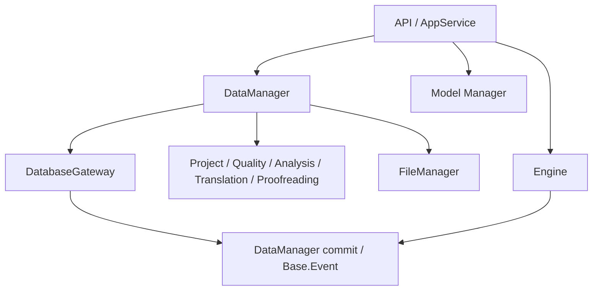
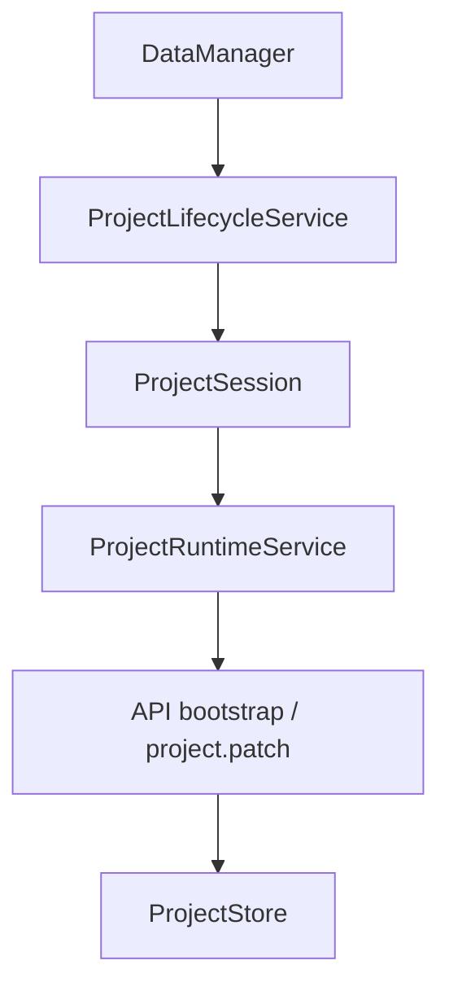
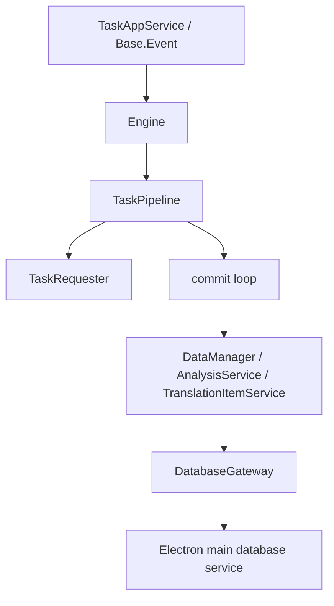
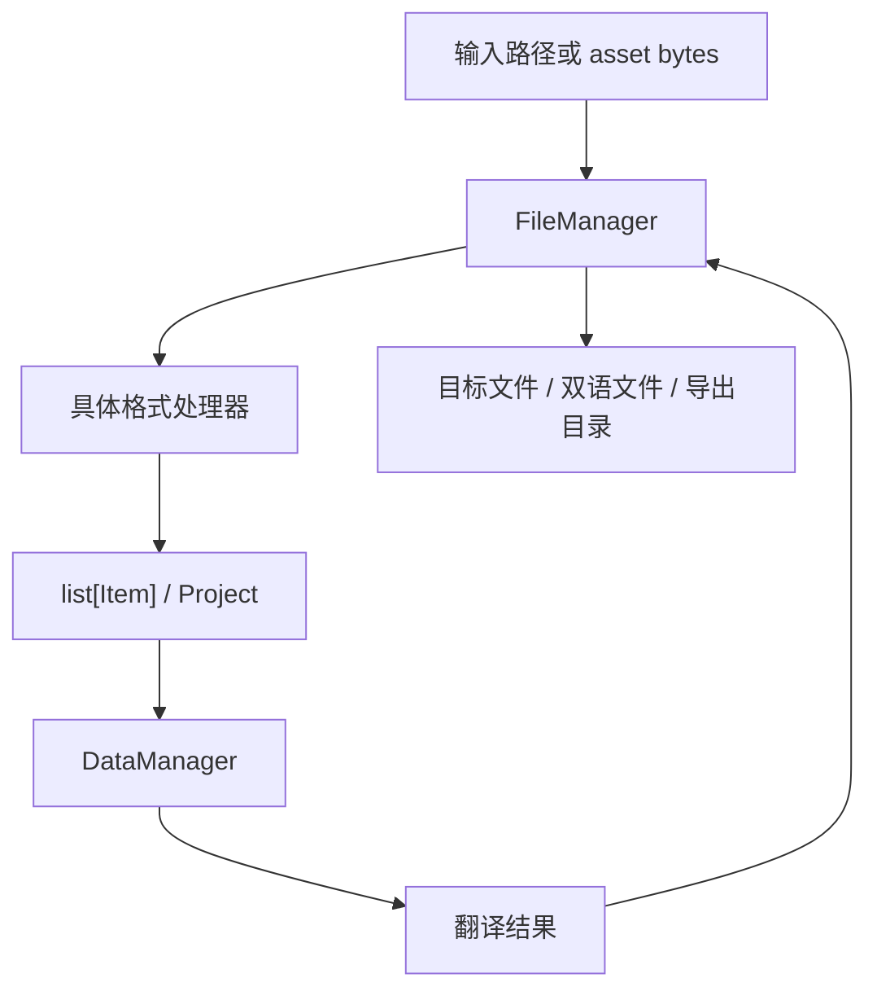

# LinguaGacha 数据域文档

## 一句话总览
LinguaGacha 的数据域由 Electron main TS API 编排层和已迁移页面写入口、Electron main Database Service 的 `.lg` 物理存储，以及 Python Core 的工程读侧 / 任务运行时共同协作。本文回答的不是目录长什么样，而是：`Data / Engine / File / Model` 分别拥有什么权威职责，项目级状态应该落在哪里，唯一写入口怎么判断，`.lg` 物理存储为什么只由 Electron main Database Service 持有，以及哪些非显然规则会影响未来维护。

## `Data / Engine / File / Model` 的职责边界

| 领域 | 权威入口 | 稳定职责 | 不该做什么 |
| --- | --- | --- | --- |
| `module/Data` | `DataManager.py` | 工程事实、规则、分析、翻译结果、校对辅助、项目运行态编码 | 不持有后台任务执行骨架，不散落 SQL |
| `module/Engine` | `Engine.py` + `TaskRunnerLifecycle.py` | 后台任务生命周期、请求调度、停止、重试、进度与终态语义 | 不持有工程真相，不直接定义 HTTP 壳 |
| `module/File` | `FileManager.py` | 文件格式分发、解析、资产读取、目标格式写回 | 不持有工程生命周期、事务与项目加载态 |
| `module/Model` | `Manager.py` + `Types.py` | 模型配置类型、模板补齐、分组排序、激活模型回退 | 不承载页面快照，不定义 API 响应壳 |

## 状态拥有者与唯一写入口

| 状态或语义 | 权威来源 | 唯一写入口或协调入口 |
| --- | --- | --- |
| 已加载工程、items、rules、meta、assets 缓存 | `ProjectSession` | `DataManager` 协调各领域 service |
| 工程创建、加载、卸载 | `Project/ProjectService.py`、`ProjectLifecycleService.py` | `DataManager` |
| 工作台文件集合与运行态编码 | `Project/ProjectFileService.py`、`ProjectRuntimeService.py` | `DataManager` |
| 设置、最近项目 | `frontend/src/main/settings` + `DATA_ROOT/userdata/config.json` | TS Gateway 调用 settings 服务 |
| 模型页 CRUD | `frontend/src/main/model` + `DATA_ROOT/userdata/config.json` | TS Gateway 调用 model 服务 |
| 质量规则、提示词页面 CRUD 与预设 IO | `frontend/src/main/quality` + `frontend/src/main/database/` | TS Gateway 调用 quality 服务；写入后通过内部 runtime bridge 清理 Python Core 缓存 |
| P2 项目同步 mutation | `frontend/src/main/project` + `frontend/src/main/database/` | TS Gateway 调用 project 服务；写入后通过内部 runtime bridge 清理 Python Core 缓存 |
| 规则、提示词运行时读取 | `Quality/*` | Python Core `DataManager` |
| 分析候选、checkpoint、分析结果 | `Analysis/*` | `DataManager` |
| 校对保存、校对 revision、重翻提交 | `Proofreading/*` 与 `Engine/Retranslate/*` | `ProofreadingAppService` 处理同步保存；重翻由 `TaskAppService` 启动 Engine 任务并回写数据层 |
| 全局忙碌态与实时请求数 | `Engine.status`、`request_in_flight_count` | `Engine` |
| 文件格式解析与写回 | `FileManager.py` | `module/File` |
| 模型列表整理、模板补齐、排序与默认回退 | `module/Model/Manager.py` | `module/Model` |

判断规则：
- 如果它是工程事实、规则、条目、分析结果、校对辅助或导出前持久化事实，优先判断是否属于 `module/Data`。
- 如果它是任务生命周期、请求节奏、停止与重试，属于 `module/Engine`。
- 如果它是格式识别、提取条目或写回目标文件，属于 `module/File`。
- 如果它是模型配置对象、模板选择、排序或激活模型回退，属于 `module/Model`。
- 如果它只是页面筛选、弹窗开关、表格交互态，不属于 Python Core，留在前端页面本地状态。

## `.lg` 物理存储唯一落点

- SQL、事务与 `.lg` 内 asset 读写只允许落在 `frontend/src/main/database/`；Zstd 压缩参数与压缩 / 解压工具只允许落在 `frontend/src/utils/zstd-tool.ts`；`.lg` 打开期 schema 与旧物理格式迁移统一落在 `frontend/src/main/migration/project-database-migration-service.ts`。
- Python Core 不直接导入 `sqlite3`，不理解 `.lg` 内压缩格式；只通过 `module/Data/Database/DatabaseGateway.py` 调内部 HTTP database workflow。
- `ProjectSession` 是会话状态容器，只保存当前工程路径、gateway handle 与业务缓存，不承担 SQL 或压缩细节。
- API 层不得直接持有 database handle，也不得直接持有 `ProjectSession`。
- 若某个新需求看起来需要“在 Python 里顺手写一条 SQL”，说明落点已经错了；database workflow 回到 `frontend/src/main/database/`，Zstd 参数化工具回到 `frontend/src/utils/zstd-tool.ts`，打开期迁移规则回到 `frontend/src/main/migration/`，再由 `DatabaseGateway` 暴露窄入口。

## 典型数据流

### 工程加载与运行态编码

稳定事实：
- `DataManager` 是工程级数据门面，负责会话、规则、分析、翻译、工作台事件与跨 service 编排。
- `ProjectRuntimeService` 负责把工程事实编码成 bootstrap block 与运行态 patch 可复用记录。
- `Config` 是应用设置权威；工程 meta 中的 `source_language`、`target_language`、`mtool_optimizer_enable` 与 `skip_duplicate_source_text_enable` 只是打开 / 新建时同步的项目镜像。
- 项目预过滤计算只在渲染层 runner / worker 中执行；Python 数据层只负责提供 create/open 草稿和事务化持久化前端提交的结果。
- 新建工程批量源路径由 `ProjectService` 统一归一、过滤和去重；目录源保留相对该目录的层级，文件源使用文件名，出现相对路径冲突时由稳定后缀保证资产路径唯一。
- `source_language`、`mtool_optimizer_enable` 或 `skip_duplicate_source_text_enable` 不一致 / 缺失会要求前端重跑预过滤；仅 `target_language` 不一致时只同步项目镜像，不重写 items。

### 后台任务与数据提交

稳定事实：
- `Engine` 负责执行骨架，`DataManager` 负责编排工程事实更新，真实落盘由 Database Service 完成。
- `TaskPipeline` 的 commit loop 是唯一允许生成 retry context 的地方。
- 停止语义是先切到 `STOPPING`，再由流水线与超时收尾，不是立刻中断网络 IO。
- 翻译任务终态只保存项目事实；译文文件写出属于用户确认后的显式导出动作，不挂在任务完成收尾上。

### 文件导入与导出

稳定事实：
- `FileManager.read_from_path()` 和 `parse_asset()` 是格式分发入口。
- `write_to_path()` 在 `DataManager.timestamp_suffix_context()` 内统一调用具体 writer。
- 输出路径规则由 `DataManager` 决定，具体 writer 只执行目标格式写回。

## 非显然规则速查

### 数据域
- `items.status` 只表达条目翻译事实，代码侧枚举为 `Base.ItemStatus`，当前有效集合为 `NONE / PROCESSED / ERROR / EXCLUDED / RULE_SKIPPED / LANGUAGE_SKIPPED / DUPLICATED`；打开旧 `.lg` 时会把 item `PROCESSED_IN_PAST` 持久化为 `PROCESSED`，把 item `PROCESSING` 持久化为 `NONE`。
- 工程忙碌态、任务按钮和任务进度由 `Engine.status`、任务事件与 `translation_extras` / `task` 运行态驱动；旧 `.lg` 中的 `meta.project_status` 只是历史字段，打开工程时保持原样。
- Python Core 路径只保留 `APP_ROOT` 与 `DATA_ROOT` 两个根概念；应用配置不是独立根，固定为 `DATA_ROOT/userdata/config.json`。
- P1 后应用设置、最近项目、模型页 CRUD 由 TS main 的 `settings/` 与 `model/` 服务读写 `DATA_ROOT/userdata/config.json`；Python Core 的 `Config`、`ModelManager`、模型 `list-available/test` runner 与任务消费仍保留为内部运行时能力，并通过 `/internal/runtime/sync` 刷新内存状态。
- P1 后质量规则与提示词页面 CRUD / 预设 IO 由 TS main 的 `quality/` 服务承载；`.lg` 写入仍只通过 Electron main `ProjectDatabase`，写入成功后由 `/internal/runtime/sync` 清理 Python Core 的 meta/rule/prompt 缓存，任务侧后续读取必须重新走 database。
- P2 后工作台文件写 mutation、项目设置对齐、translation reset、analysis reset 与 analysis glossary import 由 TS main 的 `project/` 服务承载；Python Core 保留解析、reset preview、bootstrap、任务、导出和运行态读取，收到 `project_data_changed` 后按 section 清理 meta/items/assets/rules 缓存，其中 files/items/analysis/quality/project 变动都会让 meta cache 失效，工作台文件写 mutation 仍复用 Python Core 文件操作锁。
- 分析候选导入术语的预演和筛选属于前端 planner；Python 数据层保留候选聚合、候选数缓存和分析结果持久化。
- `translation reset` 与 `analysis reset` 属于同步 mutation，不是后台任务链路。
- 校对 `save-item`、`save-all`、`replace-all` 属于同步 mutation；重翻通过 `/api/tasks/start-retranslate` 进入任务型链路，Engine 持有任务生命周期与 `retranslating_item_ids`，批次提交再回写数据层与 `project.patch`。

### 迁移入口

| 场景 | 迁移入口 | 保持在原领域的内容 |
| --- | --- | --- |
| 启动期 userdata/config/preset 布局升级 | `module/Migration/UserDataMigrationService.py` | 配置读写仍由 `Config` 与路径 resolver 提供权威路径 |
| `.lg` 打开期 schema、asset sort_order 与 item 状态升级 | `frontend/src/main/migration/` | `database` 只在打开工程时编排迁移，Python 只看到迁移后的 gateway 读写结果 |
| 工程加载期 meta/rule 旧字段升级 | `module/Migration/ProjectMetaMigrationService.py`、`module/Migration/ProjectRuleMigrationService.py` | `ProjectLifecycleService` 只维持加载时机、cache 刷新和清理 |
迁移目录只承接会写回旧 userdata、旧配置事实或 `.lg` 打开期旧物理格式的行为；`.lg` schema 与旧物理格式读取兼容留在 Electron main 内部，具体规则统一放在 `frontend/src/main/migration/project-database-migration-service.ts`。payload 归一和文件格式 fallback 保留在原领域，例如 `Item/DataManager` 的状态边界归一，以及 EPUB/RenPy/TRANS writer fallback 都不是迁移入口。

### 引擎域
- `Engine.status` 是全局忙碌态的唯一权威来源，翻译与分析不会并行运行。
- `request_in_flight_count` 表示“真正发出去的请求数”，不是限流器上限，也不是队列长度。
- `TRANSLATION_PROGRESS` 与 `ANALYSIS_PROGRESS` 在事件总线中按字段合并最新进度；实时请求数这类单字段补丁不能覆盖同批次里的行数、token、耗时等完整快照。
- 对 API / 前端暴露的终态仍由桥接层解释为 `DONE / ERROR / IDLE`。

### 文件域

| 场景 | 当前规则 |
| --- | --- |
| `.xlsx` 解析 | `parse_asset()` 显式先试 `WOLFXLSX` 再回退 `XLSX`；整目录读取时两个 reader 都会遍历 `.xlsx`，再由 `XLSX.read_from_stream()` 主动跳过 WOLF 表头完成分流 |
| `.json` 解析 | 先尝试 `KVJSON`，返回空条目时再回退到 `MESSAGEJSON` |
| `.trans` | 会按 `project.gameEngine` 二次分发到不同处理器 |
| EPUB 写回 | 所有条目都带 `extra_field.epub.parts` 时走 AST writer，否则统一走 legacy writer |
| EPUB ruby 清理 | 文件层只在叶子 block 的 `extra_field.epub.ruby_clean_candidate` 记录可清理结构候选；是否启用由 `TextProcessor` / `RubyCleaner` 按 `Config.clean_ruby` 决定，写回层在候选启用后可走块级写回并让双语原文保留原始 `<ruby>/<rt>` |

### 模型域
- `module/Model/Manager.py` 是模型列表整理、分组排序、模板补齐和激活模型回退的唯一规则入口。
- 内置模型预设固定读取 `resource/model/preset` 单套资源，UI 语言切换不改变模型预设集合，也不会把现有 `PRESET` 模型改写成自定义模型。
- 新增模型供应商或模板时，优先扩展 `ModelType`、模板映射和预设资源，不把分支散到调用方。

## 新状态应归属哪里的判断规则

| 你想新增的东西 | 优先归宿 | 说明 |
| --- | --- | --- |
| 工程级持久化事实、revision、条目状态、规则快照 | `module/Data` | 由 `DataManager` 协调，必要时下沉到具体 service |
| 后台任务执行态、并发节奏、停止请求、重试队列 | `module/Engine` | 保持任务语义集中 |
| 文件解析中间态、写回兼容逻辑、格式判定顺序 | `module/File` | 保持格式规则集中 |
| 模型配置字段、模板选择、排序与默认回退 | `module/Model` | 保持模型配置语义集中 |
| 页面筛选、弹窗开关、局部交互状态 | 前端页面本地状态 | 不进入 Python Core |

红线：
- 不要把新的项目级状态顺手塞进 `DataManager`，先判断它是不是某个领域 service、更底层会话容器，或者根本应留在前端。
- 不要把新的 SQL 或事务逻辑放到 `frontend/src/main/database/` 之外；不要把 `.lg` 打开期迁移规则放到 `frontend/src/main/migration/` 之外。
- 不要把共享任务语义写回 `module/Data`，也不要把工程事实塞进 `module/Engine`。

## 什么时候必须更新本文

- `Data / Engine / File / Model` 的职责边界变化
- `DataManager`、`ProjectSession`、`Engine.status`、`FileManager`、`Manager.py` 的权威入口变化
- `.lg` 物理存储落点、文件格式分发优先级、模型模板规则变化
- 同步 mutation、任务终态或工程事实流向变化
