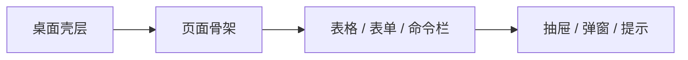
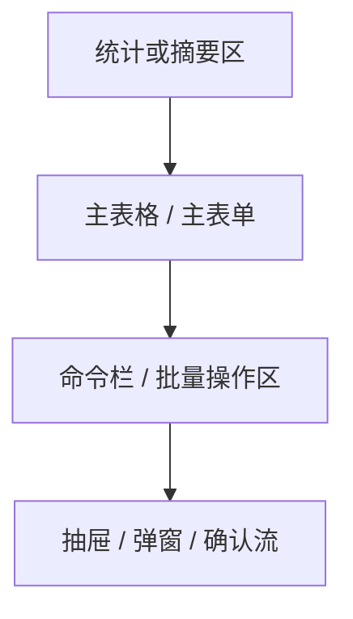

# LinguaGacha DESIGN.md

## 1. 设计定位

LinguaGacha 的前端是桌面工作台，不是宣传页。长期设计文档只回答三件事：界面应当看起来像什么、稳定样式语义由谁定义、页面新增时优先复用哪套骨架。

- 整体气质是暖灰中性底色、克制圆角、轻边框与轻阴影。
- 主强调色服务于关键操作、选中轨道和重点数据，不承担大面积铺色。
- 页面首屏直接进入可操作区域，优先面板、表格、工具栏和设置行，不使用营销式 hero、插画大横幅或装饰型首页。
- 亮色与暗色共享同一套语义层级，不为暗色主题再造一套并行品牌语言。

## 2. 设计权威来源

| 关注点 | 权威来源 | 说明 |
| --- | --- | --- |
| 全局视觉 token、主题语义、组件基础表面 | `frontend/src/renderer/index.css` | 具体颜色、圆角、阴影、间距和 `--ui-*` token 以这里为准 |
| 应用壳层与布局节奏 | `frontend/src/renderer/app/shell/*` | 标题栏、侧栏、工作区边界和壳层过渡 |
| 页面骨架与页面级样式 | `frontend/src/renderer/pages/*/page.tsx` + 页面 CSS | 页面级布局、区块组织和局部工作流 |
| 稳定组合组件语言 | `frontend/src/renderer/widgets/*` | `app-table`、`command-bar`、`setting-card-row` 是最重要的视觉样本 |
| 长期文案语义 | `frontend/src/renderer/i18n/` | 持久文案不直接硬编码在组件体内 |

规则：
- 具体 token 数值、组件 slot 样式和尺寸细节以代码权威源为准，本文不重复抄录代码表面事实。
- 新视觉语义优先复用现有 token；只有已经无法表达时，才回到 `index.css` 扩充语义变量。

## 3. 稳定视觉语言

### 3.1 色彩与层次

- 主背景保持暖灰或炭黑系中性表面，避免冷蓝主导的“控制台”观感。
- 主强调色是金棕系，用于关键 CTA、局部高亮、状态轨道和重点统计。
- `accent`、`muted` 一类轻表面承担 hover、selected、分层与占位，不用高饱和颜色抢主线。
- 局部功能色可以存在，但只服务明确场景，不能上升为全局品牌语言。

### 3.2 排版与信息密度

- 字体延续当前界面字体栈与轻微 monospace 气质，不引入新的展示型品牌字体。
- 标题短、直白、任务导向；说明文字控制在辅助层，不堆营销式副标题。
- 信息密度允许偏高，但必须保持扫描效率，尤其是表格、设置页和工作流命令区。
- 数字、进度、行号、路径等密集信息优先保持稳定对齐感。

## 4. 页面骨架与布局

### 4.1 壳层骨架

- 应用壳层遵循标题栏 + 侧栏 + 主工作区的桌面工具布局。
- 侧栏、标题栏和工作区的视觉关系以 `app/shell/*` 为准，页面不要绕过壳层自己重做一套应用 chrome。
- 工作区是开放式操作面，不把整页包进一张大卡片。

### 4.2 页面组织

默认优先复用下面这条骨架：

- 复杂页面优先采用“统计区 + 主表格或主表单 + 命令栏”。
- 详情、确认、停止、重译等次级流程优先进抽屉或弹窗，不在页面中再造第二套骨架。
- 页面滚动由工作区承担，避免多层竞争滚动。
- 桌面端优先横向利用空间，但不能牺牲主表格、设置行和命令栏的可扫描性。

## 5. 组合组件语言

| 组件 | 稳定职责 | 设计规则 |
| --- | --- | --- |
| `app-table` | 主数据承载面 | 新的数据页优先复用这套表格语言，而不是重新设计一张“业务专用表” |
| `command-bar` | 页面操作组织层 | 用来表达页面能做什么，不承担品牌装饰 |
| `setting-card-row` | 设置页和检查页的标准行骨架 | 每行只承载一个意图，标题短、说明短、动作明确 |
| `page-shell` 及页面局部骨架 | 页面分区与节奏 | 新页面先套现有骨架，再决定是否需要抽新 widget |

规则：
- `widgets/` 只收口跨页面稳定组合层；页面私有视觉语言留在对应 `pages/*`。
- `shadcn/` 只放基础组件源码与项目内定制，不混入业务组合组件。
- 新组件若改变了表格、命令栏、设置行这类长期样本的视觉语义，先更新本文，再落代码。

## 6. 交互与反馈

- 状态变化优先使用浅表面、边框、选中轨道和轻位移，不依赖发光、重阴影、夸张缩放或强弹簧。
- 层次组织优先级是：表面色变化 > 边框 > 阴影；浮层阴影只留给抽屉、弹窗、提示层。
- 拖拽区、告警、确认框等特殊交互沿用现有组件语义，只按主题 token 调整，不另起装饰体系。
- 所有可点击区域都要有明确 hover / focus-visible 状态，但反馈节奏保持克制，符合长时间桌面使用场景。

## 7. 样式归属边界

- `index.css` 只承载全局 token、主题变量、跨页面基础表面和第三方运行时皮肤。
- 页面私有样式放在页面目录并由页面入口导入。
- widget 私有样式由 widget 自己维护，不把页面语义回写到全局。
- 具体像素尺寸、slot 结构和 token 值属于代码权威源；本文只保留未来维护时必须先知道的语义边界。

## 8. 页面模式

| 页面类型 | 首选结构 | 备注 |
| --- | --- | --- |
| 项目首页 | 导入入口 + 最近项目 + 格式说明 | 是工作流起点，不是欢迎页 |
| 工作台页 | 统计区 + 主表格 + 命令栏 | 是产品设计语言的主样本 |
| 设置页 / 质量页 | 纵向设置行或规则面板 | 优先保证扫描效率和状态清晰 |

## 9. 什么时候必须更新本文

- 主题 token 的语义层级变化，导致现有“暖灰中性底 + 金棕强调”的主线失真。
- 壳层结构、页面骨架或稳定组合组件语言变化。
- 新增一条会被多个页面长期复用的设计规则，而这条规则无法仅靠看组件代码快速得出。

如果改动只涉及某个页面的局部布局、具体数值或短期实验样式，而没有改变长期语义边界，就不要为了显得勤快来改本文。

## 10. 设计自检

- 这是不是桌面工作台，而不是宣传页或消费级卡片流。
- 新页面是否优先复用了壳层、表格、设置行、命令栏这些既有样本。
- 亮色与暗色是否仍在共享同一套语义，而不是各自长出独立风格。
- 长期文案是否仍放在 `i18n/`，而不是悄悄写死在组件里。
- 这次改动沉淀的是长期设计规则，还是只是代码层面的尺寸和样式细节。
