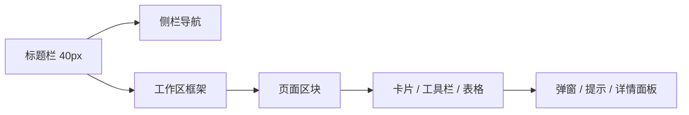

# LinguaGacha DESIGN.md

## 1. 视觉主题与整体气质

LinguaGacha 前端不是营销型网站，而是桌面端、高密度、任务驱动的工程工具。界面应当传达以下气质：

- 温暖中性的底色，不走冷冰冰的纯技术蓝灰路线
- 金棕色作为主强调色，表达“高级工具”而不是“高饱和娱乐产品”
- 以面板、工具栏、表格、侧栏构成主界面，不使用 hero、插画大横幅或装饰型着陆页
- 信息密度高，但留出稳定呼吸位，避免视觉挤压
- 圆角克制，边框和阴影轻量，交互反馈以内敛的底色变化和选中轨道为主
- 支持亮色与暗色主题，两套主题保持同一套语义，不重新发明第二种品牌语言



## 2. 设计权威来源

| 层级 | 权威来源 | 说明 |
| --- | --- | --- |
| 全局颜色、阴影、圆角、间距 token | `frontend/src/renderer/index.css` | 所有新视觉语义优先复用这里的 `--ui-*` 与主题变量 |
| 壳层结构 | `frontend/src/renderer/app/shell/*` | 标题栏、侧栏、工作区边框与过渡节奏 |
| 页面节奏 | `frontend/src/renderer/pages/*/page.tsx` + 页面 CSS | 页面级布局、分区方式、统计卡和工作流形态 |
| 组合组件样式 | `frontend/src/renderer/widgets/*` | `app-table`、`command-bar`、`setting-card-row` 是最稳定的界面语言样本 |
| 文案语义 | `frontend/src/renderer/i18n/` | 长期文案不直接硬编码进组件体 |

## 3. 色彩系统

### 3.1 核心调色板

| 语义 | 亮色 | 暗色 | 用途 |
| --- | --- | --- | --- |
| `background` | `#f8f7f7` | `#121212` | 应用主背景 |
| `foreground` | `#282522` | `#eceae7` | 默认正文与主图标 |
| `card` | `#fefdfe` | `#191919` | 卡片、面板、浮层表面 |
| `primary` | `#b8892f` | `#c9aa92` | 主强调色、关键状态、局部高亮 |
| `primary-foreground` | `#f9f2ec` | `#33241d` | 主强调色上的文字 |
| `secondary` | `#f1efed` | `#222222` | 次级按钮、轻表面 |
| `muted` | `#efedec` | `#202020` | 次级背景、占位区域 |
| `muted-foreground` | `#7b7670` | `#b8b4af` | 辅助说明文字 |
| `accent` | `#ebe9e7` | `#252525` | hover、选中底层染色 |
| `border` | `#dddad6` | `#323232` | 卡片和输入边框 |
| `sidebar` | `#f5f4f2` | `#161616` | 侧栏语义背景 |
| `success` | `#22c55e` | `#4ade80` | 成功态、通过态 |
| `warning` | `#f97316` | `#fb923c` | 警告态、注意态 |

### 3.2 色彩使用规则

- 主色只用于关键操作、选中轨道、强调数据和局部说明，不大面积铺满页面
- `accent` 与 `muted` 优先承担 hover、选中背景、分隔层次，不用更高饱和色抢戏
- 页面允许出现局部功能色，例如项目页拖拽区的蓝 / 紫提示，但它们是场景色，不是全局品牌色
- 亮色主题偏纸面与暖灰，暗色主题偏炭黑与暖白，两者都应保留“温润工具感”
- 禁止新增霓虹渐变、发光描边、彩虹色数据可视化，除非页面语义明确要求

## 4. 字体与排版

### 4.1 字体栈

全局字体栈：

```text
LGMono, LGBaseFont, Segoe UI, Microsoft YaHei UI, PingFang SC, system-ui, sans-serif
```

设计上应理解为：

- 默认界面字体带轻微 monospace 气质，但仍可用于中文长文和设置界面
- 不引入新的品牌展示字体
- 不通过极端字重和夸张字距制造“海报感”

### 4.2 字号层级

| 场景 | 建议字号 | 行高 | 说明 |
| --- | --- | --- | --- |
| 标题栏品牌、侧栏一级标签、卡片标题 | `14px` | `1.2` - `1.25` | 工作台常用标题密度 |
| 页面正文、表格正文、普通按钮 | `14px` | `1.4` - `1.5` | 默认阅读层 |
| 辅助说明、表单说明、命令栏提示 | `12px` | `1.4` | 低对比信息层 |
| 统计数值 | `42px` | `1` | 只用于工作台关键指标 |

### 4.3 排版规则

- 正文默认使用常规字重，标题使用 `medium` 即可，不堆叠粗体层级
- 默认不扩展夸张字距；若复用现有统计大数字风格，可沿用其紧凑表现，但不要扩散到普通标题
- 数字密集区域优先使用等宽感更强的排法，尤其是行数、进度、文件列表
- 标题通常短、直白、任务导向，不写营销式副标题

## 5. 布局原则

### 5.1 应用壳层

UI 是典型桌面工具布局：

- 顶部 `40px` 透明标题栏
- 左侧可折叠导航栏
- 右侧主工作区带轻边框与圆角入口
- 页面内部采用纵向堆叠区块，区块之间以稳定间距组织

### 5.2 间距与尺寸尺度

| 语义 | 稳定值 | 用法 |
| --- | --- | --- |
| 页面内边距 | `16px` | 工作区四周默认留白 |
| 页面区块间距 | `16px` | 页面主层级间距 |
| 致密区块间距 | `12px` | 表格上方统计区、密集设置区 |
| 卡片内边距 | `16px` | 普通卡片、设置行 |
| 面板内边距 | `24px` | 更重的内容面板 |
| 工具栏高度 | `56px` | 命令栏、操作条 |
| 工具按钮高度 | `36px` | 工具栏按钮 |
| 表格头高 | `36px` - `42px` | 表头容器与头部感知高度 |
| 表格行高 | `39px` 左右 | 主列表默认密度 |

### 5.3 布局约束

- 页面优先是“工具面”而不是“故事面”，首屏直接进入可操作区域
- 不把整页包进一张大卡片；页面是带约束宽度的开放工作区，卡片只服务于局部模块
- 常见结构是“统计区 + 主表格 / 主表单 + 底部命令栏”
- 页面滚动由工作区自身承担，不制造多层冲突滚动
- 桌面端优先横向利用空间，但保留稳定的最小可用宽度

## 6. 组件样式规范

### 6.1 标题栏

- 标题栏透明，借背景渐层自然融入整体壳层
- 左侧主按钮是 `32px` 图标按钮，圆角 `8px`
- 品牌信息保持小而稳，像应用 chrome，不像页面标题
- hover 仅做浅色底衬，不做高亮描边或发光

### 6.2 侧栏导航

- 侧栏本体透明，不做独立厚重底板
- 一级导航高度约 `38px`，二级导航高度约 `36px`
- 激活态核心语言是左侧细选中轨道 + 浅层背景染色
- 一级项与二级项都保持直角或近似直角，不使用大胶囊按钮
- 折叠 / 展开通过宽度、文字显隐、箭头旋转完成，动画克制顺滑

### 6.3 页面卡片与面板

- 卡片圆角以 `4px` 为主，按钮圆角以 `8px` 为主
- 表面色通过 `card` 与 `background` 的轻混合形成层次，不直接堆纯白或纯黑
- hover 更偏向边框和阴影轻微增强，而不是整体抬升或缩放
- 面板可承载完整模块，但不要层层套娃

### 6.4 设置行

参考 `setting-card-row`：

- 标题 `14px`
- 描述 `12px`
- 标题与描述纵向紧凑堆叠
- 右侧操作区固定为约 `128px`
- 强调文字直接借用主色，不额外引入新的强调体系

### 6.5 表格

参考 `app-table`：

- 使用固定列布局与虚拟滚动友好的结构
- 表头有独立浅表面与轻边框
- 行背景允许极轻 zebra 交替，但幅度要非常克制
- hover、selected、active 都基于浅层底色变化
- 选中态通过左侧细色轨强化，不依赖粗描边
- 拖拽列、操作列、行号列尽量居中；文件名和正文列保持左对齐
- 表格是主数据页面最强的信息密度载体，任何新增数据页面优先复用这一套视觉语言

### 6.6 命令栏

参考 `command-bar`：

- 高度固定，承担“页面能做什么”的明确表达
- 左侧操作组可换行，右侧提示信息弱化处理
- 分组之间用细分隔线，不用实心大块背景切割
- 命令栏是操作组织层，不是品牌装饰层

### 6.7 特殊交互组件

- 拖拽落区使用 `2px` 虚线边框与主色轻底，不使用强发光效果
- 提示、告警、确认框应沿用 shadcn 基础组件，但表面色和边框色继续服从主题变量
- 详情抽屉与确认弹窗优先强调任务语义和层级清晰，不做炫技式转场

## 7. 深度、边框与阴影

前端不是“纯平无层次”，而是用很轻的阴影和边界区分语义层：

- 默认卡片阴影轻，面板阴影略重，表格和工具栏有独立阴影组
- 主要层次手段顺序为：表面色变化 > 边框 > 阴影
- overlay 阴影只用于浮层、弹窗、详情面板，不扩散到普通卡片
- 阴影应服务于分层，而不是制造漂浮感

## 8. 动效与交互节奏

### 8.1 推荐时长

| 类型 | 时长 | 说明 |
| --- | --- | --- |
| 颜色、透明度变化 | `180ms` | hover、选中、可用性变化 |
| 轻位移 / 轨道形变 | `220ms` | 选中轨道、按钮按压 |
| 结构变化 | `260ms` | 侧栏折叠、子项展开、标签显隐 |

### 8.2 交互原则

- 优先用颜色、透明度、轻位移表达状态变化
- 避免夸张弹簧、过度缩放、炫光、粒子感反馈
- 可点击区域必须有明确 hover / focus-visible 状态
- 顶层交互节奏平稳、连续，符合桌面工具长时间使用场景

## 9. 页面模式

### 9.1 项目首页

项目首页不是欢迎页，而是启动工作流的桌面入口：

- 左右或分区式布局承载导入源文件、打开项目、最近项目、格式说明
- 拖拽区是核心入口，虚线边框与轻功能色只用于引导，不应扩展成全局风格
- 最近项目区保持工具化列表体验，悬停时才逐步暴露次级操作

### 9.2 工作台页

工作台是最能代表产品设计语言的页面：

- 顶部为关键统计卡
- 中部为主数据表格
- 底部为命令栏
- 详情、停止、确认等次级流程通过抽屉或弹窗承接

新增复杂页面时，优先复用这个组织方式，而不是重新发明内容骨架。

### 9.3 设置页与质量页

- 以纵向设置卡片行为主
- 每一行只解决一个明确设置意图
- 标题短、说明短、动作明确
- 页面本身不需要夸张视觉重音，重点是扫描效率和稳定阅读

## 10. Do 与 Don't

### 10.1 Do

- 用暖灰 + 金棕主色体系组织新界面
- 保持桌面工具式信息密度，优先服务真实工作流
- 复用 `page-shell`、`setting-card-row`、`app-table`、`command-bar` 的视觉语义
- 让状态变化通过浅表面、细边框和选中轨道表达
- 让亮色与暗色主题共享同一套布局和语义

### 10.2 Don't

- 不做营销首页、巨幅 hero、插画主视觉、宣传卡片瀑布流
- 不引入新的主品牌色，不把蓝紫等局部功能色提升为全局语言
- 不把导航、按钮、表格行做成圆滚滚的大胶囊
- 不叠加厚重阴影、强描边、玻璃拟态、霓虹发光或大面积渐变
- 不在同一页面里混用两套不同密度和不同圆角哲学
- 不把长期文案直接写死在组件实现里

## 11. 响应式与密度策略

代码是桌面优先设计，扩展时遵循以下策略：

- 先保证桌面端稳定，再考虑窄宽度退化
- 侧栏可折叠到 icon 模式，但主工作区的工具属性不能消失
- 命令栏在窄宽度下允许换行，但操作分组关系不能被打散
- 统计卡、设置行、表格列宽要优先保证信息不重叠
- 移动端不是首要目标；若必须适配，应保留桌面工具感，而不是改写成消费级卡片流

## 12. 设计自检

只要新页面、新组件或样式改动偏离“暖灰金棕、桌面工具化、高密度、低装饰、表格与面板优先”这条主线，就应该回到上文重新确认权威来源与骨架语言。

- 这是不是工作台，而不是宣传页
- 主色有没有被滥用成大面积铺色
- 圆角是不是依旧克制
- 信息密度高时是否仍然清晰可扫读
- 是否优先复用了现有组合组件与主题 token
