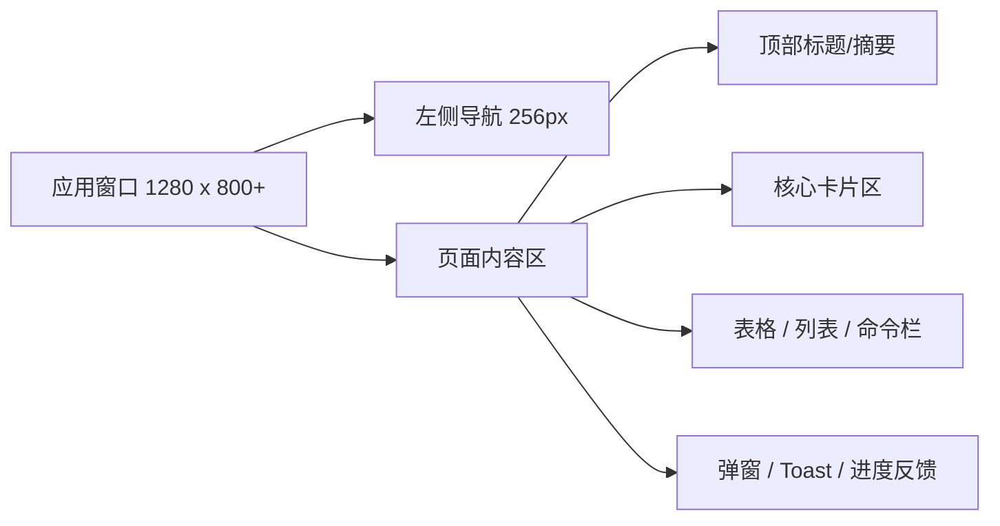
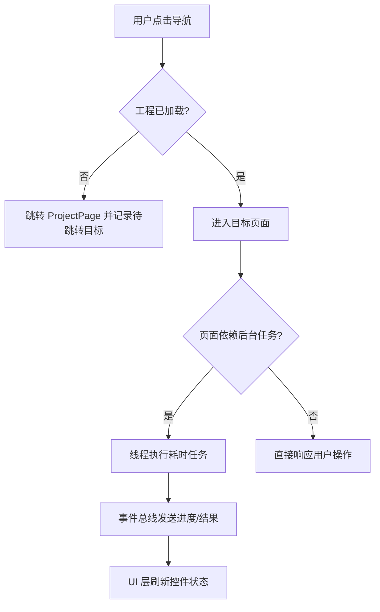

# LinguaGacha 设计系统说明

## 一句话总览
LinguaGacha 的界面不是展示型官网，而是面向长时间翻译、校对、分析和项目管理的桌面工作台：整体基于 QFluentWidgets 的 Fluent 骨架，用克制的暖金强调色、稳定的卡片节奏和明确的状态映射，让用户在高频任务中保持低认知负担。

## 1. 设计目标与适用范围
本文件参考 `awesome-design-md` 的写法整理，但内容只服务于 LinguaGacha 自身，主要约束以下对象：

| 范围 | 说明 |
| --- | --- |
| 桌面应用界面 | 包括导航、页面、卡片、表格、弹窗、Toast、进度反馈 |
| 新增页面与组件 | 新功能默认遵循本文的布局、色彩、层级和状态规则 |
| 设计决策入口 | 本文负责讲“LinguaGacha 整体应该长什么样”；单次方案取舍继续沉淀到 `docs/design/*.md` |
| Agent / AI 生成界面 | 用于约束后续由 Agent 辅助生成的页面结构与视觉语言 |

设计目标固定为四条：
- 任务优先：先让用户明确“当前项目、当前阶段、当前是否可操作”。
- 稳定优先：避免花哨视觉抢走注意力，所有强调都必须有业务含义。
- 桌面优先：默认工作窗口最小尺寸为 `1280 x 800`，主要为宽屏任务流设计。
- 主题一致：亮色与暗色主题共享同一结构语言，只调整明度、对比度和表意色的落点。

## 2. 视觉基调与氛围
LinguaGacha 的理想气质不是“赛博炫技”，而是“安静、可信、能持续工作很久”的翻译工作台。它继承 Fluent 的清爽壳层，但通过暖金主强调色和成组卡片，把工具感从“系统设置面板”拉回“有温度的创作工作区”。

核心气质可以概括为：
- 稳定的侧边导航：页面切换应当像在同一个工程空间里移动，而不是不断进入新场景。
- 克制的品牌存在：品牌色只用于焦点、强调和局部装饰，不大面积铺满背景。
- 信息密度可控：翻译工具一定会变复杂，所以需要用卡片、间距和标题层级把复杂度切片。
- 状态先于装饰：成功、警告、忙碌、禁用、未加载工程，这些状态必须比“好看”更先被看见。

**关键特征：**
- Fluent 风格的桌面导航壳层，左侧展开导航是全局骨架。
- 暖金主强调色 `#BCA483` 作为品牌锚点，而不是大面积品牌背景。
- 页面普遍采用 `24px` 外边距、`8px ~ 12px` 内容间距、`4px ~ 8px` 温和圆角。
- 卡片是第一层组织单元，表格和命令栏是第二层操作单元，弹窗和 Toast 是第三层反馈单元。
- 亮暗主题共用同一套布局与语义色，不重新发明一套视觉语言。

## 3. 色彩体系与角色
LinguaGacha 已经在代码中沉淀出一套“品牌色 + 语义色 + 提供商识别色”的分工，新增界面应直接沿用，不要重新发明颜色含义。

### 主色与中性色

| 颜色角色 | 色值 | 用途 | 现有来源 |
| --- | --- | --- | --- |
| 品牌主强调 | `#BCA483` | 全局主题色、选中态、焦点感、品牌识别 | `frontend/AppFluentWindow.py` |
| 次级说明文本-亮色 | `rgb(96, 96, 96)` | 描述、副标题、弱化说明 | `FlowCard`、`SettingCard` 等 |
| 次级说明文本-暗色 | `rgb(160, 160, 160)` | 暗色主题下的说明文字 | `FlowCard`、`SettingCard` 等 |
| 统计单位-亮色 | `rgba(0, 0, 0, 0.45)` | 次级元信息、单位标签 | `WorkbenchPage.StatCard` |
| 统计单位-暗色 | `rgba(255, 255, 255, 0.55)` | 暗色主题下的元信息 | `WorkbenchPage.StatCard` |

说明：
- 中性色优先依赖 QFluentWidgets 的默认文本层级与系统主题，不要在普通文本里随意写死颜色。
- 只有在“需要跨主题保持一致语义”的位置，才允许像现有代码这样通过 `setTextColor()` 显式给出亮暗两套值。

### 语义状态色

| 颜色角色 | 色值 | 用途 | 约束 |
| --- | --- | --- | --- |
| 成功 / 已完成 | `#22C55E` | 已翻译量、成功状态、正向完成反馈 | 只用于正向结果，不用于品牌装饰 |
| 警示 / 未完成 | `#F59E0B` | 未翻译量、提醒、需要继续处理的状态 | 不与错误混用 |
| 信息 / 可继续 | 蓝系 | 可用于信息提示、普通状态标签 | 优先复用现有组件默认样式 |
| 错误 / 危险 | 红系 | 删除、失败、不可恢复错误 | 只在高风险动作或错误反馈使用 |

### 领域识别色
这类颜色不是全局品牌色，而是用于帮助用户快速识别“当前内容属于哪一类模型或任务”。

| 领域 | 色值 | 现有来源 |
| --- | --- | --- |
| 预设模型 | `#6B7280` | `frontend/Model/ModelPage.py` |
| Google 模型 | `#4285F4` | `frontend/Model/ModelPage.py` |
| OpenAI 模型 | `#10A37F` | `frontend/Model/ModelPage.py` |
| Anthropic 模型 | `#D97757` | `frontend/Model/ModelPage.py` |

规则：
- 领域识别色只出现在局部装饰条、标签、数字强调等位置。
- 领域识别色不能抢走全局品牌主色的控制权。
- 同一页面中若同时出现多个品牌色，必须借助卡片边界和标题把它们分组，避免彩色噪声。

## 4. 排版规则
LinguaGacha 是多语言桌面工具，不适合依赖个性化网页字体。排版策略应当优先保证中文、英文、日文、韩文混排的稳定性，再追求个性。

### 字体策略
- 默认沿用 QFluentWidgets / 系统 UI 字体栈，不引入额外品牌字体作为强依赖。
- 用户长时间阅读的正文、配置说明、任务描述都以稳定清晰为第一优先级。
- 只有代码、模型 ID、路径、技术标签等信息，才使用等宽字体语义。

### 推荐层级

| 角色 | 建议控件 / 语义 | 用途 |
| --- | --- | --- |
| 页面标题 | `TitleLabel` / 等级更高标题控件 | 页面主标题、核心区块入口 |
| 卡片标题 | `StrongBodyLabel` | 卡片名、分组名、重点模块标题 |
| 正文 | `BodyLabel` / 默认文本 | 操作说明、说明文案、配置说明 |
| 说明文字 | `CaptionLabel` | 副标题、弱化解释、辅助信息 |
| 数值强调 | 大字号 `StrongBodyLabel` | 工作台统计数字、阶段指标 |
| 标签 / 元信息 | 小字号说明文本 | 文件类型、状态标签、路径摘要 |

### 文案原则
- 标题说“这里能做什么”，正文说“为什么要这样做”。
- 控件文案应短、直、可执行，避免营销语气。
- 同一视图里，标题层级不超过三级，避免一页出现太多抢眼文本。

## 5. 布局、间距与结构节奏
LinguaGacha 的布局不是网页分镜，而是桌面工作流。结构稳定感比视觉惊喜更重要。

### 全局骨架

### 现有节奏

| 维度 | 当前主流值 | 说明 |
| --- | --- | --- |
| 应用最小尺寸 | `1280 x 800` | 保证桌面任务页有足够横向空间 |
| 导航展开宽度 | `256px` | 全局信息架构的固定锚点 |
| 页面主边距 | `24px` | 大多数页面已采用 |
| 主区块间距 | `8px ~ 12px` | 页面内部常规垂直节奏 |
| 卡片内边距 | `16px` | `FlowCard`、`CommandBarCard` 等通用卡片已采用 |
| 常规圆角 | `4px` | 当前卡片家族的主流圆角 |
| 较柔和圆角 | `6px ~ 8px` | 输入框、项目卡片、局部容器 |

### 布局原则
- 页面内容默认左对齐，不做居中营销式排版。
- 优先使用“标题 + 说明 + 主操作区 + 辅助反馈区”的四段式结构。
- 一个页面先有一级卡片分组，再在卡片内部放按钮、表格、标签和二级说明。
- 高风险操作不要混在主操作区域里，应通过分隔、菜单或弹窗二次确认。

## 6. 组件风格

### 导航与外壳
- 以 [`frontend/AppFluentWindow.py`](../frontend/AppFluentWindow.py) 为唯一壳层入口。
- 左侧导航默认展开，说明这个产品更适合“持续停留与频繁切换”，不是单页沉浸式体验。
- 导航图标统一来自 [`base/BaseIcon.py`](../base/BaseIcon.py)，避免混入来源不一的图标风格。

### 卡片家族
- [`widget/FlowCard.py`](../widget/FlowCard.py) 与 [`widget/CommandBarCard.py`](../widget/CommandBarCard.py) 代表当前卡片基线。
- 默认 `4px` 圆角、`16px` 内边距、轻量标题 + 说明 + 内容结构。
- 如果需要强调分类，可使用 `4px` 宽的竖向装饰条，而不是整张卡片换成彩色底。

### 表格与工作台
- 工作台类界面优先采用“顶部指标卡 + 中部表格 + 底部命令栏”的三段结构。
- 指标卡里的颜色只能承担状态含义，如已完成与未完成，不能单纯为了好看上色。
- 表格区应维持工具属性，避免加过多装饰边框、复杂背景和无意义阴影。

### 按钮与命令操作
- 主按钮负责开始当前阶段最重要的动作。
- 次按钮与菜单按钮负责低频、次级、批量或危险操作。
- 命令栏适合承载同一上下文中的一组相邻动作，不适合放解释性长文案。

### 弹窗、Toast 与进度反馈
- 轻量反馈走 `Toast / InfoBar`。
- 需要用户决策的动作走对话框。
- 长耗时动作必须有进度反馈，且通过事件总线回到 UI 层更新，不允许后台线程直接改界面。

## 7. 交互状态与行为约束
LinguaGacha 的设计重点不只是“长得像什么”，还包括“用户什么时候能点、点了会发生什么”。

### 状态优先级
1. 是否已加载工程。
2. 当前引擎是否忙碌。
3. 当前页面是否只读。
4. 当前操作是普通反馈、警示、还是危险操作。

### 行为规则
- 未加载工程时，依赖工程的数据页必须禁用或重定向到项目页。
- 页面如果需要等待后台任务，应展示明确的忙碌态，而不是让按钮继续可点。
- 后台线程只负责计算和 IO；任何 UI 刷新都通过 `Base.emit` / `Base.subscribe` 回到界面层。
- 组件之间通过事件交换 `id`、状态值或不可变快照，禁止跨模块共享可变对象引用。

### 典型流转

## 8. 主题、图标与本地化

### 主题
- 主题切换由 [`app.py`](../app.py) 与 [`frontend/AppFluentWindow.py`](../frontend/AppFluentWindow.py) 统一控制。
- 新组件必须同时检查亮色和暗色主题，不允许只在一种主题下可读。
- 不要直接写“亮色专用”的纯黑描边或“暗色专用”的纯白高光，优先复用主题感知 API。

### 图标
- 图标优先从 [`base/BaseIcon.py`](../base/BaseIcon.py) 取。
- 图标应承担导航、状态和动作提示，不承担复杂插画功能。
- 如果需要自定义配色，必须保证亮暗主题下都有足够对比度。

### 本地化
- 所有用户可见文案都必须从 `module/Localizer` 读取，禁止直接硬编码。
- 变更文案时，`LocalizerZH` 与 `LocalizerEN` 必须保持行数对齐。
- 文案语气应贴近工具界面：清楚、可执行、少歧义，不写空泛的产品口号。

## 9. Do 与 Don't

### Do
- 使用 Fluent 风格的壳层与卡片组织复杂任务。
- 使用 `#BCA483` 作为品牌锚点，把强调集中在真正重要的控件与状态上。
- 维持 `24px` 页面边距、`8px ~ 12px` 内容节奏、`16px` 卡片内边距这一组稳定比例。
- 让“未加载工程、忙碌、只读、危险操作”这些状态比视觉装饰更早被用户理解。
- 在局部分组中使用语义色或模型识别色，帮助用户快速扫描信息。
- 对亮色与暗色主题都做可读性验证。

### Don't
- 不要把整页刷成品牌色，也不要把品牌色当作大面积背景。
- 不要引入与 Fluent 风格差异过大的图标、阴影、拟物插画或网页 Hero 版式。
- 不要为了“有设计感”降低信息密度的可扫描性。
- 不要在普通正文里随意写死颜色或字号，优先复用现有控件层级。
- 不要让后台线程直接操作 UI。
- 不要硬编码任何用户可见文本。

## 10. Agent / AI 生成界面提示
后续如果让 Agent 为 LG 生成新页面、重构旧页面或补齐设计稿，应默认套用下面这组提示语言。

### 快速设计摘要
- 产品类型：基于 PySide6 / QFluentWidgets 的桌面翻译工作台，不是官网。
- 气质关键词：稳定、克制、可信、长时间可用。
- 全局主强调色：`#BCA483`。
- 基础布局：左侧展开导航 + 右侧内容工作区。
- 页面节奏：`24px` 外边距、`8px ~ 12px` 组间距、`16px` 卡片内边距、`4px ~ 8px` 圆角。
- 状态色：成功 `#22C55E`，警示 `#F59E0B`，模型识别色遵循既有定义。

### 示例提示词
- “为 LinguaGacha 设计一个新的任务页面。它是桌面工作台，不是营销页。使用左侧导航已有壳层，右侧内容区采用 `24px` 外边距、卡片式结构、`4px` 圆角和 `16px` 内边距。主强调色使用 `#BCA483`，只点缀关键按钮与选中态。”
- “设计一个工作台统计区，顶部使用 3 到 4 个数据卡片，数字可使用成功绿 `#22C55E` 与警示橙 `#F59E0B` 表达状态，但不要把整张卡片涂成高饱和颜色。”
- “设计一个模型分组卡片，使用竖向装饰条区分 Google、OpenAI、Anthropic 等模型来源，正文保持中性色，不要让多品牌色互相争抢。”
- “为一个需要后台任务的页面设计状态流：未加载工程时禁用关键区域，运行中显示进度反馈，完成后通过 Toast 或卡片状态刷新结果。”

### 迭代检查清单
1. 页面首先能否让用户看懂当前是否已加载工程。
2. 最重要的主操作是否足够突出，但没有喧宾夺主。
3. 颜色是否只承担品牌和状态语义，没有无意义装饰。
4. 亮暗主题下的说明文字、标签和禁用态是否仍然可读。
5. 文案是否全部可本地化，且没有写死到组件里。
