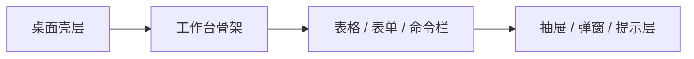
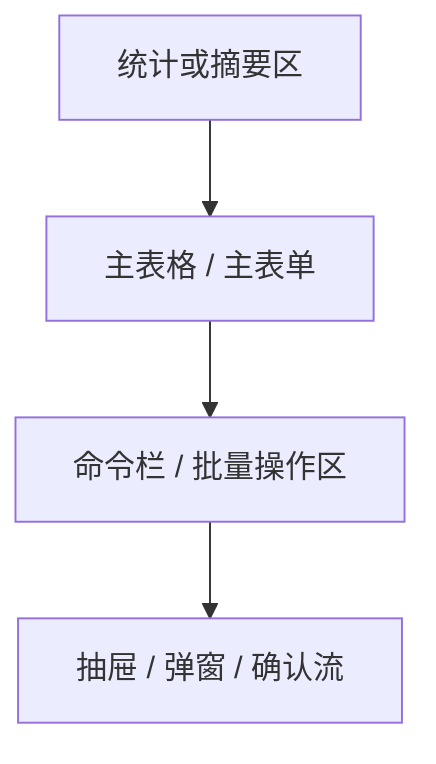

# LinguaGacha 设计文档

## 一句话总览
LinguaGacha 的前端是桌面工作台，不是宣传页。本文只保留会长期约束多个页面与组件的设计语义：产品气质是什么、视觉权威源在哪里、页面骨架如何组织、稳定组件语言如何复用，以及什么时候该把新规则沉淀进这里。

## 设计目标与产品气质

核心气质：
- 暖灰中性底色、克制圆角、轻边框、轻阴影，适合长时间桌面使用。
- 金棕主强调色只服务关键操作、选中轨道和重点统计，不承担大面积铺色。
- 页面首屏直接进入可操作区域，优先面板、表格、工具栏和设置行，不做营销式 hero、插画横幅或装饰型首页。
- 亮色与暗色共享同一套语义层级，不为暗色主题另造一套平行品牌语言。
- 新界面优先延续“桌面工具工作台”路线：高密度但可扫读、面板与表格优先、首屏直接进入可操作区域。

## 视觉 token 权威来源

| 关注点 | 权威来源 | 为什么写在这里 |
| --- | --- | --- |
| 全局视觉 token、主题语义、基础表面 | `frontend/src/renderer/index.css` | `--ui-*` 变量和全局表面语义以这里为准 |
| 应用壳层与布局节奏 | `frontend/src/renderer/app/shell/*` | 标题栏、侧栏、工作区边界的长期样本 |
| 页面骨架与页面级样式 | `frontend/src/renderer/pages/*/page.tsx` + 页面 CSS | 页面布局与局部工作流的真实落点 |
| 稳定组合组件语言 | `frontend/src/renderer/widgets/*` | `app-table`、`command-bar`、`setting-card-row` 是最重要的视觉样本 |
| 长期文案语义 | `frontend/src/renderer/i18n/` | 持久文案不直接硬编码在组件体内 |

权威源规则：
- 具体 token 数值、组件 slot 结构、像素尺寸以代码为准，本文不复述代码表面事实。
- 新视觉语义优先复用现有 token；只有现有语义无法表达时，才回到 `index.css` 扩充变量。

## 页面骨架与稳定组件语言

### 壳层骨架
- 应用壳层固定沿用标题栏 + 侧栏 + 主工作区的桌面工具布局。
- 页面不要绕过 `app/shell/*` 另做一套应用 chrome。
- 工作区是开放式操作面，不把整页塞进一张大卡片。

### 默认页面骨架

长期规则：
- 复杂页面优先采用“统计区 + 主表格或主表单 + 命令栏”。
- 详情、确认、停止、重译等次级流程优先进抽屉或弹窗，不在页面里再造第二套骨架。
- 页面滚动由工作区承担，避免多层竞争滚动。
- 桌面端优先横向利用空间，但不能牺牲表格、设置行和命令栏的可扫描性。

### 稳定组件语言

| 组件 | 稳定职责 | 设计含义 |
| --- | --- | --- |
| `app-table` | 主数据承载面 | 新的数据页优先复用这套表格语言 |
| `command-bar` | 页面操作组织层 | 表达页面能做什么，不承担品牌装饰 |
| `setting-card-row` | 设置页与检查页的标准行骨架 | 每行只承载一个意图，标题短、说明短、动作明确 |
| 页面局部 `page-shell` 类骨架 | 页面分区与节奏 | 新页面先套现有骨架，再判断是否需要抽新 widget |

边界规则：
- `widgets/` 只收口跨页面稳定组合层；页面私有视觉语言留在对应 `pages/*`。
- `shadcn/` 只放基础组件源码与项目内定制，不混入业务组合组件。
- 如果你改变了表格、命令栏、设置行这类长期样本的视觉语义，就先改本文，再落代码。

## 主题、交互与文案语义

### 色彩与层次
- 主背景保持暖灰或炭黑系中性表面，避免冷蓝主导的“控制台”观感。
- `accent`、`muted` 等轻表面承担 hover、selected、分层与占位，不用高饱和颜色抢主线。
- 局部功能色可以存在，但只服务明确场景，不能上升成全局品牌语言。

### 排版与信息密度
- 字体沿用当前界面字体栈与轻微 monospace 气质，不引入展示型品牌字体。
- 标题短、直白、任务导向；说明文字控制在辅助层，不堆营销式副标题。
- 信息密度允许偏高，但必须保持扫描效率，尤其是表格、设置页和工作流命令区。

### 交互反馈
- 状态变化优先用浅表面、边框、选中轨道和轻位移，不依赖重阴影、强弹簧或夸张缩放。
- 层次组织优先级是“表面色变化 > 边框 > 阴影”；浮层阴影只留给抽屉、弹窗、提示层。
- 所有可点击区域都要有明确 hover / focus-visible 状态，但反馈节奏保持克制。

### 长期文案
- 长期文案统一放在 `frontend/src/renderer/i18n/`。
- 文案改动要同步检查中文与英文资源是否语义一致。

## 新页面或新组件的设计约束

| 场景 | 首选结构 | 额外要求 |
| --- | --- | --- |
| 项目首页 | 导入入口 + 最近项目 + 格式说明 | 它是工作流起点，不是欢迎页 |
| 工作台页 | 统计区 + 主表格 + 命令栏 | 它是产品设计语言的主样本 |
| 设置页 / 质量页 | 纵向设置行或规则面板 | 优先保证扫描效率和状态清晰 |
| 新数据页 | 优先复用 `app-table` + `command-bar` | 避免重新设计“业务专用表” |

新增设计规则时的判断：
- 这条规则会不会长期影响多个页面或组件？
- 它能不能仅靠读组件代码立刻得出？
- 它描述的是稳定语义，而不是某次任务的局部尺寸调整？

只有三题都偏向“是”，才值得写进本文。

## 什么时候必须更新本文

- 主题 token 的语义层级变化，导致现有“暖灰中性底 + 金棕强调”的主线失真。
- 壳层结构、页面骨架或稳定组件语言变化。
- 新增一条会被多个页面长期复用、且无法仅靠读代码快速得出的设计规则。

如果改动只涉及某个页面的局部布局、具体尺寸或短期实验样式，而没有改变长期设计语义，就不要把过程性内容堆进本文。
