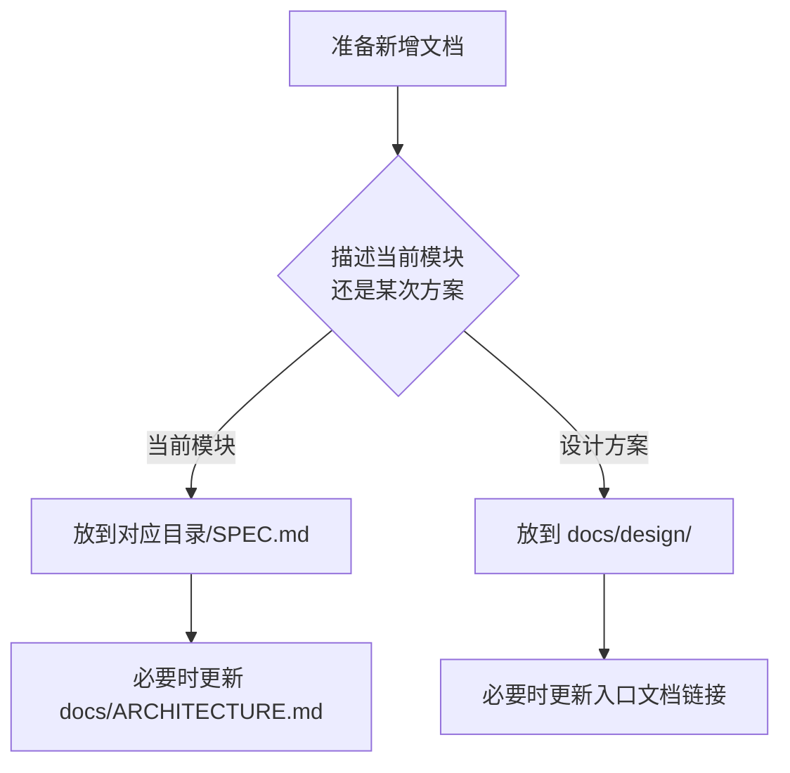

# LinguaGacha 文档体系说明

## 一句话总览
LinguaGacha 的文档系统采用“仓库级地图 + 模块级局部说明 + 设计决策沉淀”三层结构：仓库级文档放在 `docs/`，模块局部说明贴着代码目录放置，阶段性设计决策保存在 `docs/design/`。

## 文档分层
| 文档 | 位置 | 主要职责 |
| --- | --- | --- |
| `AGENTS.md` | 仓库根目录 | 放最短规则、关键约束和阅读入口 |
| `docs/ARCHITECTURE.md` | `docs/` | 描述仓库结构、模块关系和阅读路径 |
| `docs/FRONTEND.md` | `docs/` | 描述前端导航结构、页面入口和 UI 状态约束 |
| `docs/DOCS.md` | `docs/` | 规定文档体系自身的放置、命名、互链和维护规则 |
| `docs/design/*.md` | `docs/design/` | 记录背景、目标、方案、取舍和设计结论 |
| `*/SPEC.md` | 模块目录内 | 说明局部模块结构、边界、主流程和改动建议 |

## 放置与命名规则
- 仓库级文档统一放在 `docs/` 下，文件名固定为 `ARCHITECTURE.md`、`FRONTEND.md`、`DOCS.md`。
- 设计文档统一放在 `docs/design/` 下，命名格式为 `<feature-name>-design.md`。
- 模块局部说明统一命名为 `SPEC.md`，并与对应模块代码目录并置维护。
- 不使用 `index.md` 作为仓库级入口，也不把模块说明集中搬运到 `docs/`。

## 互链规则
- `AGENTS.md` 只保留最短规则和文档入口，链接到 `docs/ARCHITECTURE.md`、`docs/FRONTEND.md`、`docs/DOCS.md`。
- `docs/ARCHITECTURE.md` 负责链接到相关模块的 `SPEC.md` 与关键设计文档。
- `docs/FRONTEND.md` 负责链接到前端总入口和关键页面入口，不复制页面实现细节。
- 模块 `SPEC.md` 只解释当前模块怎么工作，不复述仓库级总览。
- 设计文档可以被仓库级文档引用，但不能替代现状文档。

## 更新规则
| 变更类型 | 必须同步的文档 |
| --- | --- |
| 模块职责变化 | 对应模块 `SPEC.md` |
| 仓库结构或模块关系变化 | `docs/ARCHITECTURE.md` |
| 前端页面入口或状态约束变化 | `docs/FRONTEND.md` |
| 文档体系规则变化 | `docs/DOCS.md` |
| 新方案或重大设计取舍 | `docs/design/*.md` |

硬规则：如果代码变更会让现有文档描述失真，应在同一任务内同步修正文档。

## 新增文档时怎么判断位置

简化判断：
- 解释“当前怎么工作”，写到对应模块目录下的 `SPEC.md`。
- 解释“为什么这样设计”，写到 `docs/design/*.md`。

## 当前落地状态
- 仓库级文档已经采用 `docs/ARCHITECTURE.md`、`docs/FRONTEND.md`、`docs/DOCS.md` 这组固定入口。
- 当前已存在的模块局部说明是 [`module/Data/SPEC.md`](../module/Data/SPEC.md)。
- `module/Engine/SPEC.md`、`module/File/SPEC.md` 暂未补齐，后续按需要新增即可。

