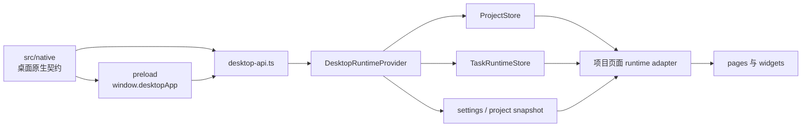

# LinguaGacha 前端权威边界

本文件只回答 Electron / preload / renderer / `ProjectStore` / 导航 / 样式消费边界。后端协议权威归 [`docs/BACKEND.md`](BACKEND.md)，产品语义和设计权威分别走 `PRODUCT.md` 与 `DESIGN.md` 对应流程。

## 1. 桌面接入边界



- renderer 的宿主能力只通过 `window.desktopApp` 暴露，Core API 访问只通过 `desktop-api.ts`，页面不直接拼接 `/api/*` 请求或事件流。
- `src/native` 根文件是 main、preload、renderer 共享的桌面原生契约归宿，负责 `window.desktopApp` 类型、IPC channel 与载荷、标题栏壳层规则、Core API 地址注入和外链策略；renderer 只读取根契约，不依赖 `src/native/platform` 或 `src/native/shell` 的实现。
- `src/preload/index.ts` 是宿主桥接唯一暴露点，只实现 `src/native` 根契约并负责 Core API base URL、原生对话框、外链、窗口关闭、日志窗口和标题栏主题的窄桥接。
- `src/renderer/app/desktop/desktop-api.ts` 是 renderer 访问 Core API 的唯一封装，负责 `/api/health` 探测、POST 响应壳解析、SSE 连接和错误类型。
- `DesktopApiError` 是 renderer 消费 Core 失败的唯一错误类型，Core API 错误码和 envelope 类型从 `src/shared/error` 导入，本地网络、探测和事件流失败使用 renderer 本地错误码与 `app.error.desktop.*.message`；页面只能按 code/status 决定刷新、重试、禁用或跳转，不读取后端原始异常文本。
- `src/renderer/app/ui-runtime/error-message.ts` 是普通页面解析用户可见错误文案的唯一入口；页面 toast、dialog 和空状态不能直接展示 `Error.message` 或自行解析 `DesktopApiError.message_key`。
- 普通页面只展示 `DesktopApiError.message_key` 对应本地化文案或后端提供的安全 `message`；非 Core API 异常只按页面语境 fallback 展示，`WorkerClientError` 等本地错误只提供稳定 code 给页面分支。日志窗口可以展示脱敏后的诊断信息，但不能显示 stack、API key、Authorization header、provider 原始响应或内部绝对路径。

## 2. 运行态初始化

- `DesktopRuntimeProvider` 启动时并行读取 settings、project、task snapshot；这一步不能通过卸载工程来“重置”Core 会话。
- 工程 loaded 且 path 非空时，前端先通过 `/api/project/manifest` 获取项目数据索引与 revision，再通过 `/api/project/read-sections` 初始化 `ProjectStore`。
- 工程未加载时 `ProjectStore` 回到空态，页面局部状态可以保留自己的选择或弹窗，但不能伪造项目事实。
- `src/renderer/app/locale` 只承接 renderer 的 React Provider 和富文本渲染适配；国际化资源、key 类型和查表函数的唯一权威在 `src/shared/i18n`。

## 3. ProjectStore 与任务运行态

`ProjectStore` 的项目数据 section 是：

```text
project, files, items, quality, prompts, analysis, proofreading
```

- `ProjectStore` 是 renderer 内共享项目事实的唯一缓存，不是后端事实源。
- `task` 属于任务运行态，只能由 `TaskRuntimeStore` 作为前端任务镜像；项目数据读取和 `project.data_changed` 都不能把 task 写入 `ProjectStore` 或项目派生缓存依赖。
- `TaskRuntimeStore` 消费的 `TaskSnapshot` 固定为 `base + progress + extras`：通用状态只在 base，进度只在 `progress`，分析候选数只在 `extras.kind === "analysis"`，重翻行级状态只在 `extras.kind === "translation" && scope.kind === "items"`。
- 停止命令 HTTP ack 只能携带后端当前完整 `TaskSnapshot`；页面可以同步写入该 snapshot，但不能在页面层追加“终态优先于 stopping”的第二套排序规则。
- 共享项目事实只能来自项目读取接口、`project.data_changed`、同步 mutation ack 后的 revision 对齐，以及明确的本地乐观 change。
- `ProjectStore.items` 持有完整公开 item DTO 镜像，字段口径与后端项目读取一致；页面、worker 和 planner 可以派生轻量 view model，但派生物不得直接写回 `.lg` 或作为 `items` upsert 进入共享 store。
- `section-invalidated` 不能只推进 revision；运行时必须先用 `/api/project/read-sections` 补读失效 section，再以 exact revision 合并，避免旧实体冒充新事实。
- 本地乐观 change 必须通过 `commit_local_project_change()`，并提供可回滚的 section 快照。
- 本地 item upsert 必须由当前完整 DTO 加局部 patch 合成完整记录；只表达字段变化的路径应走专门 mutation payload，由后端合并数据库事实。
- `ProjectStore` change revision 默认合并，乐观 change 使用 exact revision；项目数据派生缓存只能消费 `ProjectDataRevisionCheckpoint` 和声明的 required sections，不得用 `task` 或时间戳作为 freshness 主依据。
- `delete_items` / `delete_files` 是显式 tombstone 语义；无法精确表达删除时必须使用对应 section 的 full replace，让派生缓存重建。
- renderer 与 main 共享的数据实体和值对象从 `src/base` 导入；跨运行时业务共享规则、协议词表和纯工具从 `src/shared` 导入，质量规则页面合并和分析导入预演复用 `src/shared/quality`；Electron 桌面原生契约从 `src/native` 根导入。页面只保留局部筛选、弹窗、排序等 UI 状态，不在页面层重定义跨层枚举。
- 基础设置页的源语言与目标语言控件分别消费 `SOURCE_LANGUAGE_CODES` 和 `TARGET_LANGUAGE_CODES`；`ALL` 只作为源语言过滤关闭值进入源语言控件，页面不得用总语言表同时驱动源/目标下拉。
- `ProjectStore` 只消费 `Prompt` 和 `QualityRule` 派生出的公开 key 与切片归一化结果；页面发起质量规则预设请求时传 `rule_type`，不传物理预设目录名。

## 4. 事件流与页面刷新

| 事件 | 前端处理 | 页面影响 |
| --- | --- | --- |
| `project.changed` | 更新项目 snapshot，并在项目加载或切换链路读取 task snapshot | 触发项目读取或清空 store |
| `settings.changed` | 应用 settings payload 或重新拉取 settings | 影响语言、默认预设和应用设置 |
| `task.snapshot_changed` | 运行中 snapshot 进入 renderer 500ms 刷新窗口并只保留最新一份；终态或 `busy=false` 事件先冲刷窗口再立即覆盖 `TaskRuntimeStore` | 按钮 busy、任务菜单、进度、请求压力、停止态 |
| `project.data_changed` | canonical delta 进入同一 500ms 刷新窗口并按到达顺序批量合并；ids-only 进入同一窗口合并 item id 后按 `/api/project/items/read-by-ids` 补读，响应 revision 落后当前 `ProjectStore` 时丢弃；section-invalidated 或无法规范化事件先冲刷窗口，再补读 canonical 数据或全量刷新 | 工作台、校对、质量、分析、校对数据刷新 |

同一 renderer 刷新窗口内，`ProjectStore` 只通知一次，工作台与校对页派生信号按批次合并后最多各 bump 一次。工程切换、设置变更、项目刷新、本地乐观 change、失效 section 补读和任务终态不被普通窗口延迟。任务运行中和任务结束后不再由 Workbench 主动重取 `/api/tasks/snapshot`；项目首次加载、项目切换或页面显式 hydration 时仍可读取一次任务快照。日志窗口的 500ms append batch 与 Workbench 波形 250ms 采样都属于页面表现层，不承载项目或任务事实同步。

## 5. 导航与项目页 runtime

- `SCREEN_REGISTRY` 是页面注册和标题 key 的唯一入口。
- `ProjectPagesProvider` 持有工作台与校对页 runtime adapter，并用 revision checkpoint barrier 协调项目 warmup、缓存刷新、文件操作和页面跳转。
- 工作台与校对页可维护页面级缓存，但 ready 判定必须覆盖当前 `ProjectStore.revisions.sections` 中声明依赖的 sections；页面 runtime adapter 不暴露时间戳或 stale boolean 作为缓存新旧依据。
- 校对 worker 的缓存身份必须同时覆盖 project path、source language、items / quality / proofreading revisions；items tombstone 必须从 worker 原始行、评估行、计数索引和列表缓存中同步删除。
- 校对、质量规则和姓名字段等结果型页面的主列表使用结果视图快照：搜索、筛选、替换、排序或刷新等显式 action 生成有序稳定 id；项目事实刷新只回读最新行内容、状态、警告和统计徽标，不自动改变当前成员与顺序；实体删除、项目切换、全量数据源重建或运行态不兼容时才剪除或重建快照，不按位置把旧 id 映射到新实体。
- Quality statistics 的文本变更判断使用顺序滚动 hash，不以全量文本数组 stringify 作为主要 stale 判断；Quality statistics 与校对 worker 的质量规则编译、替换、文本保护和术语匹配口径收口到 `quality-runtime-context`。
- 新增页面若依赖项目事实，应接入 `ProjectPagesProvider` 或现有 runtime adapter；不要在页面里建立第二套全局项目缓存。

## 6. 样式和设计消费边界

- 设计权威不在本文；涉及产品语义先看 `PRODUCT.md`，涉及视觉和交互规范先走 `DESIGN.md`。
- 全局 CSS token 的稳定落点是 `src/renderer/index.css`；页面和组件不得随意新增并行 `--ui-*` token。
- 渲染层视觉尺寸字面量优先使用 `px`，`line-height` 使用无单位数值，`letter-spacing` 使用 `em`，`clamp()` 只使用 `px + vw + px` 组合。
- shadcn 基础组件承载基础视觉边界；页面 CSS 只写页面布局和局部组合状态。

## 7. 更新触发条件

必须同步更新本文的改动：

- preload 暴露能力、`window.desktopApp` 类型或 Core API 接入方式变化。
- `src/native` 根契约的桥接 API、IPC、标题栏壳层、Core API 地址注入或外链策略变化。
- `desktop-api.ts` 的响应壳、错误、SSE、项目读取或外部网络调用语义变化。
- `ProjectStore` section、项目变更 payload、revision 对齐、本地乐观 change 或项目读取消费方式变化。
- 改 renderer 消费的跨层基础值域、合法值集合、normalize 或派生判断。
- 导航注册、项目页 runtime adapter、barrier 或页面共享缓存策略变化。
- 样式 token、设计系统约束或前端视觉边界变化。
