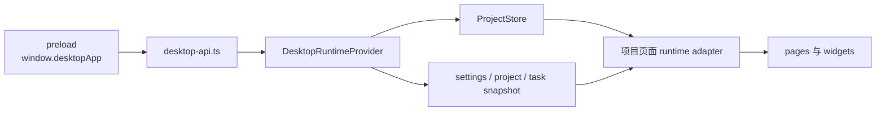

# LinguaGacha 前端权威边界

本文件只回答 Electron / preload / renderer / `ProjectStore` / 导航 / 样式消费边界。后端协议权威归 [`docs/BACKEND.md`](BACKEND.md)，产品语义和设计权威分别走 `PRODUCT.md` 与 `DESIGN.md` 对应流程。

## 1. 桌面接入边界



- renderer 只能通过 `window.desktopApp` 接入 Electron 宿主能力；禁止直接访问 Node、Electron、文件系统或内部服务。
- `src/preload/index.ts` 是宿主桥接唯一暴露点，负责 Core API base URL、原生对话框、外链、窗口关闭、日志窗口和标题栏主题。
- `src/renderer/app/desktop/desktop-api.ts` 是 renderer 访问 Core API 的唯一封装，负责 `/api/health` 探测、POST 响应壳解析、SSE 连接和错误类型。
- 页面代码不得绕过 `desktop-api.ts` 拼接 Core API URL；新增 Core 调用应先在该层收口。

## 2. 运行态初始化

- `DesktopRuntimeProvider` 启动时并行读取 settings、project、task snapshot；这一步不能通过卸载工程来“重置”Core 会话。
- 工程 loaded 且 path 非空时，前端通过 `/api/project/bootstrap/stream` 初始化 `ProjectStore`。
- bootstrap stage 只能由 `ProjectStore.applyBootstrapStage()` 合并；页面不直接解析后端 stage payload。
- 工程未加载时 `ProjectStore` 回到空态，页面局部状态可以保留自己的选择或弹窗，但不能伪造项目事实。

## 3. ProjectStore 消费边界

`ProjectStore` 的固定 section 是：

```text
project, files, items, quality, prompts, analysis, proofreading, task
```

- `ProjectStore` 是 renderer 内共享项目事实的唯一缓存，不是后端事实源。
- 共享项目事实只能来自 bootstrap、`project.patch`、同步 mutation ack 后的 revision 对齐，以及明确的本地乐观 patch。
- `project.patch` 不能消费时，运行时可以触发完整 bootstrap 刷新；页面不应自己调用多个 snapshot 拼接替代。
- 本地乐观 patch 必须通过 `commit_local_project_patch()`，并提供可回滚的 section 快照。
- `ProjectStore` patch revision 默认合并，乐观 patch 使用 exact revision；新增 patch operation 必须同步 store、runtime context 和测试。
- renderer 与 main 共享的基础值域从 `src/base` 导入；页面只保留局部筛选、弹窗、排序等 UI 状态，不在页面层重定义跨层业务枚举。

## 4. 事件流与页面刷新

| 事件 | 前端处理 | 页面影响 |
| --- | --- | --- |
| `project.changed` | 更新项目 snapshot、刷新 task | 触发工程 bootstrap 或清空 store |
| `settings.changed` | 应用 settings payload 或重新拉取 settings | 影响语言、默认预设和应用设置 |
| `task.status_changed` | 立即合并任务状态 | 按钮 busy、任务菜单、停止态 |
| `task.progress_changed` | 通过 `LiveRefreshScheduler` 批量合并 | 进度、请求中数量、统计 |
| `project.patch` | 可消费则合并到 `ProjectStore`，不可消费则 bootstrap | 工作台、校对、质量、任务块增量刷新 |

`LiveRefreshScheduler` 只用于降低高频事件刷新压力，不改变事实归属。需要强一致的事件必须先 flush 再应用。

## 5. 导航与项目页 runtime

- `SCREEN_REGISTRY` 是页面注册和标题 key 的唯一入口。
- `ProjectPagesProvider` 持有工作台与校对页 runtime adapter，并用 barrier 协调项目 warmup、缓存刷新、文件操作和页面跳转。
- 工作台与校对页可维护页面级缓存，但缓存失效信号必须来自 `ProjectStore`、事件流或明确 mutation 结果。
- 新增页面若依赖项目事实，应接入 `ProjectPagesProvider` 或现有 runtime adapter；不要在页面里建立第二套全局项目缓存。

## 6. 样式和设计消费边界

- 设计权威不在本文；涉及产品语义先看 `PRODUCT.md`，涉及视觉和交互规范先走 `DESIGN.md`。
- 全局 CSS token 的稳定落点是 `src/renderer/index.css`；页面和组件不得随意新增并行 `--ui-*` token。
- 渲染层视觉尺寸字面量优先使用 `px`，`line-height` 使用无单位数值，`letter-spacing` 使用 `em`，`clamp()` 只使用 `px + vw + px` 组合。
- shadcn 基础组件的基础视觉边界由组件和设计系统审查脚本共同维护；页面 CSS 只写页面布局和局部组合状态。
- 前端视觉改动必须按 [`docs/WORKFLOW.md`](WORKFLOW.md) 的验证矩阵运行 `npm run renderer:audit`，必要时再用 Electron 真机检查。

## 7. 更新触发条件

必须同步更新本文的改动：

- preload 暴露能力、`window.desktopApp` 类型或 Core API 接入方式变化。
- `desktop-api.ts` 的响应壳、错误、SSE、bootstrap 或外部网络调用语义变化。
- `ProjectStore` section、patch operation、revision 对齐、本地乐观 patch 或 bootstrap 消费方式变化。
- 改 renderer 消费的跨层基础值域、合法值集合、normalize 或派生判断。
- 导航注册、项目页 runtime adapter、barrier 或页面共享缓存策略变化。
- 样式 token、设计系统审查脚本或前端视觉边界变化。
