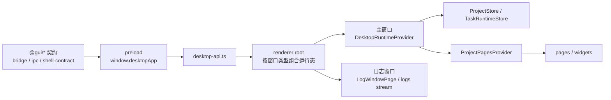

# LinguaGacha 前端权威边界

本文件只回答 Electron / preload / renderer / `ProjectStore` / 导航 / 样式消费边界。后端协议权威归 [`docs/BACKEND.md`](BACKEND.md)，产品语义和视觉规范分别走 `PRODUCT.md` 与 `DESIGN.md`。

## 1. 桌面宿主与 Core API 接入

- renderer 只能通过 `window.desktopApp` 接触 Electron 宿主能力，不能直接导入 Electron、Node、`src/native`、preload 实现或 Core 内部实现。
- Core API 访问只允许收口到 `src/renderer/app/desktop/desktop-api.ts`；页面不直接 `fetch('/api/*')`，也不直接创建 Core EventSource。
- `desktop-api.ts` 负责 Core base URL 归一、`/api/health` 探测、POST 响应壳解析、SSE 打开、本地网络错误和 GitHub release 检查。
- `DesktopApiError` 是 renderer 消费 Core / 本地网络失败的唯一错误类型；页面根据 code/status/action 决定刷新、重试、禁用或跳转，不解析后端原始异常文本。
- 普通页面展示用户可见错误时走 `src/renderer/app/ui-runtime/error-message.ts`；toast、dialog 和空状态不得直接显示 `Error.message`。
- 可见文案从 `src/shared/i18n` 解析；renderer 的 React Provider 和富文本渲染适配在 `src/renderer/app/locale`。

## 2. 共享运行态写入口

- `DesktopRuntimeProvider` 是主窗口内 settings、project snapshot、task snapshot、项目 warmup、事件流和共享 store 写入的唯一运行态入口。
- 启动 hydration 并行读取 `/api/settings/app`、`/api/project/snapshot`、`/api/tasks/snapshot`；这一步不能通过卸载工程来“重置”Core 会话。
- `ProjectStore` 只缓存后端公开项目事实，section 固定为 `project / files / items / quality / prompts / analysis / proofreading`；它不是后端事实源。
- `TaskRuntimeStore` 只缓存 `TaskSnapshot`，并用 `runtime_revision` 丢弃旧 snapshot；task 不进入 `ProjectStore` 或项目派生缓存。
- context 对页面只暴露 `ProjectStoreReader` 的 `getState`、`getRevisionCheckpoint`、`subscribe`；共享项目事实写入口留在 Provider 内部。
- settings 只能由后端设置载荷同步，task 只能由后端 task 载荷或任务命令 ack 同步，project 只能由项目读取、mutation result 或 `project.data_changed` 同步。
- 页面 mutation 只能提交用户意图、设置镜像和 `ProjectStore.revisions.sections` 中的依赖 revision；不能把页面派生 items、task extras、prefilter config 或 analysis extras 当后端事实提交。

## 3. 项目初始化、事件和刷新

- 已加载工程刷新时，前端先读 `/api/project/manifest` 校验后端项目身份和 revision，再读 `/api/project/read-sections` 获取完整 section 快照；两次响应的 `projectPath` 必须与当前运行态身份一致。
- `DesktopRuntimeProvider` 维护独立于 `ProjectStore` 的项目身份 `path + epoch + phase`；项目切换、同路径重新 warmup 或迟到补读都必须过这道身份闸门。
- warmup 期间，同项目身份的 mutation result 和 `project.data_changed` 先进入队列；完整 read-sections 快照原子替换 `ProjectStore` 后再按原顺序重放。
- 同步 mutation 成功后，页面必须先规范化并应用 `ProjectMutationResult.changes`；`eventId` 去重窗口用于跳过同源 SSE 重放。
- `canonical-delta` 可直接合并；`field-patch` 只合并后端确认的 `dst / status / retry_count`；`ids-only` 只能合并 id 后补读 `/api/project/items/read-by-ids`；`section-invalidated` 或缺少 section revision 的变更必须补读 canonical section。
- 补读请求必须绑定发起时的 project path 和 epoch，返回后还要校验当前身份、响应 project path 与后端 section revision；合格补读结果以 exact revision 合并。
- `ProjectStore` 默认用 merge revision 合并事件，补读和完整快照用 exact revision；两者都只写入后端显式返回的 section revision，不按本地 updated section 自增。
- `DesktopRuntimeRefreshScheduler` 将运行中 task snapshot 与可批量项目变更合并到 500ms 窗口；项目切换、设置刷新、mutation result、失效补读和任务终态必须先冲刷窗口，不能被普通合帧延迟。

## 4. ProjectStore 消费规则

- `ProjectStore.items` 持有只读 `ProjectItemIndex` 和完整公开 item DTO 镜像；页面和 Project UI Worker 只能通过索引 API 派生轻量 view model，不能保存为历史事实副本。
- `ProjectStore.analysis` 只保留轻量进度、候选数量和状态摘要；完整候选聚合由页面在需要导入术语时按需读取。
- renderer 与 Core 共享的数据实体和值对象从 `src/base` 导入；跨运行时纯规则、协议词表和工具从 `src/shared` 导入；最终项目 mutation 派生算法只属于 Core，renderer 不导入或复刻。
- 质量规则页面使用 `QualityRule` / `Prompt` 派生出的公开 key 与归一化切片；请求预设时传公开 rule type，不传物理目录名。
- 源语言与目标语言控件分别消费 `SOURCE_LANGUAGE_CODES` 与 `TARGET_LANGUAGE_CODES`；`ALL` 只作为源语言过滤关闭值，不进入目标语言控件。

## 5. 导航与项目页 runtime

- `SCREEN_REGISTRY` 是页面注册和标题 key 的唯一入口；新增页面先进入注册表，再接入对应页面 runtime。
- `ProjectPagesProvider` 持有工作台与校对页 runtime adapter，并通过 revision checkpoint barrier 协调项目 warmup、文件操作、页面缓存刷新和跳转。
- 页面级缓存的新旧判定必须覆盖声明依赖的 `ProjectStore.revisions.sections`；不得用时间戳、task 状态或裸 stale boolean 代替 section revision。
- 工作台和校对页可以维护页面局部缓存，但 ready 判定必须基于项目 path、required sections 与 consumed revisions。
- `src/renderer/project/worker` 是 Project UI Worker 的唯一归宿：单 worker 承接校对视图、质量统计和分析术语导入预演等 UI 派生计算；它只消费只读快照、section revision 和显式查询，不写项目事实、不发 mutation、不替代 Core 或 `ProjectStore`。
- Project UI Worker client 统一 request id、优先级、stale 错误、稳定错误码和带 projectId 的缓存释放；没有性能证据前不拆 renderer worker pool。
- 结果型页面的主列表使用结果视图快照：搜索、筛选、替换、排序或刷新等显式 action 生成新的稳定 id 序列；项目事实刷新只能在当前 view 语义内更新受影响实体和窗口事实。

## 6. 样式与设计消费

- 设计权威不在本文；涉及产品语义看 `PRODUCT.md`，涉及视觉和交互规范看 `DESIGN.md`。
- 全局 `--ui-*` token 的稳定落点是 `src/renderer/index.css`；页面和组件不得定义并行全局 token。
- renderer app、pages、widgets 范围内的尺寸字面量优先使用 px；需要 rem 或新的长期视觉语义时，先回到 `DESIGN.md` 判定并同步对应约束。
- shadcn 基础组件承载基础视觉边界；页面 CSS 只写页面布局和局部组合状态，不重新定义基础组件的核心背景、边框、圆角、阴影等视觉。
- 前端静态检查会拦截可见中文硬编码、Core API 直连、GUI 契约越界、共享 snapshot 裸 setter、`--ui-*` token 越界和部分基础组件视觉越界。

## 7. 更新触发条件

- 改 preload 暴露能力、`window.desktopApp` 类型、GUI 契约白名单、IPC 或 Core API 接入方式，更新本文。
- 改 `desktop-api.ts` 的 health probe、响应壳、错误、本地网络错误、SSE 或外部网络检查语义，更新本文。
- 改 `ProjectStore` section、项目身份、warmup、mutation result、payload mode、revision 合并或补读策略，更新本文并同步 [`docs/BACKEND.md`](BACKEND.md)。
- 改导航注册、`ProjectPagesProvider` barrier、项目页 runtime adapter、Project UI Worker 或页面共享缓存策略，更新本文。
- 改 i18n、可见文案、样式 token、px-first、基础组件视觉边界或设计系统消费方式，更新本文；产品 / 设计权威仍回到 `PRODUCT.md` / `DESIGN.md`。
