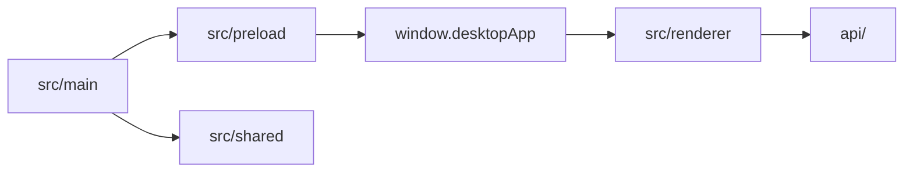
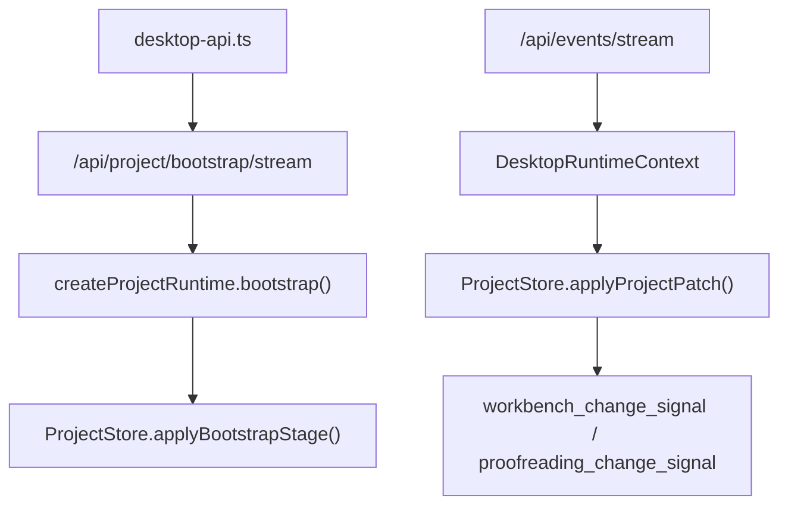

# LinguaGacha 前端文档

## 一句话总览
`frontend/` 是 LinguaGacha 的 Electron + React 子工程。本文回答四个问题：`main / preload / shared / renderer` 的边界是什么，`window.desktopApp` 与 `desktop-api.ts` 为什么是唯一入口，`ProjectStore` 如何消费 bootstrap 与 `project.patch`，以及页面、widget、shadcn、样式与导航各该落在哪一层。

## `main / preload / shared / renderer` 边界

| 层 | 职责 | 不该做什么 |
| --- | --- | --- |
| `src/main` | Electron 宿主、窗口、标题栏、原生对话框、外链打开、开发态调试端口 | 不持有页面状态，不组织 HTTP 请求，不写 React 逻辑 |
| `src/preload` | 通过 `contextBridge` 暴露 `window.desktopApp` | 不维护页面缓存，不承载 UI 状态 |
| `src/shared` | 跨端共享契约、桌面壳层常量、Core API 地址解析 | 不放页面语义或业务组件 |
| `src/renderer` | React 页面、导航、状态编排、组件与样式实现 | 不绕过 bridge 直接碰 Node / Electron |
| `src/test` | Vitest 测试装配 | 不承担运行时代码路径 |

稳定事实：
- `frontend/package.json` 是前端命令入口，稳定命令包括 `dev`、`build`、`format`、`format:check`、`lint`、`test`、`renderer:audit`、`preview`。
- `electron.vite.config.ts` 固定 renderer root 为 `src/renderer`，开发态 host 固定为 `127.0.0.1`。
- `src/main/index.ts` 在开发态打开 Chromium remote debugging 端口 `9222`，方便 Electron 真机调试与自动化。

## `window.desktopApp` 与 `desktop-api.ts` 的唯一入口约束

### `window.desktopApp`
- `src/preload/index.ts` 通过 `contextBridge.exposeInMainWorld("desktopApp", ...)` 暴露宿主能力。
- 对渲染层公开的稳定能力包括：
  - `shell`
  - `coreApi.baseUrl`
  - 文件 / 目录选择
  - 外链打开
  - 标题栏主题同步
  - `getPathForFile()`

### Core API 地址来源
- `src/shared/core-api-base-url.ts` 按固定顺序解析 Core API 地址：
  1. 环境变量 `LINGUAGACHA_CORE_API_BASE_URL`
  2. 启动参数 `--core-api-base-url=...`
  3. 默认地址 `http://127.0.0.1:38191`
- 渲染层不会盲信这个地址；`desktop-api.ts` 仍会先请求 `/api/health` 做探活确认。

### `desktop-api.ts`
- 它是渲染层访问 Core API 的唯一 HTTP / SSE 入口。
- 页面不要重新发明第二套 `fetch` 包装、`EventSource` 接入或健康检查逻辑。
- 如果你要改 HTTP 路径、bootstrap 事件、SSE topic 或 `ProjectMutationAck` 对齐逻辑，必须联读 [`API.md`](./API.md)。
- bootstrap 流消费者当前会监听 `stage_started`、`stage_payload`、`stage_completed`、`completed`，并为未来兼容预留 `failed` 监听。

## 运行态消费与 `ProjectStore`

### `ProjectStore` 的职责
- `frontend/src/renderer/app/project-runtime/` 负责把 bootstrap 流与 `project.patch` 收口成渲染层可消费的最小项目运行态。
- 稳定 section 固定为：`project`、`files`、`items`、`quality`、`prompts`、`analysis`、`proofreading`、`task`。
- `revisions` 额外维护 `projectRevision` 与 `sections[stage]`。
- 质量规则统计常驻缓存不进入 `ProjectStore`；应用根的 `QualityStatisticsProvider` 会在 warmup ready 后预热四类统计，并由规则页通过 `useQualityStatistics(ruleType)` 消费。

### bootstrap 落地规则
- `files` 使用 `rel_path` 作为 key。
- `items` 使用 `item_id` 作为 key。
- `quality`、`prompts`、`analysis`、`proofreading`、`task` 以对象快照写入对应 section。
- bootstrap 完成时，`completed` 事件补回 revision 信息。

### 本地 patch 与服务器 patch
- `DesktopRuntimeContext` 通过 `commit_local_project_patch(...)` 暴露渲染层唯一的本地运行态写入口。
- 同步 mutation 的成功路径是“本地 patch -> HTTP 持久化 -> `align_project_runtime_ack(...)`”。
- 失败路径是“回滚 -> `refresh_project_runtime()`”。
- 服务器 `project.patch` 与本地 patch 共用 `ProjectStore.applyProjectPatch(...)` 后处理。

### 页面变更信号

| 信号 | 作用域 | 主要消费者 |
| --- | --- | --- |
| `workbench_change_signal` | 当前稳定发出 `global` / `file` | 工作台页 |
| `proofreading_change_signal` | 当前稳定发出 `global` / `entry` | 校对页 |

补充说明：
- `project.changed`、`task.*`、`settings.changed` 与 `project.patch` 都由 `DesktopRuntimeContext` 收口，再决定是否刷新页面派生状态。
- 若 `project.patch` 载荷不合法，当前实现会回退为 `refresh_project_runtime()`，而不是让页面直接猜测修复策略。
- 工作台与校对页在工程切换后都会先清空本地快照，再等待各自的 change signal 驱动首次有效刷新；不会在空 `ProjectStore` 上做 eager refresh。
- `ProjectPagesProvider` 当前把 `project_warmup` 定义为“工作台首屏已基于本次 bootstrap 完成刷新”，`wait_for_barrier("project_warmup", { checkpoint })` 会要求工作台 `last_loaded_at` 晚于该 checkpoint；校对页缓存仍通过独立 barrier 维护。
- 校对页是否可交互只看自己的缓存状态，稳定语义是 `cache_status === "ready"` 且 `!is_refreshing`，不再复用 `project_warmup` 作为可操作条件。
- glossary / pre-replacement / post-replacement / text-preserve 四类质量统计由常驻 `QualityStatisticsProvider` 统一调度：项目 warmup ready 后先全预热，后续只根据 `items` revision 与对应 quality slice revision 后台刷新；规则页本身不再创建 worker 或维护统计刷新 effect。

## 页面 / widget / shadcn / 样式归属

| 路径 | 稳定职责 | 归属规则 |
| --- | --- | --- |
| `app/` | 应用根、导航、壳层组件、桌面运行时上下文、项目运行态装配 | 需要全局上下文、bridge 接缝、统一运行态时留在这里 |
| `pages/` | 页面入口、页面私有组件、页面 CSS、页面私有 hook 与辅助模块 | 每个页面目录以 `page.tsx` 为入口，不被其他页面反向依赖 |
| `widgets/` | 跨页面复用的组合组件 | `app-table`、`command-bar`、`setting-card-row` 等稳定组合层放这里 |
| `shadcn/` | shadcn CLI 管理的基础组件源码与项目内定制 | 业务组合组件不得混入 |
| `hooks/` | 跨页面复用的交互 hook | 不承载页面语义 |
| `i18n/` | 文案资源与翻译入口 | 长期文案不写进组件体内 |
| `lib/` | 无页面语义的纯逻辑工具 | 不承载 UI 或页面状态 |

样式边界：
- `index.css` 只承载全局 token、主题变量、浏览器重置和第三方运行时皮肤。
- 页面私有样式放在页面目录并由页面入口导入。
- widget 私有样式由 widget 自己维护，不把页面语义回写到全局。
- 渲染层执行 `px-first`：字面量长度优先 `px`，`line-height` 用无单位数值，`letter-spacing` 仅允许 `em`。

## 导航与页面映射中不显然的规则

导航权威来源固定为三处：
- `app/navigation/types.ts`
- `app/navigation/schema.ts`
- `app/navigation/screen-registry.ts`

稳定但不显然的映射如下：

| 路由 / 节点 | 真实落点 | 维护含义 |
| --- | --- | --- |
| `project-home` | `pages/project-page/page.tsx` | 默认落地页，但不在侧边栏分组里显示 |
| `text-replacement` | 仅侧边栏父节点 | 没有独立屏幕 |
| `custom-prompt` | 仅侧边栏父节点 | 没有独立屏幕 |
| `pre-translation-replacement` / `post-translation-replacement` | 同一个 `TextReplacementPage`，靠 `variant` 区分 | 不要再建平行页面目录 |
| `translation-prompt` / `analysis-prompt` | 同一个 `CustomPromptPage`，靠 `variant` 区分 | 不要再建平行页面目录 |
| `toolbox` | `pages/debug-panel-page/page.tsx` | 直接复用 debug panel 页面 |

## 前端与 API / DESIGN 的接缝

| 你在改什么 | 先联读哪份文档 |
| --- | --- |
| HTTP 路径、bootstrap、SSE topic、`ProjectMutationAck` | [`API.md`](./API.md) |
| 视觉 token、页面骨架、组件语义 | [`DESIGN.md`](./DESIGN.md) |
| Python Core 状态拥有者、同步 mutation 的真实持久化落点 | [`DATA.md`](./DATA.md) |

## 什么时候必须更新本文

- `main / preload / shared / renderer` 分层边界变化
- `window.desktopApp` 暴露能力或 `desktop-api.ts` 唯一入口约束变化
- `ProjectStore` section、本地 patch 提交流程、页面变更信号规则变化
- 导航结构、页面映射、目录职责或样式归属边界变化
