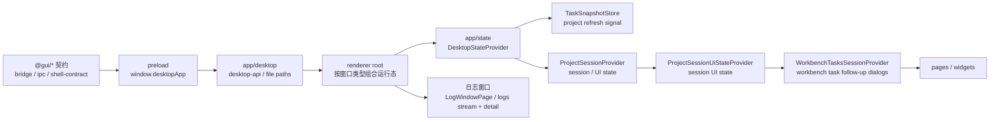

# LinguaGacha 前端权威边界

本文件只回答 Electron / preload / renderer / 页面 query reader/state / 导航 / 样式消费边界。后端协议权威归 [`docs/BACKEND.md`](BACKEND.md)，产品语义和视觉规范分别走 `PRODUCT.md` 与 `DESIGN.md`。

## 1. 桌面宿主与后端 API 接入

- renderer 只能通过 `window.desktopApp` 接触 Electron 宿主能力，不能直接导入 Electron、Node、`src/native`、preload 实现或后端内部实现。
- 后端 API 访问只允许收口到 `src/frontend/app/desktop/desktop-api.ts`；页面不直接 `fetch('/api/*')`，也不直接创建后端 EventSource。
- `src/frontend/app/desktop` 只承接桌面桥、Backend API、SSE、本地路径、外链和宿主边界归一；它不承接页面 query、跨页面 session 或页面业务反馈。
- `desktop-api.ts` 负责后端 API base URL 归一、`/api/health` 探测、POST 响应壳解析、SSE 打开、本地网络错误和 GitHub release 检查。
- renderer JS 异常诊断只能经 `desktop-api.ts` 提交到 `/api/diagnostics/renderer-error`；renderer diagnostics、state diagnostics、worker diagnostics 和 renderer error context 只能提供实际抛错摘要、route / project / task / event 轻量上下文和白名单字段，不上报完整 items/files payload、页面自定义对象或原始路径 / URL。诊断协议与日志写入规则以 [`docs/BACKEND.md`](BACKEND.md) 为权威。
- Chromium renderer 进程级崩溃由 main 侧 renderer process diagnostics registry 接管：renderer 通过 preload IPC 持续上报 route / project / task 摘要和近期 task/project 事件头，`render-process-gone` 日志写入窗口类型、`webContents.id`、OS 进程 id、URL 摘要、进程指标、crash dumps 目录摘要和最近面包屑。
- 日志窗口只把 `log.appended` 的轻量事件放入列表状态；完整正文由 `desktop-api.ts` 通过 `/api/logs/detail` 按当前选中行懒加载，不能进入列表筛选、排序或批量渲染路径。
- 日志窗口详情是 renderer 内唯一可展开结构化错误和调用栈的诊断视图；日志列表、toast 和普通页面错误提示不得展示调用栈或原始异常文本。
- `DesktopApiError` 是前端消费后端 API / 本地网络失败的唯一错误类型；页面根据 code/status/action 决定刷新、重试、禁用或跳转，不解析后端原始异常文本。
- 普通页面展示用户可见错误时走 `src/frontend/app/feedback/visible-error-message.ts`；toast、dialog 和空状态不得直接显示 `Error.message`。
- 可见文案从 `src/shared/i18n` 解析；前端的 React Provider 和富文本渲染适配在 `src/frontend/app/locale`。

## 2. 共享状态入口

- `src/frontend/app/state` 承接主窗口 settings、项目身份、task snapshot、项目 session 初始化、事件流、写入结果归一和轻量项目刷新信号；`DesktopStateProvider` 是唯一共享状态入口。
- 启动 hydration 并行读取 `/api/settings/app`、`/api/session/project/snapshot`、`/api/tasks/snapshot`；这一步不能通过关闭工程来“重置”后端会话。
- `TaskSnapshotStore` 只缓存 `TaskSnapshot`，并用 `run_revision` 丢弃旧 snapshot；task 不进入项目 query 或页面派生缓存。
- settings 只能由后端设置载荷同步，task 只能由后端 task 载荷或任务命令 ack 同步，project identity 只能由后端项目载荷同步。
- 页面写入只能提交用户意图、设置镜像和后端 query 返回的依赖 revision，并必须通过 `commit_project_write` 携带页面领域拥有的显式 `operation` 进入统一提交管线；页面不能自建刷新、诊断或写入结果应用链路，也不能把派生 items、task extras、prefilter config 或 analysis extras 当后端事实提交。

## 3. 项目初始化、事件和刷新

- 已加载工程刷新时，前端只校验后端项目身份和 revision，不读取完整项目大 section。
- `DesktopStateProvider` 维护项目身份 `path + epoch + phase`；项目切换、同路径重新初始化 session 或迟到事件都必须过这道身份闸门。
- session 初始化期间，同项目身份的写入结果和 `project.data_changed` 先进入队列；项目身份确认后再按原顺序重放。
- 同步写入结果与 SSE 统一归一成轻量项目刷新信号；页面按自身 query 参数重新读取 view model，不能在前端合并项目事实。
- `DesktopRefreshScheduler` 只合并可延迟的 task snapshot 和项目刷新信号；项目切换、设置刷新、写入结果和任务终态必须先冲刷窗口。
- flush、SSE 和写入异常必须写 renderer 诊断，并经 `useDesktopRecovery` 发起可等待、可去重的后端权威 query 恢复；当前项目有效事件不能静默丢弃。

## 4. 页面 Query 与局部状态

- 前端消费的数据实体和值对象从 `src/domain` 导入；跨运行时纯规则、协议词表和工具从 `src/shared` 导入；最终项目写入派生算法只属于后端，前端不导入或复刻。
- 页面读取项目事实只能通过本页面目录内 `*-api-client.ts` 包装的功能域 view API；页面状态只保存 query 参数、结果 view model、窗口缓存和交互态。
- query response 的 `sectionRevisions` 是页面写入的乐观锁来源；页面不得从本地缓存、task 状态或时间戳推导 revision。
- 质量规则页面使用 `QualityRule` / `Prompt` 派生出的公开 key 与归一化切片；请求预设时传公开 rule type，不传物理目录名。
- 源语言与目标语言控件分别消费 `SOURCE_LANGUAGE_CODES` 与 `TARGET_LANGUAGE_CODES`；`ALL` 只作为源语言过滤关闭值，不进入目标语言控件。

## 5. 导航、Session 与页面派生缓存

- `SCREEN_REGISTRY` 是页面注册和标题 key 的唯一入口；新增页面先进入注册表，再接入对应页面状态。
- `ProjectSessionProvider` 只提供项目 session ready、当前项目 UI 轻状态和文件操作等待；它不登记页面缓存 barrier，也不阻塞页面 query 刷新。
- `ProjectSessionUiStateProvider` 只保存当前项目 session 内可跨路由恢复的轻量页面 UI 状态；项目切换或关闭时清空，不写入后端事实，也不参与页面缓存 barrier。
- `WorkbenchTasksSessionProvider` 常驻在项目 session 内，拥有翻译 / 分析任务完成后的生成译文、导入术语和任务确认意图；完整翻译完成才触发生成译文确认，校对页局部重翻完成只回到校对工作流；任务 follow-up 不属于工作台页面缓存，不能随工作台页面卸载而丢失。
- 页面派生缓存、弹窗、确认框、导入状态和提交中状态随页面挂载创建、随卸载释放；只有登记到 `ProjectSessionUiStateProvider` 的轻量页面 UI 状态可在当前项目 session 内跨路由保留。
- 工作台和校对页可以维护页面局部缓存，但 ready 判定必须基于项目 path、required sections 与 consumed revisions。
- 校对页搜索、筛选、排序、窗口和警告派生由后端校对 query 提供；前端只保存当前参数、view id、窗口结果、选择和编辑态，cache ready 与 consumed revisions 以后端 `sync` 返回的 section revision 为准，页面卸载或路由切换不代表后端校对派生缓存清理。
- 质量规则统计的全量匹配计算由后端 query 提供；`src/frontend/app/session/quality-rule-statistics-*` 只保存规则描述、调度阶段、已完成统计结果和页面订阅状态。页面挂载对应规则时发起前台 query，未挂载规则仅失效缓存，失败态只能由依赖变化或显式用户动作重新调度。
- `src/frontend/app/result` 承接结果型页面共用的主列表快照规则：搜索、筛选、替换、排序或刷新等显式 action 生成新的稳定 id 序列；项目事实刷新只更新快照内实体的最新内容、状态、警告和统计，不能重新筛选、插入或重排当前 view；后端 tombstone 删除、项目切换、全量数据源重建或状态不兼容时才剪除或重建快照。
- 工作台统计区和任务菜单百分比消费后端 query 派生的 `WorkbenchStats`；任务详情在运行或停止中消费 `TaskSnapshot.progress`，空闲态才回落到 `WorkbenchStats`。
- `src/frontend/widgets/interactions` 只承接通用 UI 交互行为和快捷键规则；它不能依赖 `app` state、页面领域、桌面桥、后端 API 或 SSE。
- `src/frontend/styling` 只保留极窄样式基础工具；当前稳定职责是 className 合并，不承接 React 状态、宿主能力或页面业务语义。
- `src/frontend/hooks` 与 `src/frontend/lib` 不再作为前端顶层入口；新增代码按状态所有者、宿主边界所有者、页面所有者或 UI 组件所有者归入 `app`、`pages`、`widgets`、`styling`、`src/shared` 或 `src/domain`。

## 6. 样式与设计消费

- 设计权威不在本文；涉及产品语义看 `PRODUCT.md`，涉及视觉和交互规范看 `DESIGN.md`。
- 全局 `--ui-*` token 的稳定落点是 `src/frontend/index.css`；页面和组件不得定义并行全局 token。
- frontend app、pages、widgets 范围内的尺寸字面量优先使用 px；需要 rem 或新的长期视觉语义时，先回到 `DESIGN.md` 判定并同步对应约束。
- shadcn 基础组件承载基础视觉边界；页面 CSS 只写页面布局和局部组合状态，不重新定义基础组件的核心背景、边框、圆角、阴影等视觉。
- 前端静态检查会拦截可见中文硬编码、后端 API 直连、GUI 契约越界、共享 snapshot 裸 setter、废弃 `hooks` / `lib` 入口、`widgets/interactions` 越权、`--ui-*` token 越界和部分基础组件视觉越界。

## 7. 更新触发条件

- 改 preload 暴露能力、`window.desktopApp` 类型、GUI 契约白名单、IPC、后端 API 或本地路径接入方式，更新本文。
- 改 `desktop-api.ts` 的 health probe、响应壳、错误、本地网络错误、SSE 或外部网络检查语义，更新本文。
- 改项目身份、session 初始化、写入结果、payload mode、revision 来源或页面 query 恢复策略，更新本文并同步 [`docs/BACKEND.md`](BACKEND.md)。
- 改 `app/state`、导航注册、`ProjectSessionProvider`、页面派生缓存、项目 UI 状态、后端校对 query 消费方式或质量规则统计共享缓存策略，更新本文。
- 改 `widgets/interactions`、`src/frontend/styling` 或废弃前端顶层入口规则，更新本文。
- 改 i18n、可见文案、样式 token、px-first、基础组件视觉边界或设计系统消费方式，更新本文；产品 / 设计权威仍回到 `PRODUCT.md` / `DESIGN.md`。
