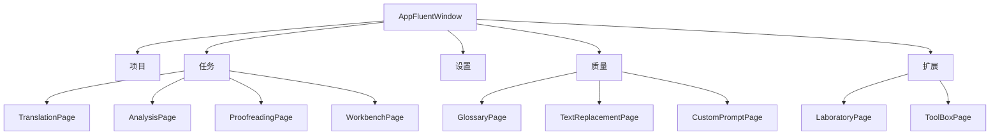

# LinguaGacha 前端结构说明

## 一句话总览
前端以 `frontend/AppFluentWindow.py` 为总导航入口，负责页面注册、工程加载态守卫、全局 Toast / 进度提示和主题语言切换；具体业务页面再按任务域拆分到 `frontend/` 的各个子目录中。

## 总导航入口
`AppFluentWindow.add_pages()` 负责组装整套导航结构，分为几组：

| 分组 | 主要入口 | 说明 |
| --- | --- | --- |
| 项目 | `ModelPage` | 模型管理入口 |
| 任务 | `TranslationPage`、`AnalysisPage`、`ProofreadingPage`、`WorkbenchPage` | 核心业务页面 |
| 设置 | `BasicSettingsPage`、`ExpertSettingsPage` | 基础设置与专家设置 |
| 质量 | `GlossaryPage`、`TextPreservePage`、`TextReplacementPage`、`CustomPromptPage` | 规则、替换和提示词相关页面 |
| 扩展 | `LaboratoryPage`、`ToolBoxPage` | 实验性与工具类页面 |
| 底部固定入口 | 主题切换、语言切换、应用设置、主页头像按钮 | 全局操作与项目主页 |

## 页面分区

## 工程加载态与导航约束
- `AppFluentWindow.switchTo()` 会在工程未加载时拦截依赖工程的页面，并重定向到 `ProjectPage`。
- 用户在未加载工程时点击业务页，会先记录到 `pending_target_interface`，等工程加载成功后自动跳转回目标页。
- `update_navigation_status()` 会按 `DataManager.get().is_loaded()` 统一禁用术语表、替换、自定义提示词、实验室、百宝箱等入口。
- `TextPreservePage` 与 `ExpertSettingsPage` 仅在专家模式下出现，调试前端导航时要先确认 `LogManager.get().is_expert_mode()`。
- `ProjectPage` 不直接出现在侧边栏，它是未加载工程时的兜底页与项目主页入口。

## 关键页面入口
| 页面 | 文件 | 主要依赖 |
| --- | --- | --- |
| 工程页 | `frontend/ProjectPage.py` | 工程创建、最近项目、加载入口 |
| 模型页 | `frontend/Model/ModelPage.py` | 模型配置与选择 |
| 翻译页 | `frontend/Translation/TranslationPage.py` | `module/Engine/Translation/*`、`module/Data/DataManager.py` |
| 分析页 | `frontend/Analysis/AnalysisPage.py` | `module/Engine/Analysis/*`、`module/Data/DataManager.py` |
| 校对页 | `frontend/Proofreading/ProofreadingPage.py` | 校对任务与工程状态 |
| 工作台 | `frontend/Workbench/WorkbenchPage.py` | 文件列表、工程文件操作、工作台刷新 |
| 术语与规则 | `frontend/Quality/*` | `DataManager` 规则接口与质量事件 |
| 设置页 | `frontend/Setting/*`、`frontend/AppSettingsPage.py` | `module/Config.py`、应用级设置 |
| 扩展页 | `frontend/Extra/*` | 实验性工具与附加处理流程 |

## 前端改动路径
1. 新增或调整侧边栏入口时，优先修改 `frontend/AppFluentWindow.py` 的 `add_pages()` 及其分组方法。
2. 涉及“未加载工程时能否进入”的规则时，同时检查 `get_project_dependent_names()`、`switchTo()` 和 `update_navigation_status()`。
3. 涉及全局 Toast、进度条或更新流程时，优先检查 `toast()`、`progress_toast_event()` 与应用更新相关事件处理函数。
4. 涉及页面文案时，不要直接写字符串，统一改 `module/Localizer/`。
5. 涉及后台任务触发 UI 刷新时，保持事件总线路径，避免后台线程直接碰界面控件。
