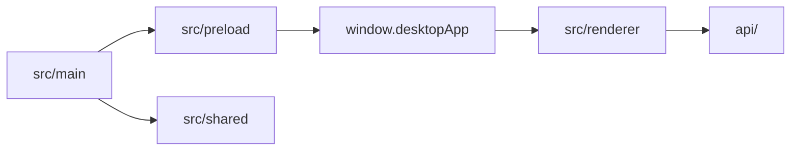
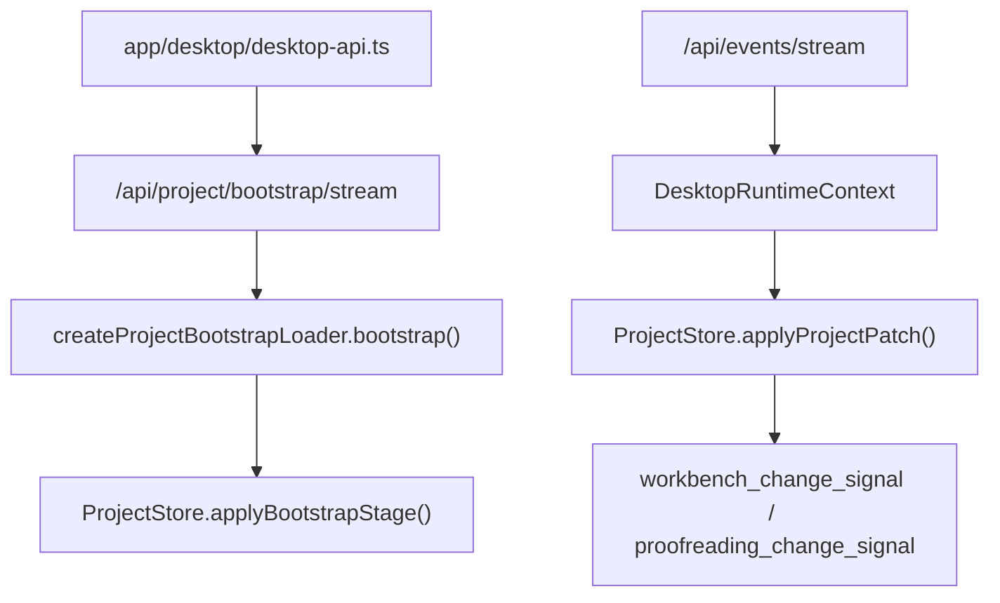

# LinguaGacha 前端文档

## 一句话总览
`frontend/` 是 LinguaGacha 的 Electron + React 子工程。本文回答四个问题：`main / preload / shared / renderer` 的边界是什么，`window.desktopApp` 与 `app/desktop/desktop-api.ts` 为什么是唯一入口，`ProjectStore` 如何消费 bootstrap 与 `project.patch`，以及页面、widget、shadcn、样式与导航各该落在哪一层。

## `main / preload / shared / renderer` 边界

| 层 | 职责 | 不该做什么 |
| --- | --- | --- |
| `src/main` | Electron 宿主、窗口、标题栏、原生对话框、外链打开、开发态调试端口、公开 TS Gateway、内部 Database Service 与 TS 领域服务生命周期 | 不持有页面状态，不写 React 逻辑 |
| `src/preload` | 通过 `contextBridge` 暴露 `window.desktopApp` | 不维护页面缓存，不承载 UI 状态 |
| `src/shared` | 跨端共享契约、桌面壳层常量、Core API 地址解析 | 不放页面语义或业务组件 |
| `src/renderer` | React 页面、导航、状态编排、组件与样式实现 | 不绕过 bridge 直接碰 Node / Electron |
| `src/test` | Vitest 测试装配 | 不承担运行时代码路径 |

稳定事实：
- `frontend/package.json` 是前端命令入口，稳定命令包括 `dev`、`build`、`format`、`lint`、`test`、`renderer:audit`。
- `electron.vite.config.ts` 固定 renderer root 为 `src/renderer`，开发态 host 固定为 `127.0.0.1`。
- `src/main/index.ts` 是 Electron main 的启动装配入口；`src/main/handler/window-handler.ts` 收口主窗口 / 日志窗口共享的窗口能力、renderer 入口加载、运行期窗口保护事件和开发态 Chromium remote debugging 端口 `9222`，`src/main/handler/ipc-handler.ts` 收口 preload 暴露给 renderer 的桌面 IPC 注册。
- `src/main/lifecycle/` 是 TS Gateway 与内部 Database Service 生命周期的唯一前端侧落点；Electron main 先创建 `src/main/log/` 的 TS `LogManager`，再启动 `src/main/database/` 内部服务并生成 token，最后启动 `src/main/api/` 的公开 `/api/*` Gateway。P1 业务服务按语义放在 `settings/`、`model/`、`quality/`，后台任务执行态放在 `task-engine/`，单个 work unit 与 pi-ai LLM adapter 放在 `task-worker/`，路径解析放在 `paths/`。
- `src/main/database/` 是 `.lg` SQLite、事务和 asset 读写的唯一物理存储实现；`src/shared/utils/zstd-tool.ts` 是 Zstd 压缩等级、压缩与解压工具的唯一落点；`src/main/migration/project-database-migration-service.ts` 承接 `.lg` 打开期 schema 与旧物理格式迁移；内部服务只监听 `127.0.0.1` 随机端口，只接受 token 校验后的内部请求，不暴露给 preload 或 renderer。
- `src/main/handler/window-handler.ts` 中用于查找 `dist/`、`public/` 的是前端 bundle 根，不是应用根；应用根语义只用于 `CoreLifecycleManager.appRoot`、资源读取和运行态路径解析。
- 打包产物只把 `resource/` 与 `version.txt` 放在应用根目录；Windows / Linux 应用根是 Electron 可执行文件所在目录，macOS 应用根是 `.app/Contents/MacOS`。

## `window.desktopApp` 与 `app/desktop/desktop-api.ts` 的唯一入口约束

### `window.desktopApp`
- `src/preload/index.ts` 通过 `contextBridge.exposeInMainWorld("desktopApp", ...)` 暴露宿主能力。
- 对渲染层公开的稳定能力包括：
  - `shell`
  - `coreApi.baseUrl`
  - 文件 / 目录选择
  - 外链打开
  - 独立日志窗口打开 / 聚焦
  - 标题栏主题同步
  - 窗口关闭确认请求订阅
  - `getPathForFile()`
- Database Service 的地址、token、调试能力和内部路由不属于 `window.desktopApp` 能力集。

### Core API 地址来源
- 应用正常启动时，Electron main 的 `CoreLifecycleManager` 会先启动内部 Database Service，再在高位端口范围内选择 TS Gateway 公开端口；公开地址写入 `LINGUAGACHA_CORE_API_BASE_URL`，该地址指向 TS Gateway。
- `LINGUAGACHA_CORE_API_BASE_URL` 可进入 renderer，用于定位 TS Gateway；Gateway 探活不返回授权 token。
- Database Service 地址只在 Electron main 内部服务之间流转，renderer 不读取也不转发。
- `src/shared/core-api-base-url.ts` 按固定顺序解析 Core API 地址：
  1. 环境变量 `LINGUAGACHA_CORE_API_BASE_URL`
  2. 启动参数 `--core-api-base-url=...`
  3. 默认地址 `http://127.0.0.1:38191`
- 渲染层不会盲信这个地址；`desktop-api.ts` 仍会先请求 `/api/health` 做探活确认。
- 开发态应用根优先取 npm 保留的原始目录 `INIT_CWD`，不存在时回退到 Electron 主进程当前工作目录；打包态应用根固定为 Electron 可执行文件所在目录。

### `app/desktop/desktop-api.ts`
- 它是渲染层访问 Core API 的唯一 HTTP / SSE 入口。
- 页面不要重新发明第二套 `fetch` 包装、`EventSource` 接入或健康检查逻辑。
- 它看到的 baseUrl 永远是 TS Gateway；Database Service 内部 baseUrl 和 token 不进入 `window.desktopApp`。
- 如果你要改 HTTP 路径、bootstrap 事件、SSE topic 或 `ProjectMutationAck` 对齐逻辑，必须联读 [`API.md`](./API.md)。
- bootstrap 流消费者当前会监听 `stage_started`、`stage_payload`、`stage_completed`、`completed`，并为未来兼容预留 `failed` 监听。
- 独立日志窗口只通过 `desktop-api.ts` 的 `/api/logs/stream` 订阅 TS `LogManager` 的 `log.appended`，不消费 `/api/events/stream`，也不把日志写进 `ProjectStore`。

## 独立日志窗口

- `src/main/log/` 是 Electron main 的日志权威：控制台输出、`DATA_ROOT/log/app.yyyymmdd.log` 文件输出和日志窗口 ring buffer 都由 TS `LogManager` 分别按目标开关管理；磁盘日志只保留日期最新的 3 份。保留 Python 工具的 `LogManager` 只写本地 stderr 兜底，不进入日志窗口。
- Electron main 通过 `window.desktopApp.openLogWindow()` 维护日志窗口单例；主窗口项目 warmup ready 后只在侧栏日志入口显示红点提醒，不自动打开日志窗口。侧栏日志入口在窗口隐藏时显示并聚焦，窗口已显示时关闭，点击入口会清除本次提醒，关闭日志窗口不关闭主窗口。
- 日志窗口复用同一个 renderer bundle，通过 `?window=logs` 进入日志模式；该模式不渲染主工作台 sidebar，也不注册为导航屏幕。
- 主窗口侧栏底部动作区提供日志入口；入口只调用 preload 暴露能力，不直接触碰 Electron / Node。
- 日志窗口主体复用 `widgets/app-table` 展示时间和消息摘要，级别以前缀形式并入消息列；选中行在详情区展示完整纯文本 `message`。
- 日志窗口的筛选、搜索、正则模式、自动滚动和详情区展开都是窗口本地状态，不属于项目运行态。

## 运行态消费与 `ProjectStore`

### `ProjectStore` 的职责
- `frontend/src/renderer/project/store/` 负责把 bootstrap 流与 `project.patch` 收口成渲染层可消费的最小项目运行态。
- `frontend/src/renderer/project/lifecycle/` 承载 bootstrap stream 解析与 loader 编排，`DesktopRuntimeContext` 只调用该入口，不在应用运行态里展开 stage 细节。
- 稳定 section 固定为：`project`、`files`、`items`、`quality`、`prompts`、`analysis`、`proofreading`、`task`。
- `revisions` 额外维护 `projectRevision` 与 `sections[stage]`。
- 质量规则统计常驻缓存不进入 `ProjectStore`；`project/quality/QualityStatisticsProvider` 会在 warmup ready 后预热四类统计，并由规则页通过 `useQualityStatistics(ruleType)` 消费。

### bootstrap 落地规则
- `files` 使用 `rel_path` 作为 key。
- `items` 使用 `item_id` 作为 key。
- `quality`、`prompts`、`analysis`、`proofreading`、`task` 以对象快照写入对应 section。
- bootstrap 完成时，`completed` 事件补回 revision 信息。

### 本地 patch 与服务器 patch
- `DesktopRuntimeContext` 通过 `commit_local_project_patch(...)` 暴露渲染层唯一的本地运行态写入口。
- 同步 mutation 的成功路径是“本地 patch -> HTTP 持久化 -> `align_project_runtime_ack(...)`”。
- 失败路径是“回滚 -> `refresh_project_runtime()`”。
- 服务器 `project.patch` 与本地 patch 共用 `ProjectStore.applyProjectPatch(...)` 后处理。
- 服务端高频 `project.patch` 先进入 `LiveRefreshScheduler`，flush 时按原顺序批量应用到 `ProjectStore`，再合并发出工作台与校对页 change signal；本地 `commit_local_project_patch(...)` 仍即时应用、即时回滚。

### 页面变更信号

| 信号 | 稳定载荷 / 模式 | 主要消费者 |
| --- | --- | --- |
| `workbench_change_signal` | 当前稳定发出 `global` / `file` | 工作台页 |
| `proofreading_change_signal` | 当前稳定发出 `full` / `delta` / `noop`，并携带 `updated_sections` 与 `item_ids` | 校对页 |

补充说明：
- `project.changed`、`task.*`、`settings.changed` 与 TS Gateway 补全后的 `project.patch` 都由 `DesktopRuntimeContext` 收口，再决定是否刷新页面派生状态。
- 若 `project.patch` 载荷不合法，当前实现会回退为 `refresh_project_runtime()`，而不是让页面直接猜测修复策略。
- 工作台与校对页在工程切换后都会先清空本地快照，再等待各自的 change signal 驱动首次有效刷新；不会在空 `ProjectStore` 上做 eager refresh。
- 实时 UI 刷新统一由 `app/ui-runtime/LiveRefreshScheduler` 在入站侧合帧，频率由 `APP_LIVE_REFRESH_INTERVAL_MS` 控制；服务端 `project.patch`、任务进度、日志流与工作台任务波形共享这条节奏，本地同步 mutation、项目切换、非法 patch fallback 与任务终态仍走即时路径。
- `ProjectPagesProvider` 当前把 `project_warmup` 定义为“工作台首屏已基于本次 bootstrap 完成刷新”，`wait_for_barrier("project_warmup", { checkpoint })` 会要求工作台 `last_loaded_at` 晚于该 checkpoint；校对页缓存仍通过独立 barrier 维护。
- `ProjectPagesProvider` 位于 `app/page-runtime/`，只消费页面运行态 adapter 暴露的缓存状态和 barrier 字段；工作台、校对页自己的 hook 仍归页面侧维护，应用运行态不直接导入页面私有 hook。
- 校对页只把 `project / items / quality` 视为后台派生真实输入；`prompts`、`analysis` 单独变化不会触发校对缓存失效，`proofreading / task` 仅在没有 item 载荷时发 `noop`。
- 校对页把 `ProjectStore` 原始状态同步到独立 worker cache：`hydrate_full` 负责项目级全量同步，`apply_item_delta` 只重算变更条目，`build_list_view` 生成 `view_id` 与 worker 内的有序 row id 索引，`read_list_window` 只回传当前表格窗口 rows，`read_row_ids_range` / `read_items_by_row_ids` 供跨窗口选择、批量操作和编辑弹窗按需取数；warnings、默认 filters、筛选 facets、排序结果与当前视图索引都由 worker 持有，主线程只保留窗口 rows、选区、游标、弹窗等轻状态。
- 工作台页收到 `merge_items` 合并后的 delta 时优先更新本地增量缓存；首次 bootstrap、项目 / 文件替换、分析摘要缺失或结构异常时回退全量重建。校对页同窗口 `full` 覆盖 `delta`，纯 `noop` 不触发列表与筛选面板查询。
- 工作台、预过滤、翻译重置和校对 mutation planner 的输出边界是条目事实、`translation_extras`、分析 / 预过滤载荷、项目设置镜像和期望 revision；工程任务态由 `task` 运行态和 TS Gateway 适配后的事件流承接。
- 新建工程先调用 `create-preview` 获取未落盘草稿，由 `project/prefilter/prefilter-runner.ts` 调 worker 完成预过滤，再用 `create-commit` 写入 `.lg` 并加载；打开工程先调用 `open-preview`，在未 loaded 前完成 `settings-alignment/apply`，最后再进入 `/api/project/load`。
- 实验室页的 `mtool_optimizer_enable` 与 `skip_duplicate_source_text_enable` 属于会改变预过滤结果的应用设置；保存后必须走同一条 project prefilter mutation 链路，把项目设置镜像与预过滤结果一起对齐到 `.lg`。
- 校对页状态筛选只展示有效 item 状态；重译中的行级 spinner 由 `task_snapshot.task_type === "retranslate"` 与 `task_snapshot.retranslating_item_ids` 派生，页面本地只保留选区、弹窗和筛选等交互态。
- 校对页是否可交互只看自己的缓存状态，稳定语义是 `cache_status === "ready"` 且 `!is_refreshing`；其中 `proofreading_cache_refresh` 的 ready 定义是“当前列表查询已结算，且 `current_filters` 对应的筛选面板已预热完成”，可操作条件独立于 `project_warmup`。
- glossary / pre-replacement / post-replacement / text-preserve 四类质量统计由常驻 `QualityStatisticsProvider` 统一调度：项目 warmup ready 后先全预热，后续比较统计依赖签名（项目相关文本、规则 key 与 descriptor 依赖字段）决定是否后台刷新；规则页通过 provider 消费统计，不创建独立 worker 或维护统计刷新 effect。

## 页面 / widget / shadcn / 样式归属

| 路径 | 稳定职责 | 归属规则 |
| --- | --- | --- |
| `app/` | 应用层入口、导航、壳层组件、桌面接缝、页面运行态协调、全局 UI 运行态 | 除导航注册表外，不直接依赖页面私有实现；不承载项目事实仓库、项目派生规则或质量统计缓存 |
| `app/desktop/` | `desktop-api.ts`、`DesktopRuntimeContext`、Core API / SSE 接入、桌面事件载荷解析 | 渲染层访问 Core API 与桌面事件的唯一应用侧入口；不把项目规则拆在这里 |
| `app/page-runtime/` | 页面缓存 barrier、页面运行态 adapter、`ProjectPagesProvider` | 只消费页面公开的窄 adapter，不导入页面私有 hook、worker 或弹窗状态 |
| `app/ui-runtime/` | toast、live refresh 等全局 UI 运行态 | 只放跨页面 UI 运行节奏和通知能力，不承载项目事实或页面筛选态 |
| `project/lifecycle/` | bootstrap stream consumer 与 bootstrap loader | 工程加载生命周期归这里，`ProjectStore` 只接收已解析的 stage 载荷 |
| `project/store/` | `ProjectStore`、项目条目文本采集 | 渲染层项目事实的权威仓库；页面只读快照或通过 `commit_local_project_patch(...)` 的唯一写入口提交本地 patch |
| `project/prefilter/` | 预过滤 mutation builder / committer、runner、worker client / worker | 只表达规则如何应用到项目条目和 mutation 输出；可审查规则清单不放在这里 |
| `shared/rules/` | 前后端共享的规则前缀、后缀、正则、标点、语言字符判断；规则口径跟随 Python `BaseLanguage` / `TextHelper` / `RuleFilter` / `LanguageFilter` | 只放可审查的纯规则与语言定义，不做项目条目遍历、worker 编排、HTTP mutation 或 Ruby 清理；Ruby 清理与译前 / 译后处理由 `src/shared/text/` 供 `src/main/task-worker/` 消费 |
| `project/reset/` | 翻译 / 分析 reset plan 与共享 reset state builders | 只放基于项目事实生成重置 mutation 的规则 |
| `project/glossary-import/` | 分析术语导入 plan | 只放分析候选到术语表 mutation 的项目领域计划 |
| `project/settings/` | 项目设置 alignment toast 与设置镜像辅助 | 只放项目设置同步相关的展示文案格式化和轻量领域辅助 |
| `project/quality/` | 质量规则运行态、统计 worker、统计缓存与 provider | 质量规则切片与统计缓存归这里，页面只消费 provider 或纯函数 |
| `project/tasks/` | 项目任务锁定与停止状态判断 | 只放跨页面稳定复用的项目任务语义，不放工作台任务 UI 模型 |
| `pages/` | 页面入口、页面私有组件、页面 CSS、页面私有 hook 与辅助模块 | 每个页面目录以 `page.tsx` 为入口，不被其他页面反向依赖；页面派生视图与页面 mutation planner 留在对应页面目录 |
| `widgets/` | 跨页面复用的组合组件 | `app-table`、`command-bar`、`setting-card-row`、`app-dropdown-menu`、`app-context-menu` 等稳定组合层放这里；`app-table` 对外保留 `rows` 兼容入口，内部统一归一为 row model 消费数组与校对页远程窗口行来源 |
| `shadcn/` | shadcn CLI 管理的基础组件源码 | 业务组合组件与应用默认视觉不得混入；菜单类项目默认样式走 `widgets/app-*-menu` |
| `hooks/` | 跨页面复用的交互 hook | 不承载页面语义 |
| `i18n/` | 文案资源与翻译入口 | 长期文案不写进组件体内 |
| `shared/` | LinguaGacha 内部跨页面 / 跨领域 / 前后端共享纯能力 | 可放 text、filtering、sorting、validation、rules、utils 等无项目事实编排的能力，不放 UI 状态或项目运行态 |
| `lib/` | 框架与第三方胶水 | 可放 `cn()`、文件拖拽、worker error、快捷键等底层工具，不承载领域规则、UI 状态或页面状态 |

样式边界：
- `index.css` 只承载全局 token、主题变量、浏览器重置和第三方运行时皮肤。
- 页面私有样式放在页面目录并由页面入口导入。
- widget 私有样式由 widget 自己维护，不把页面语义回写到全局。
- 渲染层执行 `px-first`：字面量长度优先 `px`，`line-height` 用无单位数值，`letter-spacing` 仅允许 `em`。
- `npm --prefix frontend run renderer:audit` 通过 `frontend/scripts/check-renderer-design-system.mjs` 自动拦截可稳定判定的 token 越权、`rem` 尺寸字面量和已接入门闩的基础视觉越权；新增例外前先回到根目录 [`DESIGN.md`](../DESIGN.md) 判断是否属于长期设计语义变化。

## 导航与页面映射中不显然的规则

导航权威来源固定为三处：
- `app/navigation/types.ts`
- `app/navigation/schema.ts`
- `app/navigation/screen-registry.ts`

补充规则：
- `screen-registry.ts` 是 `app/` 中唯一允许直接导入页面入口和页面运行态 adapter 的文件；其它 `app/` 模块如果需要页面缓存状态，只消费 `ProjectPagesProvider` 提供的窄接口。
- 工作台任务 UI 运行态只归 `pages/workbench-page/task-runtime/`，翻译 / 分析任务模型与波形工具不从 `app/`、`project/tasks/` 或 `lib/` 暴露。

稳定但不显然的映射如下：

| 路由 / 节点 | 真实落点 | 维护含义 |
| --- | --- | --- |
| `project-home` | `pages/project-page/page.tsx` | 默认落地页，但不在侧边栏分组里显示 |
| `text-replacement` | 仅侧边栏父节点 | 没有独立屏幕 |
| `custom-prompt` | 仅侧边栏父节点 | 没有独立屏幕 |
| `pre-translation-replacement` / `post-translation-replacement` | 同一个 `TextReplacementPage`，靠 `variant` 区分 | 不要再建平行页面目录 |
| `translation-prompt` / `analysis-prompt` | 同一个 `CustomPromptPage`，靠 `variant` 区分 | 不要再建平行页面目录 |
| `toolbox` | `pages/toolbox-page/page.tsx` | 百宝箱一级入口页；工具二级页不在侧边栏注册 |
| `name-field-extraction` | `pages/name-field-extraction-page/page.tsx` | 从 `ProjectStore.items` 的 `name_src/src` 本地派生姓名表；单条 LLM 翻译只走 `desktop-api.ts` 调 `/api/tasks/translate-single`，导入术语表复用质量规则同步 mutation |
| `ts-conversion` | `pages/ts-conversion-page/page.tsx` | 从 `ProjectStore.items / quality.text_preserve` 本地派生转换结果；OpenCC、文本保护分段、内置预设读取和转换结果文件写出都在 TS 侧执行 |

## 前端与 API / DESIGN 的接缝

| 你在改什么 | 先联读哪份文档 |
| --- | --- |
| HTTP 路径、bootstrap、SSE topic、`ProjectMutationAck` | [`API.md`](./API.md) |
| 视觉 token、页面骨架、组件语义 | [`DESIGN.md`](../DESIGN.md) |
| 数据域状态拥有者、同步 mutation 的真实持久化落点 | [`DATA.md`](./DATA.md) |

## 什么时候必须更新本文

- `main / preload / shared / renderer` 分层边界变化
- `window.desktopApp` 暴露能力或 `desktop-api.ts` 唯一入口约束变化
- `ProjectStore` section、本地 patch 提交流程、页面变更信号规则变化
- 导航结构、页面映射、目录职责或样式归属边界变化
