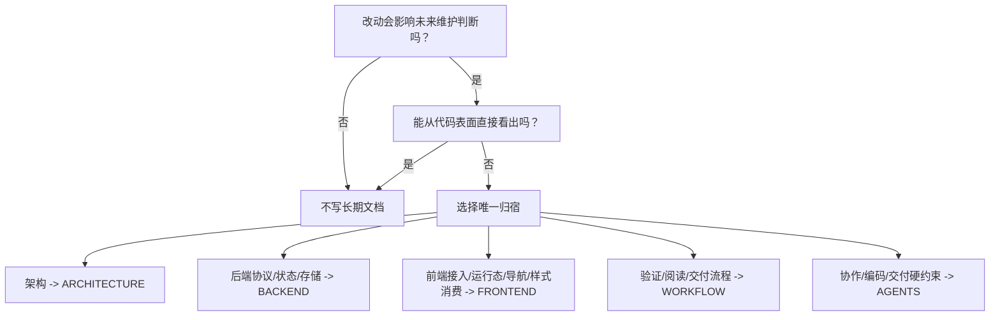

# LinguaGacha 工作流

本文件规定任务起手式、阅读路径、验证矩阵、文档同步和交付自检。专题正文不要写在这里；这里只告诉维护者何时读哪里、跑什么、交付时说明什么。

## 1. 起手式

1. 先判断任务类型，再按下表选择阅读路径。
2. 除非任务只涉及纯文档自检，否则先读 [`docs/ARCHITECTURE.md`](ARCHITECTURE.md)。
3. 改代码前确认状态拥有者、唯一写入口和事件回流路径。
4. 改动若会改变长期边界，同一任务内同步对应文档。
5. 完成后回看 diff，确认没有制造并行规则、旧入口或低密度重复正文。

## 2. 阅读路径

| 任务类型 | 必读 | 视情况补读 |
| --- | --- | --- |
| 架构、跨层边界、进程链路 | [`docs/ARCHITECTURE.md`](ARCHITECTURE.md) | [`docs/BACKEND.md`](BACKEND.md)、[`docs/FRONTEND.md`](FRONTEND.md) |
| Electron 桌面原生契约、preload 桥接、IPC | [`docs/ARCHITECTURE.md`](ARCHITECTURE.md)、[`docs/FRONTEND.md`](FRONTEND.md) | `src/native/` 根契约、`src/native/shell/`、`src/preload/`、`src/renderer/app/desktop/` |
| API、SSE、项目读取、mutation、错误码 | [`docs/BACKEND.md`](BACKEND.md) | `src/main/api/`、`src/renderer/app/desktop/` |
| 数据库、`.lg`、migration、状态写入口 | [`docs/BACKEND.md`](BACKEND.md) | `src/main/database/`、`src/main/migration/`、相关 service 测试 |
| 任务命令、运行态、引擎、worker、事件 | [`docs/BACKEND.md`](BACKEND.md) | `src/main/engine/`、`src/main/events/` |
| renderer、ProjectStore、导航 | [`docs/FRONTEND.md`](FRONTEND.md) | `src/renderer/app/`、相关页面 |
| 前端视觉和交互 | [`docs/FRONTEND.md`](FRONTEND.md) | `DESIGN.md`、相关 CSS 和组件 |
| 长期文档治理 | `.codex/skills/project-doc/SKILL.md` | `AGENTS.md` 与 `docs/` 目标形态 |

## 3. 验证矩阵

| 改动范围 | 最小验证 | 追加验证 |
| --- | --- | --- |
| 纯长期文档 | `npm run lint` 可选；必须检查链接和目标文档形态 | 涉及 README / 脚本提示时跑相关脚本或全文检索 |
| TypeScript 非视觉逻辑 | `npm test -- <相关 test 文件>` 或 `npm test` | `npm run lint` |
| 后端 API / database / task | `npm run check:backend` + 相关 `src/main/**/*.test.ts` | `npm test` |
| renderer 状态 / 页面逻辑 | `npm run check:frontend` + 相关 `src/renderer/**/*.test.ts(x)` | `npm run lint` |
| 前端视觉 / CSS / 组件外观 | `npm run check:frontend` + 相关组件或页面测试 | Electron 真机检查；需要时接 9222 DevTools |
| 跨前后端运行态或共享契约 | `npm run check:boundaries` + 后端相关测试 + renderer runtime/store 测试 | `npm test`，必要时启动 `npm run dev` 真机走主链路 |
| 构建或打包配置 | `npm run build` | 按影响范围追加测试 |

无法执行、只执行部分或验证失败时，交付必须说明原因、影响范围和剩余风险。

## 4. 文档同步规则

- 同一规则只能有一个权威归宿；其它位置只保留短引用。
- `AGENTS.md` 只保留代理协作、仓库级硬约束、编码约束和交付硬约束，不展开专题正文。
- `docs/ARCHITECTURE.md` 是阅读路由和系统分层，不承载协议字段、状态表或验证矩阵。
- 后端协议与数据域权威都归 `docs/BACKEND.md`，不得新增并行 API 或数据域入口。
- `docs/FRONTEND.md` 不替代产品与设计流程；遇到产品语义或设计权威，提醒走 `PRODUCT.md` / `DESIGN.md` 对应流程。
- 删除或迁移文档入口前，必须全文检索 README、脚本报错、测试断言和技能提示，确认不再指向旧入口。

## 5. 交付自检

交付前逐项确认：

- `git diff` 中的命名、注释、实现边界和文档边界一致。
- 没有把专题正文写进 `AGENTS.md` 或 `ARCHITECTURE.md`。
- 没有新增与 `BACKEND.md`、`FRONTEND.md` 并行的临时权威入口。
- 协议、状态、数据库、前端运行态和验证要求的变更已同步到唯一归宿。
- 命中前端、后端或跨层共享契约边界的改动已执行对应 `check:*` 脚本。
- 验证命令已按矩阵执行，并在交付中说明结果。
- 前端视觉改动已说明是否核对 `DESIGN.md` 和是否执行 `npm run check:frontend`。
