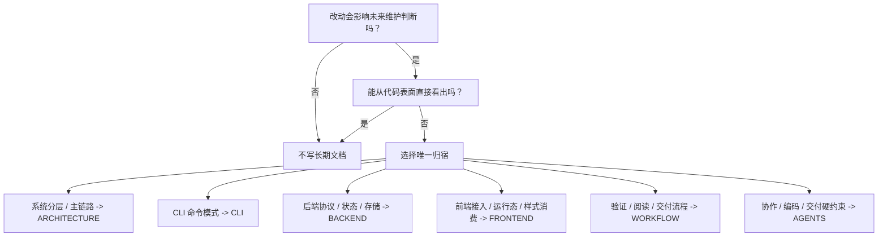

# LinguaGacha 工作流

本文件规定任务起手式、阅读路径、验证矩阵、文档同步和交付自检。专题正文不要写在这里，这里只说明维护者何时读哪里、跑什么、交付时说明什么。

## 1. 起手式

1. 先判断任务类型，再按阅读路径进入唯一归宿。
2. 除非任务只涉及纯文档自检，否则先读 [`docs/ARCHITECTURE.md`](ARCHITECTURE.md)，再读对应专题文档。
3. 改代码前确认状态拥有者、唯一写入口、事件回流路径和失败回滚语义，不要只按目录名推断边界。
4. 代码事实优先于文档，文档与代码冲突时回到当前实现，证据仍不足则列为未决，不写成长期规则。
5. 改动会影响未来维护判断时，同一任务内同步唯一归宿文档，不影响边界、契约或验证的局部实现不要写长期文档。
6. 完成后回看 diff，确认没有制造并行规则、旧入口、低密度重复正文或无关改动。

## 2. 阅读路径

| 任务类型 | 必读 | 视情况补读 |
| --- | --- | --- |
| 架构、跨层边界、进程链路 | [`ARCHITECTURE.md`](ARCHITECTURE.md) | `src/index.ts`、`src/core/bootstrap/` |
| GUI / CLI 分发、产品入口、打包入口 | [`ARCHITECTURE.md`](ARCHITECTURE.md) | [`CLI.md`](CLI.md)、`src/gui/`、`src/cli/`、`buildtools/builder/` |
| CLI 命令、参数、临时工程、资源、输出 | [`CLI.md`](CLI.md) | [`BACKEND.md`](BACKEND.md)、`src/cli/`、相关 CLI 测试 |
| API、SSE、错误、项目读取、mutation | [`BACKEND.md`](BACKEND.md) | `src/core/api/`、`src/core/project/`、`src/shared/error/` |
| 数据库、`.lg`、migration、asset、NativeFs | [`BACKEND.md`](BACKEND.md) | `src/core/database/`、`src/core/migration/`、`src/native/` |
| 任务命令、运行态、worker、LLM | [`BACKEND.md`](BACKEND.md) | `src/core/engine/`、`src/core/llm/`、`src/core/service/task-service.ts` |
| Electron / preload / renderer Core 接入 | [`FRONTEND.md`](FRONTEND.md) | `src/gui/bridge/`、`src/gui/ipc/`、`src/gui/preload/`、`src/renderer/app/desktop/` |
| 页面 query runtime、导航、项目页 runtime、校对列表运行态 | [`FRONTEND.md`](FRONTEND.md) | `src/renderer/project/`、`src/renderer/pages/`、相关 renderer 测试 |
| 前端视觉、样式、可见文案 | [`FRONTEND.md`](FRONTEND.md) | `DESIGN.md`、`src/renderer/index.css`、相关组件 / 页面 CSS |
| 长期文档治理 | `.codex/skills/project-doc/SKILL.md` | `AGENTS.md`、`docs/` 目标形态、README / 脚本引用 |

## 3. 验证矩阵

代码、测试、构建配置或脚本有任何改动时，先执行代码基线验证，再按影响范围追加测试：

1. `npx tsc -b --noEmit`
2. `npm run lint`
3. `npm run check`
4. `npm run format`

| 改动范围 | 基线后追加验证 |
| --- | --- |
| 纯长期文档 | 检查目标文档形态、相对链接和 diff，涉及 README、脚本提示或测试断言时全文检索相关入口 |
| TypeScript 非视觉逻辑 | `npm test -- <相关 test 文件>` 或 `npm test` |
| 后端 API / database / task / shared error | 相关 `src/core/**/*.test.ts`，影响共享行为时跑 `npm test` |
| CLI 命令、入口分发或平台启动器 | 相关 `src/cli/**/*.test.ts`、`src/index.test.ts`、`buildtools/builder/*.test.mjs`，影响打包时跑 `npm run build` |
| renderer 状态 / 页面逻辑 | 相关 `src/renderer/**/*.test.ts(x)` |
| 前端视觉 / CSS / 可见文案 | 相关页面或组件测试，核对 `DESIGN.md`，必要时 Electron 真机检查 |
| 跨前后端运行态或共享契约 | 后端相关测试 + renderer runtime/store 测试，必要时 `npm test` 或 `npm run dev` 走主链路 |
| 构建、Vite、electron-builder、发布资产 | `npm run build`，按影响范围追加 CLI / renderer / backend 测试 |

纯长期文档不强制执行代码基线验证，若同时改代码或工程配置，则按代码基线处理。

## 4. 文档同步规则

- 同一规则只能有一个权威归宿，其它位置只保留必要短引用。
- `AGENTS.md` 只保留代理协作、仓库级硬约束、编码约束和交付硬约束，不展开专题正文。
- `ARCHITECTURE.md` 是专题边界地图和运行时分层，不承载协议字段、状态表、验证矩阵或用户教程。
- `CLI.md` 不承载 HTTP / SSE、数据库 schema、renderer 运行态或用户长教程。
- `BACKEND.md` 不写页面交互教程，也不替代字段类型定义。
- `FRONTEND.md` 不替代产品与设计流程，产品语义和视觉规范分别回 `PRODUCT.md` / `DESIGN.md`。
- 删除或迁移文档入口前，全文检索 README、脚本报错、测试断言、技能提示和文档内链接，确认不再指向旧入口。

## 5. 交付自检

- `git diff` 只包含本任务相关文件，命名、注释、实现边界与文档边界一致。
- 没有把专题正文写进 `AGENTS.md` 或 `ARCHITECTURE.md`，也没有新增临时权威入口。
- 协议、状态、数据库、前端运行态、CLI 或验证要求的变化已同步到唯一归宿。
- 代码、测试、构建配置或脚本改动已执行代码基线验证，并按矩阵追加影响范围内的测试，未执行项已说明原因。
- 前端视觉改动已说明是否核对 `DESIGN.md`，以及是否做了真机或等价验证。
- 交付中列出实际执行的验证，失败、跳过或无法执行的命令要说明原因和影响范围。

## 6. 更新触发条件

- 改起手阅读路径、验证命令、检查脚本、文档同步归宿或交付格式，更新本文。
- 新增长期文档入口、删除旧入口或改变 `AGENTS.md` 与 `docs/` 的目标形态，更新本文并检查仓库链接。
- 改产品 / 设计流程入口时，只在本文保留入口关系，不吸收 `PRODUCT.md` / `DESIGN.md` 正文。
