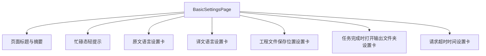
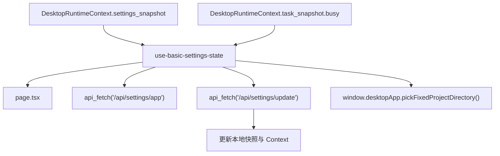

# frontend-vite 基础设置页设计

## 1. 背景

当前 `frontend-vite` 的 `basic-settings` 路由仍然使用占位调试页，尚未承接 Qt 版 [`frontend/Setting/BasicSettingsPage.py`](../../frontend/Setting/BasicSettingsPage.py) 的真实设置能力。  
Qt 版基础设置页当前已经承载以下 5 个高频设置项：

1. 原文语言
2. 译文语言
3. 工程文件保存位置
4. 任务完成时打开输出文件夹
5. 请求超时时间

本次设计目标不是重新发明设置中心，而是在 `frontend-vite` 中以符合现有分层规则的方式，严格对齐 Qt 版页面语义、即时保存体验和忙碌锁定约束。

## 2. 目标与非目标

### 2.1 目标

1. 在 `frontend-vite` 中实现可替代占位页的基础设置页面。
2. 严格对齐 Qt 版 5 个设置项的读写语义。
3. 保留“任务忙碌时锁定原文语言 / 译文语言”的约束。
4. 保持 `frontend-vite` 既有页面分层，不把页面状态、接口请求和视图细节全部堆到一个文件里。
5. 补齐中英文文案，使页面支持现有语言切换能力。

### 2.2 非目标

1. 不在本次任务中扩展专家设置页或应用设置页。
2. 不抽象一个覆盖全站的通用设置框架。
3. 不改动 Core API 设置接口契约。
4. 不改变 Qt 版当前设置含义与交互时机。

## 3. 约束与已确认决策

| 项目 | 决策 |
| --- | --- |
| 页面骨架 | 使用纵向设置卡列表，优先贴近 Qt 版阅读路径 |
| 保存方式 | 所有设置项均为即时保存 |
| 语言锁定 | `task_snapshot.busy === true` 时禁用原文语言和译文语言 |
| 保存目录交互 | 切换到 `FIXED` 时立即弹目录选择；取消则回退到旧值 |
| 页面范围 | 仅覆盖 Qt 版基础设置页的 5 个设置项 |

## 4. 方案比较

| 方案 | 说明 | 优点 | 缺点 |
| --- | --- | --- | --- |
| 方案 A | 在 `page.tsx` 内直接组织所有接口和交互逻辑 | 文件少，实现快 | 状态、接口、视图耦合过重，后续扩展困难 |
| 方案 B | 页面装配、页面级 hook、页面私有组件分层实现 | 符合 `frontend-vite` 规范，便于维护和测试 | 文件数略多 |
| 方案 C | 顺手抽象通用设置中心底座 | 长期复用潜力高 | 明显超出当前任务边界 |

### 结论

采用 `方案 B`。  
原因是该方案既能完整保留 Qt 版语义，又符合 `frontend-vite/SPEC.md` 对页面分层、依赖方向和局部组件落位的要求。

## 5. 页面结构设计

### 5.1 文件落点

```text
frontend-vite/src/renderer/pages/basic-settings-page/
├─ page.tsx
├─ basic-settings-page.css
├─ types.ts
├─ use-basic-settings-state.ts
└─ components/
   └─ setting-card-row.tsx
```

### 5.2 职责划分

| 文件 | 职责 |
| --- | --- |
| `page.tsx` | 页面装配入口，组织 5 张设置卡并导入页面样式 |
| `use-basic-settings-state.ts` | 设置快照读写、即时保存、错误回退、忙碌锁定、目录选择语义 |
| `types.ts` | 设置页本地类型、保存模式常量、控件选项模型 |
| `components/setting-card-row.tsx` | 页面私有设置卡骨架，负责标题、说明、右侧控件区域和状态提示 |
| `basic-settings-page.css` | 页面私有布局、卡片间距、响应式换行规则 |

### 5.3 页面结构



页面整体保持单列纵向滚动，桌面宽度下以紧凑的卡片节奏对齐当前 React 设计系统；在较窄宽度下，卡片右侧控件允许换行到底部，避免控件被硬压缩。

## 6. 数据流与状态设计

### 6.1 权威状态来源

基础设置页的数据来源仍然是 Core API 的 `/api/settings/app` 与 `/api/settings/update`。  
渲染层已有的 `DesktopRuntimeContext` 已维护全局 `settings_snapshot` 与 `task_snapshot`，因此本页遵守以下原则：

1. 首屏使用 `DesktopRuntimeContext.settings_snapshot` 作为同步渲染来源，避免页面闪烁。
2. 页面挂载后主动调用 `refresh_settings()`，拿到最新快照后刷新本地视图。
3. 单项设置更新成功后，用服务端返回的新快照同时刷新页面本地状态与 `DesktopRuntimeContext` 中的 `settings_snapshot`。
4. 忙碌锁定直接读取 `DesktopRuntimeContext.task_snapshot.busy`，不在页面内部维护第二份并行任务状态。

### 6.2 数据流



### 6.3 类型约束

页面实现时需要显式建模以下核心类型：

| 类型 | 作用 |
| --- | --- |
| `ProjectSaveMode` | 收敛 `MANUAL` / `FIXED` / `SOURCE`，避免魔术字符串散落 |
| `BasicSettingsSnapshot` | 对齐接口返回中的 5 个设置字段 |
| `LanguageOption` | 语言枚举值与当前显示名称的组合 |
| `SettingPendingState` | 跟踪每个设置项自己的提交中状态 |

## 7. 设置项交互设计

### 7.1 原文语言

- 数据字段：`source_language`
- 选项列表：`ALL` + 语言枚举列表
- 显示名称：
  - 中文界面使用中文语言名
  - 英文界面使用英文语言名
- 锁定条件：
  - `task_snapshot.busy === true`
  - 或该设置项当前请求尚未完成

### 7.2 译文语言

- 数据字段：`target_language`
- 选项列表：仅语言枚举列表，不提供 `ALL`
- 锁定条件与原文语言一致

### 7.3 工程文件保存位置

- 数据字段：`project_save_mode`、`project_fixed_path`
- 模式选项：
  - `MANUAL`
  - `FIXED`
  - `SOURCE`
- 特殊交互：
  - 当用户切换到 `FIXED` 时，先调用 `window.desktopApp.pickFixedProjectDirectory()`
  - 如果返回 `canceled === true` 或 `path === null`，则不发更新请求，下拉框回退到旧模式
  - 如果用户选择了目录，则一次提交新的 `project_save_mode` 与 `project_fixed_path`
  - 从 `FIXED` 切到其他模式时，仅更新 `project_save_mode`，保留已有 `project_fixed_path` 作为下次目录选择默认值
- 描述文案：
  - 非 `FIXED` 模式显示默认说明
  - `FIXED` 模式且有路径时显示带路径的说明文案

### 7.4 任务完成时打开输出文件夹

- 数据字段：`output_folder_open_on_finish`
- 控件形态：开关
- 交互语义：点击即保存

### 7.5 请求超时时间

- 数据字段：`request_timeout`
- 控件形态：数字输入框
- 取值约束：
  - 首版延续 Qt 版范围：`0 ~ 9999999`
  - 改值即保存

## 8. 即时保存与错误处理

### 8.1 即时保存策略

页面级 hook 暴露统一的单项更新入口，内部负责：

1. 记录更新前快照
2. 标记当前设置项进入 `pending`
3. 调用 `/api/settings/update`
4. 成功后以服务端快照覆盖本地展示
5. 失败后恢复旧值并弹出错误提示
6. 清理该设置项的 `pending`

该策略确保：

- 每个设置项只写自己负责的字段
- 某一项提交失败不会污染其他项的显示
- 页面不会产生“本地看起来成功，实际服务端没保存”的双写问题

### 8.2 错误处理

| 场景 | 处理 |
| --- | --- |
| 首次刷新设置失败 | 保留 Context 现有快照，页面顶部显示非阻断错误提示，并允许用户重试 |
| 单项设置更新失败 | 控件回退到旧值，并通过全局 toast 告知错误 |
| 目录选择失败或桥接异常 | 不更新设置，提示用户目录选择失败 |
| 任务忙碌时尝试改语言 | 控件直接禁用，不允许进入请求流程 |

### 8.3 状态提示

当任务处于忙碌态时，在页面标题下方展示一条轻提示文案，明确说明“任务运行中，语言设置暂时锁定”，避免用户只看到灰态控件却不理解原因。

## 9. 视觉与样式原则

### 9.1 页面风格

本页采用纵向设置卡列表，优先复用当前设计系统提供的卡片、按钮、输入类组件，只在页面层处理：

1. 卡片之间的垂直节奏
2. 标题区与设置区的布局
3. 窄宽度下的控件换行
4. 路径说明和轻提示的语义文本样式

### 9.2 明确禁止

1. 不在页面 CSS 中重新定义 `Card`、`Button` 的基础皮肤。
2. 不新增页面级 `--ui-*` 变量。
3. 不在页面层直接改全局主题状态。

## 10. 本地化设计

基础设置页需要在 `zh-CN/setting.ts` 与 `en-US/setting.ts` 同步补齐以下文案：

1. 页面标题
2. 页面摘要
3. 忙碌锁定提示
4. 5 个设置项的标题与描述
5. 保存模式 3 个选项的名称
6. 带固定目录路径的描述文案
7. 设置加载失败与目录选择失败提示

要求：

1. 中英文资源结构保持一致
2. 优先复用现有通用动作文案
3. 不在页面组件中硬编码用户可见文本

## 11. 验证方案

### 11.1 交互回归

1. 页面能从占位页切换为真实基础设置页。
2. 原文语言首项包含 `ALL`。
3. 译文语言不包含 `ALL`。
4. 任务忙碌时原文语言与译文语言被禁用。
5. 保存位置切换到 `FIXED` 时会弹目录选择。
6. 目录选择取消后，下拉框恢复旧值。
7. 目录选择成功后，模式与路径同时保存。
8. 开关切换后立即保存。
9. 数字输入修改后立即保存。
10. API 失败时控件会回退并提示错误。

### 11.2 代码质量

1. 运行 `frontend-vite` 相关格式化与 lint。
2. 检查页面 CSS 未越权改写设计系统基础皮肤。
3. 检查 i18n 中英文键结构一致。

## 12. 实施边界

本设计仅覆盖 `frontend-vite` 基础设置页的实现，不包含：

1. Qt 版页面重构
2. 专家设置页联动改造
3. 应用设置页整合
4. Core API 扩展字段

## 13. 结论

本次基础设置页将以“严格对齐 Qt 语义、遵守 React 子工程分层、保持即时保存体验”为核心原则，在 `frontend-vite` 内落地一个真实可用的基础设置页面。  
实现完成后，`basic-settings` 路由将不再是调试占位页，而会成为 React 桌面前端中与 Qt 版一致的常用设置入口。
