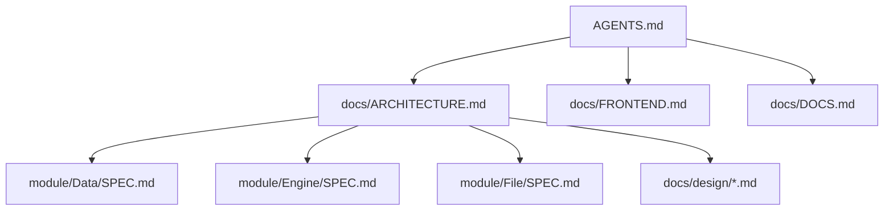
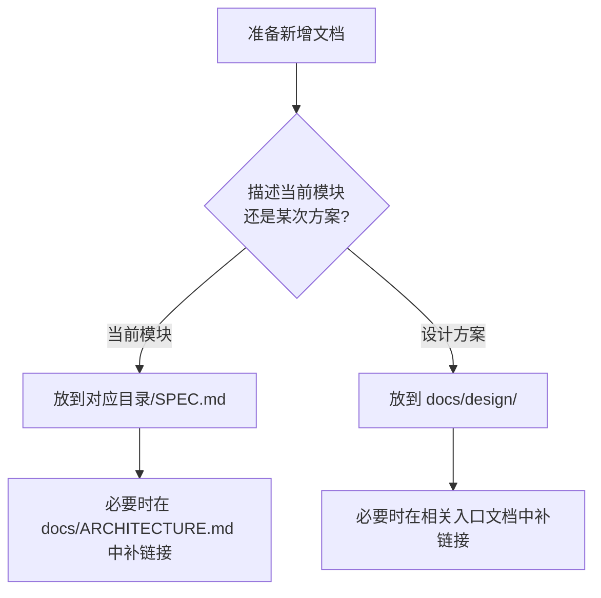

# LG 文档系统 v1 设计

## 背景
当前仓库已经存在面向 AGENT 的规则与局部说明，但相关知识仍然分散在对话、模块目录和仓库规则中，缺少一份统一的设计说明来明确文档体系应该如何组织。

当前阶段的目标不是建设庞大的知识库，而是降低 AGENT 理解仓库现状、定位改动入口、同步维护文档时的摩擦成本。因此，文档体系应优先服务开发、维护和验证任务，并尽量贴近仓库当前真实结构。

## 目标
- 定义 LG 仓库中文档的最小可用结构
- 明确仓库级文档、设计文档和模块级说明文档的职责边界
- 统一模块说明文档的命名与放置规则
- 明确文档之间的跳转关系，帮助 AGENT 快速找到正确入口
- 为后续起草 `docs/DOCS.md`、`docs/ARCHITECTURE.md`、`docs/FRONTEND.md` 提供依据

## 非目标
- 不在本设计中直接编写最终的 `docs/DOCS.md`、`docs/ARCHITECTURE.md` 或 `docs/FRONTEND.md` 正文
- 不在本设计中要求一次性为所有模块补齐 `SPEC.md`
- 不建立多层级、重型、面向未来扩展的知识库体系
- 不将模块局部说明统一迁移到 `docs/` 中集中维护

## 设计原则
### 聚焦现状
文档优先描述仓库当前已经存在的结构、入口、边界和约束，而不是为了未来可能的扩展预先建立复杂层级。

### 总图与局部分离
仓库级文档负责导航与总览，模块级文档负责解释局部结构。上层文档不复制局部正文，局部文档不复述全局地图。

### 单一真相
同一份说明只在一个地方维护。跨文档复用通过链接完成，不通过复制正文完成。

### 文档贴近维护者
模块局部说明继续放在模块目录下，保证修改代码的人可以顺手同步更新说明，减少文档与实现漂移。

### 轻量优先
文档层级和文件种类保持最小化，保证 AGENT 可以迅速理解和使用，而不是在文档系统本身消耗过多注意力。

## 目录结构
推荐的文档结构如下：

```text
AGENTS.md
docs/
├── ARCHITECTURE.md
├── FRONTEND.md
├── DOCS.md
└── design/
    ├── documentation-system-v1-design.md
    └── <feature-name>-design.md

base/
frontend/
model/
module/
resource/
tests/
widget/
```

模块局部说明文档不集中搬到 `docs/`，而是继续贴着模块放置：

```text
module/
├── Data/
│   └── SPEC.md
├── Engine/
│   └── SPEC.md      # 需要时再补
└── File/
    └── SPEC.md      # 需要时再补
```

## 文档分层与职责
### `AGENTS.md`
- 放置最短规则、阅读入口和关键跳转
- 不展开架构正文、模块细节或设计历史

### `docs/ARCHITECTURE.md`
- 描述仓库整体结构、核心模块关系和推荐阅读路径
- 链接到相关模块的 `SPEC.md`
- 不展开模块内部实现细节

### `docs/FRONTEND.md`
- 描述前端层结构、页面入口、关键 UI 状态和前端改动路径
- 不承担页面级完整实现说明

### `docs/DOCS.md`
- 定义文档体系本身的放置规则、命名规则、互链规则和更新规则
- 不承担业务实现或架构现状说明

### `docs/design/*.md`
- 记录某次设计的背景、目标、方案、取舍和结论
- 用于保存阶段性设计决策
- 不替代仓库当前现状文档

### `*/SPEC.md`
- 描述某个模块的局部结构、阅读顺序、边界、分工、主流程和常见坑位
- 不承担仓库总览或其他模块的规则说明

## 命名规范
### 仓库级文档
- `ARCHITECTURE.md`
- `FRONTEND.md`
- `DOCS.md`

这些文件统一放在 `docs/` 下，不使用 `index.md`。

### 模块级文档
模块局部说明统一命名为 `SPEC.md`，例如：

- `module/Data/SPEC.md`
- `module/Engine/SPEC.md`
- `module/File/SPEC.md`

### 设计文档
设计文档统一放在 `docs/design/` 下，命名为：

```text
<feature-name>-design.md
```

例如：

- `documentation-system-v1-design.md`
- `analysis-progress-design.md`

## Windows 与 Git 注意事项
当前开发环境为 Windows，文件系统对大小写不敏感。如果将现有的小写 `spec.md` 改为 `SPEC.md`，不能仅依赖大小写变更。

建议通过中间文件名完成重命名：

```text
spec.md -> SPEC.tmp.md -> SPEC.md
```

这样可以避免 Git 索引对大小写改名识别不稳定的问题。

## 互链规则
文档之间的跳转关系如下：



具体规则如下：

1. `AGENTS.md` 应链接到 `docs/ARCHITECTURE.md`、`docs/FRONTEND.md`、`docs/DOCS.md`
2. `docs/ARCHITECTURE.md` 应链接到相关模块的 `SPEC.md`
3. `docs/FRONTEND.md` 应链接到关键页面入口和相关业务入口
4. `docs/design/*.md` 可以被仓库级文档引用，但不替代现状文档
5. 仓库级文档不复制模块 `SPEC.md` 的正文
6. 模块 `SPEC.md` 不复述仓库级总览

## 文档更新规则
当发生以下变更时，应同步更新对应文档：

| 变更类型 | 必须同步的文档 |
| --- | --- |
| 模块职责变化 | 对应模块 `SPEC.md` |
| 仓库结构或模块关系变化 | `docs/ARCHITECTURE.md` |
| 前端页面入口或状态约束变化 | `docs/FRONTEND.md` |
| 文档体系规则变化 | `docs/DOCS.md` |
| 新方案或重大设计取舍 | `docs/design/*.md` |

建议将下面这条作为硬规则：

> 如果代码变更会让现有文档描述失真，应在同一任务内同步修正文档。

## 新增文档的决策流程
新增文档时，应优先判断它是在描述“当前模块如何工作”，还是在描述“某次设计为何这样做”。



简化规则如下：

- 解释“当前怎么工作”就写 `SPEC.md`
- 解释“为什么这样改”就写 `docs/design/*.md`

## 推荐模板
### 模块 `SPEC.md` 模板
```md
# `<module-path>` 说明

## 一句话总览
## 适合 AGENT 的阅读顺序
## 目录结构
## 模块边界
## 核心对象或子模块分工
## 主流程
## 修改建议
## 最容易踩坑的地方
## 给未来 AGENT 的工作准则
```

### 设计文档模板
```md
# `<feature-name>` 设计

## 背景
## 目标
## 非目标
## 设计原则
## 目录结构
## 文档分层与职责
## 命名规范
## 互链规则
## 文档更新规则
## 新增文档的决策流程
## 推荐模板
```

## 现有文档的整合方式
当前已发现的模块说明文档为 `module/Data/spec.md`。该文档应保留其“模块局部说明”的语义，并在后续按命名规范统一为 `module/Data/SPEC.md`。

整合方式如下：

- 不将该文档正文迁移到 `docs/`
- 在 `docs/ARCHITECTURE.md` 中链接到该文档
- 在 `docs/DOCS.md` 中规定 `SPEC.md` 的位置与命名规则
- 后续需要时，再为 `module/Engine`、`module/File` 等模块补充同类文档

## 结论
LG 文档系统 v1 采用轻量、现状导向的组织方式：

- `docs/` 只放仓库级地图、文档规则和设计文档
- 模块局部说明统一放在各自目录下的 `SPEC.md`
- 仓库级文档负责导航，不复制局部正文
- 模块级文档负责解释局部结构，不承担仓库总览

这套结构可以在不引入额外复杂层级的前提下，显著降低 AGENT 理解现状和维护文档的一致性成本。
