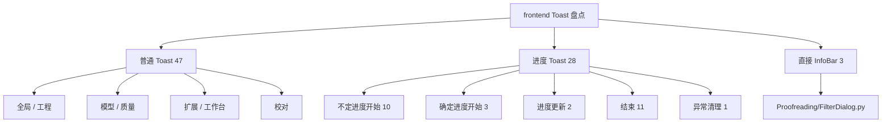

# `frontend/` Toast 与不定进度 Toast 调用盘点

## 1. 范围与方法

- 盘点范围只包含旧页面目录 `frontend/`，不包含 `frontend-vite/`。
- 检索对象包含三类：
  - 事件总线普通 Toast：`Base.Event.TOAST`
  - 事件总线进度 Toast：`Base.Event.PROGRESS_TOAST`
  - 直接绕过事件总线的 `InfoBar.*`
- 检索方法：
  - 先用 `ast-grep` 搜索 `emit(Base.Event.TOAST / PROGRESS_TOAST, ...)` 与 `InfoBar.*(...)`
  - 再用 `uv run python` 的 AST 脚本抽取文件、函数、行号、类型、文案表达式与子事件
- 盘点日期：`2026-04-17`

## 2. 结论速览

| 项目 | 数量 | 说明 |
| --- | ---: | --- |
| 普通 Toast | 47 | 通过 `Base.Event.TOAST` 发出 |
| 进度 Toast | 28 | 通过 `Base.Event.PROGRESS_TOAST` 发出 |
| 直接 `InfoBar.*` | 3 | 全部位于 `frontend/Proofreading/FilterDialog.py` |
| 不定进度开始 | 10 | `sub_event=RUN` 且 `indeterminate=True` |
| 确定进度开始 | 3 | `sub_event=RUN` 且 `indeterminate=False` |
| 进度更新 | 2 | `sub_event=UPDATE` |
| 进度结束 | 11 | `sub_event=DONE` |
| 异常清理 | 1 | `sub_event=ERROR` |

## 3. 结构图

## 4. 关键观察

- `frontend/Proofreading/ProofreadingPage.py` 是 Toast 最密集的页面：普通 Toast 22 处，进度 Toast 4 处，主要集中在搜索/筛选/替换/保存/批量翻译流程。
- `frontend/Quality/QualityRulePageBase.py`、`frontend/Quality/CustomPromptPage.py`、`frontend/Quality/QualityRulePresetManager.py` 都把 Toast 封装成统一出口；如果后续想统一埋点或统一文案口径，这几处是优先入口。
- `frontend/Proofreading/FilterDialog.py` 直接使用 `InfoBar.warning/success/error`，没有走 `Base.Event.TOAST`，它是当前旧页面里最明显的“旁路”。
- `frontend/ProjectPage.py` 的模块级 `emit_toast()` 目前只用于拖拽时的“多文件不支持”提示，影响范围很小。
- `frontend/Extra/TSConversionPage.py` 与 `frontend/Proofreading/ProofreadingPage.py` 都同时存在“不定进度”和“确定进度”两段式流程。
- `frontend/Extra/NameFieldExtractionPage.py` 里定义了 `show_progress_toast()`，但本次盘点未找到该方法在 `frontend/` 内的直接调用；当前主流程更偏向“不定进度 + 完成后一次性反馈”。

## 5. 底层入口说明

| 入口 | 文件 | 作用 |
| --- | --- | --- |
| `AppFluentWindow.toast()` | `frontend/AppFluentWindow.py` | 把 `Base.Event.TOAST` 统一转成顶层 `InfoBar` |
| `AppFluentWindow.progress_toast_event()` | `frontend/AppFluentWindow.py` | 把 `RUN / UPDATE / DONE / ERROR` 分发给 `ProgressToast` |
| `ProjectPage.emit_toast()` | `frontend/ProjectPage.py` | 工程页模块级普通 Toast 辅助函数 |
| `NameFieldExtractionPage.show_toast()` | `frontend/Extra/NameFieldExtractionPage.py` | 人名提取页普通 Toast 辅助函数 |
| `CustomPromptPage.emit_toast()` | `frontend/Quality/CustomPromptPage.py` | 自定义提示词页普通 Toast 辅助函数 |
| `QualityRulePageBase.emit_toast_message()` | `frontend/Quality/QualityRulePageBase.py` | 质量规则基类普通 Toast 辅助函数 |
| `QualityRulePresetManager.show_toast()` | `frontend/Quality/QualityRulePresetManager.py` | 质量规则预设管理器普通 Toast 辅助函数 |
| `Proofreading/FilterDialog.py` 中的 `InfoBar.*` | `frontend/Proofreading/FilterDialog.py` | 直接弹顶层 InfoBar，不走事件总线 |

## 6. 普通 Toast 明细

> 下表是“真正发出 `Base.Event.TOAST` 的位置”。如果某一行是封装函数，比如 `show_toast()`、`emit_toast()`，更细的业务场景会在后文继续展开。

| 文件 | 行号 | 函数 | 类型 | 文案/消息 | 触发方式 |
| --- | ---: | --- | --- | --- | --- |
| `frontend/AppFluentWindow.py` | 441 | `switch_language` | `Base.ToastType.SUCCESS` | `Localizer.get().switch_language_toast` | `self.emit` |
| `frontend/AppFluentWindow.py` | 468 | `close_current_project` | `Base.ToastType.SUCCESS` | `Localizer.get().app_project_closed_toast` | `self.emit` |
| `frontend/Extra/NameFieldExtractionPage.py` | 628 | `show_toast` | `type` | `message` | `self.emit` |
| `frontend/Extra/TSConversionPage.py` | 313 | `show_task_failed_toast` | `Base.ToastType.ERROR` | `Localizer.get().task_failed` | `self.emit` |
| `frontend/Extra/TSConversionPage.py` | 327 | `start_conversion` | `Base.ToastType.WARNING` | `Localizer.get().task_running` | `self.emit` |
| `frontend/Extra/TSConversionPage.py` | 335 | `start_conversion` | `Base.ToastType.ERROR` | `Localizer.get().alert_no_data` | `self.emit` |
| `frontend/Extra/TSConversionPage.py` | 488 | `finish_progress` | `Base.ToastType.SUCCESS` | `Localizer.get().task_success` | `self.emit` |
| `frontend/Model/ModelAdvancedSettingPage.py` | 220 | `emit_json_format_error_toast` | `Base.ToastType.WARNING` | `Localizer.get().model_advanced_setting_page_json_format_error` | `self.emit` |
| `frontend/Model/ModelPage.py` | 412 | `model_test_done` | `Base.ToastType.SUCCESS if data.get('result', True) else Base.ToastType.ERROR` | `data.get('result_msg', '')` | `self.emit` |
| `frontend/Model/ModelPage.py` | 437 | `delete_model` | `Base.ToastType.WARNING` | `Localizer.get().model_page_delete_last_one_toast` | `self.emit` |
| `frontend/Model/ModelPage.py` | 524 | `reset_preset_model` | `Base.ToastType.SUCCESS` | `Localizer.get().model_page_reset_success_toast` | `self.emit` |
| `frontend/Model/ModelSelectorPage.py` | 214 | `get_models` | `Base.ToastType.WARNING` | `Localizer.get().model_selector_page_fail` | `self.emit` |
| `frontend/ProjectPage.py` | 68 | `emit_toast` | `toast_type` | `message` | `Base().emit` |
| `frontend/ProjectPage.py` | 1068 | `on_source_dropped` | `Base.ToastType.WARNING` | `Localizer.get().project_toast_no_valid_file` | `self.emit` |
| `frontend/ProjectPage.py` | 1145 | `on_lg_dropped` | `Base.ToastType.WARNING` | `Localizer.get().project_toast_invalid_lg` | `self.emit` |
| `frontend/ProjectPage.py` | 1175 | `on_lg_dropped` | `Base.ToastType.WARNING` | `message` | `self.emit` |
| `frontend/ProjectPage.py` | 1292 | `on_create_finished` | `Base.ToastType.ERROR` | `Localizer.get().project_toast_load_fail.replace('{ERROR}', str(e))` | `self.emit` |
| `frontend/ProjectPage.py` | 1304 | `on_create_finished` | `Base.ToastType.ERROR` | `Localizer.get().project_toast_create_fail.replace('{ERROR}', str(result))` | `self.emit` |
| `frontend/ProjectPage.py` | 1362 | `on_open_finished` | `Base.ToastType.ERROR` | `Localizer.get().project_toast_load_fail.replace('{ERROR}', str(result))` | `self.emit` |
| `frontend/Proofreading/ProofreadingPage.py` | 606 | `on_items_loaded_ui` | `Base.ToastType.ERROR` | `Localizer.get().alert_no_data` | `self.emit` |
| `frontend/Proofreading/ProofreadingPage.py` | 672 | `apply_filter` | `Base.ToastType.ERROR` | `f'{Localizer.get().search_regex_invalid}: {e}'` | `self.emit` |
| `frontend/Proofreading/ProofreadingPage.py` | 729 | `on_filter_done_ui` | `Base.ToastType.WARNING` | `Localizer.get().search_no_match` | `self.emit` |
| `frontend/Proofreading/ProofreadingPage.py` | 920 | `do_search` | `Base.ToastType.ERROR` | `f'{Localizer.get().search_regex_invalid}: {error_msg}'` | `self.emit` |
| `frontend/Proofreading/ProofreadingPage.py` | 955 | `on_search_options_changed` | `Base.ToastType.ERROR` | `f'{Localizer.get().search_regex_invalid}: {error_msg}'` | `self.emit` |
| `frontend/Proofreading/ProofreadingPage.py` | 1027 | `on_search_done_ui` | `Base.ToastType.WARNING` | `Localizer.get().search_no_match` | `self.emit` |
| `frontend/Proofreading/ProofreadingPage.py` | 1210 | `prepare_replace_context` | `Base.ToastType.ERROR` | `f'{Localizer.get().search_regex_invalid}: {error_msg}'` | `self.emit` |
| `frontend/Proofreading/ProofreadingPage.py` | 1232 | `prepare_replace_context` | `Base.ToastType.WARNING` | `Localizer.get().search_no_match` | `self.emit` |
| `frontend/Proofreading/ProofreadingPage.py` | 1323 | `action` | `Base.ToastType.ERROR` | `f'{Localizer.get().search_regex_invalid}: {error_msg}'` | `self.emit` |
| `frontend/Proofreading/ProofreadingPage.py` | 1363 | `action` | `Base.ToastType.WARNING` | `Localizer.get().search_no_match` | `self.emit` |
| `frontend/Proofreading/ProofreadingPage.py` | 1458 | `action` | `Base.ToastType.WARNING` | `Localizer.get().search_no_match` | `self.emit` |
| `frontend/Proofreading/ProofreadingPage.py` | 1473 | `action` | `Base.ToastType.WARNING` | `Localizer.get().search_no_match` | `self.emit` |
| `frontend/Proofreading/ProofreadingPage.py` | 1515 | `on_replace_all_done_ui` | `Base.ToastType.ERROR` | `Localizer.get().proofreading_page_save_failed` | `self.emit` |
| `frontend/Proofreading/ProofreadingPage.py` | 1526 | `on_replace_all_done_ui` | `Base.ToastType.WARNING` | `Localizer.get().proofreading_page_replace_no_change` | `self.emit` |
| `frontend/Proofreading/ProofreadingPage.py` | 1542 | `on_replace_all_done_ui` | `Base.ToastType.SUCCESS` | `Localizer.get().proofreading_page_replace_done.replace('{N}', str(changed_count))` | `self.emit` |
| `frontend/Proofreading/ProofreadingPage.py` | 1695 | `on_item_saved_ui` | `Base.ToastType.ERROR` | `Localizer.get().proofreading_page_save_failed` | `self.emit` |
| `frontend/Proofreading/ProofreadingPage.py` | 1712 | `on_item_saved_ui` | `Base.ToastType.SUCCESS` | `Localizer.get().toast_save` | `self.emit` |
| `frontend/Proofreading/ProofreadingPage.py` | 1762 | `on_copy_src_clicked` | `Base.ToastType.SUCCESS` | `Localizer.get().proofreading_page_copy_src_done` | `self.emit` |
| `frontend/Proofreading/ProofreadingPage.py` | 1780 | `on_copy_dst_clicked` | `Base.ToastType.SUCCESS` | `Localizer.get().proofreading_page_copy_dst_done` | `self.emit` |
| `frontend/Proofreading/ProofreadingPage.py` | 1930 | `on_translate_done_ui` | `Base.ToastType.ERROR` | `Localizer.get().task_failed` | `self.emit` |
| `frontend/Proofreading/ProofreadingPage.py` | 1946 | `on_translate_done_ui` | `Base.ToastType.SUCCESS` | `Localizer.get().task_batch_translation_success.replace('{SUCCESS}', str(changed_count)).replace('{FAILED}', '0')` | `self.emit` |
| `frontend/Proofreading/ProofreadingPage.py` | 1961 | `on_translate_done_ui` | `Base.ToastType.WARNING` | `Localizer.get().task_batch_translation_success.replace('{SUCCESS}', str(changed_count)).replace('{FAILED}', str(fail_count))` | `self.emit` |
| `frontend/Quality/CustomPromptPage.py` | 122 | `emit_toast` | `toast_type` | `message` | `self.emit` |
| `frontend/Quality/QualityRulePageBase.py` | 368 | `notify` | `type_map.get(level, Base.ToastType.INFO)` | `message` | `self.emit` |
| `frontend/Quality/QualityRulePageBase.py` | 547 | `emit_toast_message` | `toast_type` | `message` | `self.emit` |
| `frontend/Quality/QualityRulePresetManager.py` | 379 | `show_toast` | `toast_type` | `message` | `self.page.emit` |
| `frontend/Quality/TextReplacementPage.py` | 382 | `delete_entries_by_rows` | `Base.ToastType.SUCCESS` | `Localizer.get().toast_save` | `self.emit` |
| `frontend/Workbench/WorkbenchPage.py` | 545 | `on_export_translation_clicked` | `Base.ToastType.WARNING` | `Localizer.get().alert_project_not_loaded` | `self.emit` |

## 7. 进度 Toast 明细

> 下表记录 `Base.Event.PROGRESS_TOAST` 的直接发出点；其中 `RUN + indeterminate=True` 可视为本次盘点中的“不定进度 Toast”。

| 文件 | 行号 | 函数 | 子事件 | 不定进度 | 文案/消息 | 触发方式 |
| --- | ---: | --- | --- | --- | --- | --- |
| `frontend/Analysis/AnalysisPage.py` | 178 | `update_button_status` | `Base.SubEvent.DONE` | `` | `` | `self.emit` |
| `frontend/Analysis/AnalysisPage.py` | 469 | `triggered` | `Base.SubEvent.RUN` | `True` | `Localizer.get().analysis_page_indeterminate_stopping` | `self.emit` |
| `frontend/AppFluentWindow.py` | 494 | `open_project_page` | `Base.SubEvent.RUN` | `True` | `Localizer.get().app_new_version_applying` | `self.emit` |
| `frontend/AppFluentWindow.py` | 559 | `app_update_apply_error` | `Base.SubEvent.DONE` | `` | `` | `self.emit` |
| `frontend/Extra/NameFieldExtractionPage.py` | 361 | `show_progress_toast` | `Base.SubEvent.RUN` | `False` | `msg` | `self.emit` |
| `frontend/Extra/NameFieldExtractionPage.py` | 374 | `update_progress_toast` | `Base.SubEvent.UPDATE` | `` | `msg` | `self.emit` |
| `frontend/Extra/NameFieldExtractionPage.py` | 386 | `hide_indeterminate_toast` | `Base.SubEvent.DONE` | `` | `` | `self.emit` |
| `frontend/Extra/NameFieldExtractionPage.py` | 421 | `extract_names` | `Base.SubEvent.RUN` | `True` | `Localizer.get().name_field_extraction_action_progress` | `self.emit` |
| `frontend/Extra/NameFieldExtractionPage.py` | 516 | `translate_names` | `Base.SubEvent.RUN` | `True` | `Localizer.get().task_batch_translation_progress.replace('{CURRENT}', '1').replace('{TOTAL}', str(count))` | `self.emit` |
| `frontend/Extra/TSConversionPage.py` | 295 | `clear_missing_task_state` | `Base.SubEvent.ERROR` | `` | `` | `self.emit` |
| `frontend/Extra/TSConversionPage.py` | 393 | `handle_start_result` | `Base.SubEvent.RUN` | `True` | `Localizer.get().ts_conversion_action_preparing` | `self.emit` |
| `frontend/Extra/TSConversionPage.py` | 443 | `show_preparing_progress` | `Base.SubEvent.RUN` | `True` | `Localizer.get().ts_conversion_action_preparing` | `self.emit` |
| `frontend/Extra/TSConversionPage.py` | 467 | `show_running_progress` | `sub_event` | `False` | `message` | `self.emit` |
| `frontend/Extra/TSConversionPage.py` | 483 | `finish_progress` | `Base.SubEvent.DONE` | `` | `` | `self.emit` |
| `frontend/ProjectPage.py` | 1249 | `on_create_project` | `Base.SubEvent.RUN` | `False` | `Localizer.get().project_progress_creating` | `self.emit` |
| `frontend/ProjectPage.py` | 1275 | `on_create_finished` | `Base.SubEvent.DONE` | `` | `` | `self.emit` |
| `frontend/ProjectPage.py` | 1322 | `on_open_project` | `Base.SubEvent.RUN` | `True` | `Localizer.get().project_progress_loading` | `self.emit` |
| `frontend/ProjectPage.py` | 1348 | `on_open_finished` | `Base.SubEvent.DONE` | `` | `` | `self.emit` |
| `frontend/Proofreading/ProofreadingPage.py` | 2080 | `indeterminate_show` | `Base.SubEvent.RUN` | `True` | `msg` | `self.emit` |
| `frontend/Proofreading/ProofreadingPage.py` | 2091 | `progress_show` | `Base.SubEvent.RUN` | `False` | `msg` | `self.emit` |
| `frontend/Proofreading/ProofreadingPage.py` | 2104 | `progress_update` | `Base.SubEvent.UPDATE` | `` | `msg` | `self.emit` |
| `frontend/Proofreading/ProofreadingPage.py` | 2116 | `indeterminate_hide` | `Base.SubEvent.DONE` | `` | `` | `self.emit` |
| `frontend/Quality/QualityRulePageBase.py` | 1255 | `invalidate_statistics` | `Base.SubEvent.DONE` | `` | `` | `self.emit` |
| `frontend/Quality/QualityRulePageBase.py` | 1274 | `on_statistics_done` | `Base.SubEvent.DONE` | `` | `` | `self.emit` |
| `frontend/Quality/QualityRulePageBase.py` | 1366 | `show_statistics_preparing_progress` | `Base.SubEvent.RUN` | `True` | `Localizer.get().toast_processing` | `self.emit` |
| `frontend/Quality/QualityRulePageBase.py` | 1380 | `hide_statistics_preparing_progress` | `Base.SubEvent.DONE` | `` | `` | `self.emit` |
| `frontend/Translation/TranslationPage.py` | 174 | `update_button_status` | `Base.SubEvent.DONE` | `` | `` | `self.emit` |
| `frontend/Translation/TranslationPage.py` | 576 | `triggered` | `Base.SubEvent.RUN` | `True` | `Localizer.get().translation_page_indeterminate_stopping` | `self.emit` |

## 8. 直接 `InfoBar` 明细

| 文件 | 行号 | 函数 | 方法 | title | content |
| --- | ---: | --- | --- | --- | --- |
| `frontend/Proofreading/FilterDialog.py` | 313 | `export_error_report` | `InfoBar.warning` | `Localizer.get().alert` | `Localizer.get().alert_no_data` |
| `frontend/Proofreading/FilterDialog.py` | 419 | `export_error_report` | `InfoBar.success` | `Localizer.get().task_success` | `''` |
| `frontend/Proofreading/FilterDialog.py` | 430 | `export_error_report` | `InfoBar.error` | `Localizer.get().task_failed` | `''` |

## 9. 封装出口展开

### 9.1 `ProjectPage.emit_toast()` 的实际场景

| 文件 | 行号 | 函数 | 业务场景 | Toast 类型 | 文案/消息 |
| --- | ---: | --- | --- | --- | --- |
| `frontend/ProjectPage.py` | 289 | `dropEvent` | 多文件拖拽到源文件卡片 | `Base.ToastType.WARNING` | `Localizer.get().project_toast_drop_multi_not_supported` |
| `frontend/ProjectPage.py` | 381 | `dropEvent` | 多文件拖拽到已选文件卡片 | `Base.ToastType.WARNING` | `Localizer.get().project_toast_drop_multi_not_supported` |

### 9.2 `NameFieldExtractionPage.show_toast()` 的实际场景

| 文件 | 行号 | 函数 | 业务场景 | Toast 类型 | 文案/消息 |
| --- | ---: | --- | --- | --- | --- |
| `frontend/Extra/NameFieldExtractionPage.py` | 257 | `notify` | 搜索卡把 `error / warning / info` 统一映射到 Toast | `type_map.get(level, Base.ToastType.INFO)` | `message` |
| `frontend/Extra/NameFieldExtractionPage.py` | 397 | `on_extract_finished` | 提取完成但没有结果 | `Base.ToastType.WARNING` | `Localizer.get().alert_no_data` |
| `frontend/Extra/NameFieldExtractionPage.py` | 402 | `on_extract_finished` | 提取成功并刷新表格 | `Base.ToastType.SUCCESS` | `Localizer.get().task_success` |
| `frontend/Extra/NameFieldExtractionPage.py` | 412 | `extract_names` | 重复点击提取，已有任务运行 | `Base.ToastType.WARNING` | `Localizer.get().task_running` |
| `frontend/Extra/NameFieldExtractionPage.py` | 453 | `reset_table` | 重置表格成功 | `Base.ToastType.SUCCESS` | `Localizer.get().toast_reset` |
| `frontend/Extra/NameFieldExtractionPage.py` | 501 | `translate_names` | 没有可翻译数据 | `Base.ToastType.WARNING` | `Localizer.get().alert_no_data` |
| `frontend/Extra/NameFieldExtractionPage.py` | 545 | `save_to_glossary` | 重复点击导入术语表，已有保存任务运行 | `Base.ToastType.WARNING` | `Localizer.get().task_running` |
| `frontend/Extra/NameFieldExtractionPage.py` | 574 | `on_translate_finished` | 批量翻译完成，按失败数返回成功或警告 | `Base.ToastType.SUCCESS if translate_result.failed_count == 0 else Base.ToastType.WARNING` | `Localizer.get().task_batch_translation_success.replace('{SUCCESS}', str(translate_result.success_count)).replace('{FAILED}', str(translate_result.failed_count))` |
| `frontend/Extra/NameFieldExtractionPage.py` | 595 | `on_save_finished` | 保存到术语表完成 | `Base.ToastType.SUCCESS` | `Localizer.get().toast_save` |
| `frontend/Extra/NameFieldExtractionPage.py` | 639 | `show_task_failed_toast` | 统一失败提示出口 | `Base.ToastType.ERROR` | `Localizer.get().task_failed` |

### 9.3 `CustomPromptPage.emit_toast()` 的实际场景

| 文件 | 行号 | 函数 | 业务场景 | Toast 类型 | 文案/消息 |
| --- | ---: | --- | --- | --- | --- |
| `frontend/Quality/CustomPromptPage.py` | 193 | `save_prompt` | 保存自定义提示词失败 | `Base.ToastType.ERROR` | `Localizer.get().task_failed` |
| `frontend/Quality/CustomPromptPage.py` | 215 | `import_prompt_from_path` | 导入提示词失败 | `Base.ToastType.ERROR` | `Localizer.get().task_failed` |
| `frontend/Quality/CustomPromptPage.py` | 221 | `import_prompt_from_path` | 导入提示词成功 | `Base.ToastType.SUCCESS` | `Localizer.get().quality_import_toast` |
| `frontend/Quality/CustomPromptPage.py` | 233 | `export_prompt_to_path` | 导出提示词失败 | `Base.ToastType.ERROR` | `Localizer.get().task_failed` |
| `frontend/Quality/CustomPromptPage.py` | 236 | `export_prompt_to_path` | 导出提示词成功 | `Base.ToastType.SUCCESS` | `Localizer.get().quality_export_toast` |
| `frontend/Quality/CustomPromptPage.py` | 249 | `set_default_preset` | 设为默认预设成功 | `Base.ToastType.SUCCESS` | `Localizer.get().quality_set_default_preset_success` |
| `frontend/Quality/CustomPromptPage.py` | 260 | `cancel_default_preset` | 取消默认预设成功 | `Base.ToastType.SUCCESS` | `Localizer.get().quality_cancel_default_preset_success` |
| `frontend/Quality/CustomPromptPage.py` | 285 | `reset_prompt_to_template` | 重置为模板成功 | `Base.ToastType.SUCCESS` | `Localizer.get().toast_reset` |
| `frontend/Quality/CustomPromptPage.py` | 295 | `apply_prompt_preset` | 应用提示词预设失败 | `Base.ToastType.ERROR` | `Localizer.get().task_failed` |
| `frontend/Quality/CustomPromptPage.py` | 308 | `apply_prompt_preset` | 应用提示词预设成功 | `Base.ToastType.SUCCESS` | `Localizer.get().quality_import_toast` |
| `frontend/Quality/CustomPromptPage.py` | 348 | `on_save` | 保存用户预设失败 | `Base.ToastType.ERROR` | `Localizer.get().task_failed` |
| `frontend/Quality/CustomPromptPage.py` | 351 | `on_save` | 保存用户预设成功 | `Base.ToastType.SUCCESS` | `Localizer.get().quality_save_preset_success` |
| `frontend/Quality/CustomPromptPage.py` | 381 | `on_rename` | 重命名预设时命名冲突 | `Base.ToastType.WARNING` | `Localizer.get().alert_file_already_exists` |
| `frontend/Quality/CustomPromptPage.py` | 406 | `on_rename` | 重命名预设失败 | `Base.ToastType.ERROR` | `Localizer.get().task_failed` |
| `frontend/Quality/CustomPromptPage.py` | 409 | `on_rename` | 重命名预设成功 | `Base.ToastType.SUCCESS` | `Localizer.get().task_success` |
| `frontend/Quality/CustomPromptPage.py` | 440 | `delete_prompt_preset` | 删除预设失败 | `Base.ToastType.ERROR` | `Localizer.get().task_failed` |
| `frontend/Quality/CustomPromptPage.py` | 443 | `delete_prompt_preset` | 删除预设成功 | `Base.ToastType.SUCCESS` | `Localizer.get().task_success` |
| `frontend/Quality/CustomPromptPage.py` | 561 | `triggered` | 命令栏保存成功 | `Base.ToastType.SUCCESS` | `Localizer.get().toast_save` |

### 9.4 `QualityRulePresetManager.show_toast()` 的实际场景

| 文件 | 行号 | 函数 | 业务场景 | Toast 类型 | 文案/消息 |
| --- | ---: | --- | --- | --- | --- |
| `frontend/Quality/QualityRulePresetManager.py` | 110 | `save_preset` | 保存质量规则预设成功 | `Base.ToastType.SUCCESS` | `Localizer.get().quality_save_preset_success` |
| `frontend/Quality/QualityRulePresetManager.py` | 131 | `rename_preset` | 重命名预设时命名冲突 | `Base.ToastType.WARNING` | `Localizer.get().alert_file_already_exists` |
| `frontend/Quality/QualityRulePresetManager.py` | 150 | `rename_preset` | 重命名预设成功 | `Base.ToastType.SUCCESS` | `Localizer.get().task_success` |
| `frontend/Quality/QualityRulePresetManager.py` | 180 | `delete_preset` | 删除预设成功 | `Base.ToastType.SUCCESS` | `Localizer.get().task_success` |
| `frontend/Quality/QualityRulePresetManager.py` | 190 | `set_default_preset` | 设为默认预设成功 | `Base.ToastType.SUCCESS` | `Localizer.get().quality_set_default_preset_success` |
| `frontend/Quality/QualityRulePresetManager.py` | 200 | `cancel_default_preset` | 取消默认预设成功 | `Base.ToastType.SUCCESS` | `Localizer.get().quality_cancel_default_preset_success` |
| `frontend/Quality/QualityRulePresetManager.py` | 223 | `reset` | 重置失败 | `Base.ToastType.ERROR` | `Localizer.get().task_failed` |
| `frontend/Quality/QualityRulePresetManager.py` | 230 | `reset` | 重置成功 | `Base.ToastType.SUCCESS` | `Localizer.get().toast_reset` |

### 9.5 `QualityRulePageBase.emit_*_toast()` 的实际场景

| 文件 | 行号 | 函数 | 业务场景 | Toast 类型 | 文案/消息 |
| --- | ---: | --- | --- | --- | --- |
| `frontend/Quality/QualityRulePageBase.py` | 580 | `persist_entries_with_feedback` | 保存 entries 失败 | `Base.ToastType.ERROR` | `Localizer.get().task_failed` |
| `frontend/Quality/QualityRulePageBase.py` | 841 | `apply_reorder_order` | 拖拽重排后保存成功 | `Base.ToastType.SUCCESS` | `Localizer.get().toast_save` |
| `frontend/Quality/QualityRulePageBase.py` | 1045 | `set_boolean_field_for_rows` | 批量切换布尔字段后保存成功 | `Base.ToastType.SUCCESS` | `Localizer.get().toast_save` |
| `frontend/Quality/QualityRulePageBase.py` | 1095 | `delete_entries_by_rows_common` | 批量删除后保存成功 | `Base.ToastType.SUCCESS` | `Localizer.get().toast_save` |
| `frontend/Quality/QualityRulePageBase.py` | 1403 | `start_statistics` | 未加载工程就开始统计 | `Base.ToastType.WARNING` | `Localizer.get().alert_project_not_loaded` |
| `frontend/Quality/QualityRulePageBase.py` | 1571 | `save_current_entry` | 保存当前条目失败 | `Base.ToastType.ERROR` | `error_msg` |
| `frontend/Quality/QualityRulePageBase.py` | 1594 | `save_current_entry` | 保存当前条目时发现合并或重复提示 | `Base.ToastType.WARNING` | `merge_toast` |
| `frontend/Quality/QualityRulePageBase.py` | 1597 | `save_current_entry` | 保存当前条目成功 | `Base.ToastType.SUCCESS` | `Localizer.get().toast_save` |
| `frontend/Quality/QualityRulePageBase.py` | 1621 | `delete_current_entry` | 删除当前条目成功 | `Base.ToastType.SUCCESS` | `Localizer.get().toast_save` |
| `frontend/Quality/QualityRulePageBase.py` | 1838 | `import_rules_entries` | 导入规则成功 | `Base.ToastType.SUCCESS` | `Localizer.get().quality_import_toast` |
| `frontend/Quality/QualityRulePageBase.py` | 1841 | `import_rules_entries` | 导入规则后发生重复合并 | `Base.ToastType.WARNING` | `Localizer.get().quality_merge_duplication` |
| `frontend/Quality/QualityRulePageBase.py` | 1893 | `triggered` | 导出规则成功 | `Base.ToastType.SUCCESS` | `Localizer.get().quality_export_toast` |

### 9.6 `TSConversionPage` 的进度辅助场景

| 文件 | 行号 | 函数 | 辅助方法 | 说明 |
| --- | ---: | --- | --- | --- |
| `frontend/Extra/TSConversionPage.py` | 351 | `start_conversion` | `show_task_failed_toast` | 启动前检查 `client` 为空时立即失败提示 |
| `frontend/Extra/TSConversionPage.py` | 405 | `handle_start_result` | `show_task_failed_toast` | 启动任务后状态非法或失败时提示失败 |
| `frontend/Extra/TSConversionPage.py` | 410 | `handle_start_failure` | `show_task_failed_toast` | 启动 API 请求本身失败 |
| `frontend/Extra/TSConversionPage.py` | 422 | `update_progress_from_state_store` | `clear_missing_task_state` | 状态快照缺失任务时清理进度并发 `ERROR` 子事件 |
| `frontend/Extra/TSConversionPage.py` | 431 | `update_progress_from_state_store` | `clear_missing_task_state` | 任务状态丢失时再次清理 |
| `frontend/Extra/TSConversionPage.py` | 433 | `update_progress_from_state_store` | `finish_progress` | 任务完成时关闭进度并补成功 Toast |
| `frontend/Extra/TSConversionPage.py` | 435 | `update_progress_from_state_store` | `show_preparing_progress` | 准备阶段显示不定进度 |
| `frontend/Extra/TSConversionPage.py` | 437 | `update_progress_from_state_store` | `show_running_progress` | 运行阶段显示确定进度 |

### 9.7 `ProofreadingPage` 的进度辅助场景

| 文件 | 行号 | 函数 | 辅助方法 | 说明 |
| --- | ---: | --- | --- | --- |
| `frontend/Proofreading/ProofreadingPage.py` | 582 | `try_reload` | `indeterminate_show` | 重新加载列表时显示“不定加载” |
| `frontend/Proofreading/ProofreadingPage.py` | 602 | `on_items_loaded_ui` | `indeterminate_hide` | 加载完成后关闭进度 |
| `frontend/Proofreading/ProofreadingPage.py` | 662 | `apply_filter` | `indeterminate_show` | 筛选开始时显示“不定加载” |
| `frontend/Proofreading/ProofreadingPage.py` | 671 | `apply_filter` | `indeterminate_hide` | 正则非法时立即关闭进度 |
| `frontend/Proofreading/ProofreadingPage.py` | 702 | `on_filter_done_ui` | `indeterminate_hide` | 筛选完成后关闭进度 |
| `frontend/Proofreading/ProofreadingPage.py` | 1485 | `action` | `indeterminate_show` | `Replace All` 保存前显示“不定保存” |
| `frontend/Proofreading/ProofreadingPage.py` | 1513 | `on_replace_all_done_ui` | `indeterminate_hide` | `Replace All` 完成后关闭进度 |
| `frontend/Proofreading/ProofreadingPage.py` | 1837 | `do_batch_reset_translation` | `indeterminate_show` | 批量重置翻译时显示“不定重置” |
| `frontend/Proofreading/ProofreadingPage.py` | 1906 | `do_batch_retranslate` | `indeterminate_show` | 批量重译时显示“不定加载 / 执行” |
| `frontend/Proofreading/ProofreadingPage.py` | 1928 | `on_translate_done_ui` | `indeterminate_hide` | 批量翻译结束后关闭进度 |
| `frontend/Proofreading/ProofreadingPage.py` | 1975 | `on_progress_updated_ui` | `progress_update` | 外部进度回调更新确定进度值 |
| `frontend/Proofreading/ProofreadingPage.py` | 1979 | `on_progress_finished_ui` | `indeterminate_hide` | 外部进度结束时关闭进度 |
| `frontend/Proofreading/ProofreadingPage.py` | 2194 | `clear_all_data` | `indeterminate_hide` | 清空页面状态时兜底关闭进度 |

## 10. 可直接落地的后续建议

- 如果后续要统一 UI 反馈样式，优先收口 `Proofreading/FilterDialog.py` 的三处 `InfoBar.*`，让它也走 `Base.Event.TOAST`。
- 如果后续要做 Toast 埋点或去重，优先在 `AppFluentWindow.toast()`、`AppFluentWindow.progress_toast_event()` 以及各页面封装出口上收口，不要从每个业务分支逐个改。
- 如果后续要压缩旧页面里的反馈复杂度，`ProofreadingPage` 最值得先清理；它现在既有直接 `self.emit(...)`，也有 `indeterminate_show / progress_show / progress_update` 这类辅助方法。
- 如果后续要确认“确定进度”是否还需要保留，建议优先复查 `NameFieldExtractionPage.show_progress_toast()`；当前旧页面内未检出直接调用。
