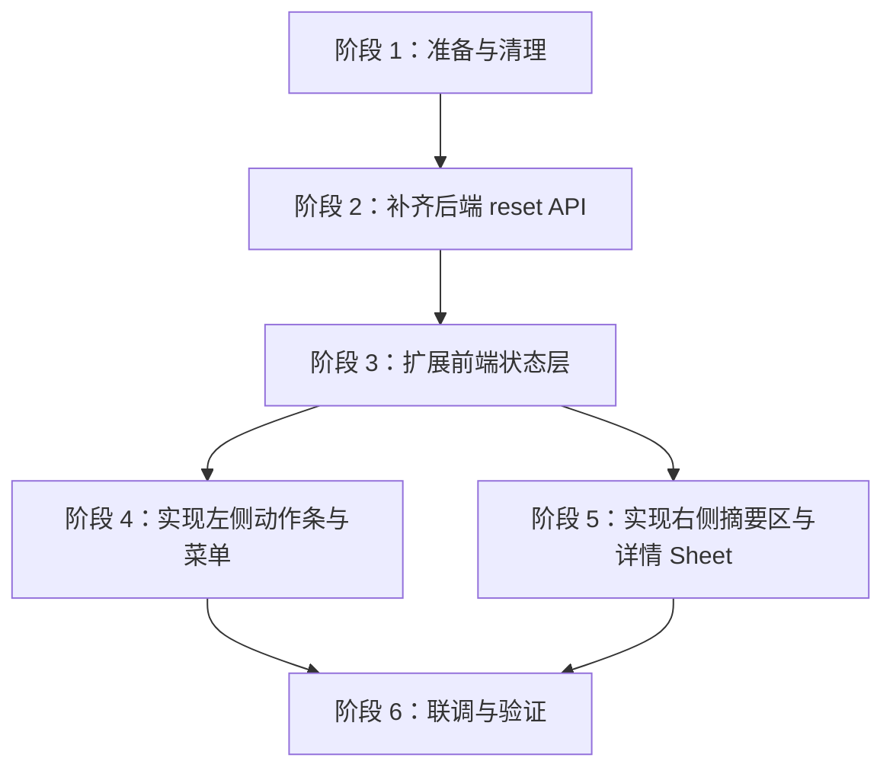

# 校对页任务动作条与翻译任务详情实现计划

- 日期：2026-04-16
- 状态：待执行
- 对应设计稿：[2026-04-15-proofreading-task-command-bar-design.md](/E:/Project/LinguaGacha/docs/superpowers/specs/2026-04-15-proofreading-task-command-bar-design.md)
- 提交策略：本计划阶段不提交 commit

## 🎯 本计划要把设计稿拆成可按顺序执行的实现工作块。

本计划覆盖以下实现目标：

- 移除 `frontend-vite` 中独立的 `translation`、`analysis` 占位页与相关资源。
- 在校对页新增任务动作条。
- 实现左侧 `翻译任务` 菜单与右侧实时摘要区。
- 实现右侧任务详情 `Sheet` 面板与停止确认。
- 补齐翻译重置的 tasks 级 API 与前端刷新链路。
- 完成必要的 i18n、状态同步与验证。

本计划不包含以下内容：

- 不实现分析任务的真实路径。
- 不恢复独立翻译页。
- 不在本轮加入暂停、任务历史等扩展能力。
- 不提交 commit。

## 🧭 实施顺序按“先依赖、再状态、后界面、最后联调”的顺序推进。

阶段 4 和阶段 5 都依赖阶段 3，因为它们共享翻译专属任务快照和确认态。

## 📦 阶段 1：准备与清理

### 目标

- 补齐本轮实现需要的基础组件依赖。
- 移除已经确认要删掉的占位页入口。
- 收口将来会被修改的文件边界。

### 任务

- 通过 shadcn CLI 为 `frontend-vite` 新增 `sheet` 组件源码。
- 检查 `frontend-vite/src/renderer/shadcn/` 中新增文件是否符合当前别名与规则。
- 从 `frontend-vite/src/renderer/app/navigation/schema.ts` 移除 `translation`、`analysis` 两个导航项。
- 从 `frontend-vite/src/renderer/app/navigation/screen-registry.ts` 移除两个占位 screen 注册。
- 删除 `frontend-vite/src/renderer/pages/analysis-page/` 中仅服务占位页的资源。
- 核查 `debug-panel-page` 是否仍被 `toolbox` 使用，避免误删公用调试页。

### 主要文件

- `frontend-vite/src/renderer/app/navigation/schema.ts`
- `frontend-vite/src/renderer/app/navigation/screen-registry.ts`
- `frontend-vite/src/renderer/pages/analysis-page/*`
- `frontend-vite/src/renderer/shadcn/sheet.tsx` 或 shadcn CLI 生成的等价文件

### 完成标准

- 侧边栏不再出现独立的 `翻译`、`分析` 页面入口。
- 项目中已具备可供右侧详情面板使用的 `Sheet` 组件。

## 🔧 阶段 2：补齐后端 reset API 与事件桥接

### 目标

- 为前端菜单提供稳定的“重置全部 / 重置失败条目” HTTP 契约。
- 让 reset 后的校对表格能自动刷新。

### 任务

- 在 `api/Server/Routes/TaskRoutes.py` 新增：
  - `POST /api/tasks/reset-translation-all`
  - `POST /api/tasks/reset-translation-failed`
- 在 `api/Application/TaskAppService.py` 新增对应方法，统一返回任务级受理结果。
- 复用现有旧事件语义，把 reset 动作映射到内部翻译重置事件。
- 确认 reset 完成后能触发 `proofreading.snapshot_invalidated` 现有刷新链路。
- 如当前 `EventBridge` 未覆盖 reset 对 proofreading 的失效通知，则补齐桥接逻辑。
- 视需要更新 `api/SPEC.md` 中的任务接口表。

### 主要文件

- `api/Server/Routes/TaskRoutes.py`
- `api/Application/TaskAppService.py`
- `api/Bridge/EventBridge.py`
- `api/SPEC.md`

### 完成标准

- 前端可以通过稳定 HTTP 路径发起两个 reset 动作。
- reset 成功后，校对页无需手工刷新即可收到 snapshot 失效通知。

## 🧠 阶段 3：扩展校对页状态层

### 目标

- 在不污染全局状态语义的前提下，为校对页维护翻译专属任务快照。
- 为左侧菜单、右侧摘要区、右侧详情面板提供统一状态入口。

### 任务

- 在 `use-proofreading-page-state.ts` 中新增翻译任务相关状态：
  - `translation_task_snapshot`
  - `last_translation_task_snapshot`
  - `translation_detail_sheet_open`
  - `task_confirm_state`
- 页面初始化时主动拉取 `{"task_type":"translation"}` 的任务快照。
- 设计一个稳定的快照选择规则：
  - 运行中优先读当前翻译快照
  - 完成后回退到最近一次翻译结果
  - 从未有结果时显示空态
- 统一计算派生字段：
  - 完成百分比
  - 成功条目
  - 失败条目
  - 剩余条目
  - 是否允许打开右侧详情面板
- 为波形图维护前端侧历史速度序列，不把临时波形历史塞进全局运行时上下文。
- 把开始、继续、停止、重置全部、重置失败条目封装成页面状态层方法。
- 让 reset 或停止后的回执与 SSE 更新能够正确同步到：
  - 菜单顶部进度区
  - 右侧摘要区
  - 右侧详情面板

### 主要文件

- `frontend-vite/src/renderer/pages/proofreading-page/use-proofreading-page-state.ts`
- `frontend-vite/src/renderer/pages/proofreading-page/types.ts`
- `frontend-vite/src/renderer/app/state/desktop-runtime-context.tsx`（仅在必须补充任务字段时调整）

### 完成标准

- 校对页内部已有单一的翻译任务状态入口。
- 左右两个任务 UI 都不需要直接拼接 API 细节。

## 🎛️ 阶段 4：实现左侧动作条与翻译任务菜单

### 目标

- 在校对页顶部落地新的任务动作条。
- 完成左侧 `翻译任务` 菜单与 `分析任务` 禁用按钮。

### 任务

- 新增 `proofreading-task-command-bar.tsx`，负责整条动作条布局。
- 新增 `proofreading-task-menu.tsx`，基于 `DropdownMenu + Progress` 组织菜单内容。
- 把动作条插入到 `page.tsx` 中的错误提示和搜索条之间。
- `翻译任务` 按钮支持：
  - 打开菜单
  - 根据进度切换 `开始翻译 / 继续翻译`
  - 在运行中只读查看
- `分析任务` 按钮保持禁用视觉与稳定布局。
- 新增统一确认弹窗组件，用于：
  - `重置全部`
  - `重置失败条目`
- 处理菜单动作的禁用规则与 loading 表现。
- 接入相应 i18n 文案。

### 主要文件

- `frontend-vite/src/renderer/pages/proofreading-page/page.tsx`
- `frontend-vite/src/renderer/pages/proofreading-page/proofreading-page.css`
- `frontend-vite/src/renderer/pages/proofreading-page/components/proofreading-task-command-bar.tsx`
- `frontend-vite/src/renderer/pages/proofreading-page/components/proofreading-task-menu.tsx`
- `frontend-vite/src/renderer/pages/proofreading-page/components/proofreading-task-confirm-dialog.tsx`
- `frontend-vite/src/renderer/i18n/resources/zh-CN/proofreading-page.ts`
- `frontend-vite/src/renderer/i18n/resources/en-US/proofreading-page.ts`

### 完成标准

- 校对页出现新动作条。
- 左侧翻译任务菜单与确认流转可完整工作。
- 空闲时两个 reset 动作保持启用。

## 📊 阶段 5：实现右侧实时摘要区与详情 Sheet

### 目标

- 把旧翻译页的大部分实时信息迁移到右侧详情面板。
- 保持“空闲态无任务、完成后保留最后一次结果、无任务不可点击”的交互规则。

### 任务

- 新增 `proofreading-task-runtime-summary.tsx`，作为动作条右侧常驻摘要区。
- 新增 `proofreading-task-detail-sheet.tsx`，基于 `Sheet` 实现右侧详情面板。
- 摘要区展示三类状态：
  - `无任务`
  - 运行中摘要
  - 最近一次结果摘要
- 摘要区点击规则：
  - `无任务` 时不可点击
  - 有运行中或历史结果时可点击
- 详情 `Sheet` 结构实现为：
  - 顶部摘要区
  - 中部图形区
  - 下部指标卡片区
  - 底部固定停止按钮区
- 中部图形区包含：
  - 进度环
  - 输出 Token 速度波形图
- 波形图实现要求：
  - 保持旧页语义
  - 以输出 Token 速度为输入
  - 自行维护历史序列
  - 空闲时保留最近一次结果展示，不继续无意义滚动
- 指标卡片区至少覆盖：
  - 已耗时
  - 剩余时间
  - 已处理条目
  - 失败条目
  - 剩余条目
  - 平均速度
  - 输入 Token
  - 输出 Token
  - 实时任务数
- 底部 `停止` 按钮接入统一确认框，确认后调用停止接口。
- 在运行中、停止中、完成后分别表现正确禁用态。
- 接入对应 i18n 文案与样式命名空间。

### 主要文件

- `frontend-vite/src/renderer/pages/proofreading-page/components/proofreading-task-runtime-summary.tsx`
- `frontend-vite/src/renderer/pages/proofreading-page/components/proofreading-task-detail-sheet.tsx`
- `frontend-vite/src/renderer/pages/proofreading-page/proofreading-page.css`
- `frontend-vite/src/renderer/i18n/resources/zh-CN/proofreading-page.ts`
- `frontend-vite/src/renderer/i18n/resources/en-US/proofreading-page.ts`

### 完成标准

- 右侧摘要区可稳定展示运行中或最近一次结果。
- 右侧详情面板能完整承载旧页式信息，不再依赖独立翻译页。

## 🌍 阶段 6：文案、回归与验证

### 目标

- 保证所有新增可见文本都有中英文资源。
- 确保 API、状态层与 UI 在主题和交互上没有回归。

### 任务

- 检查是否需要删除或保留 `translation-page.ts`、`analysis-page.ts` 中仍被导航引用的标题文案。
- 为新增动作条、摘要区、详情面板、确认框补齐中英文文案。
- 跑一轮静态检查：
  - `npm run lint`
  - `npm run renderer:audit`
  - `npx tsc -p tsconfig.json --noEmit`
  - `npx tsc -p tsconfig.node.json --noEmit`
- 做一轮手工验证：
  - 未加载工程
  - 空闲但未有任务结果
  - 开始翻译
  - 翻译运行中
  - 停止中
  - 翻译完成后
  - reset 全部
  - reset 失败条目
  - 亮 / 暗主题
- 记录本轮没有覆盖的风险点。

### 主要文件

- `frontend-vite/src/renderer/i18n/resources/zh-CN/*`
- `frontend-vite/src/renderer/i18n/resources/en-US/*`
- 必要时更新 `frontend-vite/src/renderer/SPEC.md` 或 `docs/FRONTEND.md` 中的入口描述

### 完成标准

- 新增交互在中英文和亮暗主题下都可用。
- 关键命令与刷新链路至少完成一轮手工验证。

## ⚠️ 已知风险与实现提醒

| 风险 | 说明 | 应对方式 |
| --- | --- | --- |
| `task_snapshot` 当前是“最相关任务”语义 | 直接复用会污染翻译专属 UI | 在校对页内部维护翻译专属快照 |
| reset API 当前不存在 | 前端菜单会被接口阻塞 | 先做阶段 2 再做 UI 联调 |
| `Sheet` 组件尚未接入 | 右侧详情面板无法直接实现 | 阶段 1 先加 shadcn `sheet` |
| 波形图历史在 React 中没有现成实现 | 如果直接每次重算会丢走势 | 在页面状态层维护波形历史序列 |
| 删除占位页可能误伤调试页复用 | `toolbox` 还在用 debug panel | 清理时只删直接引用占位页的部分 |

## ✅ 执行检查清单

- 已接入 `sheet`
- 已移除独立 `translation` / `analysis` 导航入口
- 已新增 reset API 与桥接刷新
- 校对页状态层已支持翻译专属快照和历史结果
- 左侧菜单已落地
- 右侧摘要区已落地
- 右侧详情 `Sheet` 已落地
- 停止与两个 reset 确认流已打通
- i18n 已补齐
- 静态检查已执行
- 手工验证已执行

## 📍 建议的实际执行顺序

1. 先做阶段 1 和阶段 2，打通依赖与 API 地基。
2. 再做阶段 3，把状态层先稳定下来。
3. 然后完成阶段 4 和阶段 5，分别落地左菜单和右详情。
4. 最后做阶段 6，把文案、验证和必要文档同步补齐。

只要按这个顺序推进，就不会出现 UI 先写完、结果被 API 和状态层反向重构的返工情况。
