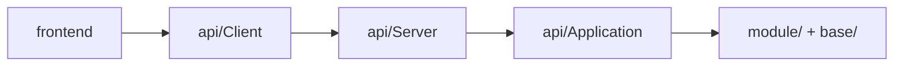

# API Client Context 分层清理设计

## 1. 背景

第一阶段 `frontend-core-separation` 已经建立了 `api/Client`、`api/Application`、`api/Server` 三层边界，并让首批页面改为通过本地 HTTP/SSE 访问 Core。

但当前仍存在一个明显的层次倒挂点：[`api/Application/AppContext.py`](/E:/Project/LinguaGacha/api/Application/AppContext.py) 实际上并不是服务端应用层对象，而是 UI 侧客户端依赖容器。它直接聚合了 `ProjectApiClient`、`TaskApiClient`、`WorkbenchApiClient`、`SettingsApiClient` 与 `ApiStateStore`，随后由 [`app.py`](/E:/Project/LinguaGacha/app.py) 构造，再传入 [`frontend/AppFluentWindow.py`](/E:/Project/LinguaGacha/frontend/AppFluentWindow.py)。

这会带来两个问题：

- `api/Application` 反向依赖 `api/Client`，破坏“服务端用例层不依赖客户端层”的边界
- `AppContext` 的命名和物理位置不一致，后续继续重构时容易把 UI 装配逻辑误塞回服务端层

## 2. 目标

- 清除 `api/Application -> api/Client` 的反向依赖
- 让客户端装配容器回到 `api/Client` 语义域内
- 保持现有 UI 启动流程、SSE 订阅流程与页面行为不变
- 让后续 `UI/Core` 分离继续沿着正确层次演进

## 3. 非目标

- 不重写 `ApiClient`、`SseClient`、`ServerBootstrap` 的行为
- 不改 HTTP/SSE 协议与 `api/SPEC.md` 的接口语义
- 不新增独立 bootstrap 层或复杂工厂抽象
- 不在本轮顺带迁移 `Quality`、`Proofreading`、`Extra` 页面

## 4. 设计决策

### 4.1 `AppContext` 迁移并更名

- 将 [`api/Application/AppContext.py`](/E:/Project/LinguaGacha/api/Application/AppContext.py) 迁移为 [`api/Client/AppClientContext.py`](/E:/Project/LinguaGacha/api/Client/AppClientContext.py)
- 将类名 `AppContext` 更名为 `AppClientContext`
- 保持字段集合不变：
  - `project_api_client`
  - `task_api_client`
  - `workbench_api_client`
  - `settings_api_client`
  - `api_state_store`

命名变化的目标不是“换个说法”，而是明确说明该对象属于 UI 客户端边界，而非 Core 服务端应用层。

### 4.2 分层约束

本轮后，`api/` 内部层次约束补充如下：

| 层 | 允许依赖 | 禁止依赖 |
| --- | --- | --- |
| `api/Client` | `api/Contract`、`model/Api`、标准库、第三方 HTTP 客户端 | `api/Application` |
| `api/Application` | `api/Contract`、`module`、`base` | `api/Client` |
| `api/Server` | `api/Application`、`api/Contract` | `frontend`、`api/Client` |

这里的重点是恢复单向依赖：



### 4.3 启动装配保持不变

[`app.py`](/E:/Project/LinguaGacha/app.py) 仍然负责：

1. 启动本地 HTTP 服务
2. 创建 `ApiClient`
3. 创建各业务客户端与 `ApiStateStore`
4. 组装 `AppClientContext`
5. 将 `AppClientContext` 传入主窗口

[`frontend/AppFluentWindow.py`](/E:/Project/LinguaGacha/frontend/AppFluentWindow.py) 仍然负责：

1. 从 `AppClientContext` 取出业务客户端与状态仓库
2. 首屏拉取工程/任务快照
3. 启动 `SseClient`

也就是说，本轮只修正“归属与命名”，不改“装配与行为”。

## 5. 影响范围

### 5.1 需要修改的代码

- [`api/Application/AppContext.py`](/E:/Project/LinguaGacha/api/Application/AppContext.py)
- [`app.py`](/E:/Project/LinguaGacha/app.py)
- [`frontend/AppFluentWindow.py`](/E:/Project/LinguaGacha/frontend/AppFluentWindow.py)
- 所有引用 `AppContext` 的测试与文档

### 5.2 预期不受影响的部分

- `ProjectApiClient`、`TaskApiClient`、`WorkbenchApiClient`、`SettingsApiClient`
- `ApiStateStore`
- `SseClient`
- `ServerBootstrap`
- 第一阶段已迁移页面的业务行为

## 6. 验证策略

本轮验证以“层次清理无行为回归”为目标。

### 6.1 静态验证

- 全仓不再存在 `from api.Application.AppContext import AppContext`
- `api/Application` 目录中不再 import `api.Client`

### 6.2 自动化验证

至少运行：

```bash
uv run pytest tests/api/test_api_client.py -v
uv run pytest tests/api/test_core_api_server.py -v
uv run pytest tests/base/test_cli_manager.py -v
```

### 6.3 最小人工验证路径

1. `uv run app.py`
2. 确认主窗口可以打开
3. 确认首屏能正常拉取工程/任务快照
4. 确认退出时不会因为上下文重命名导致清理流程异常

## 7. 迁移步骤

1. 新建 `api/Client/AppClientContext.py`
2. 更新 `app.py` 的 import 与实例化代码
3. 更新 `frontend/AppFluentWindow.py` 的 import、类型标注与报错文案
4. 批量替换测试和文档中的 `AppContext`
5. 删除旧的 `api/Application/AppContext.py`
6. 运行静态搜索与自动化验证

## 8. 取舍说明

本轮没有选择新建 `api/Bootstrap` 层，也没有把上下文对象挪进 `frontend/`，原因如下：

- 当前问题是明确的层次倒挂，直接把对象收回 `api/Client` 已足以修复
- 新增 bootstrap 层会扩大改动面，但并不能为当前需求提供额外收益
- 先做最小闭环修复，更符合本仓库当前“逐步分离 UI/Core”的节奏

因此，本轮采用“最小物理迁移 + 明确命名修正”的方案。
