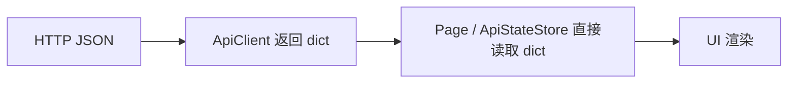
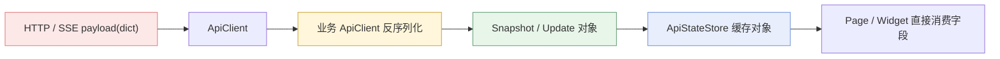
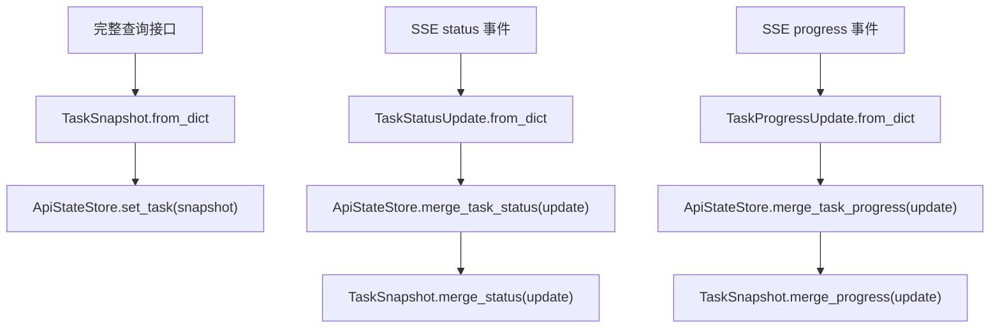

# API 响应对象化与状态仓库 DTO 化设计

## 1. 背景

当前前端在调用本地 Core API 时，请求参数使用 JSON / `dict` 传输，这一层没有问题；但响应进入应用内部后，页面和状态仓库仍然普遍直接消费 `dict`，例如通过 `response.get(...)`、`snapshot.get(...)` 读取字段。

这种做法会带来几个问题：

- UI 直接依赖协议字段名，协议细节泄漏到页面层。
- 默认值与兼容逻辑散落在页面、状态仓库和客户端中，难以统一。
- 类型信息弱，字段重命名和结构调整时，IDE 与类型检查很难提供可靠保护。
- `ApiStateStore` 同时承担缓存和字段归一化职责，边界不清晰。

本设计的目标不是为了“更 OO”而引入额外样板，而是把 `dict` 收缩到协议边界，在应用内部统一使用具名、冻结、可类型检查的对象。

## 2. 设计目标

### 2.1 目标

- 保持 HTTP 请求与响应在边界层继续使用 JSON / `dict`。
- 在响应进入应用后，立即反序列化为具名对象。
- 页面、状态仓库、业务逻辑不再直接依赖协议字典。
- `ApiStateStore` 改为缓存 DTO / Snapshot 对象，而不是缓存 `dict`。
- 完整快照与 SSE 增量更新分开建模，避免语义混淆。
- 保持实现简单直接，不引入自动映射框架或复杂基类。

### 2.2 非目标

- 不将所有请求参数全部对象化。
- 不在本次设计中重构服务端 HTTP 外层包裹结构。
- 不引入新的兼容层长期并存。
- 不把 DTO 扩展成承载复杂业务逻辑的胖模型。

## 3. 现状与问题定位

当前数据流大致如下：



这一模式下，`dict` 已经越过 API 边界，进入了页面和状态仓库。

典型问题表现：

- 页面层需要知道 `settings`、`snapshot`、`entries` 等字段名。
- 同一字段在不同页面中重复做 `bool(...)`、`int(...)`、默认值兜底。
- `ApiStateStore` 需要把任务快照中的字段逐项归一化，本质上在重复做 DTO 的工作。

## 4. 总体方案

### 4.1 核心原则

- `dict` 只允许存在于 HTTP 边界和 `from_dict()` 内部。
- 业务 `ApiClient` 负责响应对象化。
- `ApiStateStore` 只负责缓存对象和合并对象，不再负责字段清洗。
- UI 只消费具名对象字段，不直接读取协议字典。

### 4.2 新数据流



### 4.3 反序列化位置

反序列化放在各业务 `ApiClient` 中，而不是放在页面、`ApiStateStore` 或通用 `ApiClient` 中。

原因：

- 业务 `ApiClient` 最了解当前路由返回的语义结构。
- 通用 `ApiClient` 保持简单，只负责通信。
- 页面层不再关心协议结构。
- 可以渐进迁移，不需要一次性抽象出复杂的泛型反序列化框架。

## 5. 模型目录与文件组织

响应对象进入应用内部后，应视为应用模型的一部分，但又不应污染现有 `model/` 根目录中的核心领域实体。

因此采用以下目录结构：

```text
model/
  Item.py
  Model.py
  Project.py
  Api/
    SettingsModels.py
    ProjectModels.py
    TaskModels.py
    WorkbenchModels.py
```

文件按聚合组织，而不是“一类一个文件”。

建议承载内容如下：

- `SettingsModels.py`
  - `AppSettingsSnapshot`
- `ProjectModels.py`
  - `ProjectSnapshot`
  - `ProjectPreview`
  - `RecentProjectEntry`
- `TaskModels.py`
  - `TaskSnapshot`
  - `TaskStatusUpdate`
  - `TaskProgressUpdate`
- `WorkbenchModels.py`
  - `WorkbenchSnapshot`
  - `WorkbenchFileEntry`

## 6. 对象建模原则

### 6.1 命名规则

- 完整状态对象使用 `Snapshot` 后缀。
- 增量事件对象使用 `Update` 后缀。
- 列表项对象使用 `Entry` 后缀。

### 6.2 类型规则

- 统一使用 `@dataclass(frozen=True)`。
- 所有字段必须显式标注类型。
- 嵌套集合优先使用不可变容器，例如 `tuple[...]`。
- 不使用私有命名和魔术值。

### 6.3 行为边界

对象只允许包含轻量方法：

- `from_dict()`
- `to_dict()`（如确有需要）
- `merge_status()` / `merge_progress()` 这类纯函数式合并逻辑

对象不允许包含：

- UI 行为
- 事件发射
- IO
- 复杂业务副作用

## 7. 完整快照与增量更新分离

`TaskSnapshot` 与 `TaskStatusUpdate` / `TaskProgressUpdate` 必须分开建模。

原因：

- 完整快照语义是“字段齐全、可直接替换状态”。
- 增量事件语义是“只更新部分字段”。
- 如果将两者混成一个“可空字段大对象”，会把完整快照和 patch 语义耦合在一起，导致状态合并逻辑继续依赖“字段是否缺失”的隐式约定。

建议的数据流如下：



## 8. `ApiStateStore` 职责重定义

改造后，`ApiStateStore` 的职责应收缩为“状态对象仓库”。

### 8.1 改造前

- 保存 `dict`
- 清洗字段
- 提供便捷状态读取

### 8.2 改造后

- 保存 `ProjectSnapshot`、`TaskSnapshot` 等对象
- 接收完整对象并原子替换
- 接收 `Update` 对象并通过对象方法合并
- 提供便捷状态读取，例如 `is_busy()`、`is_project_loaded()`

### 8.3 不再承担的职责

- `str(...)`、`int(...)`、`bool(...)` 类型兜底
- 缺省值补齐
- 嵌套结构清洗

这些职责统一收敛到对象的 `from_dict()` 中。

## 9. 错误处理策略

### 9.1 处理原则

- 对“可容忍缺省”使用默认值。
- 对“契约破坏”记录日志，并回退到安全默认对象或终止当前更新。

### 9.2 `from_dict()` 允许做的事

- 基础类型转换
- 默认值填充
- 嵌套对象反序列化
- 轻量结构校验
- 兼容字段映射

### 9.3 `from_dict()` 禁止做的事

- UI 提示
- 事件发射
- IO
- 复杂业务推导
- 隐式修复服务端错误逻辑

## 10. 迁移策略

采用分批迁移，避免一次性大改：

1. `SettingsApiClient` + 设置相关页面
2. `ProjectApiClient` + 工程页
3. `WorkbenchApiClient` + 工作台页
4. `TaskApiClient` + `ApiStateStore` + SSE 事件链路

迁移纪律：

- 一条链路切到 DTO 后，不再回传 `dict` 给页面。
- 页面层禁止新增 `response.get(...)`、`snapshot.get(...)`。
- `ApiStateStore` 改造完成后，不再暴露内部 `dict` 副本接口。
- 如确需短期兼容，仅允许局部、短生命周期兼容出口，并在同批次完成后删除。

## 11. 测试策略

### 11.1 DTO 单元测试

- `from_dict()` 对缺省值和错误结构的处理
- 嵌套列表与子对象反序列化
- `merge_status()`、`merge_progress()` 的状态保留与覆盖规则

### 11.2 Client 单元测试

- API 返回结构到对象的转换正确性
- 返回对象类型是否符合预期

### 11.3 Store 单元测试

- 完整快照 hydration
- 增量更新合并
- 忙碌态与工程加载态便捷接口

### 11.4 最小手动验证路径

- 设置页读取与更新设置
- 工程页读取最近项目、打开/关闭工程
- 工作台页读取快照与刷新文件列表
- 任务启动后状态和进度事件正确更新

## 12. 落地准则

本设计最终要求达到以下状态：

- 请求继续使用 JSON / `dict`
- 响应在业务客户端边界立即对象化
- `ApiStateStore` 统一持有对象
- UI 不再直接消费协议字典
- 完整快照与增量更新严格分离
- DTO 存放于 `model/Api/`，按聚合组织

达到以上状态后，应用内部数据流将更加稳定、可读、可重构，并符合项目关于正交数据流、单一写入入口和不可变快照传递的约束。
