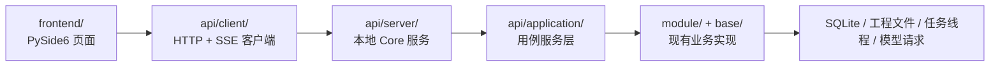
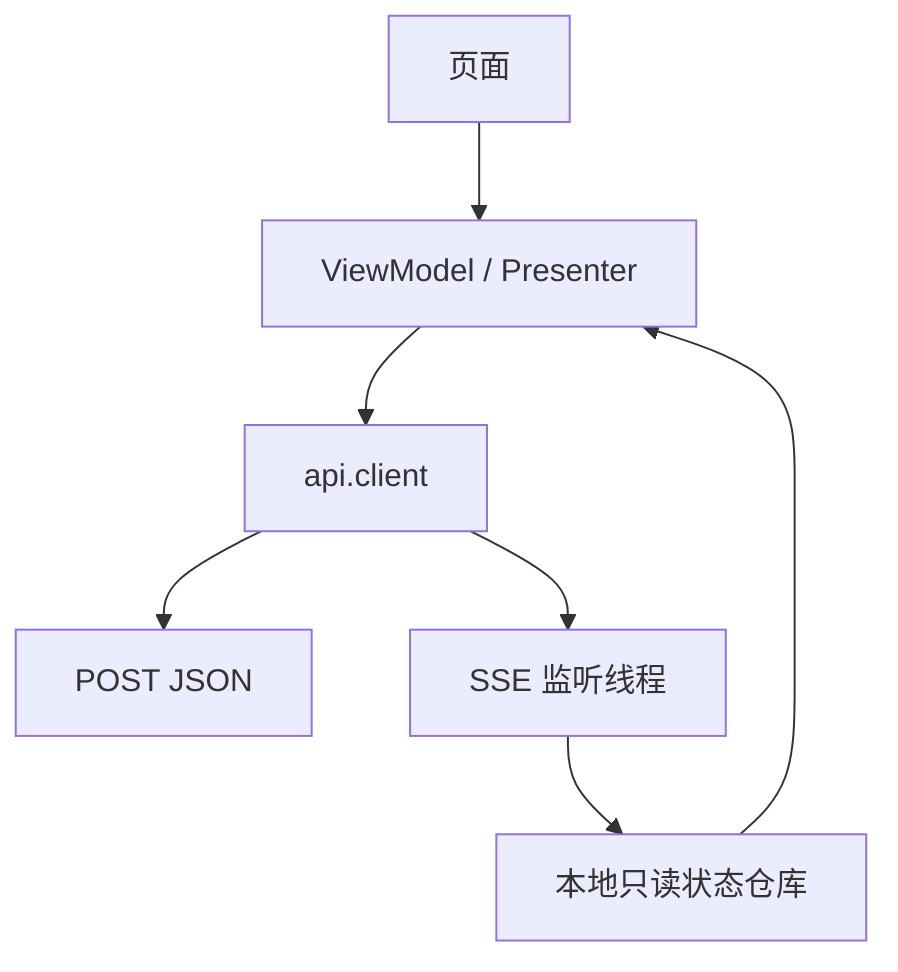

# 前后端分离改造设计：UI 与 Core 通过本地 HTTP/SSE 通信

## 1. 背景

LinguaGacha 当前采用单进程桌面应用架构，`QApplication`、`frontend`、`DataManager`、`Engine`、`Config`、事件总线与文件/数据库访问均运行在同一进程内。现状的主要问题如下：

- UI 直接依赖 `module.*`、`base.*`，边界不清晰。
- 工程状态、任务状态、配置状态分散暴露给 UI，后续替换 UI 技术栈时耦合面过大。
- 进程内 `Base.Event` 与 `EventManager` 适合当前实现，但不适合作为未来跨进程、跨技术栈的稳定契约。
- 现有功能可以工作，但不利于逐步演进到更现代的前端实现。

本设计的目标不是立即重写全部 Core，而是先建立稳定边界，让现有 PySide6 UI 退化为 HTTP/SSE 客户端，为后续替换 UI 技术栈创造条件。

## 2. 已确认的设计决策

本设计基于以下已确认前提：

- 第一阶段采用本地单机双进程架构。
- UI 与 Core 通过 `127.0.0.1` 本地接口通信。
- Core 独占工程、数据库、文件系统与任务引擎的权威状态。
- 现有 PySide6 UI 第一阶段继续保留，但要逐步改造为 `api.client` 消费者。
- 接口风格以业务 `POST + JSON body` 为主。
- 异步状态变化通过 `SSE` 推送。
- `SSE` 流入口保留为 `GET`，其余业务接口不要求使用 `GET`。
- 新边界统一落在 `api/` 包下。
- 后续实现阶段除代码外，必须额外产出 `api/SPEC.md` 作为简明接口契约文档。

## 3. 改造目标

### 3.1 目标

- 建立 UI 与 Core 之间唯一正式边界。
- 让 UI 不再直接调用 `DataManager`、`Engine`、`Config`、`EventManager`。
- 将进程内事件模型转换为稳定的外部接口与 SSE 事件主题。
- 在不一次性重写全部 Core 的前提下，逐步迁移现有页面。
- 为未来引入更现代的 UI 技术栈保留清晰边界与稳定契约。

### 3.2 非目标

- 第一阶段不追求远程部署能力。
- 第一阶段不要求 Core 内部全部重写为全新架构。
- 第一阶段不要求 CLI 必须立刻走 HTTP 接口。
- 第一阶段不追求完整 REST 风格或资源风格设计。

## 4. 现状与核心问题

当前关键耦合点包括但不限于：

- `app.py` 同时负责启动 Qt、初始化 Core、创建主窗口、运行事件循环。
- `frontend/AppFluentWindow.py` 直接依赖 `DataManager`、`Config`、`VersionManager` 与事件总线。
- `frontend/ProjectPage.py`、`frontend/Workbench/WorkbenchPage.py` 等页面直接调用 `DataManager` 和 `Engine`。
- `module/Data/DataManager.py` 同时承担数据中间层、事件桥接、工作线程触发、文件操作调度等多重职责。
- `base/Base.py` 中的内部事件枚举既承担内部语义，又被 UI 直接消费。

这些问题意味着，如果直接把现有内部对象生硬暴露成 HTTP 路由，只会把进程内耦合原样搬到进程间，无法真正理清边界。

## 5. 推荐方案

采用“先建立 Application Service，再对外服务化”的方案。

### 5.1 核心思路

- 在 `api/application` 中建立稳定的用例层。
- 在 `api/server` 中提供本地 HTTP/SSE 服务。
- 在 `api/client` 中提供 UI 唯一允许使用的客户端封装。
- 在 `api/bridge` 中把旧 `Base.Event` 转换为对外稳定的 SSE 主题。
- `module/` 与 `base/` 暂时保留实现，但逐步退居 `api/application` 背后。

### 5.2 总体结构



## 6. `api/` 包边界设计

建议初始目录结构如下：

```text
api/
  __init__.py
  contract/
    ApiError.py
    ApiResponse.py
    EventEnvelope.py
    ProjectDtos.py
    TaskDtos.py
    WorkbenchDtos.py
  application/
    AppContext.py
    ProjectAppService.py
    TaskAppService.py
    WorkbenchAppService.py
    SettingsAppService.py
    EventStreamService.py
  server/
    CoreApiServer.py
    ServerBootstrap.py
    routes/
      ProjectRoutes.py
      TaskRoutes.py
      WorkbenchRoutes.py
      SettingsRoutes.py
      EventRoutes.py
  client/
    ApiClient.py
    ProjectApiClient.py
    TaskApiClient.py
    WorkbenchApiClient.py
    SettingsApiClient.py
    SseClient.py
  bridge/
    EventBridge.py
    EventTopic.py
```

各层职责如下：

| 层 | 职责 | 是否允许被 UI 直接引用 |
| --- | --- | --- |
| `api/client` | UI 使用的 HTTP/SSE 客户端与本地状态分发 | 允许 |
| `api/server` | 本地路由、请求解析、响应封装、SSE 输出 | 禁止 |
| `api/application` | 稳定用例边界、DTO 转换、错误映射、事件标准化入口 | 禁止 |
| `api/bridge` | 内部事件到外部主题的转换 | 禁止 |
| `module` / `base` | 现有业务与基础设施实现 | 禁止 |

## 7. 硬边界规则

第一阶段起即建立以下硬规则：

- `frontend/` 禁止直接 `import module.*`
- `frontend/` 禁止直接 `import base.*`
- `frontend/` 只允许通过 `api.client.*` 访问 Core 能力
- `api/server` 不承载业务规则，只负责协议层逻辑
- `api/application` 不得机械透传内部对象方法，必须收口为“用例级接口”

该规则是边界真正成立的前提，违反时应视为架构退化。

## 8. 协议设计

### 8.1 总体原则

- 业务接口统一使用 `POST + JSON body`
- 所有路径、文本、复杂筛选、非 ASCII 数据均放入 JSON body
- 异步事件统一通过 `SSE` 推送
- `SSE` 流入口使用 `GET`
- 不强求经典 REST 风格

这样设计的主要原因是：

- 项目包含中文、日文、复杂路径与文本数据，放入 URL query 会增加转义与调试成本。
- 本地单机场景对缓存语义和纯资源式接口诉求不强。
- 统一 `POST` 可以显著降低客户端实现复杂度。

### 8.2 协议概览

```text
POST /api/...            -> 所有业务读取与写入
GET  /api/events/stream  -> SSE 事件流
GET  /api/health         -> 可选健康检查
```

### 8.3 为什么不采用“全量 GET + POST 对称”

- 只读查询并不天然比 `POST` 更有价值。
- 非 ASCII 参数进入 URL 后可读性差，调试体验差。
- 复杂查询条件未来很容易增长，不适合用 query string 承载。
- 本项目优先目标是边界清晰，不是追求资源风格教条。

## 9. 事件流设计

### 9.1 事件桥接原则

内部仍可继续使用 `Base.Event` 作为短期实现机制，但对 UI 的外部事件必须经过 `api/bridge/EventBridge.py` 统一映射，禁止直接透传内部事件名与内部 payload。

### 9.2 建议的 SSE 主题

| 主题 | 语义 | 典型内部来源 |
| --- | --- | --- |
| `app.toast` | 弹窗/提示信息 | `TOAST` |
| `project.state_changed` | 工程加载、卸载、切换 | `PROJECT_LOADED`、`PROJECT_UNLOADED` |
| `project.file_changed` | 工程文件增删改 | `PROJECT_FILE_UPDATE` |
| `task.status_changed` | 任务开始、停止、完成、失败 | `TRANSLATION_TASK`、`ANALYSIS_TASK` |
| `task.progress_changed` | 翻译/分析进度快照 | `TRANSLATION_PROGRESS`、`ANALYSIS_PROGRESS` |
| `workbench.snapshot_changed` | 工作台刷新或快照变化 | `WORKBENCH_REFRESH`、`WORKBENCH_SNAPSHOT` |
| `settings.changed` | 配置更新 | `CONFIG_UPDATED` |

### 9.3 统一事件包格式

```json
{
  "event_id": "evt_123",
  "topic": "task.progress_changed",
  "timestamp": "2026-03-24T12:34:56+08:00",
  "project_id": "current",
  "payload": {
    "task_type": "translation",
    "processed_line": 120,
    "total_line": 500
  }
}
```

事件包必须保持：

- topic 稳定
- 时间戳明确
- payload 与内部实现解耦
- 可以被未来非 PySide6 前端直接消费

## 10. 接口分组建议

接口分组应按用户用例，而不是按内部类名。

### 10.1 推荐分组

- `project`
- `tasks`
- `workbench`
- `settings`
- `rules`
- `events`

### 10.2 第一阶段最小闭环接口

```text
POST /api/project/current
POST /api/project/preview
POST /api/project/create
POST /api/project/load
POST /api/project/unload

POST /api/tasks/status
POST /api/tasks/translation/start
POST /api/tasks/translation/stop
POST /api/tasks/analysis/start
POST /api/tasks/analysis/stop
POST /api/tasks/translation/reset_failed
POST /api/tasks/analysis/reset_failed

POST /api/workbench/snapshot
POST /api/workbench/file/add
POST /api/workbench/file/replace
POST /api/workbench/file/reset
POST /api/workbench/file/delete

POST /api/settings/app
POST /api/settings/app/save

GET  /api/events/stream
```

说明：

- 即使是读取当前快照，也允许用 `POST`，以换取统一 JSON body 风格。
- 第一阶段不追求接口齐全，只覆盖主链路。

## 11. UI 端消费模型

建议 UI 第一阶段采用如下模式：



具体约束如下：

- 页面不直接持有 `DataManager`
- 页面不直接依赖 `Engine`
- 页面不直接操作内部事件总线
- UI 本地只保留展示态与临时缓存
- 权威状态以 Core 快照与 SSE 事件为准

## 12. 启动与进程模型

第一阶段需要重新规划启动方式：

- UI 模式下，由桌面入口先确保本地 Core 服务已启动。
- Core 服务绑定本地回环地址，避免暴露到局域网。
- UI 通过端口探测或握手方式连接 Core。
- Core 未启动或启动失败时，UI 需要给出明确提示。
- 需要明确多开实例策略，避免多个 UI 进程争夺同一 Core 状态。

建议后续实现时，在 `api/server/ServerBootstrap.py` 中集中处理启动、端口、健康检查与退出协作。

## 13. 迁移分期

### P0：搭建 `api/` 骨架

- 建立 `api/contract`
- 建立 `api/application`
- 建立 `api/server`
- 建立 `api/client`
- 建立 `api/bridge`
- 规划桌面入口如何拉起本地 Core 服务

### P1：打通工程生命周期与全局事件流

优先迁移：

- `ProjectPage`
- `AppFluentWindow`
- 工程创建、加载、卸载、预览
- 全局 Toast 与工程状态事件

### P2：打通翻译与分析任务主链路

优先迁移：

- 翻译任务启动/停止/状态查询
- 分析任务启动/停止/状态查询
- 任务进度 SSE
- 页面 busy 状态统一依赖 API 状态

### P3：打通工作台与文件操作

优先迁移：

- 工作台快照
- 文件新增、替换、重置、删除
- 工作台刷新事件

### P4：迁移设置、规则与附加页面

逐步迁移：

- 设置页
- 术语表
- 文本替换
- 提示词相关页面
- 其他工具页

### P5：清理直连依赖

- 扫描 `frontend/` 中残留的 `module.*` 和 `base.*` 依赖
- 删除临时兼容胶水
- 把 UI 对 Core 的所有访问统一收敛到 `api.client`

## 14. 风险与控制手段

### 14.1 主要风险

1. SSE 直接透传内部 `Base.Event`
2. `api/application` 退化为 `DataManager` 转发器
3. UI 一部分走 API，一部分继续偷偷直连旧模块
4. 双进程启动流程未先理顺，导致全局不稳定

### 14.2 控制手段

| 手段 | 目的 |
| --- | --- |
| 边界禁令 | 防止 `frontend` 越过 `api.client` 直连 Core |
| 事件标准化 | 防止内部事件模型泄漏到边界之外 |
| 阶段闭环 | 每阶段都至少完成一条完整用户路径 |
| 显式兼容清单 | 控制过渡代码，避免无限遗留 |
| 最小接口集合 | 先保证主链路稳定，再逐页扩展 |

## 15. 验证策略

### 15.1 自动化验证

- 为 `api/application` 编写用例级测试
- 为 `api/server` 编写协议与错误映射测试
- 覆盖非 ASCII 路径、文本与请求体传输
- 覆盖 SSE 主题与基础事件格式

### 15.2 手工回归路径

每个阶段至少执行以下最小路径：

1. 启动 UI 并拉起 Core
2. 创建或加载工程
3. 验证页面正确反映工程加载态
4. 启动翻译或分析任务
5. 验证进度、Toast、完成态通过 SSE 正确更新
6. 停止任务或卸载工程后，验证所有页面状态一致

## 16. `api/SPEC.md` 产物要求

后续实现时，除代码外必须额外产出 `api/SPEC.md`，其职责如下：

- 作为后续 AGENT 的接口速查文档
- 作为 UI 开发者与 Core 开发者的统一契约
- 作为新增页面或新增功能是否绕过边界的检查依据

`api/SPEC.md` 应保持简明扼要，建议包含以下内容：

1. 边界原则
2. 接口目录与请求/响应示例
3. SSE topic 列表与 payload 示例
4. 错误格式约定
5. 迁移约束与新增功能接入规则

该文档不是架构设计说明书，而是实施期使用的简洁操作契约。

## 17. 实施顺序建议

推荐后续实现计划按以下顺序展开：

1. `api/` 骨架与本地 Core 服务启动
2. `EventBridge` 与 `GET /api/events/stream`
3. `ProjectAppService` 与工程生命周期接口
4. 改造 `ProjectPage` 与 `AppFluentWindow`
5. `TaskAppService` 与翻译/分析接口
6. 改造翻译与分析页面
7. 工作台文件接口与页面迁移
8. 设置、规则、工具页迁移
9. 清理 UI 对 `module` / `base` 的残留依赖

## 18. 结论

本设计选择在 `api/` 下建立前后端边界层，以“本地双进程 + 业务 POST + SSE 事件流”的方式逐步拆分 UI 与 Core。第一阶段不追求重写全部内部实现，而是优先建立稳定边界、迁移主链路、冻结 UI 对旧内部模块的直接依赖。只要 `api/application`、`api/bridge` 与 `api/client` 三层边界建立成功，后续替换前端技术栈时就可以在更小风险下持续推进。
