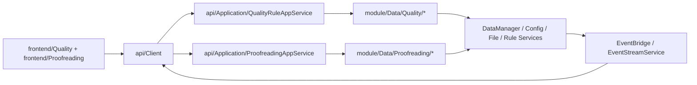

# Quality / Proofreading UI-Core 分离设计

## 1. 背景

当前第一阶段 UI/Core 分离已经覆盖工程生命周期、翻译/分析主链路、工作台与应用设置入口，但 `frontend/Quality/**` 与 `frontend/Proofreading/**` 仍然直接依赖 `module.Data.DataManager`、`module.Config`、`module.ResultChecker`、`module.QualityRule.*` 等 Core 实现。

这导致以下问题持续存在：

- `Quality` 页面仍然直接控制规则读写、导入导出、统计与预设逻辑，UI 不是纯消费者。
- `ProofreadingPage` 同时持有 `ResultChecker`、`warning_map`、筛选状态、搜索状态、批量替换状态与保存流程，页面承担了过多业务职责。
- 规则页与校对页之间的联动依赖前端内部逻辑拼接，缺少稳定的协议边界。
- 后续若要继续迁移到更现代的 UI 技术栈，这两块仍然会成为最大耦合点。

本设计的目标是在现有本地 HTTP/SSE 边界基础上，把 `Quality` 与 `Proofreading` 的完整业务也收口到 `api/` 与 `module/Data` 侧，使 UI 只保留展示与交互编排职责。

## 2. 本轮确认的设计决策

本设计基于以下已确认决策：

- 范围覆盖 `Quality` 与 `Proofreading` 的完整边界迁移，而不是只迁移只读链路。
- 服务按职责拆分为 `QualityRuleAppService` 与 `ProofreadingAppService` 两套应用服务。
- 筛选、搜索、批量替换、结果检查与重检等重计算逻辑全部下沉到 Core。
- 数据交换采用“首屏完整快照 + 后续增量命令”的模式。
- 增量命令统一通过 `revision` 防止 UI 与 Core 状态漂移。
- SSE 只承载失效通知与长操作进度，不承载整页数据流式同步。

## 3. 目标与非目标

### 3.1 目标

- 建立 `Quality` / `Proofreading` 与 Core 之间唯一正式边界。
- 移除 `frontend/Quality/**` 与 `frontend/Proofreading/**` 对 Core 单例和实现细节的直接依赖。
- 让规则数据与校对派生视图拥有明确的单一来源与单一写入口。
- 为后续继续迁移 `Model` / `Extra` 页面提供可复用的边界模板。

### 3.2 非目标

- 本轮不重写 `DataManager` 或 `ResultChecker` 的底层实现。
- 本轮不引入远程部署、多进程会话中心或复杂分页协议。
- 本轮不改变现有 `Quality` / `Proofreading` 的核心用户交互语义。

## 4. 推荐方案与选择结论

评估过的方案如下：

| 方案 | 描述 | 结论 |
| --- | --- | --- |
| 薄封装方案 | 在 `api/Application` 外面包一层 façade，尽量复用现有前端业务逻辑 | 不推荐，边界仍然偏软 |
| 双服务方案 | `QualityRuleAppService` 管规则与提示词，`ProofreadingAppService` 管校对快照与操作 | 采用 |
| 有状态会话中心 | 服务端为每个窗口维护独立校对会话状态 | 暂不采用，复杂度过高 |

最终采用“双服务 + 快照/命令分层 + revision 增量协议”的方案。

## 5. 整体架构



核心边界规则：

- `frontend/Quality/**` 与 `frontend/Proofreading/**` 只允许依赖 `api.Client` 与对象化 API 模型。
- `api/Application` 负责用例编排、错误映射与 payload 转换，不直接暴露内部对象。
- `module/Data/Quality/*` 与 `module/Data/Proofreading/*` 承担实际业务逻辑，是新的 Core 服务入口。

## 6. 服务边界设计

### 6.1 `QualityRuleAppService`

职责如下：

- 构建规则快照
- 处理规则写操作
- 处理导入导出
- 处理预设管理
- 处理规则统计
- 把规则条目转换为校对页可消费的查询参数
- 管理自定义提示词快照、保存与预设

它不负责：

- Qt 交互
- 页面内选中行、滚动位置、按钮开关等展示态
- `Proofreading` 页面内部表格状态

### 6.2 `ProofreadingAppService`

职责如下：

- 构建首屏完整快照
- 执行筛选与搜索
- 执行单条保存、单条重检
- 执行单次替换与批量替换
- 在规则或工程变化后刷新 warning 与筛选基础数据
- 维护 `revision` 与冲突检测

它不负责：

- Qt 信号
- 纯展示态 UI 状态
- 页面快捷键、滚动定位与弹窗打开关闭

## 7. 数据流与不变量

必须保持以下不变量：

1. 规则数据的唯一权威来源仍然是 `DataManager`、配置与规则文件。
2. 校对页数据不是新的持久状态，而是“项目条目 + 当前规则集”派生出来的查询快照。
3. UI 不再持有 `ResultChecker`、`warning_map`、规则统计过程对象等业务运行态。
4. 所有规则写操作都只能通过 `QualityRuleMutationService` 进入。
5. 所有校对写操作都只能通过 `ProofreadingMutationService` 进入。
6. 筛选结果、搜索结果与 warning 结果都只在某个 `revision` 语义下成立。

## 8. API 设计

## 8.1 `Quality` 接口

推荐路径如下：

```text
POST /api/quality/rules/snapshot
POST /api/quality/rules/update-meta
POST /api/quality/rules/save-entries
POST /api/quality/rules/import
POST /api/quality/rules/export
POST /api/quality/rules/statistics
POST /api/quality/rules/query-proofreading

POST /api/quality/prompts/snapshot
POST /api/quality/prompts/save
POST /api/quality/prompts/import
POST /api/quality/prompts/export
POST /api/quality/prompts/presets
```

### 8.1.1 请求示例

```json
{
  "rule_type": "glossary"
}
```

```json
{
  "rule_type": "pre_translation_replacement",
  "expected_revision": 12,
  "entries": [
    {
      "src": "foo",
      "dst": "bar",
      "regex": false,
      "case_sensitive": false
    }
  ]
}
```

```json
{
  "rule_type": "text_preserve",
  "expected_revision": 5,
  "meta": {
    "mode": "SMART"
  }
}
```

### 8.1.2 规则快照示例

```json
{
  "rule_type": "glossary",
  "revision": 12,
  "meta": {
    "enabled": true
  },
  "entries": [
    {
      "entry_id": "glossary:0",
      "src": "勇者",
      "dst": "Hero",
      "info": "",
      "case_sensitive": false
    }
  ],
  "statistics": {
    "available": true,
    "results": {
      "勇者|0": {
        "matched_item_count": 8,
        "subset_parents": []
      }
    }
  }
}
```

## 8.2 `Proofreading` 接口

推荐路径如下：

```text
POST /api/proofreading/snapshot
POST /api/proofreading/filter
POST /api/proofreading/search
POST /api/proofreading/save-item
POST /api/proofreading/recheck-item
POST /api/proofreading/replace-once
POST /api/proofreading/replace-all
POST /api/proofreading/save-all
POST /api/proofreading/reload-quality-rules
```

### 8.2.1 快照示例

```json
{
  "revision": 18,
  "project_id": "current",
  "readonly": false,
  "summary": {
    "total_items": 320,
    "filtered_items": 320,
    "warning_items": 54
  },
  "filters": {
    "warning_types": ["GLOSSARY", "NO_WARNING"],
    "statuses": ["NONE", "PROCESSED", "ERROR"],
    "file_paths": ["script/a.txt"],
    "glossary_terms": [["勇者", "Hero"]]
  },
  "items": [
    {
      "item_id": 123,
      "file_path": "script/a.txt",
      "row_number": 45,
      "src": "勇者が来た",
      "dst": "Hero arrived",
      "status": "PROCESSED",
      "warnings": ["GLOSSARY"],
      "failed_glossary_terms": [["勇者", "Hero"]]
    }
  ]
}
```

### 8.2.2 增量结果示例

```json
{
  "revision": 19,
  "changed_item_ids": [123, 124],
  "items": [
    {
      "item_id": 123,
      "dst": "The Hero arrived",
      "status": "PROCESSED",
      "warnings": []
    }
  ],
  "summary": {
    "filtered_items": 319,
    "warning_items": 53
  }
}
```

## 8.3 `revision` 规则

所有会改状态的 `Quality` / `Proofreading` 命令都必须携带 `expected_revision`。

当 `expected_revision` 与 Core 当前 revision 不一致时：

- 服务端返回 `REVISION_CONFLICT`
- 不执行实际写入
- UI 触发快照刷新与局部状态恢复

这样可以覆盖以下竞态：

- 规则页与校对页同时编辑同一套规则
- 工程切换导致旧校对快照失效
- 批量替换执行中规则发生变化
- SSE 已提示失效，但 UI 还未来得及刷新

## 9. 客户端对象模型

建议新增以下 API 模型：

| 文件 | 关键对象 |
| --- | --- |
| `model/Api/QualityRuleModels.py` | `QualityRuleSnapshot` `QualityRuleEntry` `QualityRuleStatisticsSnapshot` `ProofreadingLookupQuery` |
| `model/Api/PromptModels.py` | `CustomPromptSnapshot` `PromptPresetEntry` |
| `model/Api/ProofreadingModels.py` | `ProofreadingSnapshot` `ProofreadingItemView` `ProofreadingFilterOptionsSnapshot` `ProofreadingWarningSummary` `ProofreadingSearchResult` `ProofreadingMutationResult` |

客户端约束：

- `api.Client` 在收到 JSON 后立即反序列化为冻结对象。
- `ApiStateStore` 若缓存该领域状态，也只缓存对象，不缓存 `dict`。
- 页面层禁止再通过 `dict.get()` 读取 API 返回值。

## 10. Core 模块拆分

## 10.1 `module/Data/Quality`

建议新增：

```text
module/Data/Quality/
  QualityRuleFacadeService.py
  QualityRuleSnapshotService.py
  QualityRuleMutationService.py
  QualityRulePresetService.py
  PromptService.py
```

职责划分如下：

- `QualityRuleFacadeService`：提供给 `QualityRuleAppService` 的聚合入口
- `QualityRuleSnapshotService`：构建规则快照与规则统计结果
- `QualityRuleMutationService`：统一处理保存、删除、排序、字段切换
- `QualityRulePresetService`：处理预设导入导出与默认预设选择
- `PromptService`：处理自定义提示词快照、保存、预设、导入导出

## 10.2 `module/Data/Proofreading`

建议新增：

```text
module/Data/Proofreading/
  ProofreadingSnapshotService.py
  ProofreadingFilterService.py
  ProofreadingMutationService.py
  ProofreadingRecheckService.py
  ProofreadingRevisionService.py
```

职责划分如下：

- `ProofreadingSnapshotService`：替代现有 `ProofreadingLoadService`
- `ProofreadingFilterService`：吸收 `ProofreadingDomain` 中筛选、搜索、lookup 逻辑
- `ProofreadingMutationService`：统一单条保存、单次替换、批量替换、批量保存
- `ProofreadingRecheckService`：统一 warning 重算与 failed glossary term 重建
- `ProofreadingRevisionService`：维护 revision 分配与冲突检测

## 11. 现有代码迁移映射

| 现有文件 | 迁移目标 |
| --- | --- |
| `frontend/Quality/QualityRulePageBase.py` 中的导入导出、统计、排序逻辑 | `module/Data/Quality/*` |
| `frontend/Quality/GlossaryPage.py` 中的 DataManager 适配逻辑 | `QualityRuleSnapshotService` / `QualityRuleMutationService` |
| `frontend/Quality/TextPreservePage.py` 中的模式切换与正则校验 | `QualityRuleMutationService` |
| `frontend/Quality/TextReplacementPage.py` 中的行级规则字段切换 | `QualityRuleMutationService` |
| `frontend/Quality/CustomPromptPage.py` 中的提示词业务逻辑 | `PromptService` |
| `frontend/Proofreading/ProofreadingLoadService.py` | `ProofreadingSnapshotService` |
| `frontend/Proofreading/ProofreadingDomain.py` | `ProofreadingFilterService` / `ProofreadingRecheckService` |
| `frontend/Proofreading/ProofreadingPage.py` 中保存、替换、重检逻辑 | `ProofreadingMutationService` / `ProofreadingRecheckService` |
| `frontend/Proofreading/FilterDialog.py` | 保留 UI，改为消费对象化筛选快照 |

## 12. 错误处理

新增错误码建议如下：

| 错误码 | 语义 |
| --- | --- |
| `NO_PROJECT` | 未加载工程 |
| `REVISION_CONFLICT` | 快照版本过期 |
| `INVALID_RULE_ENTRY` | 规则条目无效 |
| `INVALID_FILTER` | 筛选参数无效 |
| `ITEM_NOT_FOUND` | 条目不存在或已失效 |
| `READONLY_STATE` | 当前状态只读，禁止修改 |
| `EXPORT_FAILED` | 导出失败 |
| `IMPORT_FAILED` | 导入失败 |
| `PROJECT_STALE` | 工程切换导致旧请求失效 |

统一响应格式：

```json
{
  "ok": false,
  "error": {
    "code": "REVISION_CONFLICT",
    "message": "proofreading snapshot is stale"
  }
}
```

分层约束：

- `module/Data/*` 抛语义化异常
- `api/Application/*` 负责错误码映射
- `api/Client/*` 负责客户端异常对象化
- `frontend/*` 只负责展示

## 13. SSE 事件设计

建议新增 topic：

| topic | 说明 |
| --- | --- |
| `quality.rules_changed` | 某类规则或规则元数据已变化 |
| `quality.prompts_changed` | 自定义提示词变化 |
| `proofreading.snapshot_invalidated` | 校对快照因规则、工程或任务变化失效 |
| `proofreading.operation_progress` | 批量替换、批量重检、保存进度 |
| `proofreading.operation_finished` | 长操作结束 |

约束如下：

- SSE 只推失效与进度，不推完整筛选结果。
- UI 收到失效事件后，按需重新拉取快照。
- UI 收到进度事件后，只更新进度提示，不直接修改表格数据。

## 14. 测试策略

测试分层如下：

| 层级 | 目标 |
| --- | --- |
| `module` 单测 | 校验筛选、替换、重检、规则统计等纯业务逻辑 |
| `api/Application` 单测 | 校验 payload 映射、错误码与 revision 行为 |
| `api` 集成测试 | 校验路由、响应壳与 SSE topic |
| `boundary` 测试 | 校验前端不再直接 import Core |

必须新增的边界测试：

- `frontend/Quality/**` 禁止直接导入：
  - `module.Data.DataManager`
  - `module.Config`
  - `module.QualityRule.*`
  - `module.ResultChecker`
  - `module.Engine.Engine`
- `frontend/Proofreading/**` 禁止直接导入上述 Core 实现

最小手动验证路径：

1. 修改 glossary 规则并保存，确认规则页刷新且校对页收到失效通知。
2. 从规则页执行“反查”，确认校对页应用查询参数并定位结果。
3. 修改单条校对译文并保存，确认 warning、状态与 summary 更新。
4. 在筛选结果上执行批量替换，确认进度反馈与结果回写。
5. 修改 text preserve 规则后回到校对页，确认 warning 与过滤项更新。
6. 在双页面并发编辑同一规则集，确认后一方收到 revision 冲突提示并自动刷新。

## 15. 迁移顺序

建议按以下顺序推进：

1. 搬迁 `ProofreadingLoadService` 与 `ProofreadingDomain` 中不依赖 Qt 的纯逻辑。
2. 建立 `QualityRuleAppService` 与 `ProofreadingAppService` 的快照接口。
3. 下沉规则写操作、校对写操作与重检逻辑。
4. 新增 `api.Client` 与 `model/Api` 对象并改造 `Quality` / `Proofreading` 页面为纯消费者。
5. 补齐 boundary 测试与 API 测试。
6. 更新 `api/SPEC.md`，把这轮新增接口正式纳入契约。

## 16. 结论

本设计将 `Quality` 与 `Proofreading` 从“UI 持有大量业务状态”的结构，重构为“UI 只展示对象快照，Core 负责规则、筛选、替换、重检与冲突控制”的结构。

这样既能守住现有交互体验，又能显著强化边界，为下一轮 `writing-plans` 与实现阶段提供稳定基础。
